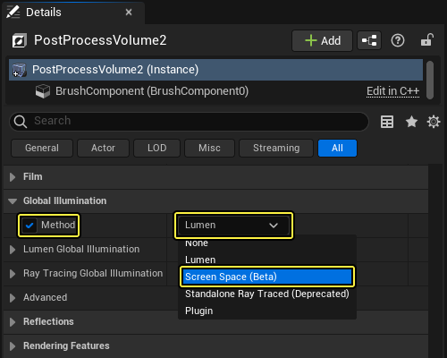
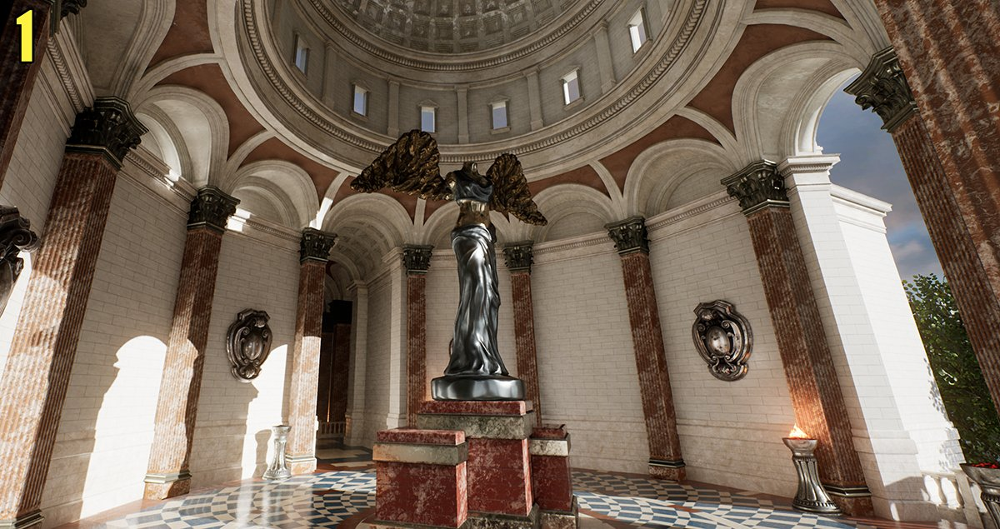

# 屏幕空间全局光照

> 路径：虚幻引擎5.7文档 / 构建虚拟世界 / 为场景设置光照 / 全局光照 / 屏幕空间全局光照

> 原始页面：https://dev.epicgames.com/documentation/unreal-engine/screen-space-global-illumination-in-unreal-engine

**屏幕空间全局光照** (SSGI) 是虚幻引擎的一项功能，其作用是为屏幕视图可见的对象添加动态间接光照，从而创建自然的光照效果。借助SSGI，还可以从自发光表面（例如霓虹灯或其他明亮表面）获得动态光照效果。

屏幕空间全局光照作为一种补充性质的间接光照方法，十分适合配合[Lightmass](../index.md)中的预计算光照方法一起使用。

> 图片已省略：禁用SSGI后的光照烘焙

> 图片已省略：启用SSGI后的光照烘焙

禁用SSGI后的光照烘焙

启用SSGI后的光照烘焙

## 启用SSGI

使用SSGI时，利用以下属性和控制台变量。

从 **项目设置（Project Settings）> 引擎（Engine）> 渲染（Rendering）** 中的 **光照（Lighting）** 类别下，启用 **屏幕空间全局光照（Screen Space Global Illumination）**。



### 控制质量

SSGI有多个质量设置，可借助以下命令启用此类设置：

```
	r.SSGI.Quality 
```

用介于1到4之间的值更改质量：



**拖动滑块将显示1到4的SSGI质量级别。**

- 1 -

  光线步数：8；光线计数：4
- 2 -

  光线步数：8；光线计数：8
- 3 -

  光线步数：8；光线计数：16
- 4 -

  光线步数：12；光线计数：32

### 其他控制台命令

还可使用以下命令来控制SSGI：

- HalfRes命令，用于以一半分辨率渲染SSGI。

  ```
            r.SSGI.HalfRes		
  ```
- 无泄漏项目使用上一帧的场景颜色来获得更好的质量效果。

  ```
            r.SSGI.MinimumLuminance		
  ```

## 其他说明

- **大型遮挡物和退却技术，例如预计算光照。**

  与其他屏幕空间效果一样，SSGI最好与其他间接光照技术结合使用，例如[全局光照中的预计算光照](../index.md)。有大型物体遮挡部分屏幕时，SSGI被用作场景的唯一间接光照时，会将变得明显。例如，在可能存在明亮物体的大型遮挡物后面进行过渡时，使用烘焙光照可减少屏幕空间瑕疵。建议将SSGI用来改善场景中的间接光照，而不是用作唯一的间接光照。
