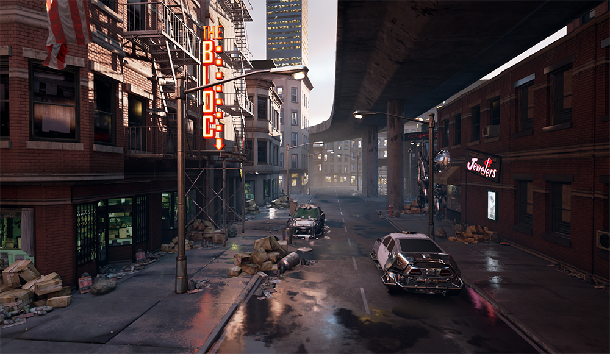
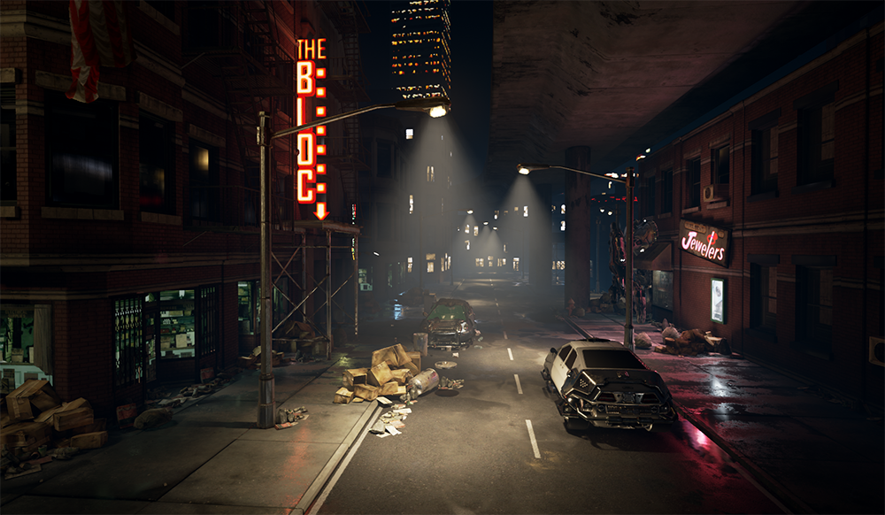
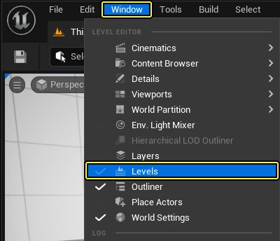
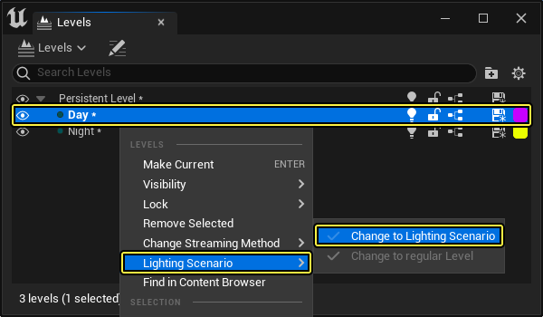
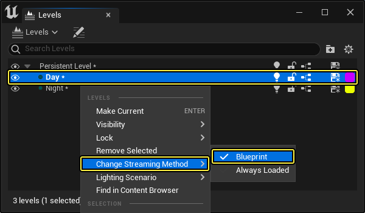
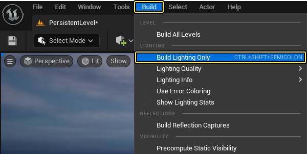
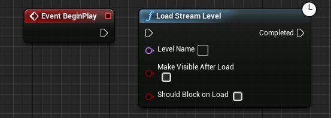
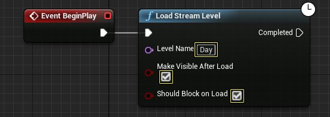

# 预计算光照情景

> 路径：虚幻引擎5.7文档 / 构建虚拟世界 / 为场景设置光照 / 全局光照 / 预计算光照情景

> 原始页面：https://dev.epicgames.com/documentation/unreal-engine/using-precomputed-lighting-scenarios-in-unreal-engine

虚幻引擎 支持在关卡中使用不同的 **预计算光照情景（Precomputed Lighting Scenarios）**。这使得单个关卡可以保存并显示多种光照设置，使玩家既获得灵活的动态光照，又能以固定开销预计算光照。 对用高性能方式进行高精度渲染的虚拟现实（VR）或建筑可视化项目而言，在不同预计算光照情景之间切换更显重要。 通读此文后，你便能了解如何在 项目中使用预计算光照。





Day Scenario

Night Scenario

在上图中，定向光照、天空光照和天空盒已被放置到一个名为 `DayScenario` 的光照情景关卡中。而街灯的聚光源则被放置在另一个名为 `Night Scenario` 的光照情景中。

## 功能限制

虽然预计算光照情景拥有诸多优点，但使用时也需要注意其缺陷与限制。在下文中，我们将介绍其中的一些限制，并告诉你如何回避（或解决）它们。

- 在游戏中只显示一个可见光照情景关卡。
- 光照情景关卡出现后，来自所有子关卡的光照图数据均会被放置在其中，因此白天时只加载 Day Scenario 光照图。因此光照图将不再由子关卡进行流送。
- 子关卡光照贴图数据保存在光照情景的BuiltData包中。注册来自其他子关卡的反射捕获会修改当前光照情景的BuiltData。假如加载子关卡两次，并且只加载光照情景BuiltData一次，就会产生如下错误：

  ```
  	错误： 反射捕获 /Game/Environments/Levels/Your_Level_Name.level_name:PersistentLevel.SphereReflectionCapture_1.NewReflectionComponent 上传了两次，且未重新加载其光照情景关卡。
  ```

  反射捕获上传时，光照情景关卡必须加载一次。

## 使用计算光照情景

执行以下步骤即可在 Unreal Engine 项目中使用光照情景：

1. 首先前往 **Window** > **Levels** 打开 **Levels Manager**。

   
2. **Levels Manager** 打开后，在 **Levels** 菜单中右键点击一个子关卡，前往 **Lighting Scenario**，并选择 **Change to Lighting Scenario** 选项将关卡设为 **光照情景（Lighting Scenario）** 关卡。

   

   > [!NOTE]
   > **光照情景** 关卡显示时，其光照图将被应用到世界场景。
3. 右键点击子关卡，前往 **Change Streaming Method**，并选择 **Blueprint**（如其未选中），将关卡流送方法设为蓝图。

   
4. 现在将项目所需的任意光照或 [静态网格体](../../../../working-with-content/static-meshes/index.md) 放入任意光照关卡，然后以常规方法构建每个关卡的光照。

   
5. 光照构建完成后，打开 **Persistent Level's** 蓝图并添加一个 **Load Stream Level** 节点，将其连接到 **Event Begin Play** 节点。

   
6. 将 **Event Begin Play** 节点连接到 **Load Stream Level** 节点，然后输入需要加载的关卡名。同时须勾选 **Make Visible After Load** 和 **Should Block on Load**，以便看到新加载的关卡。

   
7. 按下 **Play** 键运行项目，首个关卡加载完成后，它现在便会使用白天（Day）关卡光照。如需使用夜晚（Night）关卡光照，可使用相同的设置，但需要将关卡名改为晚间关卡的命名（而非白天关卡的命名）。

   > 图片已省略：白天光照

   > 图片已省略：夜间光照

   白天光照

   夜间光照

虽然有一些明显的限制，但 Unreal Engine 中的预计算光照情景仍能为用户带来诸多益处，如增强性能，便于更改为烘焙光照（以满足项目的需求）。
