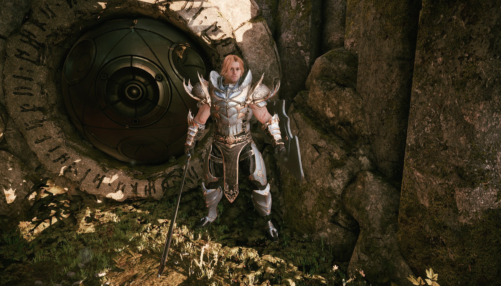
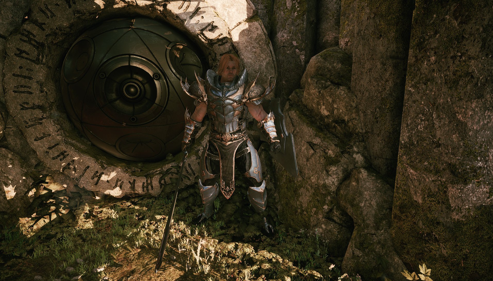
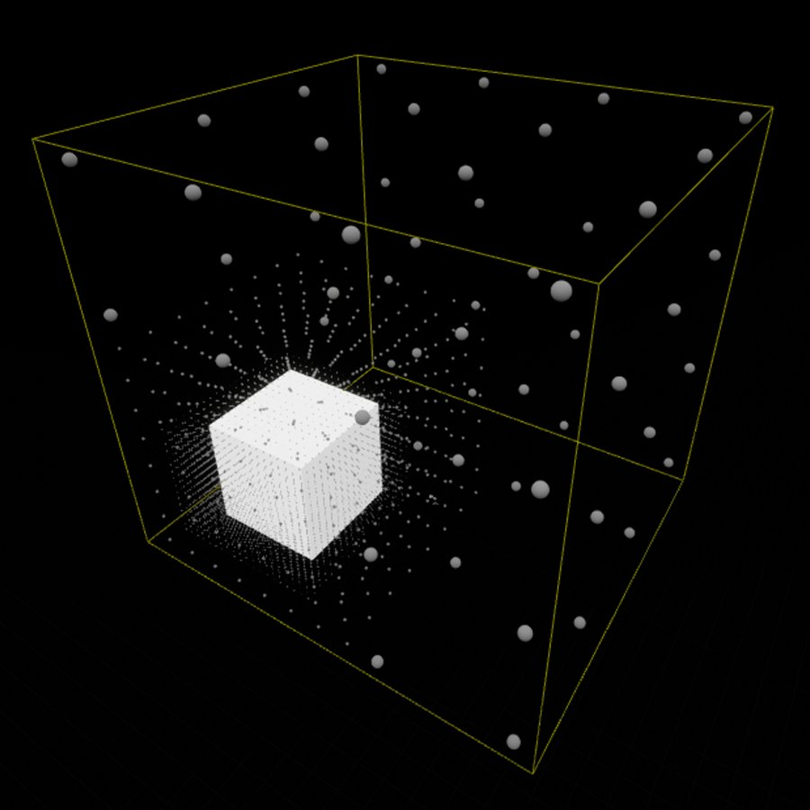
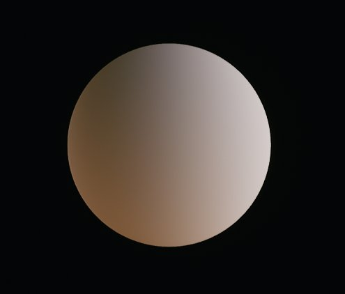
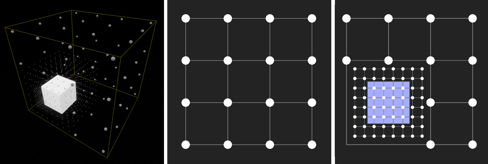
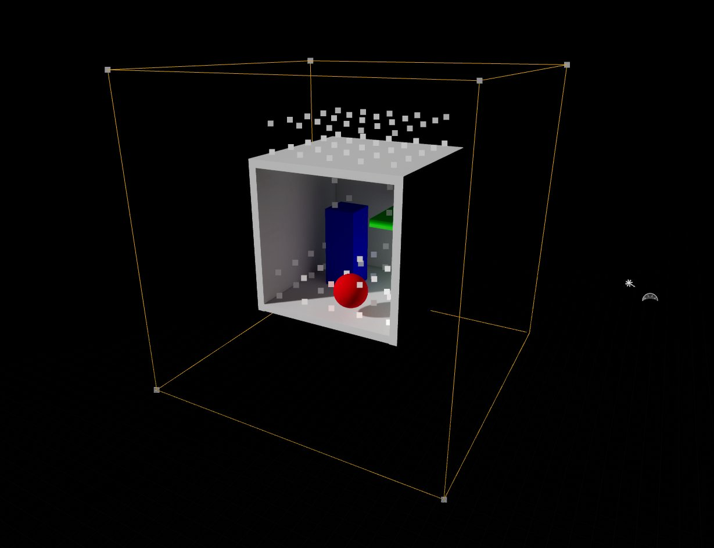
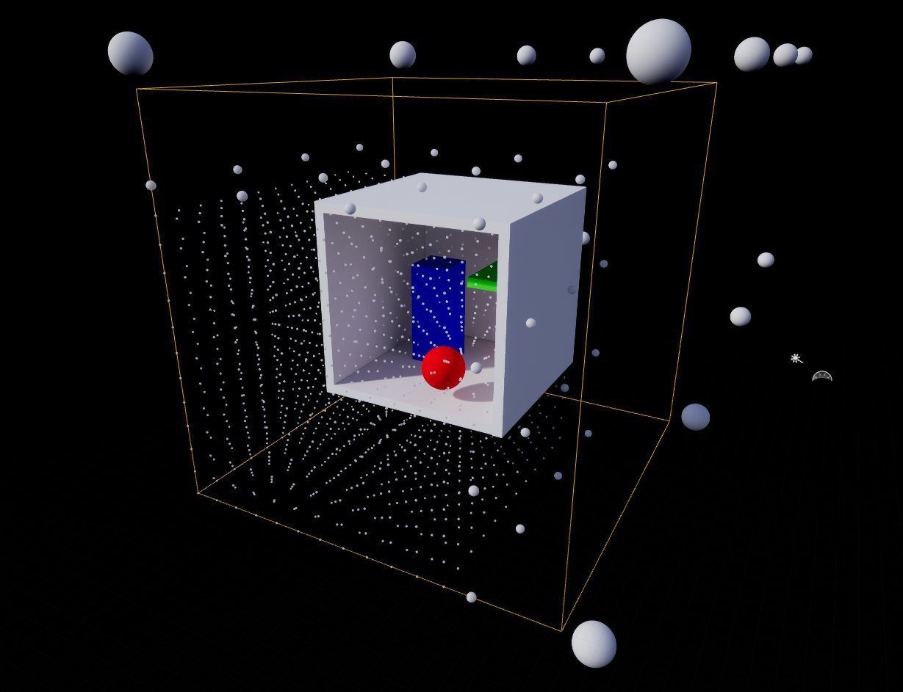
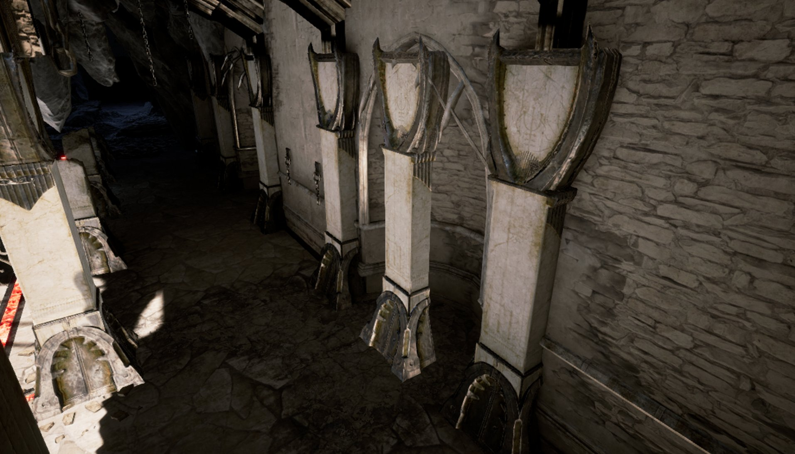

# 体积光照贴图

> 路径：虚幻引擎5.7文档 / 构建虚拟世界 / 为场景设置光照 / 全局光照 / 体积光照贴图

> 原始页面：https://dev.epicgames.com/documentation/unreal-engine/volumetric-lightmaps-in-unreal-engine

> [!NOTE]
> 体积光照贴图将逐渐取代[间接光照缓存](../indirect-lighting-cache/index.md)和体积光照取样。
>
> 要重新启用间接光照缓存，可以打开 **世界场景设置（World Settings）** > **Lightmass设置（Lightmass Settings）**，将 **体积光照方法（Volume Lighting Method）** 设置为 **VLM稀疏体积光照采样（VLM Sparse Volume Lighting Samples）**。

Lightmass会生成[表面光照贴图](../../../../working-with-content/static-meshes/understanding-lightmapping/index.md)，用于表现静态对象上的间接光照。但是，动态的对象（例如角色）也需要一种接受间接光照的方法。这种方法就是在构建时将所有点的预计算光照存储在名为 **体积光照贴图** 的空间中，然后在运行时用于动态Object的间接光照的插值。

稀疏体积光照取样 | （老方法）

体积光照贴图 | （新方法）

稀疏体积光照取样决定了漏光程度和光照精确性。体积光照贴图在这方面做了改进。

## 工作方式

概括起来，体积光照贴图是按下列方式工作的：

- Lightmass将光照采样放置在关卡中的各个位置，并在光照构建期间为它们计算间接光照。
- 当需要渲染动态Object时，就将体积光照贴图内插到着色的每个像素，提供预计算的间接光照。
- 如果没有构建的光照可用（也就是说Object是新的或者移动过多），就从

  静态

  Object的体积光照贴图将光照内插到每个像素，直至光照重构完成为止。

当放置Lightmass重要体积时，体积光照贴图会构建由4x4x4个单元格组成的砖块（光照采样）。运行Lightmass时，会将这些单元格放置在整个Lightmass重要体积上，然后在场景中的静态几何体周围使用更多单元格，以获得更好的间接光照结果。

每个这样的点（或球体）都是一个体积光照贴图光照采样，它使用三阶球谐函数存储所有方向传来的光照。

在Object附近，任何处于某个砖块中的静态几何体都将在间接光照变化最大的地方使用更多单元格。通过数据结构能够将间接光照内插到GPU上的任何空间点。

（从左到右）一个Lightmass重要体积，在该体积中放置了一个静态网格体。静态几何体周围的单元格密度较高；砖块的一个面的表示示例，显示了4x4x4个单元格的布置；同样的单元格表示示例，光照构建期间存在静态几何体时密度较高。

### 启用体积光照贴图可视化

单击 **显示（Show）** > **可视化（Visualize）** > **体积光照贴图（Volumetric Lightmap）**，使用 **体积光照贴图** 的视图模式在关卡视口中将光照采样可视化。

| 列 1 | 列 2 |
| --- | --- |
| [undefined](https://d1iv7db44yhgxn.cloudfront.net/documentation/images/6f294037-f1bc-4d5b-b785-510e71830b20/06-volumetric-lightmaps-enamble-visualize-vlm.png) | [undefined](https://d1iv7db44yhgxn.cloudfront.net/documentation/images/11e12874-d7df-4841-85c4-0623e3607acb/07-volumetric-lightmaps-visualize-example.png) |
| 启用体积光照贴图视图模式 | 可视化体积光照贴图光照采样 |
| *点击查看大图。* | *点击查看大图。* |

如果在光照构建之后将体积光照贴图可视化，你可以根据受影响的Lightmass重要 体积中的单元格数量看出聚集在静态几何体周围的光照采样的密度。距离静态几何体较远的光照采样密度较低，因为它们附近没有几何体。

稀疏体积光照取样 | （老方法）

体积光照贴图 | （新方法）

[间接光照缓存](../indirect-lighting-cache/index.md)仅将光照采样放置在静态几何体表面上方。 体积光照贴图将采样高密度地放置在静态几何体周围，在间接光照变化最大的地方呈现更多细节。

### 预览未构建的光照

体积光照贴图允许预览有未构建的光照的Object。如果移动一个先前为其构建过光照的静态网格体，它会自动切换为体积光照贴图， 直至下一次光照构建为止。

> 图片已省略：体积光照贴图 |（新方法）

间接光照缓存 |（老方法）

体积光照贴图 |（新方法）

中间的柱子是额外复制的。现在采用体积光照贴图进行光照处理，直到再次构建光照。

### 可移动Object上的预计算光照

与整个组件只发生一次光照采样的插值的[间接光照缓存](../indirect-lighting-cache/index.md)不同，体积光照贴图允许内插至每个像素，从而可以呈现更多细节。这样可以实现可靠的细节分布，从而减少漏光现象。

> 图片已省略：间接光照缓存 |（老方法）

> 图片已省略：体积光照贴图 |（新方法）

间接光照缓存 |（老方法）

体积光照贴图 |（新方法）

增加的体积光照贴图细节使角色更好地与环境融合。

> 图片已省略：间接光照缓存 |（老方法）

> 图片已省略：体积光照贴图 |（新方法）

间接光照缓存 |（老方法）

体积光照贴图 |（新方法）

对于嵌入在任何静态几何体中的可移动Object，它提供了比间接光照缓存更好的静态Object光照匹配。

### 体积雾上的预计算光照

体积光照贴图使每个雾体素都有预计算光照内插到其在空间中的位置，从而支持了体积雾的静态光照应用。

> 图片已省略：点光源 | 无间接光线反射

> 图片已省略：点光源 | 有间接光线反射

点光源 | 无间接光线反射

点光源 | 有间接光线反射

固定光源的间接光照存储在光照贴图中，现在会影响雾。

> 图片已省略：带自发光颜色的天空光照

> 图片已省略：天空光照体积光照贴图

带自发光颜色的天空光照

天空光照体积光照贴图

天空光照现在也可以正确地投射阴影，防止室内区域变成大雾效果。

> 图片已省略：间接光照缓存：| 静态光照的静态和自发光 |（老方法）

> 图片已省略：体积光照贴图：| 静态光照的静态和自发光 |（新方法）

间接光照缓存：| 静态光照的静态和自发光 |（老方法）

体积光照贴图：| 静态光照的静态和自发光 |（新方法）

静态光照的静态和自发光对雾的影响没有任何开销，因为它们全部都合并到体积光照贴图中了。

## 设置

可以在 **世界场景设置（World Settings）** 的 **Lightmass设置（Lightmass Settings）** 下访问体积光照贴图设置。

| 设置 | 说明 |
| --- | --- |
| **体积光照方法（Volumetric Lighting Method）** | 用于在Lightmass重要体积内的所有位置提供预计算光照的技术。 **VLM体积光照贴图（VLM Volumetric Lightmap）**：在覆盖整个Lightmass重要体积的高级网格中计算光照采样。在几何体附近使用较高密度的网格。通过在GPU上逐像素进行高效的体积光照贴图插值，为动态Object和体积雾实现准确的间接光照。重要体积以外的位置复用体积光照贴图的边界纹素（限制寻址）。在移动平台上，在CPU上对每个Object的边界中心执行插值。 **VLM稀疏体积光照采样（VLM Sparse Volume Lighting Samples）**：体积光照采样按中等密度放置在静态表面上，在Lightmass重要体积中的其他所有位置则按低密度放置。重要体积以外的位置则没有间接光照。这种方法要求CPU插值，因此使用间接光照缓存为每个动态Object内插结果，会增加渲染线程开销。如果使用此方法，预计算光照无法影响体积雾。 |
| **体积光照贴图细节单元格大小（Volumetric Lightmap Detail Cell Size）** | 最高密度（在几何体周围使用）下的体积光照贴图体素的大小，按世界场景空间单位计。这个设置对于构建时间和内存有很大影响，应该谨慎使用。 |
| **体积光照贴图最大砖块内存量（Volumetric Lightmap Maximum Brick Memory Mb）** | 要为体积光照贴图砖块数据花费的最大内存量。系统会丢弃高密度砖块，直至达到这一限制为止。先丢弃距离几何体最远的砖块。对内存裁减过多会导致分辨率不一致，因此最好用增大 **体积光照贴图细节单元格大小（Volumetric Lightmap Detail Cell Size）** 来代替。 |
| **体积光图球面谐波平滑法（Volumetric Lightmap Spherical Harmonic Smoothing）** | 控制在球面谐波去环过程中，对体积光照贴图采样进行多少程度的平滑处理。每当高方向性的光照信息被保存在球面谐波中时，就会出现一个环形伪影，表现为在另一面出现预期之外的黑色区域。平滑可以减少这种伪影。平滑只有在出现环形伪影时才会应用。**0** = 无平滑，**1** = 强平滑（光照的方向性较小）。 |
| **体积光源采样放置缩放（Volume Light Sample Placement Scale）** | 缩放体积光照采样放置时的距离。体积光照采样由Lightmass计算，用于可移动组件上的GI。使用较大的缩放值时，采样的内存占用较低，还能降低间接光照缓存的更新时间，但光照区域之间过渡的准确程度会下降。 |

## 性能

在考虑体积光照贴图的性能和内存使用时，应该考虑下列因素。

- 第三人称视角角色上的体积光照贴图在PlayStation 4上会耗用0.02毫秒的GPU 时间。所有间接光照缓存渲染线程成本均已剔除。
- 在Epic的《虚幻争霸》的巨岩殿地图上，使用间接光照缓存时的内存使用量是5Mb，而按默认 **细节单元格大小（Detail Cell Size）** 设置使用体积光照贴图时的内存使用量会增大到30Mb。内存使用量可以 在编辑器中 **统计内存（Stat MapBuildData）** 命令下通过 **体积光照贴图内存（Volumetric Lightmap Memory）** 看到

  > 图片已省略：undefined

  点击查看大图。

### 体积光照贴图与间接光照缓存对比

下面是间接光照缓存与体积光照贴图的详细对比：

| **预计算光照体积/间接光照缓存** | **体积光照贴图** |
| --- | --- |
| 在CPU上进行开销巨大的插值 | 在GPU上进行高效插值 |
| 逐个Object插值，在实例化组件上也不例外 | 逐像素插值 |
| 无法影响体积雾 | 对体积雾有效 |
| 仅在静态表面上高密度放置，导致低密度采样漏光 | 以高密度放置在所有静态表面周围 |
| Lightmass重要体积以外为黑色采样 | 拉伸边界体素以覆盖Lightmass重要体积外部区域 |
| 支持关卡流送 | 支持关卡流送，但要求所有关卡必须同时构建。更多详情请参阅下方的"附加提示"部分。 |

支持关卡流送，但要求所有关卡必须同时构建。更多详情请参阅下方的"附加提示"部分。

## 附加提示

- 如果你在大型关卡中降低

  体积光照贴图细节单元格大小（Volumetric Lightmap Detail Cell Size）

  来获得更高的精度，则还需要增大

  体积光照贴图最大砖块内存量（Volumetric Lightmap Maximum Brick Memory Mb）

  。否则，细节单元格将会被剔除，导致动态Object间接光照精度下降。
- 关卡流送要求所有关卡（包括固定关卡和所有子关卡）都在同一时间构建，否则流送进来的关卡将无法正确注册。流送关卡主要是一种内存优化手段，细节最丰富的砖块体积会合并成一个尺寸更大的立方体体积（长宽高一样长、），而非盒型体积（长宽高不同）。细节最丰富的砖块会和距离最近的子关卡一起流送，而更高级别的关卡总是固定的。在那些包含实际几何体的关卡中，大部分数据都会进入那些细节最丰富的关卡砖块。假如关卡填满了几何体，那么体积中看起来是空的（或者"浪费的"）空间就不应受到太多关注。当前系统使用单张体积纹理，这意味着我们对空的空间没有太多办法，因为我们不支持使用多张体积纹理，无法使用重叠和混合功能。
- 体积光照贴图密度体积（Volumetric Lightmap Density Volumes）

  可以控制场景区域中的采样密度的局部控制。这些体积只支持凸形形状。你可以在关卡编辑器的

  放置Actor

  面板中添加它。

## 故障诊断

- 为了增加采样数量已经降低了

  细节单元格大小（Detail Cell Size）

  ，但是在静态几何体附近的采样密度低于所请求的密度。

  - 如果

    砖块最大内存（Maximum Brick Memory）

    过低，或者区域中的所有光照都几乎相等，细节砖块可能被剔除。
- 光线透过墙壁漏到角色身上，但没有漏到附近的静态网格体上。

  - 当前解决漏光的唯一办法是降低

    细节单元格大小（Detail Cell Size）

    （允许使用更多内存）或增加墙壁厚度。
