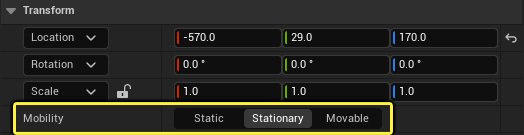

# 光源类型及其可移动性

> 路径：虚幻引擎5.7文档 / 构建虚拟世界 / 为场景设置光照 / 光源类型及其可移动性

> 原始页面：https://dev.epicgames.com/documentation/unreal-engine/light-types-and-their-mobility-in-unreal-engine

虚幻引擎提供了多种类型的光照，可创建几乎所有类型的光照场景，并适用于各种规模的世界。每种光源类型都有自己的移动性选项，可以定义它如何与场景中的其他Actor交互以及光照系统将如何利用光源。

## 光源类型

编辑器中的可用光源类型能够以各种样式和配置照亮你的世界，打造你想要的项目外观。你可以使用这些光源类型照亮大大小小的场景，包括大型广阔的世界以及小型局部化的内景。

虚幻引擎提供以下类型的光源：

- 定向光源（Directional Lights）

  是主要的室外光源，或是那些需要看起来好像是从极远或接近无限远的距离发出光亮的光源。
- 天空光照（Sky Light）

  捕捉场景的背景并将其应用于关卡的几何体。
- 点光源（Point Lights）

  就像一个灯泡，从一个点向各个方向发出光亮。
- 聚光源（Spot Lights）

  从单个点沿着由一组椎体限制的方向发射光。
- 矩形光源（Rect Lights）

  从矩形表面沿一个方向发光。

**定向光源** 和 **天空光照** 可用于大型外景，或通过内景开口提供光照和投影。对于大型外景，定向光源最能照亮浓密的植被，在照亮其他几何体时也比较高效。

| 定向光源 | 天空光照 |
| --- | --- |
| 定向光源（Directional Lights） | 天空光照（Sky Light） |

**点光源**、**聚光源** 和 **矩形光源** 可用于照亮较小的局部区域。光源的类型和属性可以帮助定义光源在给定场景中的形状和外观。这些类型的光源也有许多相同的属性。

| 聚光源 | spot light | 矩形区域光源 |
| --- | --- | --- |
| 点光源（Point Light） | 聚光源（Spot Light） | 矩形区域光源（Rectangular Area Light） |

### 光源类型概述

%building-virtual-worlds/lighting-and-shadows/light-types-and-mobility/Directional:Topic%

- [天空光照](sky-lights/index.md)

- [点光源](point-lights/index.md) - 理解点光源的基本知识。

- [矩形光源](rectangular-area-lights/index.md) - 理解虚幻引擎中矩形光源的基本概念。

%building-virtual-worlds/lighting-and-shadows/light-types-and-mobility/Spot:Topic%

## 光源移动性

场景中每种类型的Actor都有自己的 **移动性（Mobility）** 设置，用于控制在Gameplay期间是否允许以某种方式移动或改变。对于光源Actor，移动性选择定义了在进行光源构建时将如何处理场景中的光源。

请务必选择对项目最有意义的光源移动性类型，因为这会影响性能、外观和设计选择。光源的某些特性在功能上受到限制，或者在某些平台或机器上不完全受到支持。例如，并非移动平台上的所有光源类型都支持动态投影。

每个光源Actor具有三种移动性状态：

| 移动性状态 | 说明 |
| --- | --- |
| **静态** | 此种移动性面向在Gameplay期间不计划移动或更新的光源Actor。 静态光源将对使用[Lightmass](../global-illumination/index.md)的预计算光照贴图产生助益。这些光源将照亮场景并为所有设置为静态和固定的Actor生成光照数据，但可移动Actor将由存储在[间接光照缓存](../global-illumination/indirect-lighting-cache/index.md)中的光照数据或[体积光照贴图](../global-illumination/volumetric-lightmaps/index.md)照亮。 |
| **固定** | 此种移动性面向在Gameplay期间可以移动但不移动的Actor。 这些光源在Gameplay期间可能会发生某种变化，例如改变颜色或强度，或者完全熄灭。固定光源将对使用[Lightmass](../global-illumination/index.md)预计算的光照贴图产生助益，但它们也可以为可移动对象投射动态阴影。固定光源会增加成本，并且可以影响单个对象的光源数量始终有限。例如，不论何时，可以影响单个对象的固定光源最多只有四个。 |
| **可移动** | 此移动性面向在Gameplay期间需要添加、移除或移动的光源Actor。 这些光源只投射动态阴影。除了能够在Gameplay期间移动之外，这些光源还可以根据需要更改颜色、强度和其他光源属性。 使用具有此种移动性的光源时必须小心，因为它们的投影成本最高。然而，不投影的可移动光源的计算成本非常低，并且比设置为静态的光源的成本更低，因为不需要将光照数据保存到磁盘。 |

### 光源移动性概述

%building-virtual-worlds/lighting-and-shadows/light-types-and-mobility/movable-lights:Topic% %building-virtual-worlds/lighting-and-shadows/light-types-and-mobility/StationaryLights:Topic%

- [静态光源的移动性](static-light-mobility/index.md)
