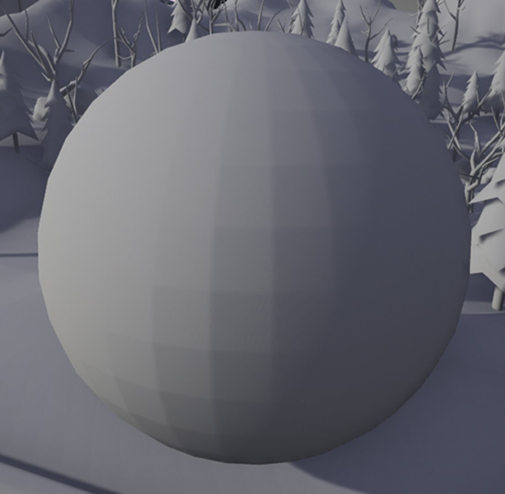
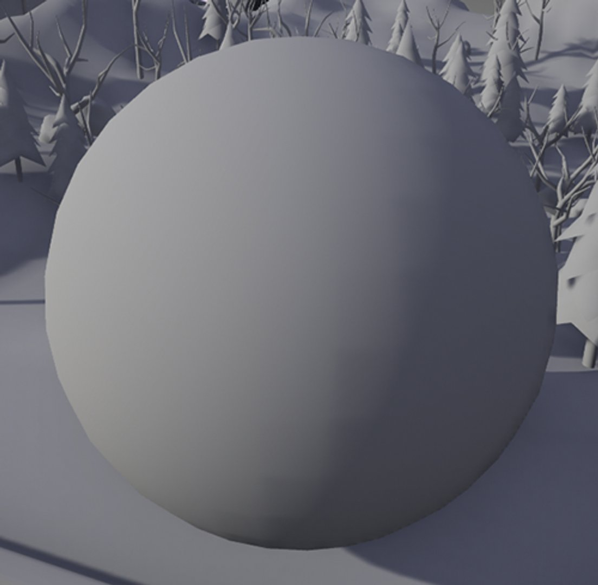
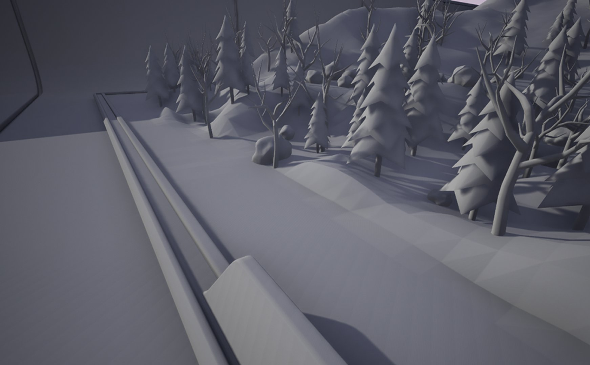
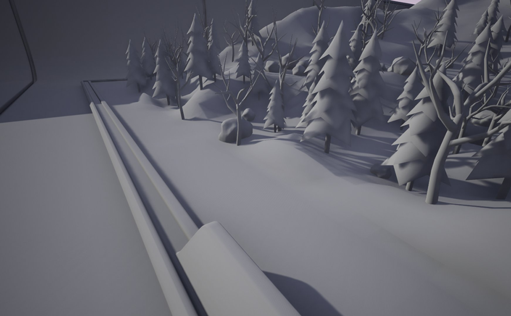

# 可移动光源的移动性

> 路径：虚幻引擎5.7文档 / 构建虚拟世界 / 为场景设置光照 / 光源类型及其可移动性 / 可移动光源的移动性

> 原始页面：https://dev.epicgames.com/documentation/unreal-engine/movable-light-mobility-in-unreal-engine

将移动性（Mobility）设为**可移动（Movable）**的光源可在运行时以任意方式动态改变，这些光源有时被称为动态光源。 动态光源的性能成本高于静态或固定光源，且取决于受光源影响的网格体数量以及这些网格体的三角形数量。 例如，相比半径较小的阴影投射动态光源，半径较大的阴影投射动态光源具有更高的性能成本。

与[Lumen全局光照和反射](https://dev.epicgames.com/documentation/assets/building-virtual-worlds/lighting-and-shadows/global-illumination/lumen)一起使用时，可移动光源支持动态间接光照。

在可供选择的三种光源移动性中，可移动光源的特点为具有不同的品质（取决于所使用的动态阴影类型）、最高可变性和最高性能成本。

## 支持的阴影类型

与静态光源和固定光源相比，可移动光源支持更多的动态光照和投影方法。 可移动光源支持以下类型的投影：

- **阴影贴图（Shadow Maps）**提供全场景动态阴影。 这是引擎中所有动态阴影的标准投影法，适用于大多数平台，可用于所有光源类型。 与此列表中的许多其他投影方法一样，阴影贴图不提供软区域投影。
- [虚拟阴影贴图](https://dev.epicgames.com/documentation/assets/building-virtual-worlds/lighting-and-shadows/shadows/virtual-shadow-maps)能提供一致的高分辨率阴影贴图，适用于电影级品质的资产和大型动态光照开放世界。 虚拟阴影贴图能提供软区域投影，并且可以与[Nanite](https://dev.epicgames.com/documentation/assets/designing-visuals-rendering-and-graphics/rendering-optimization/nanite)、[Lumen全局光照和反射](https://dev.epicgames.com/documentation/assets/building-virtual-worlds/lighting-and-shadows/global-illumination/lumen)以及[世界分区](https://dev.epicgames.com/documentation/assets/building-virtual-worlds/world-partition)良好配合，以合理的性能成本提供最高的品质。 支持DirectX 11或DirectX 12的最新主机和PC平台支持虚拟阴影贴图。
- [光线追踪阴影](../../ray-tracing-and-path-tracing-features/hardware-ray-tracing/index.md)可模拟软区域光照效果，以合理的性能成本实现最高的阴影品质。 它们使用的光线追踪架构受到NVIDIA GPU硬件的支持，但是需要在带有DirectX 12的Windows 10（或更高版本）系统上运行。
- 网格体距离场阴影以网格体的距离场呈现为基础提供网格体的光照效果和软区域投影。 此方法需要项目的距离场网格体，供[Lumen全局光照和反射](https://dev.epicgames.com/documentation/assets/building-virtual-worlds/lighting-and-shadows/global-illumination/lumen)和[距离场环境光遮蔽](../../mesh-distance-fields/distance-field-ambient-occlusion/index.md)中的软件光线追踪使用。

## 阴影偏差

虚幻引擎中的默认阴影映射技术适用于可移动光源的所有平台，提供动态投影。 阴影贴图具有一些限制，因而会产生瑕疵，例如曲面上的多面阴影和表面交叉处的阴影接触硬化，这会使对象看起来像是悬浮在场景中或未接地。

阴影偏差是逐光源属性集，有助于减少这些类型的瑕疵，同时提高这些光源自投影和接触硬化的精度。 这些偏差设置通过权衡取舍来发挥作用，即平衡一个区域的精度同时减少另一个区域的自投影瑕疵。

阴影偏差（常量和斜率）：默认值

阴影偏差（常量和斜率）：调整值

> [!NOTE]
> 调整**阴影斜率偏差（Shadow Slope Bias）**可以在损失阴影精度的情况下减少自投影瑕疵，后者可能会导致场景中接地对象出现彼得潘（或悬浮）现象。 斜率偏差调整解决不了*所有*动态光照的自投影问题，但可以解决大部分问题。 项目的*正确*平衡由你决定。

定向光源具有额外的深度偏差属性，可以控制跨级联阴影贴图（CSM）的偏差强度。 它可以减少级联过渡点阴影瑕疵的不连续性。

阴影偏差（常量和斜率）：默认值

阴影偏差（常量和斜率）：调整值

光源的以下属性可用于调整阴影偏差：

| 属性 | 说明 |
| --- | --- |
| **阴影级联偏差分布（Shadow Cascade Bias Distribution）** | （仅限定向光源）控制级联阴影贴图的深度偏差缩放。 它降低了不同级联过渡之间的阴影瑕疵差异。 值1根据每个级联的大小缩放阴影偏差。 0统一缩放所有级联中的阴影偏差。 |
| **阴影偏差（Shadow Bias）** | 控制来自该光源的整个场景阴影的自投影准确度。 值为0时，阴影从它们的阴影投射表面开始，但会有很多瑕疵。 值更大时，阴影从距离投射器更远的位置开始，不会有自投影瑕疵，但对象可能看起来像悬浮在表面上方。 中点0.5附近的值可以在精度和减少自投影瑕疵之间实现良好的平衡。 |
| **阴影斜率偏差（Shadow Slope Bias）** | 与阴影偏差结合使用，控制所选光源整个场景阴影的自投影准确度。 此属性会根据给定表面的斜率增加偏差量。 值为0时，阴影从它们的投射表面开始，但会有很多自投影瑕疵。 值更大时，阴影从距离投射器更远的位置开始，不会有自投影瑕疵，但对象可能看起来像悬浮在表面上方。 |
| **阴影过滤锐化（Shadow Filter Sharpen）** | 调整来自固定或可移动光源的直接投影锐度。 它可以减少阴影贴图的软投影效果。 |

## 阴影贴图缓存

阴影贴图缓存是可移动光源的一项功能，它使游戏中点光源和聚光源的阴影投射更加实惠。 如果关卡中有不需要移动的资产，那么这些资产阴影计算会消耗每一帧的性能。 阴影贴图缓存会查看将移动性设为**静态（Static）**或**固定（Stationary）**的资产，并且不需要逐帧重新计算，除非这些资产或光源发生变化。

阴影贴图缓存对性能有重大影响，尤其是在有大量资产受光源影响的关卡中。

例如，在中等大小的场景中，有三个可移动的点光源投射阴影，那么可能需要14毫秒以上的时间渲染阴影深度。 启用缓存阴影后，这三个相同的光源可能需要大约1毫秒的时间来渲染阴影深度。

> [!NOTE]
> 阴影贴图缓存需要占用内存来存储缓存的阴影，对于足够大的场景，你可能需要使用控制台命令`r.Shadow.WholeSceneShadowCacheMb`调整为其分配的内存量。

### 阴影贴图缓存性能

你可以使用`Stat ShadowRendering`打命令开阴影渲染的统计数据窗口，检查缓存阴影的性能。 然后使用控制台命令`r.Shadow.WholeSceneShadows`启用/禁用缓存阴影。

|  |  |
| --- | --- |
| [阴影贴图缓存启用](https://dev.epicgames.com/community/api/documentation/image/0c1bad0f-fbae-473f-aef3-280a1ccbb25c?resizing_type=fit) | [阴影贴图缓存禁用](https://dev.epicgames.com/community/api/documentation/image/f0af0e1e-4ff4-4436-ba08-7e267feb08a3?resizing_type=fit) |
| 阴影贴图缓存：启用 | 阴影贴图缓存：禁用 |

### 阴影贴图缓存限制

阴影贴图缓存可以显著降低在关卡中使用动态投影的成本，但是在使用不受支持的引擎功能时，必须考虑一些限制。

默认情况下，缓存只能在以下资产满足这些条件时发生：

- 关卡中的图元必须将移动性设为**静态（Static）**或**固定（Stationary）**。
- 使用**世界位置偏移（World Position Offset）**的材质将不会被缓存。
- 支持**点光源**和**聚光源**，并且在投射阴影时，必须将其移动性设为**可移动（Movable）**。
- 四处移动的光源**将不会**缓存阴影。
- 使用带动画的**曲面细分**或**像素深度偏移**的材质可能会导致瑕疵，因为它们的阴影将被缓存，但与资产看起来不匹配。
