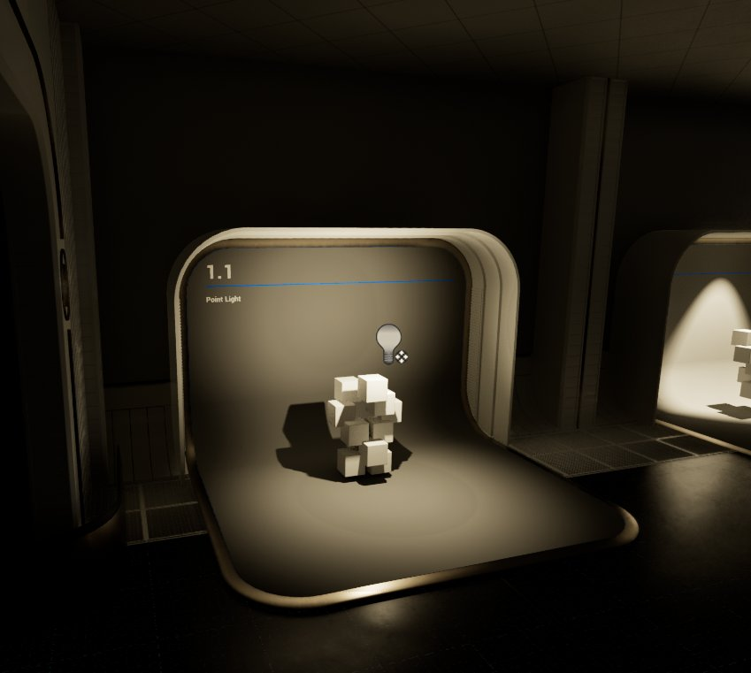
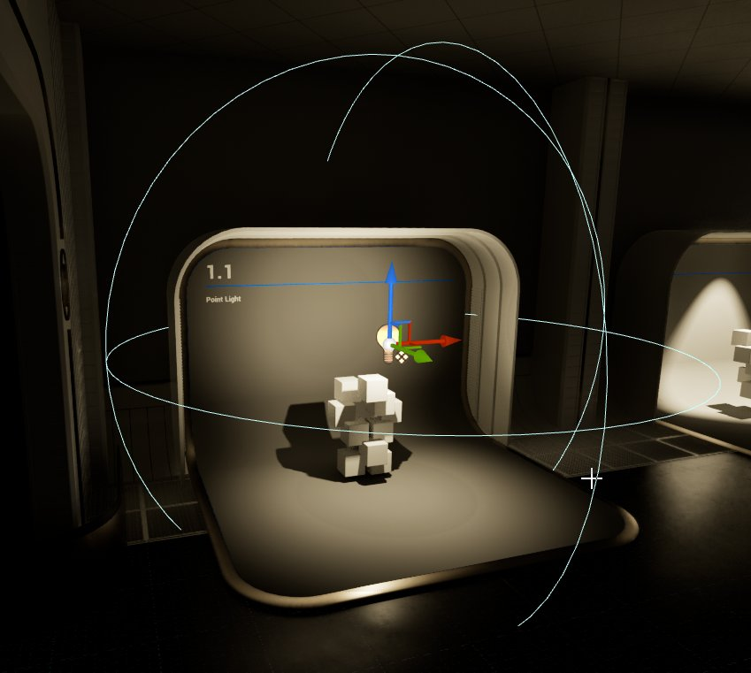

# 点光源

> 路径：虚幻引擎5.7文档 / 构建虚拟世界 / 为场景设置光照 / 光源类型及其可移动性 / 点光源

> 原始页面：https://dev.epicgames.com/documentation/unreal-engine/point-lights-in-unreal-engine

**点光源（Point Light）** 的工作原理很像一个真实的灯泡，从灯泡的钨丝向四面八方发出光。然而，为了性能考虑，点光源被简化为从空间中的一个点均匀地向各个方向发射光。放置的点光源可以设置为三个移动性设置之一：

- 静态（Static）

  - （如左图所示）它意味着，不能在游戏中更改光源。这是最快的渲染方法，并且允许烘焙的光照。
- 固定（Stationary）

  - （亦如左图所示）它意味着，光源通过

  Lightmass

  仅烘焙静态几何体的投影和反射光照。其他则为动态光源。该设置还允许光源在游戏中更改颜色和强度，但它不会移动且允许局部烘焙光照。
- 可移动（Moveable）

  - （如左图所示）这意味着光是完全动态的，并考虑到了动态阴影。从渲染的角度看这是最慢的，但顾及到了游戏进程中的最大灵活性。

下面是放置在关卡内的点光源的两个例子。

Point Light Without Radius Showing

Point Light With Radius Showing.

左边的图像是一个没有显示其半径的点光源，而右边的图像是显示了半径的同一光源，这给人一种光源将影响世界的良好印象。

虽然点光源只从空间中的该点发出，没有形状，但虚幻引擎可以给点光源一个半径和长度，用于反射和高光，让点光源有更多的物理真实感。

## 点光源属性

**点光源（Point Light）** 的属性分为4类：光源、光源描述文件、Lightmass和光照函数。

### 光源

| 属性 | 说明 |
| --- | --- |
| **强度（Intensity）** | 光源发出的总能量。 |
| **光源颜色（Light Color）** | 光源发出的颜色。 |
| **衰减半径（Attenuation Radius）** | 限制光的可见影响。 |
| **光源半径（Source Radius）** | 光源形状的半径。 |
| **光源长度（Source Length）** | 光源形状的长度。 |
| **影响世界（Affects World）** | 完全禁用光源。无法在运行时设置。要在运行时禁用光源的效果，更改其可视性（Visibility）属性。 |
| **投射阴影（Casts Shadows）** | 光源是否投射阴影。 |
| **间接照明强度（Indirect Lighting Intensity）** | 缩放光源的间接照明贡献。 |
| **使用平方反比衰减（Use Inverse Squared Falloff）** | 是否使用基于物理的平方反比距离衰减，其中，衰减半径只是用于限制光源的贡献。 |
| **光源衰减指数（Light Falloff Exponent）** | 禁用UseInverseSquaredFalloff时，控制光源的径向衰减。 |
| **高光比例（Specular Scale）** | 反射高光上的乘数。请谨慎使用！1以外的任意值皆非物理效果！可用于为艺术效果而移除高光模拟偏振滤镜或照片润色。 |
| **阴影偏差（Shadow Bias）** | 控制该光源的阴影的精确程度。 |
| **阴影过滤锐化（Shadow Filter Sharpen）** | 对该光源的阴影过滤的锐化程度。 |
| **接触阴影长度（Contact Shadow Length）** | 屏幕空间到锐化接触阴影的光线追踪的长度。值为0表示禁用此选项。 |
| **投射半透明阴影（Cast Translucent Shadows）** | 是否允许该光源通过半透明对象投射动态阴影。 |
| **影响动态间接照明（Affect Dynamic Indirect Lighting）** | 是否应将光源注入光传播体积。 |
| **投射静态阴影（Cast Static Shadows）** | 该光源是否会投射静态阴影。 |
| **投射动态阴影（Cast Dynamic Shadows）** | 该光源是否会投射动态阴影。 |
| **影响半透明光照（Affect Translucent Lighting）** | 光源是否会影响半透明度。 |

### 光源描述文件

| 属性 | 说明 |
| --- | --- |
| **IES纹理（IES Texture）** | 用于光源描述文件的IES"纹理"。IES文件是ASCII格式的，但虚幻将它们表示为纹理，而不是图像文件。 |
| **使用IES亮度（Use IES Brightness）** | 如果是 *false*，它将利用光源的亮度来决定要产生多少光。如果是 *true*，它将使用IES文件的亮度（以流明计）（通常比虚幻中的光源的默认值大得多）。 |
| **IES亮度比例（IES Brightness Scale）** | IES亮度贡献的比例，其可能会使场景严重曝光。 |

### Lightmass

| 属性 | 说明 |
| --- | --- |
| **间接照明饱和度（Indirect Lighting Saturation）** | 值为0将使该光源在Lightmass中完全去饱和，值为1则不变。 |
| **阴影指数（Shadow Exponent）** | 控制阴影半影的衰减。 |

### 光照函数

| 属性 | 说明 |
| --- | --- |
| **光照函数材质（Light Function Material）** | 应用于该光源的光照函数材质。 |
| **光照函数缩放（Light Function Scale）** | 缩放光照函数投射。 |
| **光照函数淡化距离（Light Function Fade Distance）** | 光照函数应完全淡化到禁用亮度（Disabled Brightness）值的距离。 |
| **禁用亮度（Disabled Brightness）** | 当光照函数已指定但被禁用时，应用于光源的亮度因子，例如从上面的属性来讲：光照函数淡化距离（Light Function Fade Distance）。 |
