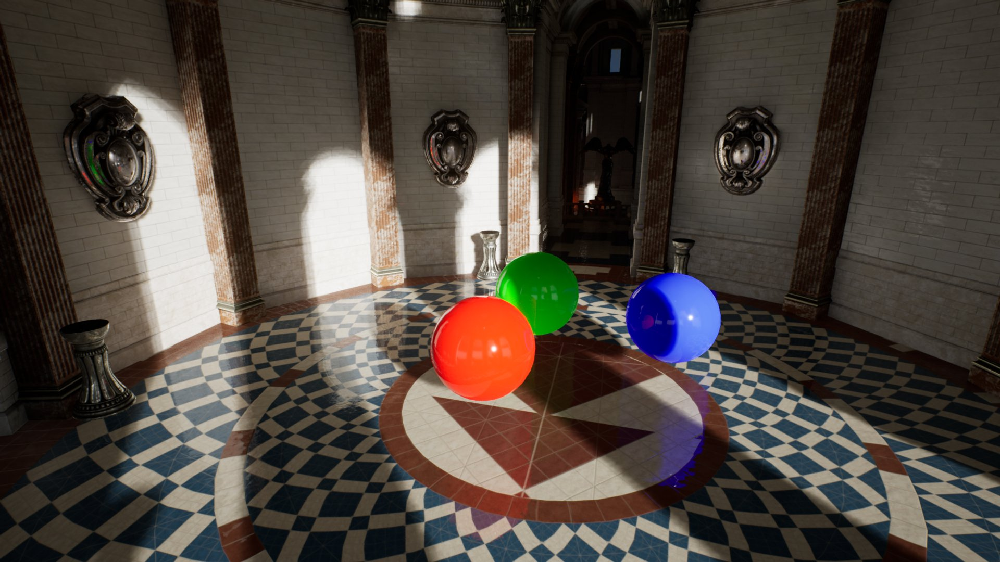
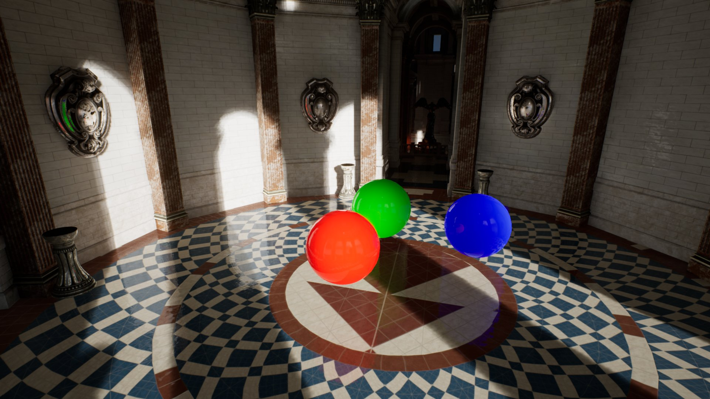
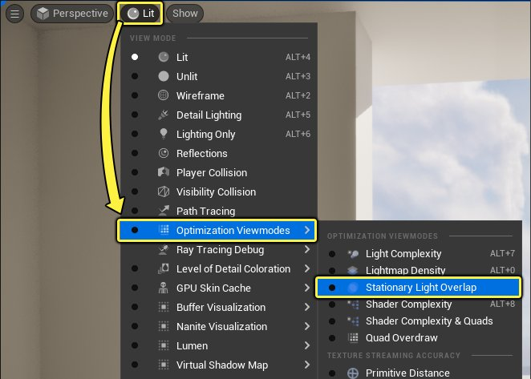
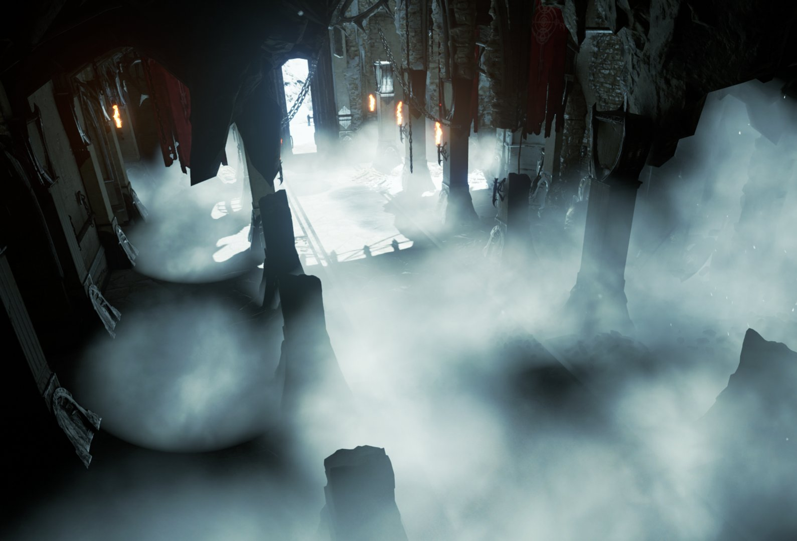
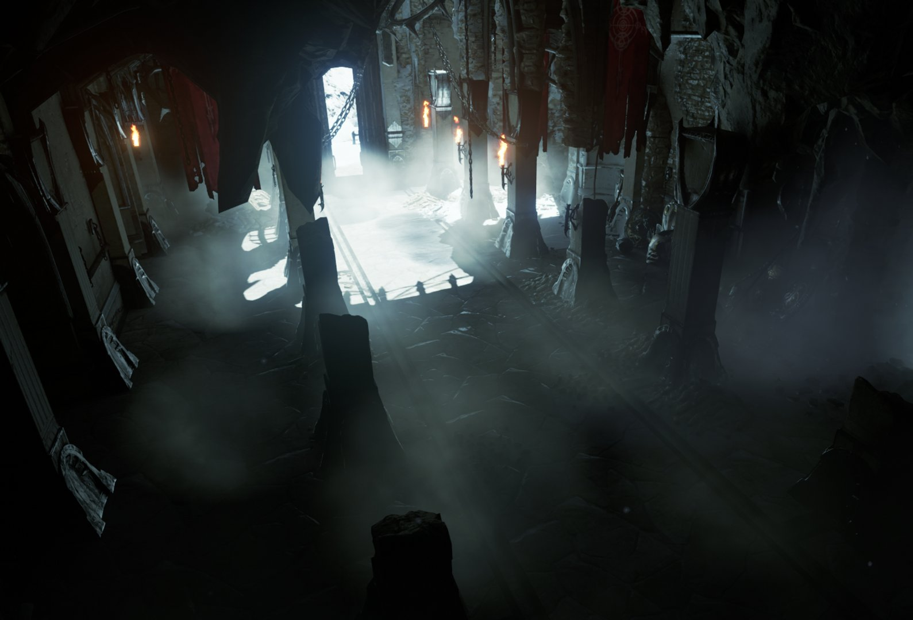
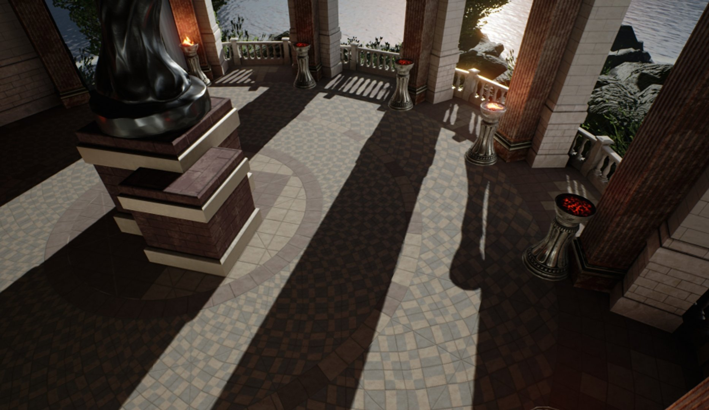
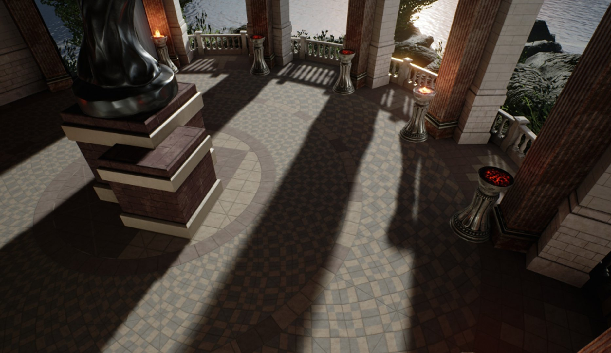

# 固定光源的移动性

> 路径：虚幻引擎5.7文档 / 构建虚拟世界 / 为场景设置光照 / 光源类型及其可移动性 / 固定光源的移动性

> 原始页面：https://dev.epicgames.com/documentation/unreal-engine/stationary-light-mobility-in-unreal-engine

移动性（Mobility）设为**固定（Stationary）**的光源即被设计为固定位置放置的光源，但其在其他方面可以调整，例如光源的亮度和颜色。 这是它们与[静态（Static）光源](../static-light-mobility/index.md)的主要区别，后者在Gameplay时无法改变。

在引擎提供的三种光源移动性中，固定光源拥有最高品质、中等可变性和中等性能成本。

固定光源使用动态和静态光照来实现其结果，间接光照和投影存储在关卡的光照贴图中。 直接阴影存储在阴影贴图中。 这些光源将使用距离场阴影，这意味着即使在光照对象上的光照贴图分辨率相当低的情况下，它们的阴影也可以保持清晰。

## 固定直接光照

固定光源将使用动态直接光照和静态间接光照来实现效果。 间接光照和投影存储在光照贴图中，而直接投影存储在阴影贴图中。 由于固定光源使用延迟着色来进行动态渲染，所以它们的亮度和颜色能够在运行时改变，同理，它们还支持[光源函数](https://dev.epicgames.com/documentation/assets/building-virtual-worlds/lighting-and-shadows/features-of-lights/light-functions)和[IES配置文件](../../features-and-properties-of-lights/using-ies-light-profiles/index.md)。

固定光源也有高品质的分析高光度，同[可移动光源](../movable-light-mobility/index.md)。

固定定向光源 | 附可移动对象

静态定向光源 | 附可移动对象

## 固定光源投影

仅四个或更少的固定光源可以在关卡中相互重叠或重叠单个几何体，这意味着在某些情况下，你可以在关卡的某些部分重叠的固定光源将更少。 投影不会影响重叠测试，因此定向光源通常需要一个来自它所在的整个关卡的通道，即使该区域可能位于地下或被其他几何体遮挡。 达到通道限制后，只能使用动态（或全场景阴影），这会带来相当高的性能成本。

当限制关卡中始终最多有四个固定光源重叠时，出问题的光源上方的图标将变为带有**红X**的图标，直到重叠限制得到解决。 系统提供了一种**固定光源重叠（Stationary Light Overlap）**的可视化模式，以红色突出显示有问题的光源，直到重叠问题得到解决。

转到关卡编辑器的**视图模式（View Mode） > 优化视图模式（Optimization Viewmodes）**下拉菜单，启用**固定光源重叠（Stationary Light Overlap）**的可视化。

### 不透明材质上的固定间接光照

[Lightmass](../../global-illumination/index.md)可在光照编译过程中为静态对象上的固定光源生成距离场阴影贴图。 即使在较低分辨率下，距离场阴影贴图也能提供准确的阴影过渡，并且运行时成本非常低。 例如，光照贴图需要在移动性设置为静态（Static）并具有来自静态或固定光源的间接光照的所有网格体上唯一展开的UV。

静态网格体Actor在不透明表面的准确投影。

> [!NOTE]
> 要想显示来自固定或静态光源的阴影，就必须构建光照，否则将使用动态阴影。

### 半透明材质上的固定间接光照

由于Lightmass会从关卡中的静态几何体预计算阴影深度贴图，因此半透明材质会使用固定光源以低成本接收投影。 该阴影深度在运行时应用于半透明材质。 这种投影形式相当粗糙，只能捕捉以米为单位的投影。

无阴影半透明

半透明接收静态投影 | 来自定向光源

> [!NOTE]
> 静态阴影深度贴图的分辨率由配置文件`BaseLightmass.ini`中的`StaticShadowDepthMapTransitionSampleDistanceX`和`StaticShadowDepthMapTransitionSampleDistanceY`控制。 它的默认值是100，即每米一个纹素。

### 固定光源动态投影

动态对象（例如将其移动性设置为可移动的静态网格体和骨骼网格体）必须从阴影贴图集成到世界中，这是通过每个对象的阴影实现的。 所有可移动对象都将根据给定的固定光源创建两个动态阴影：处理静态世界*到可移动对象*的阴影，以及处理*投射到世界*的可移动对象的阴影。

使用此设置，固定光源的唯一投影成本来自它影响的可移动对象。 这也意味着成本可能有高有低，这取决于有多少可移动对象。 随着足够多的可移动对象受到影响，使用将移动性（Mobility）设置为可移动（Movable）的光源实际上更有效。

在下方示例场景中，球体的移动性（Mobility）被设为**可移动（Movable）**。

在下面的示例场景中，固定定向光源用于照亮场景。 球体的移动性（Mobility）被设为**可移动（Movable）**，场景的其余部分则被设为**静态（Static）**。 已经为场景构建光照。 通过接收后面物体的阴影并投射与地面上的阴影融合的自身阴影，每个可移动球体的每个对象阴影视锥体与场景无缝集成。

> [!NOTE]
> 可移动组件使用的每个对象阴影会将阴影贴图应用于物体的边界，因此物体的边界必须准确。 对于骨骼网格体，这意味着它们应该有物理资产。 对于粒子系统，固定边界框必须足够大，可以包含它生成的所有粒子。

#### 固定定向光源动态投影

定向固定光源的特殊之处在于，它们可通过**级联阴影贴图（Cascaded Shadow Maps）**支持整个场景阴影，并在同时支持预计算的静态投影。 这在具有大量动画植被的场景中非常有用，在这些场景中，你希望玩家的周围出现移动的阴影，但又不想因为宽广的视野范围内有多层级联阴影贴图而产生更高的成本。

定向固定光源会使用级联阴影贴图在指定范围内使用**动态阴影距离固定光源（Dynamic Shadow Distance Stationary Light）**在玩家附近制造直接投影。 超出此距离的所有阴影都会淡化为存储在光照贴图中的预计算静态阴影。 默认情况下，所有定向固定光源都从值0开始，这意味着不会出现动态投影。

> [!TIP]
> 如果场景中有很多可移动对象，但你希望使用较小的动态阴影距离，为节省性能开销，请启用**为可移动对象插入阴影（Inset Shadows for Movable Objects）**。 该功能允许可移动对象即使在级联阴影贴图范围之外也有阴影，并且如果场景中有许多可移动对象，则可显着降低投影成本。

### 固定光源间接投影

当为关卡构建光照时，固定光源会将其间接光照存储在光照贴图中，就像静态光源一样。 要想修改间接光照，就必须将光照作废再重建，但不可改变光源的**强度（Intensity）**和**光源颜色（Light Color）**。 但是，这不会影响烘焙阴影的强度或颜色。

**后期处理体积（Post Process Volume）**可以使用**全局光照（Global Illumination）**类别属性**间接光照颜色（Indirect Lighting Color）**和**间接光照强度（Indirect Lighting Intensity）**更改间接阴影的强度和颜色。

#### 对固定光源使用区域阴影

是否将区域阴影用于固定光源预计算的阴影贴图。 区域阴影离阴影投射器越远就越柔和，但需要更高的光照贴图分辨率才能在阴影清晰的地方达到相同的品质。

默认情况下，静态光源在构建光照时会自动使用区域阴影——接近表面的清晰硬投影与彼此分开的较远表面的较柔和阴影相接触。 对于固定光源，**对固定光源使用区域阴影（Use Area Shadows for Stationary Lights）**属性将为场景中受此光源影响的所有静态几何体启用柔和区域投影。

要为固定光源启用该属性，请转到光源的**细节（Details）**面板的**Lightmass**分段。

默认固定阴影 | 针对静态几何体

启用区域阴影 | 针对静态几何体

> [!NOTE]
> **对固定光源使用区域阴影（Use Area Shadows for Stationary Lights）**仅适用于固定光源，并且需要较高的光照贴图分辨率才能实现良好的效果。
