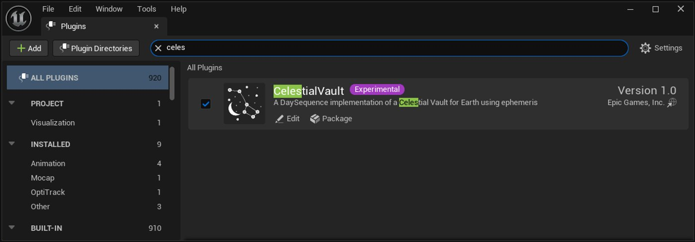
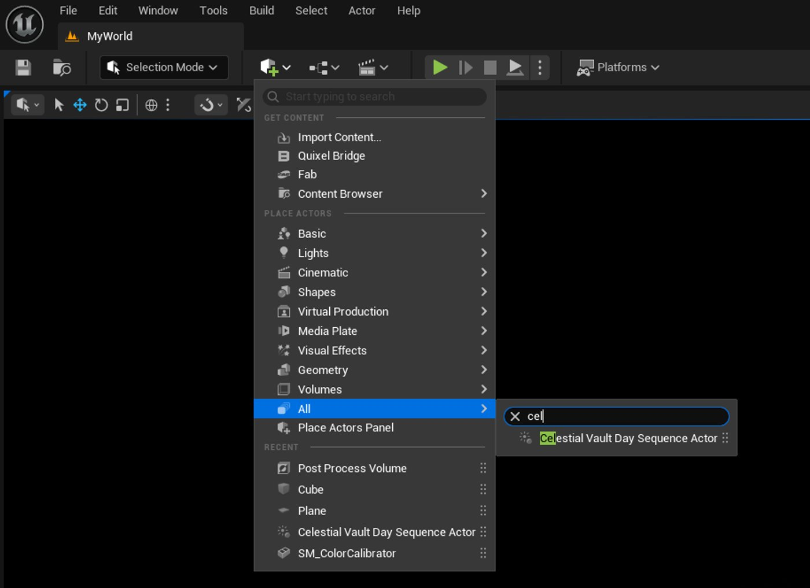
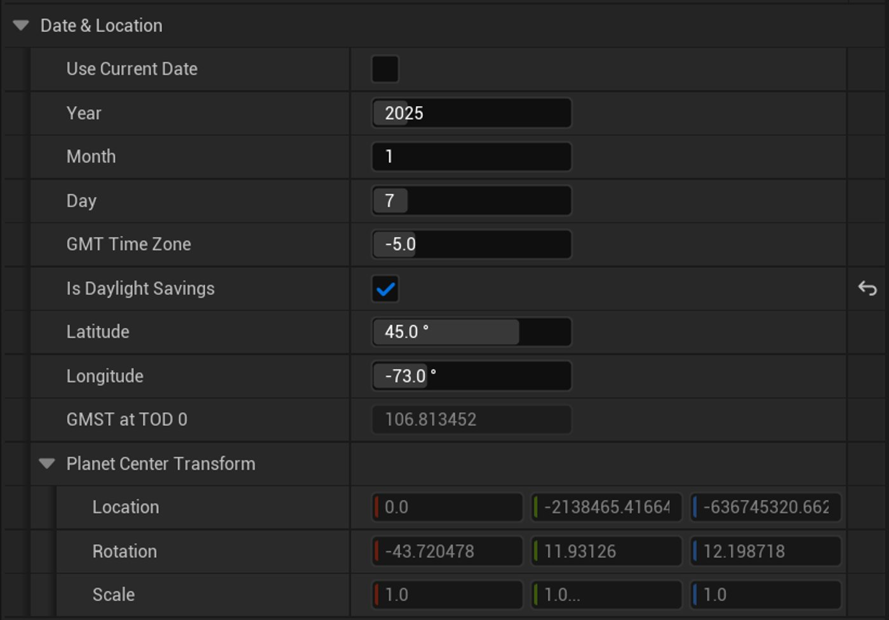
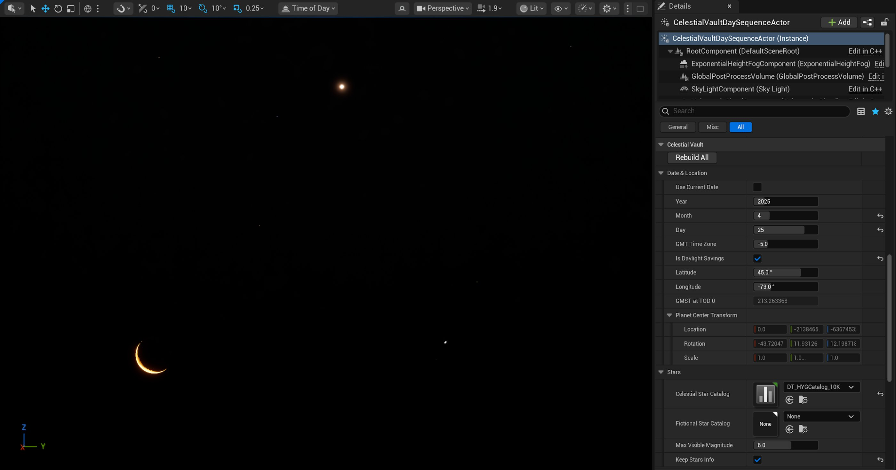
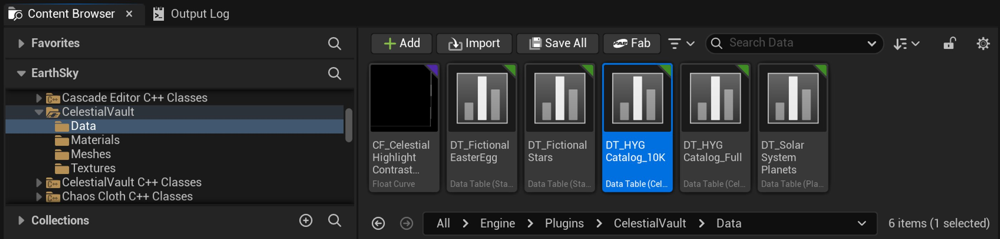
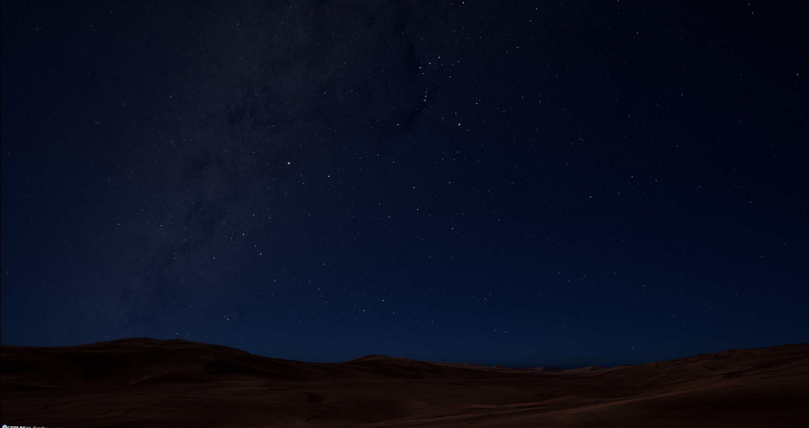
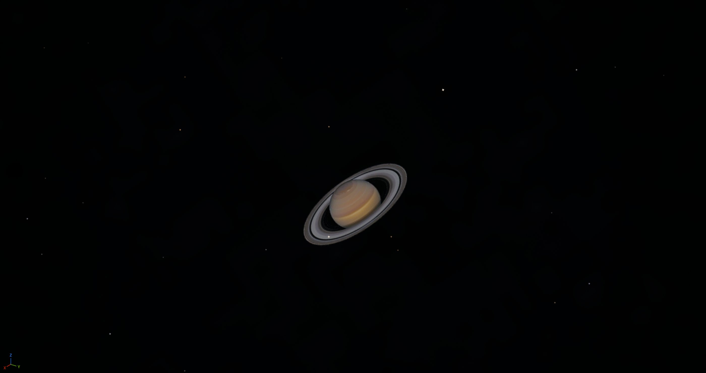

# Celestial Vault

> 路径：虚幻引擎5.7文档 / 构建虚拟世界 / 为场景设置光照 / Lighting Tools and Plugins / Celestial Vault

> 原始页面：https://dev.epicgames.com/documentation/unreal-engine/celestial-vault-plugin-for-unreal-engine

**昼夜序列（Day Sequence）**插件中提供的日月昼夜序列Actor（Sun Moon Day Sequence Actor）非常适合创建艺术性天空效果，但是缺乏精确的天体位置数据，这些数据对实现更精确的模拟或建筑项目至关重要。

> [!NOTE]
> 此插件基于昼夜序列而开发，融入了更多科学考量。 使用Celestial Vault插件前，需先了解昼夜序列插件。

为了更精确地模拟天空效果，**Celestial Vault**插件额外考虑了以下方面：

- 考虑地球自转的天穹背景。
- 星场的星体位置和星等由源自官方星表或任意虚构位置的数据驱动。
- 通过VSOP87算法精确放置的太阳系行星。
- 根据星历表显示正确月相的月球。 （仍可手动控制。）
- 所有光照单位均采用真实物理单位设置，昼夜亮度差异显著。

> [!NOTE]
> 重点聚焦地球视角的太阳系，采用与柏拉图相同的地心说模型。 考虑允许在行星间穿梭的日心说模型未纳入考量。

## 在项目中启用天穹昼夜序列

要在场景中使用天穹昼夜序列Actor（Celestial Vault Day Sequence Actor），必须为项目启用Celestial Vault插件。 你可以在编辑（Edit）菜单的插件（Plugins）浏览器中找到该插件。

启用Celestial Vault插件

> [!TIP]
> 无需添加昼夜序列插件；已定义自动依赖。

> [!NOTE]
> 本插件不依赖Georeferencing插件，但二者可配合使用。 只需确保在地理配准与天穹昼夜序列Actor中使用相同的地理配准位置。

## 使用天穹昼夜序列Actor

虽然天穹昼夜序列Actor与昼夜序列集合资产（ay Sequence Collection Asset）的概念相同，但是为了确保天空行为符合现实，这个序列的选项有限。

与天空相关的不同对象将由**程序化天穹序列（Procedural Celestial Vault Sequence）**驱动，该序列将读取天穹昼夜序列Actor中的共享属性。

因此，请勿将该天穹序列分配给其他类型的昼夜序列Actor。

该程序化序列考虑了以下因素：

- 天穹每24小时绕地球自转轴旋转一圈。
- 星体与穹的相对位置固定不变。
- 行星处于正确位置。 （由于它们运动缓慢，我们假设它们不会在昼夜序列期间移动。）
- 月球遵循其恒星运动规律运行。 （每天相对于背景星体向东移动约13度，并且晚升起约50分钟。）
- 正确显示月相。 （为简单起见，假设月相在一天内保持不变，但实际并非如此。）
- 太阳遵循其在天空的轨迹运行。

### 当前局限说明

为了提高性能，部分天体公式已被简化，虽然精度依旧很高（几分之一度），但无法提供绝对精确或超高精度的位置数据。

- 未模拟地轴的进动/章动效应。

  - 赤经、赤纬坐标是基于J2000历元的坐标，而非基于日期的坐标。
- 昼夜序列系统在一天内循环。

  - 由于月球的恒星运动，经过午夜时，它会跳过之前的位置。
- VSOP87算法仅使用有限的系数（地球和月球除外）。 行星位置为近似值。
- 未考虑日食/月食场景。
- 天空大气（SkyAtmosphere）组件将地球视为半径固定的球体。 使用WGS84椭球作为参考处理高精度地理空间数据时，无法匹配半径。 建议将天空大气半径设为围绕虚幻引擎世界原点的正确半径，当摄像机远离原点时，动态调整半径。
- 暂不支持地心ECEF坐标系（以地心为原点）。

这些限制可能会在插件的后续版本中改进。

## 天穹昼夜序列Actor

### 将Actor添加到世界中

天穹昼夜序列Actor是一种预配置的完整昼夜循环，可以直接拖到关卡中使用。 无需额外设置即可正常运行。

请按以下步骤开始：

1. 新建空白关卡或打开现有关卡。 若关卡中存在环境光照组件，例如定向光源（Directional Light）、天空光照（Sky Light）、天空大气（Sky Atmosphere）、体积云（Volumetric Clouds）、全局后期处理体积（Global Post-Process Volume）等，请将它们移除。
2. 在关卡编辑器的主工具栏点击创建（Create），从所有（All）卷展栏类别将天穹昼夜序列Actor（Celestial Vault Day Sequence Actor）拖入场景。

创建天穹昼夜序列Actor

> [!WARNING]
> 该系统采用物理精确的光源强度和天体亮度单位。 昼夜之间的动态范围较大（EV100的范围：-7至14）。
>
> 为了适应这一点，需为HDR眼部适应（HDR Eye Adaptation）和局部曝光（Local Exposure）设置特殊值。 该Actor包含无限范围的预配置后期处理体积组件（Postprocess Volume Component）。
>
> 可以直接在你的项目中使用这个组件，如果想自定义，必须禁用这个组件。 Actor或各种材质都支持使用其他虚拟单位。
>
> |  |  |
> | --- | --- |
> |  |  |
>
> 由于眼部适应需要时间来调整，建议在工作时提高加速（Speed Up）和减速（Speed Down）参数。

### 设置Actor属性

将天穹昼夜序列Actor添加到关卡中之后，就可以自由调整其组件的各种参数。 部分属性将由程序化序列驱动，有些数值无法编辑是正常的。

天穹昼夜序列Actor必须始终位于世界原点。 请勿修改其位置。

你需要控制的所有驱动属性都在Actor中：

#### 日期与地点

日期和时间设置

| 属性 | 说明 |
| --- | --- |
| 使用当前日期（Use Current Date） | 启用后，系统将按计算机的年月日初始化。 不考虑你所在的时区或夏令时。 |
| 年 | 展示天空的年份 |
| 月 | 展示天空的月份 |
| 日 | 展示天空的日期注意，不需要时间，因为它由当日时间（TOD Time）滑块定义。 这应该是该地点的当地时间。 |
| 格林威治标准时间时区（GMT Time Zone） | 在此手动输入时区；时区不会根据位置自动填充。 |
| 是否夏令时（Is Daylight Savings） | 手动检查是否在夏令时（夏季）。 无法根据本地日期自动计算。 |
| 纬度（Latitude） | 地球上与世界原点对应的点的纬度。 |
| 经度（Longitude） | 地球上与世界原点对应的点的经度。 |
| TOD 0的格林标准时间（GMST at ToD 0）[只读] | 显示当前日期对应于t=0（一天的开始）的格林尼治平星体时。 |
| 行星中心变换（Planet Center Transform）[只读] | 为了简化动画，所有组件都作为子项附加在一个场景组件（SceneComponent上），该组件设置了适当的变换，位于行星中心并朝向其旋转轴。该组件的旋转将模拟行星自转。 |

2025年4月25日早上5点的天空--“The Smiley Face”

#### 星体

| 属性 | 说明 |
| --- | --- |
| 天体星表（Celestial Stars Catalog） | 该输入数据表用于含天体属性的真实星体。 |
| 虚构星表（Fictional Stars Catalog） | 该输入数据表用于含基本属性的虚构星体。 |
| 最大可见星等（Max Visible Magnitude） | 所有星等高于此阈值的星体都将在生成时被忽略。 星等越小，亮度越高。 肉眼通常只能看到6等以内的星体。 阈值更高，生成的星体越多，但可能看不见，除非通过星体材质（Stars Material）人为增强其可见性。 |
| 保留星体信息（Keep Stars Info） | 启用后会生成一张表格并存储在内存中，可查询星体数据。 如果只对视觉表现感兴趣，无需启用。 |

生成时，两个星表将合并为一个ISM组件用于渲染。 但是虚构星体不含相同的详细信息，因此它们拥有不同的数据表格式：

天体星体的数据表必须为天体星体输入数据（CelestialStarInputData）类型

虚构星体的数据表必须为星体输入数据（StarInputData）类型

若格式错误，消息日志将提示警告，并且无法生成对应星体。

部分基础数据表位于Engine/Plugins/CelestialVault/Data文件夹。

数据文件夹

##### 天体星体

天体星体来自官方星表， 包含大量后续可查询的信息。 天体星表可通过CSV文件导入，前提是其中包含天体星体输入数据类型的字段：

- **ID**：唯一ID【1-n】
- **名称（Name）**：星体名称——可以为空
- **RA**：赤经——以小时表示（1小时=15°）
- **DEC**：赤纬——以度数表示
- **DistanceInPC**：距离——以秒差距表示
- **星等（Magnitude）**：通常为【-2-13】
- **色指数（ColorIndex）**：又称B-V，表示星体颜色【-0.33-2.0】
- **依巴谷ID（HipparcosID）**：依巴谷星表中的星体ID——可以为空
- **亨利德雷珀ID（HenryDraperID）**：亨利德雷珀星表中的星体ID——可以为空
- **耶鲁亮星ID（YaleBrightStarID）**：耶鲁亮星表中的星体ID——可以为空

插件提供两个数据表

- DT_HYGCatalog_Full——Astronomy Nexus页面的完整HYG星表。 其中包含120000颗星的记录。
- DT_HYGCatalog_10K——相同的HYG星表，但只包含最亮的10000颗星（星等≤6）。 足以满足多数用例的需求。

沙漠地形上空的完整HYG星表。

##### 虚构星体

虚构星体更加简单，可由用户制作。 它们采用和星表相同的概念，但由于只需要可视化部分，因此数据表只需包含星体输入数据类型的一组精简字段：

- **ID**：唯一ID【1-n】
- **名称（Name）**：星体名称——可以为空
- **RA**：赤经——以小时表示（1小时=15°）
- **DEC**：赤纬——以度数表示
- **星等（Magnitude）**：通常为【-2-13】
- **颜色（Color）**：线性RGB颜色字符串，格式为“(R=0.924,G=0.114,B=1.)”

插件提供两个数据表

- DT_FictionalStars——随机放置星体的简单示例。
- DT_FictionalEasterEgg——复活节彩蛋形状的高级星座示例。

创建自定义虚构星表不在本文档的讨论范畴，但某些开源计算机视觉软件可从一组点中轻松提取像素坐标，利用电子表格即可生成CSV文件，支持你做各种有趣的实验。

##### 导入自己的CSV文件

星表可通过CSV文件导入，例如：

> [!TIP]
> 也可将提供的数据表导出为CSV文件，作为基础模板。
>
> 1. 将CSV文件拖入内容浏览器。
> 2. 确保选择与导入内容匹配的天体星体输入数据/星体输入数据行类型。
> 3. 若你的数据集包含其他字段，请检查不同的输入选项。
> 4. 正确设置用作主键的字段。 （此处为ID）

#### 行星

| 属性 | 说明 |
| --- | --- |
| 行星表 | 该输入数据表包含行星的属性。 |
| 行星规模（Planets Scale） | 应用于行星的人工缩放系数 |
| 保留行星信息（Keep Planets info） | 启用后会生成一张表格并存储在内存中，可查询行星数据。 如果只对视觉表现感兴趣，无需启用。 |

当前主要聚焦于太阳系行星。 VSOP87星历表精确模拟了它们的运行轨迹。 此外，系统还支持任意行星使用椭圆轨迹，但该功能尚未实现。

行星数据表需包含以下字段：

- **ID**：唯一ID【1-n】
- 名称（Name）：行星名称——可以为空
- **轨道类型（OrbitType）**：太阳系行星轨道枚举。 尚未启用椭圆轨道。
- **半径（Radius）**：行星半径（千米）
- **纹理列索引（TextureColumnIndex）**：行星纹理在完整行星图谱中的索引。

> [!NOTE]
> 行星使用平面替代物渲染，配合着色器进行缩放，从而确保始终在屏幕上显示最小像素尺寸。 行星规模属性的效果仅在行星真实尺寸超过该像素尺寸时可见，具体取决于行星半径、距离和摄像机视野。

以星星为背景的土星

#### 月球

当前系统仅支持地球的卫星，因此选项有限。

| 属性 | 说明 |
| --- | --- |
| 月球缩放（Moon Scale） | 应用于月球的人工缩放系数 |
| 手动控制（Manual Control） | 默认情况下，月球位置和月相根据日期和位置值计算。 勾选此方框可启用附加选项（见下文说明） |
| 月龄 | 对应月球的月龄：0=新月，0.25=上弦月，0.5=满月，1=下一个新月。 |
| 月球相对于太阳赤经的偏移（Moon offset to Sun’s Right Ascension） | 月球位置相对于太阳的水平偏移量，以小时为单位。 （1小时=15°） 若偏移值为3小时，月球将以45度的偏移角跟随太阳，在太阳落山3小时后通过地平线。 |
| 月球相对于太阳赤纬的偏移（Moon offset to Sun’s Declination） | 月球位置相对于太阳的垂直偏移量，以度数为单位。 |

> [!NOTE]
> 默认情况下，月球的位置和月相会自动计算，无需任何操作。 但在某些训练与仿真场景中，控制夜间亮度至关重要，因为在黑暗的夜晚和明亮的夜晚，能见度完全不同！
>
> 要在日历上精准找到对应的日期，确保月球处于正确相位和位置往往比较麻烦，手动控制（Manual Control）选项就能解决这个问题。
>
> 从用户角度而言，设置与太阳的偏移量是最简单的方法。 非常直观，无论你在哪个半球、什么纬度，无论当前白昼时长……
>
> 需要注意的是，可能会产生不受控制的视觉效果：假设偏移值为3小时。 月球将位于太阳“左侧”。 此时，太阳光应使月球形成蛾眉月。 因此，月龄值不应大于0.75。 在极端情况下，可能会出现满月靠近太阳的情况，这在现实中是绝不可能的。 要想保持基本的真实效果，一定要注意这个问题。
>
> 由于需要手动控制，月球采用带自定义材质的平面渲染，而非3D球体。

阿尔卑斯山上空的残月

#### 高级（Advanced）

天空被渲染成一个球体，包含多个半径更小的分层，分别对应不同的天体，由外至内依次为：天穹背景层、星体层、行星层和月球层。

它们需远离行星，以避免视差效应，同时要保持足够远，避免深度冲突。 高级属性可以调整各种对象范围。

还可以设置太阳和月亮定向光源的基础参数。

| 属性 | 说明 |
| --- | --- |
| 天穹距离（Celestial Vault distance） | 映射背景纹理的球体的半径（千米）（银河、星座或天球网格线） |
| 星穹百分比（Stars Vault percentage） | 星体生成位置占穹球体半径的百分比。 |
| 行星穹百分比（Planets Vault percentage） | 行星生成位置占穹球体半径的百分比。 |
| 月穹百分比（Moon Vault percentage） | 月球生成位置占穹球体半径的百分比。 |
| 阳光强度（Sunlight Intensity） | 物理正确的太阳光源强度（默认：120000勒克斯） |
| 月光强度（Moonlight Intensity） | 物理正确的月亮光源强度（默认：0.1勒克斯） |

> [!NOTE]
> 光源和眼部适应的注意事项：
>
> 本系统在设计时考虑了物理准确性，并且已自动设置默认值。
>
> 太阳和月亮光源已被定义为大气光源，其中太阳的索引为0，月光的索引为1。
>
> 120000勒克斯的阳光强度意味着，正午时地表白色表面的亮度约为8000-12000 cd/m²。
>
> 月光的基础强度为0.1勒克斯（满月的平均值）。 文献记载的范围在0.05至0.1勒克斯之间，超级满月可达0.32勒克斯，你可以自由调节！ 该强度对应的地表白色表面亮度约为0.01-0.02 cd/m²。
>
> 我们会根据月相调低基础强度，因此在无人造光源的环境下，强度可能非常低。
>
> 月球表面通常是非常明亮的！ （约1000-2500 cd/m²），满月时月光非常炫目。
>
> 由于亮度范围很大，眼部适应（Eye Adaptation）的默认值也必须做相应的调整：
>
> 最小EV100（MinEV100）被设为-0.5，因此我们可以在满月时看到清晰的夜景，新月时环境昏暗。
>
> 基于直方图的眼部适应无法完全覆盖这个亮度范围，尤其是在屏幕上的月球尺寸较小的时候。 因此，我们设置了一条局部曝光高光对比度曲线（Local Exposure Highlight Contrast Curve）来适应月球的亮度。
>
> 这些特殊设置都集成在与Actor相关的全局后期处理体积中。
>
> 系统还会处理光照、阴影和雾气对象的云层覆盖。 太阳和月亮光源均启用了投射阴影（Cast Shadow）和投射云层阴影（Cast Cloud Shadows）功能，但这些功能会影响性能。 如果你不需要，随时可以关闭。

### 调整天空的外观

系统为所有组件配置了材质实例，你也可以随时用自己的材质替换。 本段将描述材料实例的属性。

注意：修改材质的亮度/强度值可能意味着改变眼部适应或曝光设置。

若想修改这些材质，建议使用项目内容中的副本， 而非修改原始材质。

#### Celestial Vault

MI_CelestialVault材质是一个多纹理材质，并且包含太阳光晕。

| 属性 | 说明 |
| --- | --- |
| 全局强度（Global Intensity） | 整个天穹（背景+星座+天体网格）的亮度系数 |
| 背景强度（Background Intensity） | 单独调节背景纹理（银河）的亮度系数 |
| 背景纹理（Background Texture） | 用于穹背景的替换纹理。 必须使用天体坐标。 |
| 显示星座（Show Constellations） | 启用带星座贴图（白色）的附加纹理层 |
| 星座颜色（Constellations Color） | 星座的着色颜色 |
| 星座强度（Constellations Intensity） | 单独调节星座纹理的亮度系数 |
| 星座纹理（Constellations Texture） | 用于星座的替换纹理。 必须使用天体坐标。 |
| 显示天体网格（Show Celestial Grid） | 启用带天体网格贴图（白色）的附加纹理层 |
| 网格颜色（Grid Color） | 天体网格的着色颜色 |
| 网格强度（Grid Intensity） | 单独调节天体网格纹理的亮度系数 |
| 网格纹理（Grid Texture） | 用于天体网格的替换纹理。 必须使用天体坐标。 |

> [!NOTE]
> 系统提供中等纹理，如需高分辨率纹理，请访问：https://svs.gsfc.nasa.gov/4851/

星座线和天体网格

#### 星体

MI_Stars材质用于为星体的各个平面创建纹理，并将它们渲染为实例化静态网格体组件。 其中包含调整星体外观和大小的不同选项。

##### 外观

| 属性 | 说明 |
| --- | --- |
| 去饱和度（Desaturation） | 所有星体均采用逐实例颜色颜色进行渲染：虚构星体需手动设置，天体星体通过B-V值计算得出。 该设置可以降低颜色饱和度（0=无变化，1=仅灰度） |
| 星等偏移（Magnitude Offset） | 星体亮度根据其星等计算。 此参数可通过偏离理论星等，人为增加星体亮度。 负值可降低星等，提升亮度。 亮度是星等的指数因子。 |
| 遮罩（Mask） | 用于星体的纹理遮罩。 参见T_StarMask_*获取更多遮罩 |
| 遮罩衰减（Mask Falloff） | 应用于遮罩颜色和Alpha的指数值，用于增强或降低对比度 |

##### 基础大小（Base Size）

星体亮度不足以看到它们；星体必须在屏幕上保持最小尺寸，建议大于1像素，以免放大失真。

虽然亮度是星等的指数因子，但屏幕上的星体尺寸可以是一个线性函数，并由星等/大小对定义。 （受限于特定范围）

| 属性 | 说明 |
| --- | --- |
| 最亮星体星等（Brightest Star Magnitude） | 最亮星体的参考星等。 低于此星等的星体仍保持最大尺寸。 |
| 最亮星体尺寸（像素）（Brightest Star Size (pixels)） | 最亮星等星体的参考像素尺寸。 星等较低的星体将根据最暗星体设置进行尺寸插值。 |
