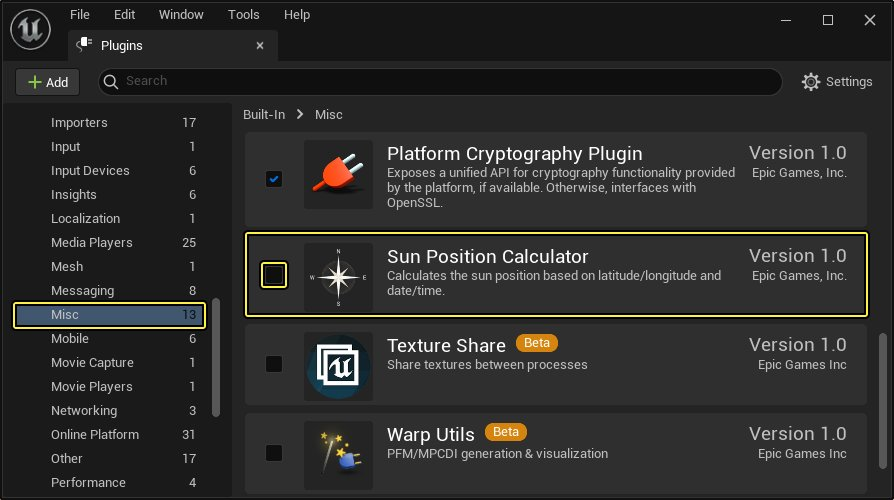
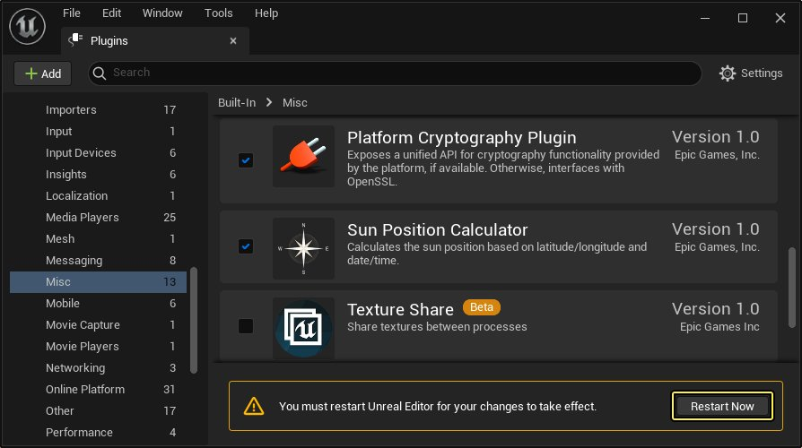
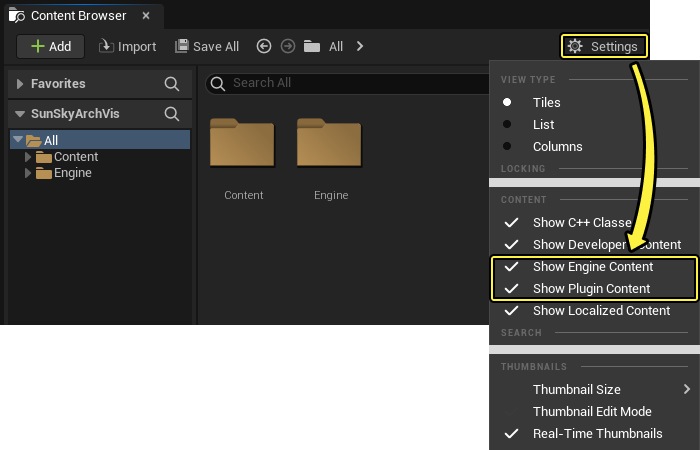
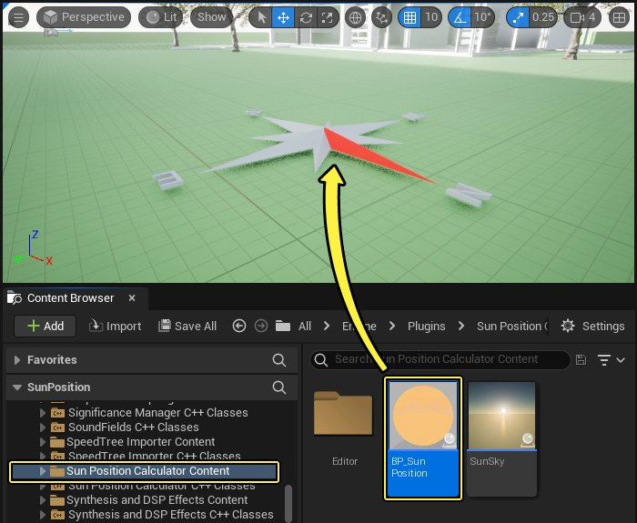
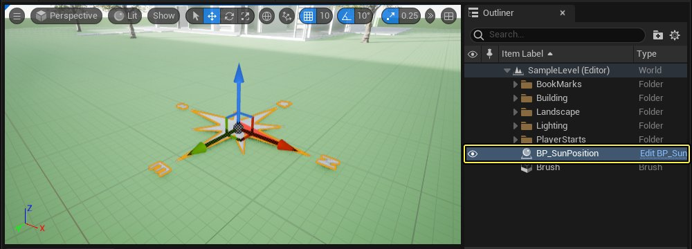
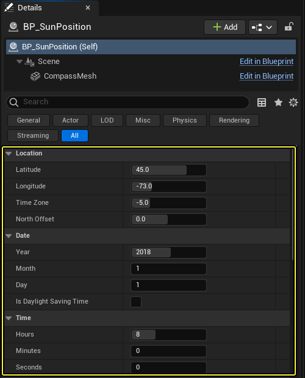
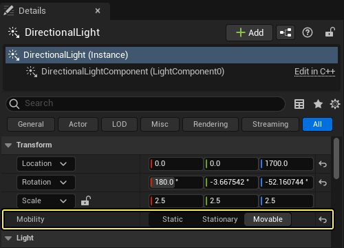
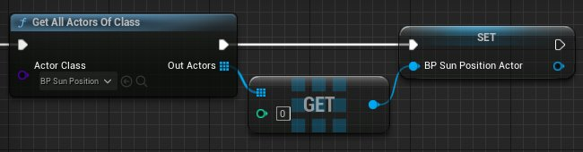

# 地理位置准确的太阳定位工具

> 路径：虚幻引擎5.7文档 / 构建虚拟世界 / 为场景设置光照 / Lighting Tools and Plugins / 地理位置准确的太阳定位工具

> 原始页面：https://dev.epicgames.com/documentation/unreal-engine/geographically-accurate-sun-positioning-tool-in-unreal-engine

在某些情况下，选择太阳在天空中的位置时，并非出于审美考虑，而是因为太阳的位置是关键的设计因素。

这在大型建筑和施工项目中通常如此，不过但凡你要生成逼真的渲染来呈现真实的光影模式，也可能如此。

在这些情况下，你需要运用数学方程将太阳准确地放在虚幻引擎关卡中，而在现实世界中，人们正是用这些数学方程来计算太阳在地球上空的位置。这些复杂的方程包含了许多设置，其中包括观测者在地球上的地理位置、日期及时间。

**太阳位置计算器（Sun Position Calculator）** 插件可在虚幻引擎中为你求解这些数学方程。你定义纬度、经度、基点、日期和时间。然后，太阳位置计算器与虚幻引擎中的默认天空球体协同工作，将日轮放入天空球体，并在关卡中确定主定向光源的方向。

## 入门指南

> [!NOTE]
> **先决条件** ：太阳定位器使用默认的 **BP_SkySphere** ，你会发现，在虚幻编辑器中创建的大多数新关卡已设置了它。你必须确保自己的关卡包含 **BP_SkySphere** 实例。

开始操作：

1. 在 **主菜单（main menu）** 中，选择 **编辑（Edit）> 插件（Plugins）** 。
2. 在 **杂项（Misc）** 类别下找到 **太阳位置计算器（Sun Position Calculator）** 插件，并选中其 **启用（Enabled）** 复选框。

   

   点击查看大图。
3. 点击 **立即重启（Restart Now）** 按钮以应用更改并重新打开虚幻编辑器。

   

   点击查看大图。
4. 找到 **内容浏览器（Content Browser）** ，打开 **设置（Settings）** 并启用 **显示引擎内容（Show Engine Content）** 和 **显示插件内容（Show Plugin Content）** 。

   
5. 在 **SunPosition Content** 文件夹中找到 **BP_SunPosition** 资产，并将其拖入 *视口（Viewport）** 。

   

   它由一个看似指南针方位基点的小工具表示。（此小工具仅出现在虚幻编辑器中，你运行项目时不会出现。）
6. 在 **视口（Viewport）** 中选择这个小工具，或在 **大纲视图（Outliner）** 中选择 **BP_SunPosition** Actor。

   

   点击查看大图。
7. 在 **细节（Details）** 面板中，设置能控制太阳位置的场景属性：

   

   | 设置 | 说明 |
   | --- | --- |
   | **纬度（Latitude）** | 对赤道以南的坐标使用负值，对赤道以北的坐标使用正值。 |
   | **经度（Longitude）** | 对子午线以西的坐标使用负值，对子午线以东的坐标使用正值。 |
   | **时区（Time Zone）** | 设置此数值来表示你的场景相对于协调世界时（UTC）或格林威治标准时间（GMT）偏差的小时数。 |
   | **北偏移（North Offset）** | 控制关卡中的对象与指南针的方位基点之间的关系。更改此控制点还会旋转 **BP_SunPosition** 小工具在关卡中的可视位置。调整该值，直到小工具点上显示的方位基点相对于关卡中的对象定向正确。 不要在关卡视口中使用旋转工具旋转小工具本身。请仅使用此北偏移（North Offset）设置来控制方位基点。 |
   | **日期（Date）** 和 **时间（Time）** | 设置你要模拟的一年中的日期和一天中的时间。 |

在你更改这些属性的数值时，应该会在虚幻编辑器中看到太阳在天空中移动，阴影也会发生变化。

## 在运行时修改设置

你可以在运行时更改 **BP_SunPosition** Actor的设置。这样你就可以根据UI控件或其他Gameplay事件来驱动太阳的位置和光源角度。

1. 为了能够在运行时更改阳光的角度，你需要使关卡中的主定向光源成为可移动光源。在 **大纲视图（Outliner）** 或 **关卡视口（Level Viewport）** 中选择定向光源（Directional Light），在 **细节（Details）** 面板中找到 **移动性（Mobility）** 设置，并将其设置为 **可移动（Movable）** 。

   
2. 当你想要在运行时修改蓝图脚本中的某个数值时，需要获取对你的关卡中包含的 **BP_SunPosition** Actor 的对象引用。你可以使用 **Get All Actors of Class** 节点动态检索它，如下所示：

   

   > [!NOTE]
   > 由于 **Get All Actors of Class** 可能开销较高，因此最好只执行一次（比如，在加载关卡或构建控件时），并将结果保存到变量中，而不是每次需要获取或设置数值时都执行一次。
3. 有了对象引用后，从其输出端口向右拖动，展开 **变量（Variables）** 类别以找到 **Get** 和 **Set** 节点列表，你可以使用这些节点来检索和设置在虚幻编辑器的 **细节（Details）** 面板中公开的相同值。

   > 图片已省略：BP_SunPosition Actor的Get和Set API
4. 将所需的值设置为新数值。完成后，从 **BP_SunPosition** 变量的输出端口向右拖动，并调用其 **Update Sun** 节点。

   > 图片已省略：Update Sun函数

例如，下面来自控件蓝图的一个片段设置了UI滑块，该滑块可将小时更改为早上6点到晚上10点之间的任意数值。

> 图片已省略：Example of changing the sun position at runtime

点击查看大图。

滑块的操作效果如下：
