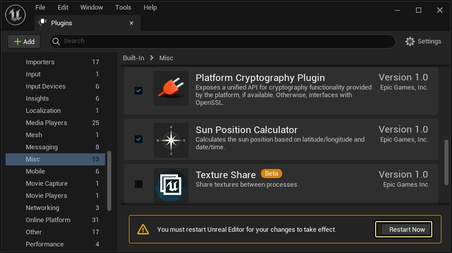
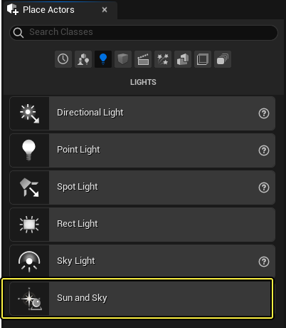
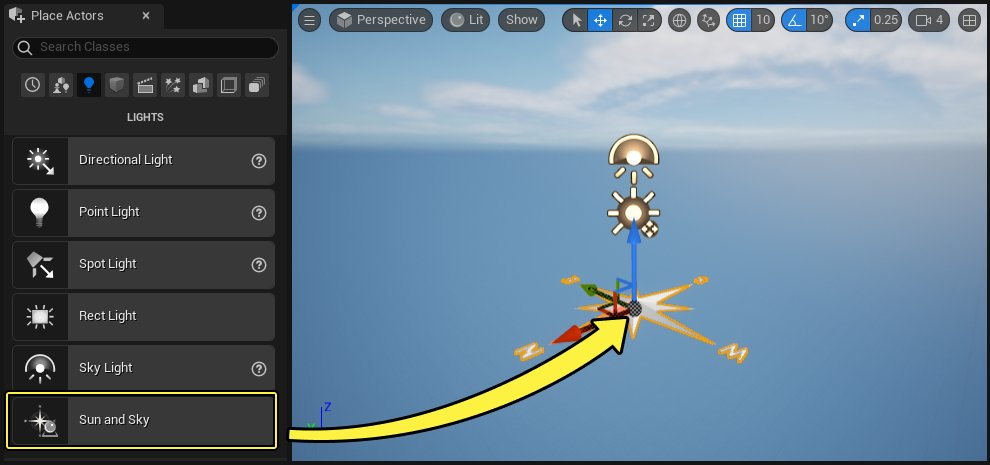
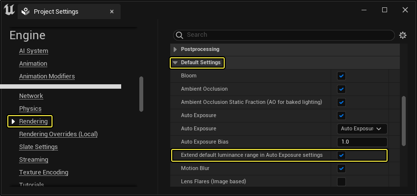
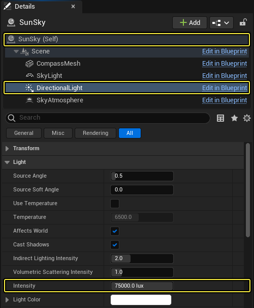
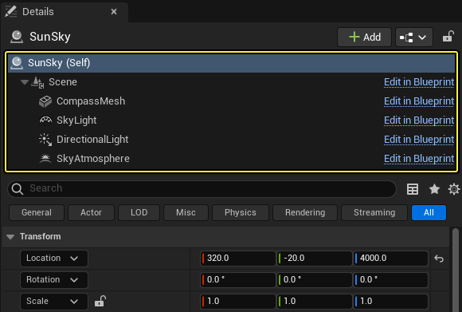
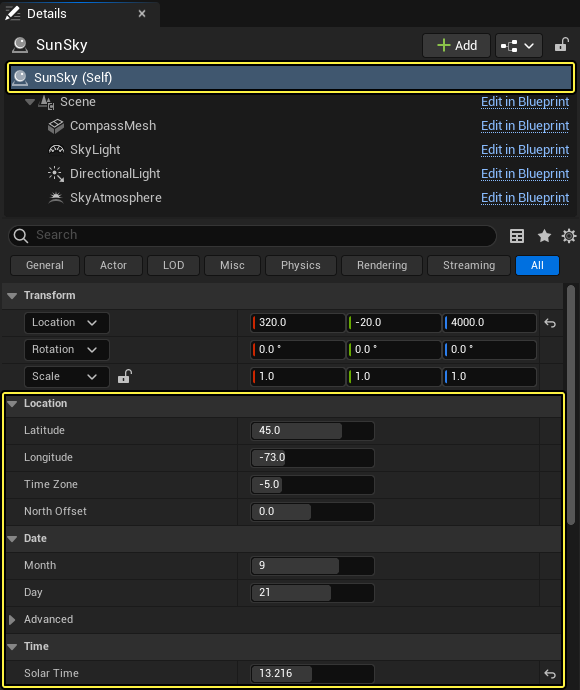

# 太阳和天空Actor

> 路径：虚幻引擎5.7文档 / 构建虚拟世界 / 为场景设置光照 / Lighting Tools and Plugins / 太阳和天空Actor

> 原始页面：https://dev.epicgames.com/documentation/unreal-engine/sun-and-sky-actor-in-unreal-engine

**太阳位置计算器（Sun Position Calculator）** 插件包括[地理位置准确的太阳定位器](../geographically-accurate-sun-positioning-tool/index.md)，可根据地理位置和日期时间精确控制太阳的位置。**SunSky** Actor是此插件的一部分。它利用相同的数学方程控制太阳在天空中的位置，还包括 **定向光源**、**天空光照**、**SkyAtmosphere** 多个组件，用于产生逼真的渲染，呈现真实形态的阳光和阴影。

借助 **SunSky** Actor，无论怎样的审美选择，都可使用夏令时(DST)、日期、时间的设置简单快捷地设置场景。设计用于游戏和其他行业，例如建筑、工程和施工(AEC)或汽车、产品设计和制造。

## 项目模板和设置

[创建新项目](../../../../understanding-the-basics/working-with-projects-and-templates/index.md)时，你可以根据需要选择各种行业类型和模板。

> [!WARNING]
> 根据所选模板，会默认禁用/启用某些属性。这些属性会影响SunSky Actor的外观和功能。

选择 **模板类别（Template Category）** 和 **模板（Template）** 时，记住以下两点：

- 需对

  在自动曝光设置中延伸默认亮度范围（Extend default luminance range in Auto Exposure settings）

  进行项目设置，以便正确显示此SunSKy Actor，无需编辑属性。
- 每个模板类别的某些模板默认启用太阳位置计算器。可转到

  主菜单

  ，选择

  编辑（Edit）> 插件（Plugins）

  并搜索此插件，或在打开新项目时搜索此插件来验证这一点。

> [!NOTE]
> 本文演示了如何在虚幻引擎（UE）的建筑可视化模板钟使用太阳和天空Actor。如需使用该模板，只需新建一个项目，然后选择 **建筑、工程和施工** 新项目类型，然后选择建筑可视化模板。

## 启用太阳位置计算器插件

1. 从主菜单选择 **编辑（Edit）> 插件（Plugins）**。
2. 在 **杂项（Misc）** 类别下找到 **太阳位置计算器（Sun Position Calculator）** 插件，并选中 **启用（Enabled）** 复选框。

   

   点击查看大图
3. 单击 **立即重启（Restart Now）** 按钮以应用更改并重新打开虚幻编辑器。

   

   点击查看大图

## 使用Sun and Sky Actor

启用太阳位置计算器插件后，将在编辑器 **放置Actor（Place Actors）** 面板中的 **光源（Lights）** 选项卡中找到名为 **Sun and Sky** 的新Actor。

拖放到关卡视口中。

Click image for full size.

> [!TIP]
> 将SunSky Actor添加到场景时，最好删除任何已有的定向光源、天空光照和SkyAtmosphere组件。否则，若从头开始，最好从全新的空白关卡开始。

> [!NOTE]
> 将SunSky Actor拖至关卡时，将显示为亮白色，可执行以下操作之一：
>
> - 在项目设置（Project Settings）中的渲染（Rendering）类别下（位于默认分段下）启用 **在自动曝光设置中延伸默认亮度范围（Extend default luminance range in Auto Exposure settings）**。
>
>   
>
>   Click image for full size.
> - 或者，若不希望此项目设置影响项目外观，可选择SunSky Actor的定向光源并使用较低光照强度（打开SunSky Actor，在"组件"下选择"定向光源"，找到"细节"面板中的"光源"分段，降低"强度"直至满意为止）。
>
>   

SunSky Actor包含定向光源、天空光照和SkyAtmosphere组件的可移动Actor，作为蓝图的一部分。选择场景组件 **SunSky(Self)** 后，将显示公开的蓝图属性，例如日期、时间、纬度、经度的属性，这些属性可进行设置。选择单个组件，例如定向光源或SkyAtmosphere组件，将显示自身属性。这些属性，如移动性和强度，也可以进行设置。

## 属性和设置

可在SunSky Actor的 **详细信息（Details）** 面板中找到以下可调节属性。

> [!NOTE]
> 由于 **（变换）Transformation** 属性是Actor的标准属性，所以我们在下表中省略了它们。

| 属性 | 说明 |
| --- | --- |
| 位置（Location） |  |
| **纬度（Latitude）** | 赤道以北或以南的度数。 |
| **经度（Longitude）** | 本初子午线以东或以西的度数。 |
| ***时区（Time Zone）** | 世界上特定地区的特定时间。时区使用GMT作为基准。 |
| **北偏移（North Offset）** | 为SunSky Actor及其组件设置北方方向位置。 |
| 日期（Date） |  |
| **月（Month）** | 设置当前月份。 |
| **日（Day）** | 设置当前日期。 |
| **使用夏令时（Use Daylight Saving Time）** | 启用夏令时(DST)。 |
| **DST起始月份（DST Start Month）** | 设置当前年度DST起始的月份。 |
| **DST起始日期（DST Start Day）** | 设置当前年度DST起始的日期。 |
| **DST终止月份（DST End Month）** | 设置当前年度DST终止的月份。 |
| **DST终止日期（DST End Month）** | 设置当前年度DST终止的日期。 |
| **DST Switch Hour** | 设置DST的起始时间和终止时间。 |
| 时间（Time） |  |
| **太阳时（Solar Time）** | 设置一天当中的时间。 输入此值，作为军用时间的浮点。例如，上午12:30为00.5，下午12:30为12.5。 |

## ArchVis模板关卡示例

创建项目时，**建筑、工程和施工（Architecture, Engineering, and Construction）** 的模板类别包括名为 **ArchVis** 的模板。

此模板项目专门用于架构可视化工作流，包括太阳研究、室内渲染和非真实感风格渲染的示例。包括以下已设置使用的资源：

- 多个包含场景设置的关卡，此类设置用于利用SunSky Actor演示物理准确光照的可视化。
- 光照配置和后期处理体积，已为启用光线追踪的项目设置光线追踪功能。
- 用于渲染场景的示例摄像机和Sequencer。这些还包括动态时间转换。

此模板还支持[Datasmith插件](../../../../working-with-content/datasmith/datasmith-import-process/index.md)，它是一组用于将3ds Max、CAD软件等离线渲染应用程序中创建的场景和资源导入实时引擎的工具和插件。

### 外部

**外部** 关卡演示SunSky Actor的使用，其中使用多个摄像机和Sequencer来演示在场景各个位置之间移动时的时间序列。可在 `Content/ArchVisProject` 文件夹中找到。

它还使用SunSky Actor组件，此类组件正用于[动态照亮场景](../../light-types-and-their-mobility/movable-light-mobility/index.md)。为项目启用各种实时[光线追踪](../../ray-tracing-and-path-tracing-features/hardware-ray-tracing/index.md)功能后，它还将演示此类功能。

### 内部

**内部** 关卡演示SunSky Actor组件的使用，此类组件正用于使用[预计算静态照明](../../light-types-and-their-mobility/static-light-mobility/index.md)照亮场景。可在 `Content/ArchVisProject` 文件夹中找到。

这包括：

- 使用

  全局照明

  生成场景的烘焙全局照明和光照。
- 使用

  全局光照重要体积

  和

  全局光照门户

  来控制和聚焦全局光照发出光子的区域。

## 其他说明

- 在SunSky Actor上，默认为定向光源和天空光照默认启用

  光线追踪

  功能，以便两者都支持光线追踪阴影的投射。
- 可手动更改SunSky Actor中的定向光源旋转值。但更改会影响SunSky Actor其他部分的其他设置时，手动调整的旋转值将重置为默认位置。这可防止值与地理位置计算思路相冲突。
- 天光Actor（SkyLight）现在会默认启用"实时采集"模式。这应该有助于你更好地捕获SkyAtmosphere组件、体积云、高度雾等。请注意，该模式只有在使用动态或固定模式才可用。如果你希望禁用实时采集模式，只需选中天光Actor，找到细节面板，然后取消勾选"光照"分段顶部的"实时采集"复选框。

## 其他资源

- 在网站

  LatLong.net

  中输入位置名称，它将返回地图视图及其纬经度坐标。
- 网站

  TimeAndDate.com

  具有专门用于

  时区地图

  的区域，这对于确定设置SunSky Actor使用的时区非常有用。默认使用-5 GMT。
