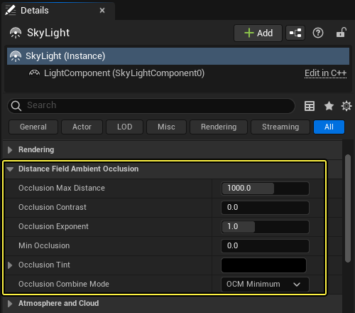
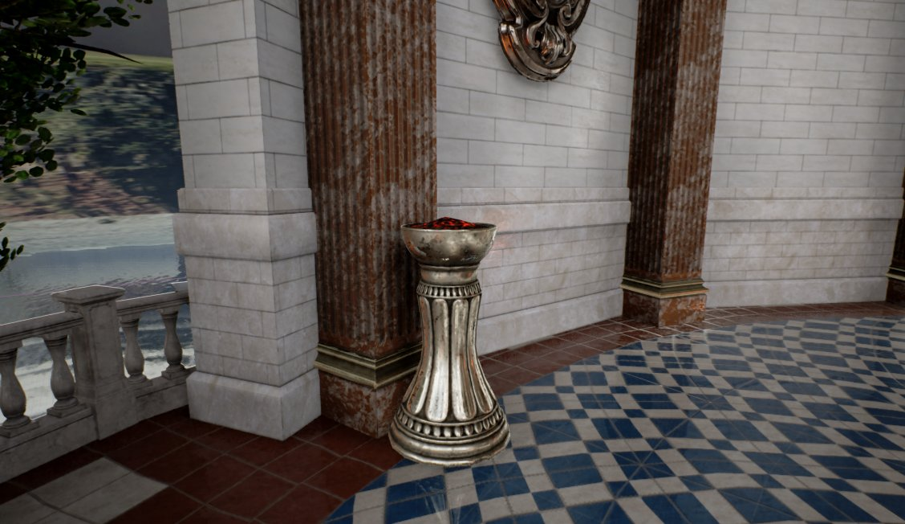
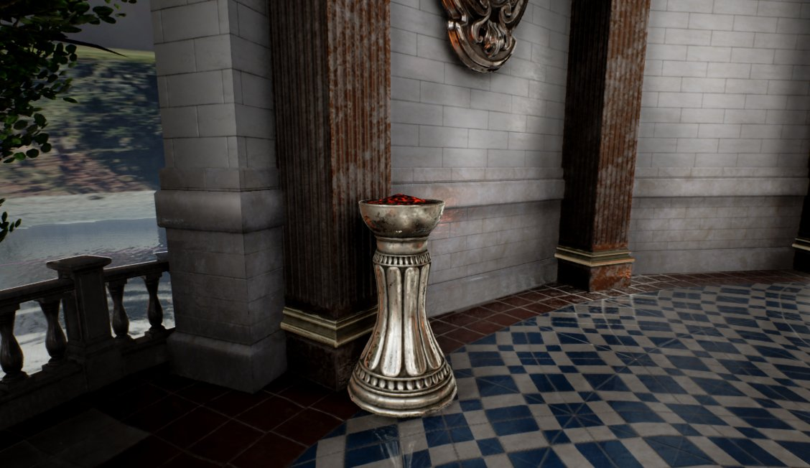
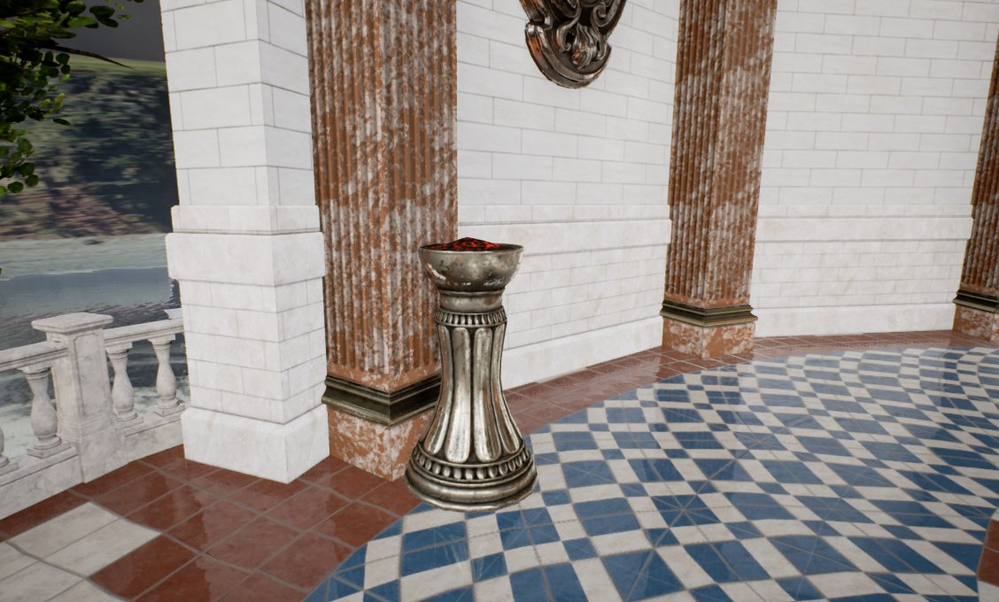
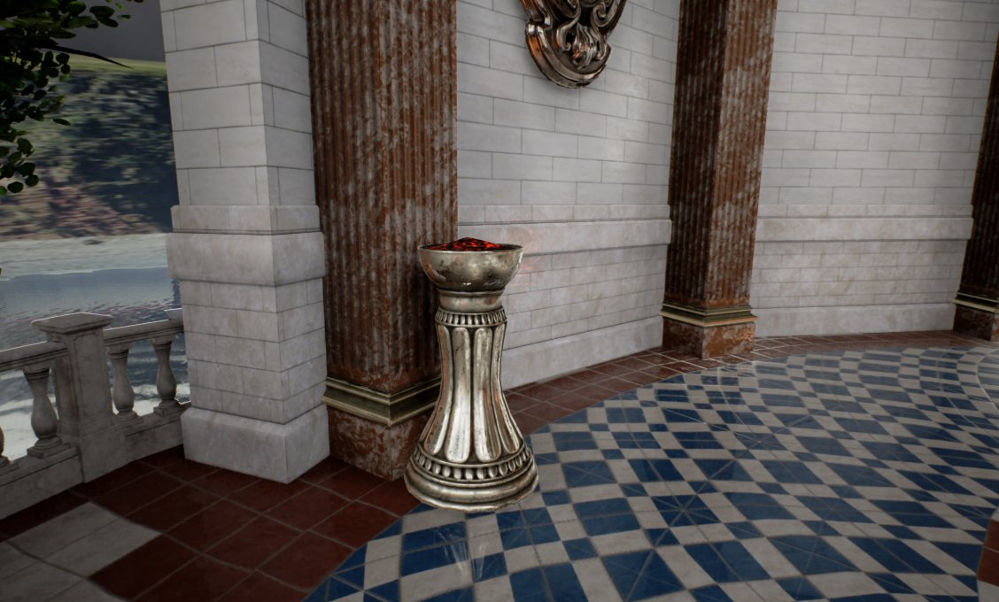
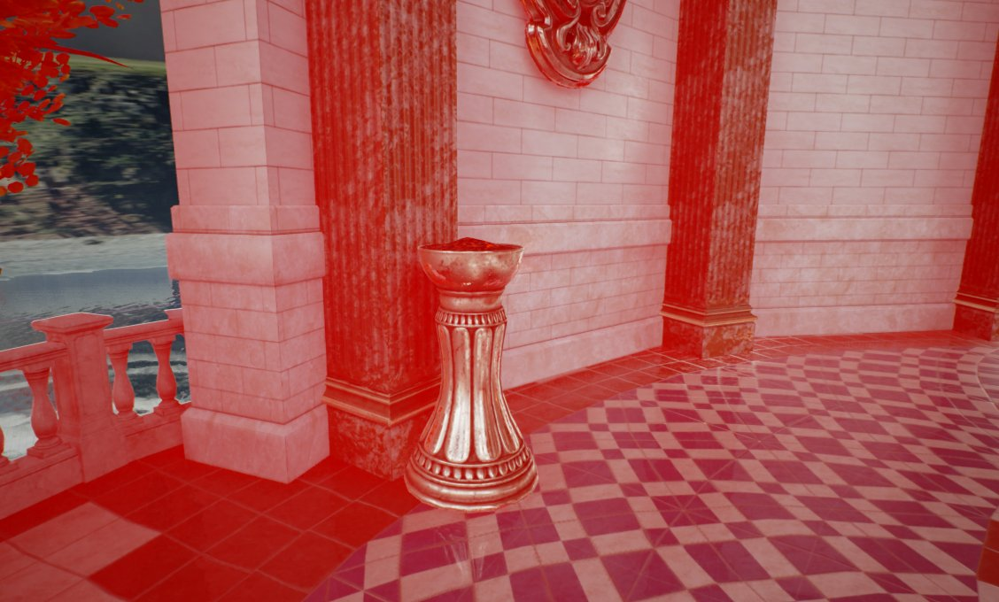
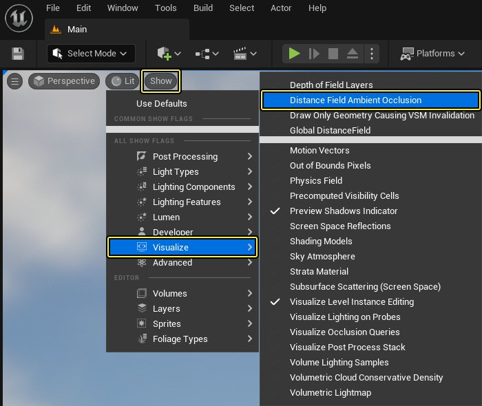

# 距离场环境光遮蔽

> 路径：虚幻引擎5.7文档 / 构建虚拟世界 / 为场景设置光照 / 网格体距离场 / 距离场环境光遮蔽

> 原始页面：https://dev.epicgames.com/documentation/unreal-engine/distance-field-ambient-occlusion-in-unreal-engine

使用有向距离场体积能获得可移动天空光照的阴影；该有向距离场体积在各刚性网格体周围预计算，以产生中等范围的环境光遮蔽。在 **虚幻引擎** 中，这被称为 **距离场环境光遮蔽（Distance Field Ambient Occlusion）**（DFAO）。其支持动态场景变化；刚性网格体可移动或隐藏，其会影响遮蔽。与[屏幕空间环境光遮蔽](../../../../designing-visuals-rendering-and-graphics/post-process-effects/index.md)（SSAO）不同，遮蔽在场景空间遮挡物中进行计算，因此出屏丢失数据不会导致瑕疵。

此动态环境光遮蔽解决方案存在部分扩散限制，以便支持动态场景修改，因此并不适用于所有项目。具体而言，其仅支持轻微非等分缩放（挤压）。此外，映射到每个物体上的体积纹理较小，因此大型静态网格体产生的效果较差。

## 场景设置

> [!WARNING]
> 使用此功能需要首先启用 **渲染（Rendering）** 部分中 **项目设置（Project Settings）** 下的 *生成网格体距离场（Generate Mesh Distance Fields）**。参见[网格体距离场](../index.md#%E5%90%AF%E7%94%A8%E8%B7%9D%E7%A6%BB%E5%9C%BA)页面了解详情。

启用距离场环境光遮蔽需将 **天空光照（Sky Light）** 拖入场景，并将其移动性设为 **可移动（Movable）**

> [!NOTE]
> 欲了解详细步骤教程，请浏览[距离场环境光遮蔽](../using-distance-field-ambient-occlusion/index.md)指南进行学习。

## 天空光照

利用 **天空光照（Sky Light）** 组件可调整 **距离场环境光遮蔽（Distance Field Ambient Occlusion）** 下列出的各项设置。

以下为部分可调设置的对比：

### 遮蔽对比度

遮蔽 | 对比度：0

遮蔽 | 对比度：1

### 最小遮蔽

最小遮蔽：0

最小遮蔽：1

### 遮蔽色调

遮蔽色调：| 黑色

遮蔽色调：| 红色

> [!NOTE]
> 关于天空光照设置的更多信息和示例，请参阅[网格体距离场参考](../mesh-distance-fields-properties/index.md#%E5%A4%A9%E7%A9%BA%E5%85%89%E7%85%A7)页面。

## 场景代表

利用距离场光遮蔽的视图模式可忽略其他正在发生的光照，查看关卡中的DFAO效果。

选择 **显示（Show）** > **可视化（Visualiz）** > **环境场光遮蔽（Distance Fields Ambient Occlusion）**，即可使用关卡视口查看模式来显示将代表场景环境光遮蔽的距离场。

点击查看大图

在此查看模式中，唯一有效果的[天空光照设置](../mesh-distance-fields-properties/index.md#%E9%81%AE%E8%94%BD%E6%9C%80%E5%A4%A7%E8%B7%9D%E7%A6%BB)便是 **遮蔽最大距离（Occlusion Max Distance）**。

> 图片已省略：Example of DFAO visualization mode

## 质量

距离场环境光遮蔽的质量由其显示的网格体距离场的分辨率所决定。环境光遮蔽的阴影十分柔和，因此即使表面未正确显示，离表面较远的遮蔽也会十分精确。这在天空遮蔽中通常不易察觉。使网格体较大的细节在网格体距离场中正确显示才能获得较好结果。使用[网格体距离场显示](../index.md#%E5%9C%BA%E6%99%AF%E8%A1%A8%E8%BE%BE)来查看质量。

> [!NOTE]
> 参见[距离场](../index.md#%E8%B4%A8%E9%87%8F)页面，了解网格体距离场质量的详情。

## 遮蔽结果

### 散射

距离场环境光遮蔽生成会一个环境法线（最少遮蔽的方向），用于修改散射天空光照计算（以及遮蔽因子）。

> 图片已省略：无距离场环境光遮蔽

> 图片已省略：距离场环境光遮蔽

无距离场环境光遮蔽

距离场环境光遮蔽

此示例是《堡垒之夜》中正午的场景。在《堡垒之夜》中，玩家可以随时推倒任何墙壁、地板或天花板并重新建造，因此光照必须随之进行更新。距离场光遮蔽支持在关卡中动态修改这些类型。

## 高光

距离场光遮蔽同样提供天空光照中的高光遮蔽。定向遮蔽椎体和反射椎体（尺寸取决于材质的粗糙度）相交即可进行计算。

> 图片已省略：无高光遮蔽

> 图片已省略：高光遮蔽

无高光遮蔽

高光遮蔽

*管道上的高光遮蔽。*

非定向环境光遮蔽默认应用至高光。将反射椎体和DFAO产生的未遮蔽椎体相交，使用 **r.AOSpecularOcclusionMode** 便能获得比默认方式更加精确的遮蔽结果。注意：此操作会导致DFAO采样瑕疵。

### 植物

针对使用[植物叶子工具](../index.md#%E6%A4%8D%E7%89%A9%E5%8F%B6%E5%AD%90%E5%B7%A5%E5%85%B7%E8%AE%BE%E7%BD%AE)绘制的Actor时，必须首先启用工具设置中的 **影响距离场光照（Affect Distance Field Lighting）** 选项。

> 图片已省略：Enable the Affect Distance Field Lighting

即使距离场光遮蔽在表面运行，其仍会处理由小树叶组成的片状植物。在 **静态网格体编辑器（Static Mesh Editor）** 的 **构建设置（Build Settings）** 中，启用植物类型资源的 **生成两面距离场（Two-Sided Distance Field Generation）** 可获得最佳结果。这将使已计算的遮蔽更加柔和。

> [!TIP]
> 在天空光照选项中增加 **最小遮蔽（Min Occlusion）** 来防止资源内部完全变黑。

> 图片已省略：Enable Two-Sided Distance Field Generation

在此范例中，DFAO已被启用并正在使用"两面距离场生成"：

> 图片已省略：仅屏幕空间环境光遮蔽

> 图片已省略：有距离场环境光遮蔽的植物叶子

仅屏幕空间环境光遮蔽

有距离场环境光遮蔽的植物叶子

对于使用LOD（细节级别）的植物资源，距离场光遮蔽可能会产生过度遮蔽的问题。[网格体距离场](../index.md)在远距离仍准确、LOD关卡却使用较少三角形数量且可能会缩小到生成的网格体距离场中时，便会出现以上问题。

在这些LOD上使用 **场景位置偏移（World Position Offset）**，将顶点拉出距离场即可解决此问题。相机的少量偏移通常就足以解决瑕疵。 对于公告板来说，使用像素深度偏移功能可创建有效深度值，更好地显示原始3D三角形网格体。GDC演示"男孩和他的风筝"便使用了此技术，其依赖于距离场进行远距离观察。

> 图片已省略：无像素深度偏移

> 图片已省略：像素深度偏移

无像素深度偏移

像素深度偏移

距离树公告板显示了过度遮蔽。使用"像素深度偏移"和"天空光照最小遮蔽"来减少过度遮蔽。

### 地形

地形使用高度场进行自身显示，而非使用网格体距离场。此操作使用近似椎体交叉。该交叉根据高度场计算得出，使像素可在无距离场代表的情况下获得遮蔽。但其中无自投阴影或距离场阴影。相反，地形应将带级联阴影贴图（CSM）的 **远景阴影（Far Shadows）** 用于远距离的投影。

> 图片已省略：Landscape

使用DFAO可视化视图模式显示地形遮蔽。

## 性能

距离场环境光遮蔽的开销主要是GPU耗时和显卡内存。DFAO已经过优化，可在中配PC、PlayStation 4和Xbox One上运行。目前其开销更加稳定，几乎不变（稍稍取决于对象密度）。

若相机静止且表面几乎是平面，与早期实现进行比较时，DFAO的速度为1.6倍之多。在有植物和快速移动相机的复杂场景中，最新的优化速度要快5.5倍。PlayStation 4上运行完整游戏场景距离场环境光遮蔽的用时为3.7毫秒。

### 优化

下表展示了在使用PlayStation 4 行测试时，DFAO的改进情况，这些改进是基于虚幻引擎4.16所进行的优化结果：

#### 总体改良

使用PlayStation 4进行测试后，虚幻引擎4.16中DFAO的部分改良结果如下：

| 优化 | 原耗时（毫秒） | 新耗时（毫秒） | 节约时间（毫秒） |
| --- | --- | --- | --- |
| 变更剔除算法，生成各对象的交叉画面贴图的列表，而非反向进行。各贴图/对象交叉获得自身椎体追踪线程组，因此波阵面更小也排列更好。 | 3.63 | 3.48 | 0.15 |
| 内循环中的缓慢指令被替换为快速近似值 | 3.25 | 3.09 | 0.16 |
| 从场景空间内循环将变换移出至本地空间（采样位置基于空间位置和方向构建）。 | 3.09 | 3.04 | 0.05 |
| 计算ClearUAV的着色器。 | 3.04 | 2.62 | 0.42 |

#### 流畅采样

使用DFAO的流畅采样前使用的是自适应采用，意味着扁平表面与所做的工作比多表面的密集场景（如植物）更少。也意味着干净环境中会出现许多污点。

流畅采样需要更长的历史过滤，可能会出现"重影"(或移动对象的拖影），移除阴影投射物后尤为如此。而在虚幻引擎4.16和之后的版本中，利用距离场临时过滤保存信任值，便可消除重影。其用于在上采样时追踪遮蔽的泄漏，然后将泄漏值通过历史更快地清空。总之，在相机或动态物体快速移动时，此操作可减少重影的发生。

在下例中，环境光遮蔽当前的计算速度足以消除自适应采样，因此遮蔽将更为流畅。

> 图片已省略：自适应采样

> 图片已省略：流畅采样

自适应采样

流畅采样

*场景视图*

> 图片已省略：自适应采样

> 图片已省略：流畅采样

自适应采样

流畅采样

*DFAO可视化*

#### 全局距离场

全局距离场是分辨率较低的距离场，跟随摄像机的同时，在关卡中使用有向距离场遮蔽。这会创建每个Object网格体距离场的缓存，然后将它们合成到围绕摄像机的若干体积纹理中，称为裁剪图。由于只有新的可见区域或受到场景修改影响的可见区域才需要更新，合成过程不会有太多消耗。

裁剪图被分为四个切片，围绕在仅在需要时更新的相机周围。相机移动显示新切片或固定不动的物体导致其影响边界被修改时会发生此情况。其维护的平均开销接近于零，但在最坏的情况下，进行瞬移等行为时的更新开销将更高。

> 图片已省略：Clipmap visualization

裁剪图纹素尺寸的裁剪图显示，每个裁剪图均由不同颜色所代表。

Object距离场的分辨率较低意味着它可用于所有物体，但是在计算天空遮蔽的锥体轨迹时，它们在阴影点附近采样，而全局距离场是在更远的地方采样。

你可以单击 **显示（Show） > 可视化（Visualize）> 全局距离场（Global Distance Field）**将全局距离场显示在视口中。

> 图片已省略：undefined

点击查看大图。

下面是每个Object网格体距离场可视化与全局距离场可视化的比较图，根据摄像机视图和距离将其合并到裁剪图。

> 图片已省略：网格体距离场可视化

> 图片已省略：全局距离场可视化

网格体距离场可视化

全局距离场可视化

全局距离场的分辨率低于其对象距离场分辨率，会造成表面附近的距离场不精确。椎体踪迹产生时，对象距离场用于遮蔽椎体的起始处，而将全局距离场用于踪迹的剩余部分。得到精确自遮蔽和有效长距离踪迹后，可获得更好的结果。有效最大对象影响距离大幅降低，因此天空遮蔽可获得5倍的性能提升。

## 限制

**技术限制（Limitations of the technique）**

- 仅生成环境光遮蔽，其与天空遮蔽不同（因其遮蔽距离受限）。
- 阴影仅从刚性网格体处投射。针对骨架网格体时，在间接光照区域使用

  胶囊体阴影

  。

**当前版本的限制（会在之后进行改善）**

- 工作是跨多帧进行的，生成新采样时遮蔽会出现细微变化，因此动态场景修改引发的环境光遮蔽更新会出现些许延迟。已在虚幻引擎4.6及之后版本中修复此问题：利用距离场临时过滤器保存信任值，该值用于在上采样时追踪遮蔽的泄漏，然后将泄漏值通过历史更快地清空。相机移动时，此操作可减少重影的发生。
- 体积纹理将被映射到每个网格体，因此较大物体的距离场分辨率较低，环境光遮蔽质量较差。

参见[距离场](../index.md#%E5%B1%80%E9%99%90%E6%80%A7)页面，了解距离场的更多详情。

## 提示和技巧

### 简易反射光照

在天空光照上取消勾选 **下半球为纯色（Lower Hemisphere is Solid Color）** 并在立方体贴图上绘制底色，可获得与太阳反射光照相似的效果，不会产生额外开销。 这将使灯光泄露到室内，因其并不遵循定向光源的投影，在室外场景中较为有效。
