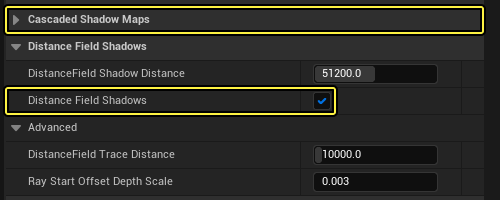
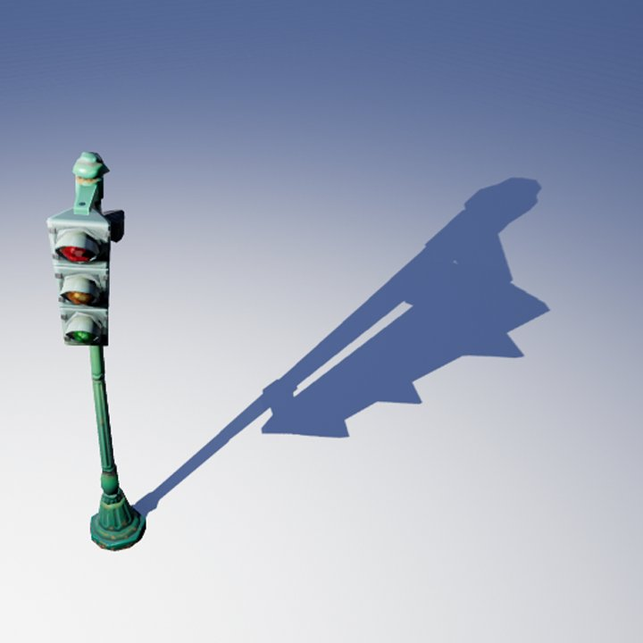
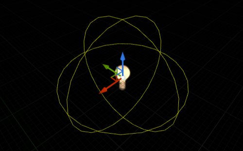
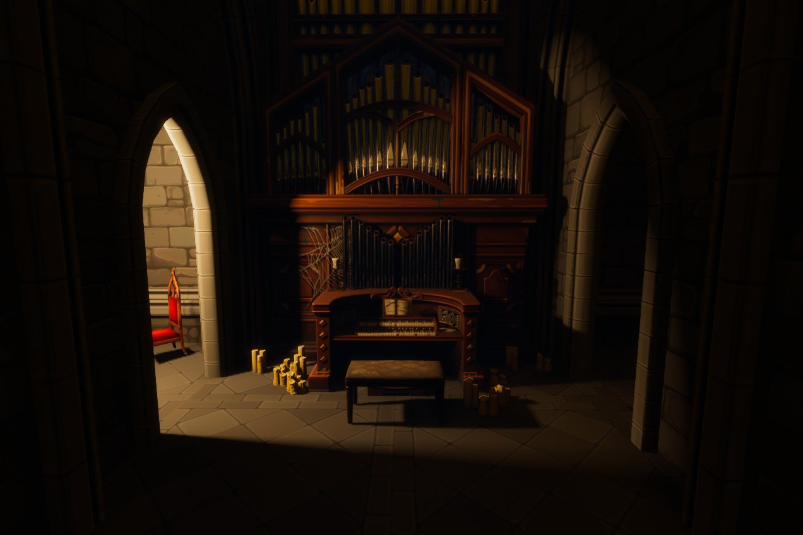
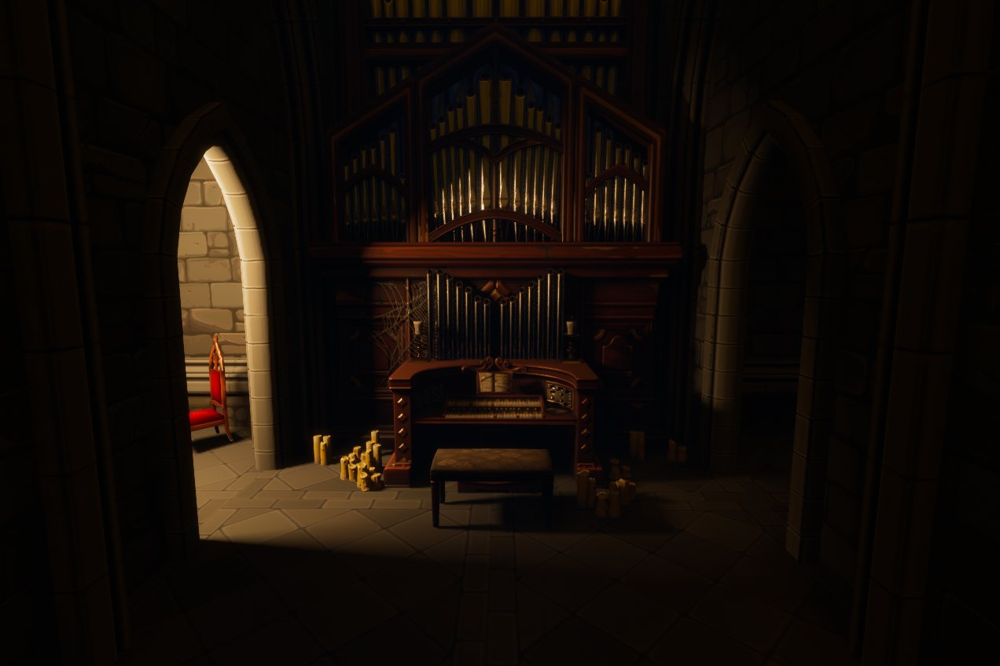
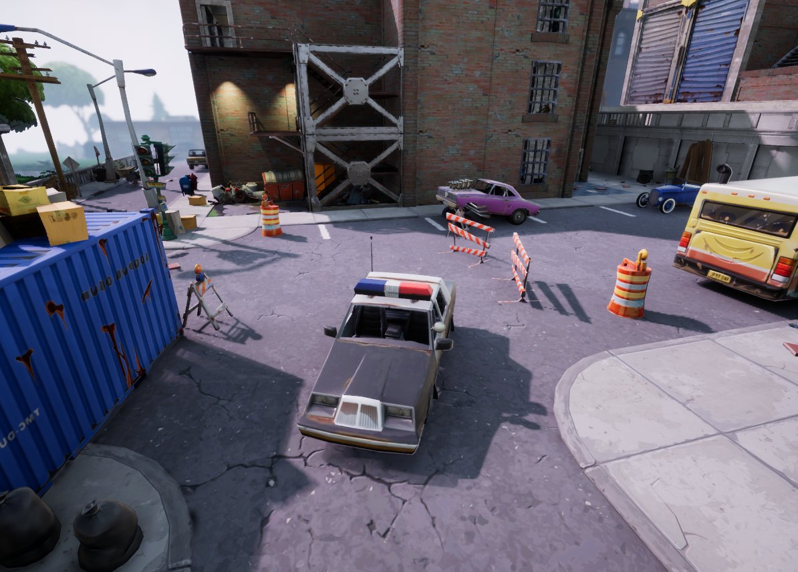
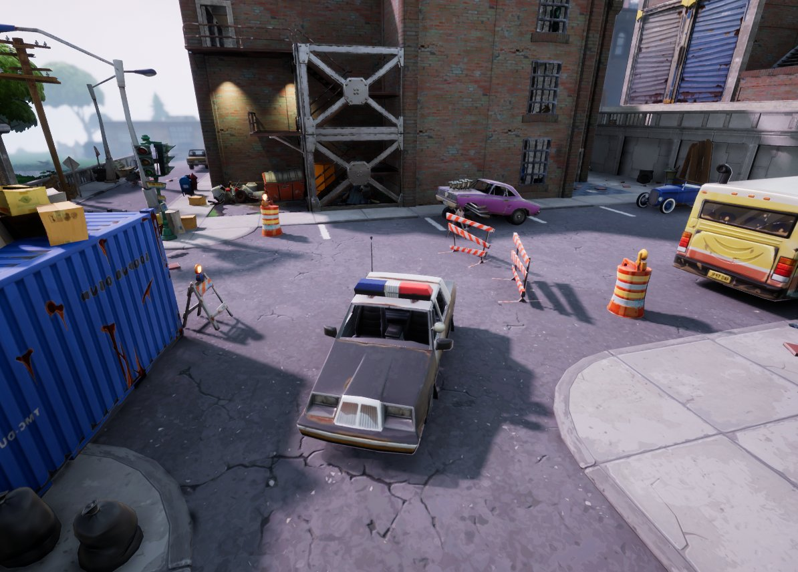

# 距离场柔和阴影

> 路径：虚幻引擎5.7文档 / 构建虚拟世界 / 为场景设置光照 / 网格体距离场 / 距离场柔和阴影

> 原始页面：https://dev.epicgames.com/documentation/unreal-engine/distance-field-soft-shadows-in-unreal-engine

可移动光源产生的阴影是使用每个刚性网格体的对象距离场，计算来自动态光源的有效区域阴影而得出的。 在虚幻引擎中，这被称为 **距离场阴影**（DFS）。为了计算阴影，从要计算阴影的点朝着每个光源，通过有向距离场（SDF）跟踪光线。 使用到遮挡物的最近距离估算椎体追踪，所耗成本与光线追踪相同。它让球形光源形状能实现高质量区域阴影。

## 场景设置

> [!NOTE]
> 该功能要求你在 **项目设置（Project Settings）** 的 **渲染（Rendering）** 部分中启用 **生成网格体距离场（Generate Mesh Distance Fields）**。 有关更多信息，请参阅[网格体距离场](../index.md)页面。

要启用距离场阴影，首先将 **光源** 拖到场景中，将其"移动性"（Mobility）设置为 **可移动（Movable）**，然后从光源的 **细节（Details）** 面板，启用 **距离场阴影**。

> [!NOTE]
> 有关逐步介绍指南，请访问[使用距离场阴影](../using-distance-field-indirect-shadows/index.md) 操作指南，以了解更多信息。

### 区域阴影设置

每个光源类型都可以使用距离场阴影来创建柔和区域阴影。这些阴影模拟真实世界的阴影，在接近于基部的地方保留明显的接触阴影，随着距离的增加，柔化处理延伸阴影。

传统阴影贴图

距离场阴影

> [!NOTE]
> 有关光源设置的更多信息以及更多示例，请参阅[网格体距离场参考](../mesh-distance-fields-properties/index.md#lightcomponents)页面。

### 点光源和聚光源半径

对于点光源和聚光源，使用 **源半径（Source Radius）** 来确定一个光源上的阴影半影范围。区域阴影使用清晰接触阴影计算，接触阴影随着距离的延长而变的柔和。 在点光源和聚光源上，表示为黄色球体。

编辑器用黄色线条绘制光源形状。

> [!NOTE]
> 光源半径不应与场景相交，否则会导致照明瑕疵。

光源半径：| 0

光源半径：| 50

距离场阴影来自于一个点光源，该光源使用光源半径柔化门道、长椅和钢琴对周围几何体产生的阴影投射。

> [!NOTE]
> 有关点光源和聚光源设置的更多信息，请参阅[网格体距离场参考](../mesh-distance-fields-properties/index.md)页面。

### 定向光源角度

对于定向光源，使用 **光源角度（Light Source Angle）** 来确定一个光源上的阴影半影范围。 距离场阴影几乎没有自交问题，因此能避免远处漏光和过度偏差问题，而传统阴影映射则很难避免。

光源角度：| 1

光源角度：| 3

*距离场阴影来自定向光源，为了实现更柔和阴影调整了其光源角度。*

在大多数情况下，使用级联阴影贴图（CSM）提供定向光源的动态阴影。这要求将场景中的网格体渲染到 多个级联阴影贴图中（用于实现阴影的细节层次）。阴影计算成本随着阴影距离增大而增加，因为 要渲染到阴影贴图中的网格体和三角形数量较多。

距离场阴影在远处的性能更优异，它只针对可见像素完成阴影工作。级联阴影贴图可以用于对摄像机附近的区域计算阴影， 而RTDF阴影对更远的区域计算阴影，最远达到设置的 **距离场阴影距离（Distance Field Shadow Distance）**。

> 图片已省略：仅级联阴影贴图

> 图片已省略：级联阴影贴图和距离场阴影

仅级联阴影贴图

级联阴影贴图和距离场阴影

启用距离场阴影后，超过 **级联阴影贴图距离（Cascaded Shadow Map Distance）** 设置值的区域将使用 距离场计算阴影。在使用CSM和RTDF阴影的对比中，CSM阴影设置为1,000 CM（厘米），允许在 摄像机附近呈现清晰的阴影，并添加大量细节。在超过1,000 CM的阴影距离处，使用RTDF阴影，允许对 最远不超过1.2 KM（千米）的对象计算阴影。这样，远处的树木也可以投射阴影，而如果使用级联阴影贴图，则需要极高的计算成本。

> [!NOTE]
> 有关定向光源设置的更多信息，请参阅[网格体距离场参考](../mesh-distance-fields-properties/index.md)页面。

### 场景表达

每个创建的关卡都由所放置Actor的所有这些网格体距离场组成。网格体距离场是离线生成的，使用了将效果保存在体积纹理中的三角形光线追踪。因此，网格体距离场是无法在运行时生成的。这种方法会计算所有方向上的有向距离场，找到距离最近的表面，然后将该信息保存起来。

你可以使用视口将表达场景的网格体距离场可视化，只需依次选择 **显示（Show） > 可视化（Visualize） > 网格体距离场（Mesh Distance Fields）**。

| 列 1 | 列 2 |
| --- | --- |
| [undefined](https://d1iv7db44yhgxn.cloudfront.net/documentation/images/b3b30cbe-6e58-4eba-a213-c10d6269aa6f/04-distance-field-enable-mdf-view-mode.png) | [undefined](https://d1iv7db44yhgxn.cloudfront.net/documentation/images/1efdfdda-0b5d-4165-94a5-b570cb24ad9e/05-distance-field-visualize-mdf.png) |
| 启用可视化的菜单 | 网格体距离场可视化 |

点击查看大图

如果看到较白而不是较灰的区域，意味着需要通过多个步骤才能找到网格体表面的交点。与相对简单的网格体相比，掠射角光线需要更多的步骤才能和平面相交。

### 网格体距离场质量

距离场阴影保真度对阴影准确度有非常大的影响，超过了[距离场环境光遮蔽](../distance-field-ambient-occlusion/index.md)。 增大的网格体距离场分辨率将提高静态网格体的阴影投射。使用网格体距离场可视化可以检查质量。

以下示例展示了启用距离场阴影的场景在不同距离场分辨率下的表现。

> 图片已省略：距离场分辨率：| 1

> 图片已省略：距离场分辨率：| 5

距离场分辨率：| 1

距离场分辨率：| 5

以下示例展示了启用网格体距离场可视化的场景在不同距离场分辨率下的表现。

> 图片已省略：距离场分辨率：| 1

> 图片已省略：距离场分辨率：| 5

距离场分辨率：| 1

距离场分辨率：| 5

网格体距离场阴影通过深度感知放大采样以半分辨率进行计算。**临时抗锯齿（Temporal Anti-Aliasing）**（TAA）非常有助于降低使用半分辨率时可能出现的闪烁现象，但有时仍可能会出现锯齿边缘。

> [!NOTE]
> 有关网格体距离场质量的更多信息，请参阅[网格体距离场](../index.md)页面。

## 性能

以下GPU时间是在Radeon 7870、分辨率1920x1080、完整游戏场景中测得的：

| 测试 | 级联/立方体贴图阴影成本（毫秒） | 距离场阴影成本（毫秒） | 提速百分比（%） |
| --- | --- | --- | --- |
| 定向光源，距离10k个单位，3个级联阴影贴图 | 3.1 | 2.3 | 25% |
| 定向光源，距离30k个单位，6个级联阴影贴图 | 4.9 | 2.8 | 43% |
| 1个点光源，大半径 | 1.8 | 1.3 | 30% |
| 5个点光源，小半径 | 3.2 | 1.8 | 45% |

### 优化

下面是优化距离场阴影时可以使用或应该考虑的要点：

- 在定向光源上，

  源角度（Source Angle）

  越大，成本越高，因为每个要计算阴影的点都需要考虑更多的对象。
- 距离场阴影距离（Distance Field Shadow Distance）

  的值越大，剔除效率越低。
- 启用了

  双面距离场生成（Two-Sided Distance Field Generation）

  （在

  构建设置（Build Settings）

  中启用）的网格体的阴影需要耗用更多成本，因为产生的阴影永远不会完全不透明。

## 局限性

> [!NOTE]
> 距离场阴影与网格体距离场方法有着一样的常规限制。有关这些限制的更多信息， 请参阅[网格体距离场](../index.md)页面。
