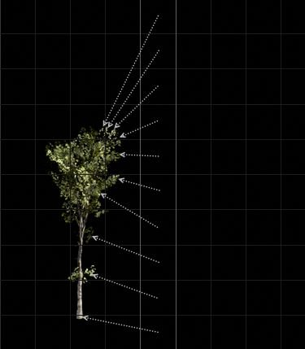
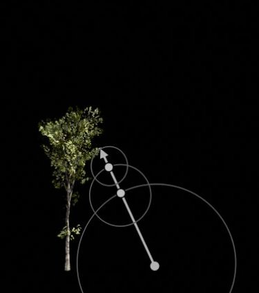
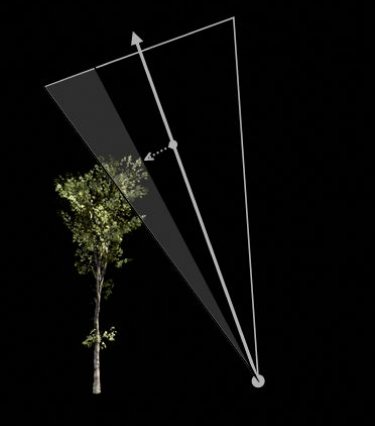
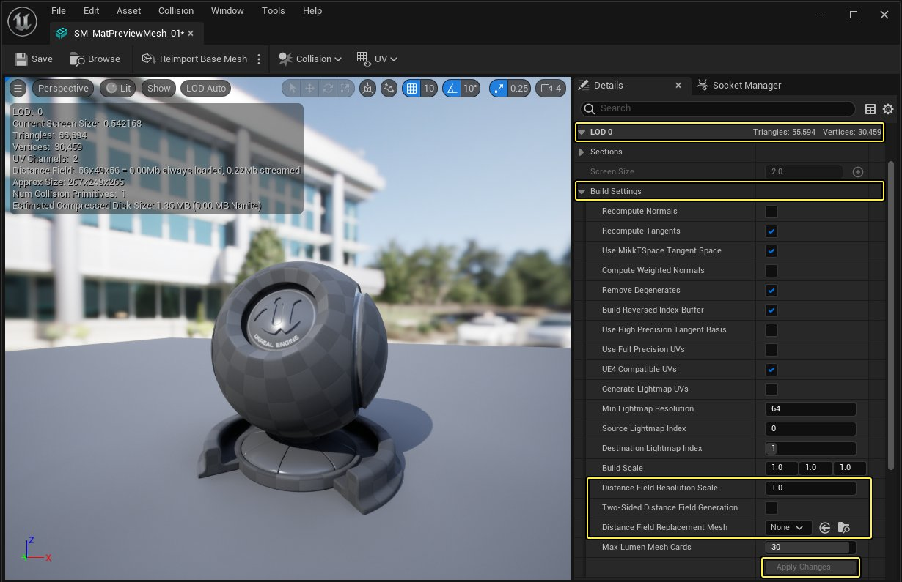
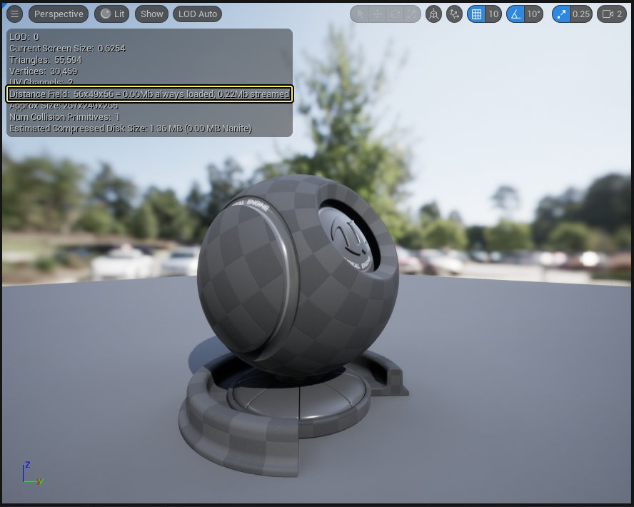
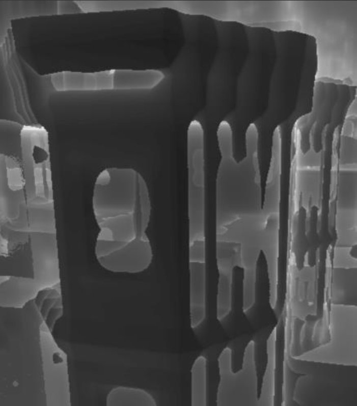
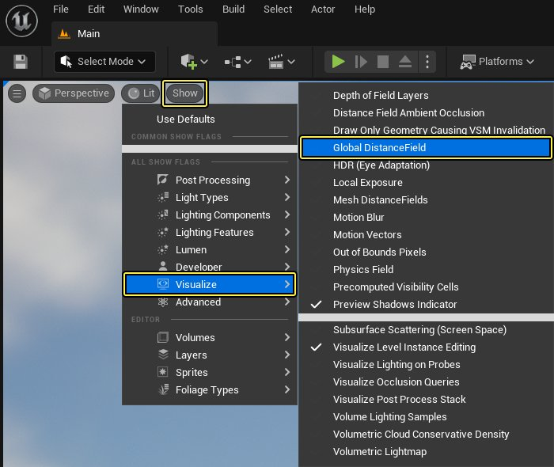
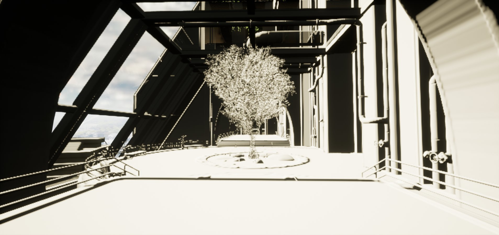

# 网格体距离场

> 路径：虚幻引擎5.7文档 / 构建虚拟世界 / 为场景设置光照 / 网格体距离场

> 原始页面：https://dev.epicgames.com/documentation/unreal-engine/mesh-distance-fields-in-unreal-engine

**虚幻引擎** 使用 **距离场（Distance Fields）** 的强大功能来实现游戏中静态网格体Actor的动态环境光遮蔽和阴影。除此之外，Actor的网格体距离场表达还可用于其他一些特性，例如GPU粒子碰撞，甚至还可以使用材质编辑器创建动态流动贴图等等。

继续阅读下面的内容可以了解网格体距离场的工作原理，以及可通过哪些方法把它应用在游戏中。

## 它的工作原理是什么？

此技术中使用的距离场是代表静态网格体表面的 **有向距离场（Signed Distance Field）** （SDF）。有向距离场在每个点将距离最近表面的距离保存到体积纹理中。网格体外的每个点保存的距离为正值，网格体内的每个点保存的距离为负值。以下示例跟踪并保存了为正的距离，以在稍后表现出树的形象。

SDF首个实用属性的作用是，在追踪光线时安全地跳过空白空间，因为到最近表面的距离已经明确（有时称这种方法为球体追踪）。只需区区几步就可以判定出交叉点。对距离场进行光线追踪将生成可见性效果， 也就是说如果光线和网格体交叉，光线就会投射出阴影。

距离场第二个实用属性的作用是，在追踪光线时，通过追踪经过遮挡物的距离最近的光线就可以计算出近似的锥体交叉点，而不产生额外成本。这种近似法可以利用距离场来实现非常柔和的区域阴影和天空遮蔽。这个属性是[距离场环境光遮蔽](distance-field-ambient-occlusion/index.md)的关键，因为少量的锥体即可为接收器点的整个半球计算出柔和的可见性。

> [!NOTE]
> [使用距离场进行灯光设置](http://iquilezles.org/www/articles/raymarchingdf/raymarchingdf.htm)的延伸阅读。

### 场景表达

每个创建的关卡都由所放置Actor的所有这些网格体距离场组成。网格体距离场是离线生成的，使用了将效果保存在体积纹理中的三角形光线追踪。因此，网格体距离场是无法在运行时生成的。这种方法会计算所有方向上的有向距离场，找到距离最近的表面，然后将该信息保存起来。

你可以使用视口将表达场景的网格体距离场可视化，只需依次选择 **显示（Show） > 可视化（Visualize） > 网格体距离场（Mesh Distance Fields）**。

| 列 1 | 列 2 |
| --- | --- |
| [undefined](https://d1iv7db44yhgxn.cloudfront.net/documentation/images/b3b30cbe-6e58-4eba-a213-c10d6269aa6f/04-distance-field-enable-mdf-view-mode.png) | [undefined](https://d1iv7db44yhgxn.cloudfront.net/documentation/images/1efdfdda-0b5d-4165-94a5-b570cb24ad9e/05-distance-field-visualize-mdf.png) |
| 启用可视化的菜单 | 网格体距离场可视化 |

点击查看大图

如果看到较白而不是较灰的区域，意味着需要通过多个步骤才能找到网格体表面的交点。与相对简单的网格体相比，掠射角光线需要更多的步骤才能和平面相交。

#### 质量

网格体距离场表达的质量由其体积纹理分辨率控制，也可以通过 **距离场分辨率比例（Distance Field Resolution Scale）** 进行控制，该选项位于[构建设置](mesh-distance-fields-properties/index.md#%E6%9E%84%E5%BB%BA%E8%AE%BE%E7%BD%AE)（在 **静态网格体编辑器** 中）。

点击查看大图。

网格体距离场在使用大小相似的网格体构建的关卡中质量最佳，因为较大的网格体往往会产生错误。例如，[《堡垒之夜》](https://www.epicgames.com/fortnite)中的网格体要么与网格一致，要么是放置在关卡中某些部分的道具，这样可以获得最佳效果并且几乎没有错误。地形由[高度场](distance-field-ambient-occlusion/index.md#%E5%9C%B0%E5%BD%A2)单独处理，不受距离场分辨率的影响。

| 列 1 | 列 2 | 列 3 |
| --- | --- | --- |
| [undefined](https://d1iv7db44yhgxn.cloudfront.net/documentation/images/bea795f5-d50d-4df0-bdb6-dd97ca53557d/07-distance-field-mesh.png) | [undefined](https://d1iv7db44yhgxn.cloudfront.net/documentation/images/fdd52fbd-9e66-454f-89cf-870208e3a4ec/08-distance-field-low-resolution.png) | [undefined](https://d1iv7db44yhgxn.cloudfront.net/documentation/images/f5e9e928-64c4-4012-a8b6-b1b917bd4925/09-distance-field-high-resolution.png) |
| 原始网格体 | 分辨率过低，重要特征丢失。 | 分辨率提升，重要特征再现 |

点击查看大图

网格体距离场的分辨率应调整到足够捕捉重要的特征。网格体的分辨率提高后，网格体距离场占用的内存量也会随之增加。在静态网格体编辑器中，视口的左上角列出了可供查看的网格体距离场的大小。

点击查看大图。

网格体距离场生成后，将根据分辨率对角进行打磨。这可以通过提高其分辨率来进行调整，但在多数情况下应该不是问题，具体取决于网格体的复杂度。任意单个网格体的体积纹理最大为8兆字节，分辨率为128x128x128。

| 列 1 | 列 2 | 列 3 |
| --- | --- | --- |
| Rounded corners based on the resolution 1 | Rounded corners based on the resolution 2 | Rounded corners based on the resolution 3 |

较薄的表面只能使用网格体内部的负纹素表达，这样才能找到根。此例中增加分辨率可以更准确地捕捉更多的细节，但是在仅使用[距离场环境光遮蔽](distance-field-ambient-occlusion/index.md)时，则无法正确地对表面进行表现。距离表面较远的遮蔽可以获得准确的效果，因此使用天空遮蔽通常不会引起注意。

#### 全局距离场

全局距离场是分辨率较低的距离场，跟随摄像机的同时，在关卡中使用有向距离场遮蔽。这会创建每个Object网格体距离场的缓存，然后将它们合成到围绕摄像机的若干体积纹理中，称为裁剪图。由于只有新的可见区域或受到场景修改影响的可见区域才需要更新，合成过程不会有太多消耗。

Object距离场的分辨率较低意味着它可用于所有物体，但是在计算天空遮蔽的锥体轨迹时，它们在阴影点附近采样，而全局距离场是在更远的地方采样。

你可以单击 **显示（Show） > 可视化（Visualize）> 全局距离场（Global Distance Field）**将全局距离场显示在视口中。

点击查看大图。

下面是每个Object网格体距离场可视化与全局距离场可视化的比较图，根据摄像机视图和距离将其合并到裁剪图。

> 图片已省略：全局距离场可视化

网格体距离场可视化

全局距离场可视化

> [!NOTE]
> 有关更多信息，请访问[距离场环境光遮蔽](distance-field-ambient-occlusion/index.md)页面。

#### 植被

植被资源也可以利用距离场实现动态遮蔽，甚至可以使距离的阴影超出级联阴影贴图可以产生的阴影。

当在游戏中使用植被资源时，可以考虑使用下面的选项，以达到最佳的性能和质量。

#### 双面距离场

在高密度网格体（如树木）中，表面通常由蒙版材质构成来表现树叶或树枝之间的许多孔，这些孔不能表现为实体表面。因此，你可以启用[构建设置](mesh-distance-fields-properties/index.md#%E6%9E%84%E5%BB%BA%E8%AE%BE%E7%BD%AE) **双面距离场生成** （在 **静态网格体编辑器** 中）。这个选项对于植物的叶子非常有效，但确实会增加光线行进的消耗。

> 图片已省略：启用双面距离场

观察下方的示例，左侧树木使用默认的不透明网格体距离场表现。右侧树木启用了 **双面距离场生成（Two-Sided Distance Field Generation）**。你会注意到双面网格体距离场呈现较白而不是较灰的颜色，而表面现在是半透明的。这意味着与不透明表面相比，在生成体积纹理时需要更多的步骤才能找到网格体的交叉点，而消耗也会随之增加。

| 列 1 | 列 2 |
| --- | --- |
| [undefined](https://d1iv7db44yhgxn.cloudfront.net/documentation/images/7b5413d8-3ace-42f4-9d65-e4708813288c/19-distance-field-two-sided-on.png) | [undefined](https://d1iv7db44yhgxn.cloudfront.net/documentation/images/395bb123-6500-48ba-9d18-520eeecb6333/20-distance-field-two-sided-off.png) |
| 禁用双面距离场生成 | 启用双面距离场生成 |

点击查看大图。

##### 植被工具设置

在[植被工具](../../open-world-tools/foliage-mode/index.md)中，必须启用要使用"距离场"照明功能实现环境光遮蔽和阴影的每种叶子类型。默认情况下，该设置处于禁用状态，因为有些拥有成千上万个实例的植被资源（比如草）会溢出图块剔除缓冲区。如果发生这种情况，你看到的东西可能会因失真而非常难看。因此，请仅为需要的植被资源启用 **影响距离场照明（Affect Distance Field Lighting）**。

> 图片已省略：undefined

点击查看大图。

### 启用距离场

要为项目启用"网格体距离场"，请点击 **主菜单** 中的 **编辑** 选项并选择 **项目设置**。

> 图片已省略：打开项目设置

找到 **引擎（Engine）** 分段并选择 **渲染（Rendering）**。 在 **软件光线追踪（Software Ray Tracing）** 分类下面勾选 **生成网格体距离场（Generate Mesh Distance Fields）** 旁边的复选框。

> 图片已省略：undefined

点击查看大图。

启用此功能后，系统将提示重新启动项目。

> 图片已省略：重启编辑器以应用新设置

完成后，你可以单击 **显示（Show）** \> **可视化（Visualize）** \> **网格体距离场（Mesh DistanceFields）**将网格体距离场显示在视口中。你应该能看到与以下类似的视图。

> 图片已省略：场景视图

> 图片已省略：网格体距离场可视化

场景视图

网格体距离场可视化

*该关卡整体是由保存在体积纹理中的范例距离场表达。*

### 局限性

**距离场技术的局限性：**

- 仅支持feature level 5平台（DX-11及更高版本）
- 仅投射刚性网格体的阴影。对于骨架网格体，可以将[关节囊阴影](../shadowing/capsule-shadows/index.md)用于具有距离场环境光遮挡（DFAO）和柔和直接阴影的间接照亮区域。
- 通过全局位置偏移或置换使网格体变形的材质可能会导致自阴影失真，因为距离场表达是离线生成的，并不知道有这些变形。

**当前实现中存在但可在未来改进的局限性：**

- 无法正确处理不一致的比例缩放（尽管可以正确处理镜像）。将网格体缩放两倍或不到两倍产生的效果通常不明显。
- 仅支持静态网格体、实例静态网格体、植被和地形（高度场）。植被必须启用"植被工具"设置中的 **影响距离场照明（Affect Distance Field Lighting）**。

**硬件局限性：**

- 英特尔显卡上禁用了所有网格体距离场功能，因为HD 4000在RHICreateTexture3D调用中会挂起以分配大型图集。

### 参考

- Quilez,Inigo. "Raymarching Distance Fields." N.p, 2008

## 基础

- [使用距离场阴影](using-distance-field-shadows/index.md) - 如何设置并使用距离场阴影。

- [使用距离场环境光遮蔽](using-distance-field-ambient-occlusion/index.md) - 如何设置并使用距离场环境光遮蔽。

- [使用距离场间接阴影](using-distance-field-indirect-shadows/index.md) - 如何设置和使用距离场间接阴影。

- [网格体距离场属性](mesh-distance-fields-properties/index.md) - 项目设置、光源组件、静态网格体编辑器和个别Actor中可以找到的所有网格体距离场设置的参考页面。

- [距离场环境光遮蔽](distance-field-ambient-occlusion/index.md) - 使用网格体距离场创建天空光照动态环境光遮蔽的总览。

- [距离场柔和阴影](distance-field-soft-shadows/index.md) - 关于使用网格体距离场创建动态柔和区域阴影的概述。
