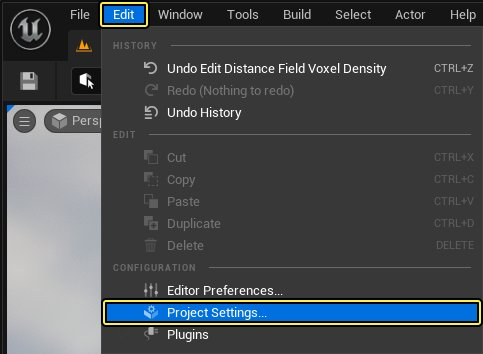
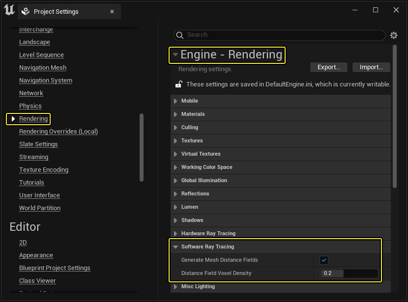
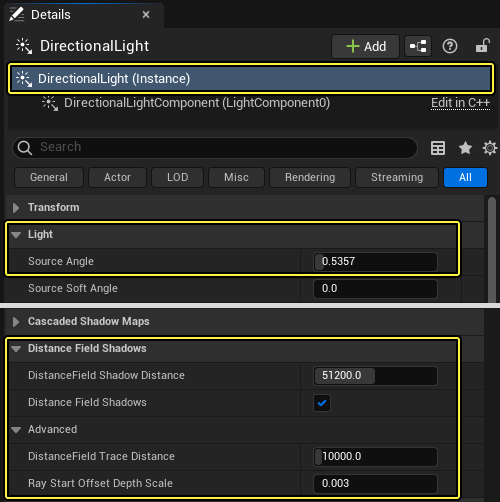
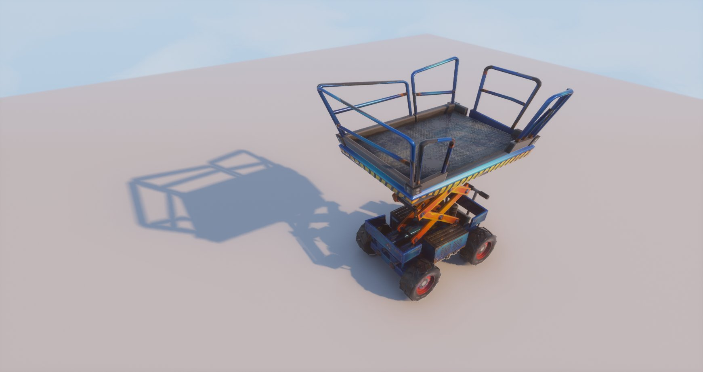
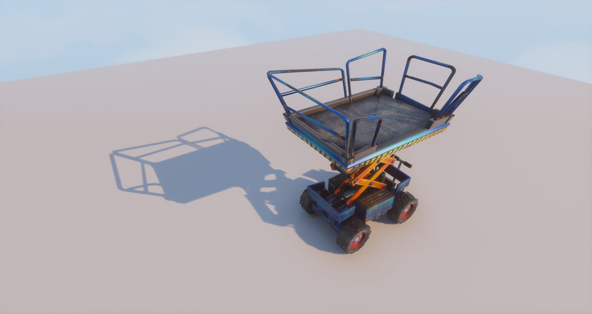
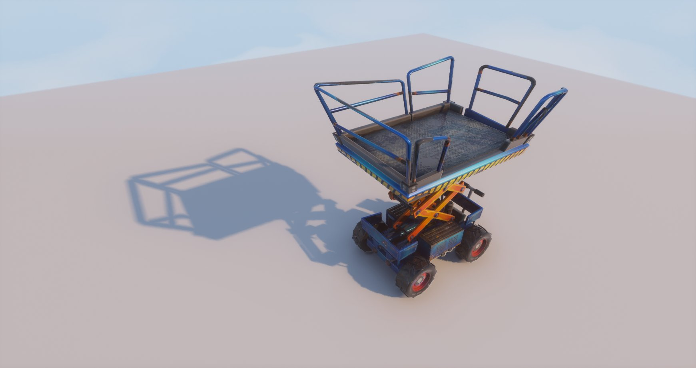
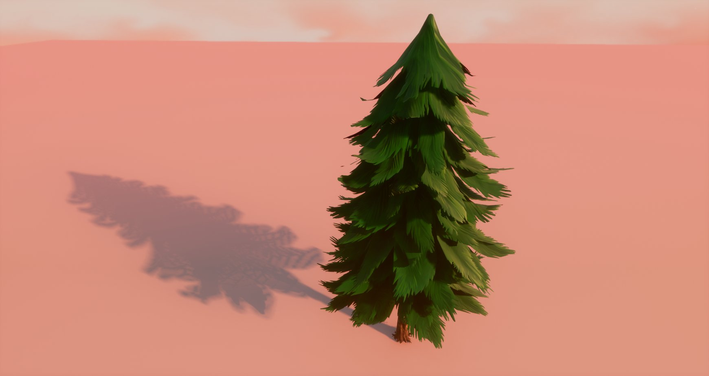

# 网格体距离场属性

> 路径：虚幻引擎5.7文档 / 构建虚拟世界 / 为场景设置光照 / 网格体距离场 / 网格体距离场属性

> 原始页面：https://dev.epicgames.com/documentation/unreal-engine/mesh-distance-fields-properties-in-unreal-engine

虚幻引擎 中的[网格体距离场（Mesh Distance Field）](../index.md)系统能够与许多不同的可以启用或禁用的系统结合使用。这些设置和属性可以用于为项目实现特定风格或用于优化目的。

下面将详细介绍菜单系统和可以使用的特定于网格体距离场（Mesh Distance Field）的设置。

## 项目设置

**项目设置（Project Settings）** 面板中有一些设置可以为项目中的资产启用网格体距离场生成，还有一些优化选项可以启用，以在一些情况下提高使用效率。

点击 **主（Main）** 菜单上的 **编辑（Edit）** 并选择 **项目设置（Project Settings）** 将其打开。

点击 **渲染（Rendering）> 软件光线追踪（Software Ray Tracing）** ，可找到用于调整网格体距离场的设置。下表详述了可用的设置。

点击查看大图。

| 属性 | 说明 |
| --- | --- |
| **生成网格体距离场（Generate Mesh Distance Fields）** | 这将确定系统是否会构建静态网格体距离场，后者可以用于距离场阴影和距离场环境光遮蔽。启用此项将增加网格体构建时间和内存使用量，而且需要你重启虚幻编辑器才能生效。 如果你为项目启用了 **生成网格体距离场（Generate Mesh Distance Fields）** 设置，那么即使你不在任何Actor上使用任何距离场渲染功能，内存使用量仍会增加。如果你禁用此设置并重启虚幻编辑器，网格体距离场将不再加载，内存使用量也会下降。 |
| **距离场体素密度（Distance Field Voxel Density）** | 确定网格体的默认比例如何转换为距离场体素维度。更改此值将导致重新构建所有距离场。值越大，占用内存的速度可能会越快！更改此设置需要重启编辑器。 |

## 光源组件

以下是可用的[网格体距离场（Mesh Distance Field）](../index.md)设置和属性，你可为每个可用的[光源类型](../../light-types-and-their-mobility/index.md)设置它们。

### 定向光源

以下 **定向光源** 设置会影响[距离场阴影（Distance Field Shadowing）](../distance-field-soft-shadows/index.md)。

| 属性 | 说明 |
| --- | --- |
| 光源 |  |
| **光源角度（Source Angle）** | 这是以度数为单位的光源角度，用于支持使用距离场或胶囊体阴影的动态阴影方法的柔和区域阴影。 |
| 距离场阴影 |  |
| **距离场阴影距离（Distance Field Shadow Distance）** | 这是能够拥有距离场阴影的最远距离。对于CSM阴影，距离场阴影也会覆盖该值与 **动态阴影距离可移动光源（Dynamic Shadow Distance Movable Light）** 之间的距离。 |
| **距离场阴影（Distance Field Shadows）** | 这将打开光源的距离场阴影。 |
| 距离场阴影高级属性 |  |
| **距离场追踪距离（Distance Field Trace Distance）** | 该属性会按世界单位设置阴影从其阴影投射体能够投射的距离。使用的值越大，场景的阴影成本就越高。 |
| **Ray Start Offset Depth Scale** | 该属性会控制摄像机离远时，追踪阴影在接收表面上的偏移量。可以使用该属性来隐藏大型静态网格体中来自低分辨率距离场的自身阴影瑕疵。 |

#### 光源角度

**光源角度（Light Source Angle）** 会根据光源的旋转角度和输入的值柔化或锐化阴影。这会使得网格体上离阴影接收表面更远的点呈现出非常柔和的投影。距离网格体和接收表面较近的阴影则会更加清晰。

光源角度： | 1（默认值）

光源角度： | 2

距离网格体或阴影接收表面越远的阴影就会越柔和。

#### 级联阴影贴图与距离场阴影对比

**级联阴影贴图（Cascaded Shadow Maps）** 可提供非常细腻的投影，但在可视距离较大时表现不佳。而 **距离场阴影（Distance Field Shadows）** 能够更高效地远距离投射阴影，但其质量严重依赖为网格体距离场生成的体积纹理的分辨率。[网格体距离场质量](../index.md#%E8%B4%A8%E9%87%8F)可能需要较高的分辨率来捕捉通常情况下会随着阴影贴图显示的重要细节。因此，我们建议你结合使用两者，将级联阴影贴图用于距离摄像机较近的区域，将距离场阴影用于较远的距离。

级联阴影贴图

距离场阴影

在使用级联阴影贴图时，无论升降机上的各个点与地面的距离远近，阴影始终清晰细腻。而距离场阴影可基于 **光源半径（Light Source Radius）** 和阴影投射点与表面的距离来柔化阴影，以提供自然的外观。

#### 距离场追踪距离

**距离场追踪距离（Distance Field Trace Distance）** 控制任意投射阴影的网格体的距离长追踪阴影能够延伸得多远。由于阴影能够沿着接收表面延展很长的距离，对于对象较多的场景，距离场阴影可能会导致性能开销增加。缩短距离场追踪距离可限制特定网格体上任意一点的距离场阴影能够投射的距离，而无需缩短 **距离场阴影距离（Distance Field Shadow Distance）**。

> 图片已省略：距离场追踪距离： | 5000

距离场追踪距离：| 10000（默认值）

距离场追踪距离： | 5000

在这个示例中，有一棵非常高的树，定向光源从一个较低的角度照亮了它（例如在日出或日落时）。缩短距离场追踪距离能够限制树梢无限投射。

### 点光源/聚光源

以下是 **点光源** 和 **聚光源** 设置，它们会影响 [距离场阴影（Distance Field Shadowing）](../distance-field-soft-shadows/index.md)。

> 图片已省略：影响DFS的点光源和聚光源设置

| 属性 | 说明 |
| --- | --- |
| 光源 |  |
| **源半径（Source Radius）** | 该属性会被用作光源球体的大小。使用的值越大，半影就越大，但是这可能会略微降低性能。 |
| 距离场阴影 |  |
| **距离场阴影（Distance Field Shadows）** | 该属性控制是否使用距离场区域阴影。 |
| 距离场阴影高级属性 |  |
| **Ray Start Offset Depth Scale** | 该属性会控制摄像机离远时，距离场阴影在接收表面上的偏移量。可以使用该属性来隐藏大型静态网格体中来自低分辨率距离场的自身阴影瑕疵。 |

#### 源半径

光源的 **源半径（Light Source Radius）** 可用于柔化或锐化区域阴影，方法是调整光源本身的大小表示。与定向光源的[光源角度](#%E5%85%89%E6%BA%90%E8%A7%92%E5%BA%A6)一样，阴影投射点距离接收表面越远，阴影柔化的程度就越高。

> 图片已省略：源半径：| 0（默认值）

> 图片已省略：源半径： | 50

源半径：| 0（默认值）

源半径： | 50

在该演示中，默认值0使用了硬编码源半径20，来自动提供柔和区域阴影。在使用较大的50光源半径时，阴影要柔和得多。

> [!NOTE]
> 默认源半径0拥有固定的硬编码值20。使用介于0和20之间的值时，区域阴影会相应地锐化。

#### 传统阴影贴图与距离场阴影对比

点光源和聚光源的阴影贴图非常细腻清晰，与定向光源的级联阴影贴图相似。光线追踪距离场阴影的质量严重依赖为网格体距离场生成的体积纹理的分辨率。[网格体距离场质量](../index.md#%E8%B4%A8%E9%87%8F)可能需要较高的分辨率来捕捉通常情况下会在阴影贴图中显示的重要细节。

> 图片已省略：传统阴影贴图

> 图片已省略：距离场阴影

传统阴影贴图

距离场阴影

在使用阴影贴图时，无论升降机上的各个点与地面的距离远近，阴影始终清晰细腻。而距离场阴影可基于 **源半径（Source Radius）** 和阴影投射点与表面的距离来柔化阴影，以提供自然的外观。

#### Ray Start Offset Depth Scale

**Ray Start Offset Depth Scale** 控制摄像机离远时，距离场阴影在接收表面上的光线开始位置。它有助于防止低分辨率网格体距离场出现自身阴影瑕疵，或因网格体具有无法在体积纹理中正常捕捉的复杂几何体而出现自身阴影瑕疵。

在某些情况下，调整[网格体距离场质量](../index.md#%E8%B4%A8%E9%87%8F)就可以减少或去除这些瑕疵，无需调整光线开始的位置。请记住，你可能也不希望付出生成体积纹理所需的较高内存开销。Ray Start Offset Depth Scale恰恰可以为该光源限制这一情况的发生。

> 图片已省略：Ray Start Offset Depth Scale：| 0.003（默认值）

> 图片已省略：Ray Start Offset Depth Scale：| 0.007

Ray Start Offset Depth Scale：| 0.003（默认值）

Ray Start Offset Depth Scale：| 0.007

岩壁有裂隙的地方可能会出现一些自身阴影瑕疵，距离场的分辨率无法捕捉这么多的细节。微量调整 **Ray Start Offset Depth Scale** 就可以更改阴影追踪开始的位置，方法是将它向内移动。

> [!NOTE]
> 应该按极小的值来调整该设置，它可以影响从调整了该设置的光源投射阴影的任意网格体的投影。调整该属性时应十分谨慎，并在使用它时检查关卡的不同区域，这种检查对可能会对视觉效果质量产生重大影响的定向光源和远距离对象尤其重要。

### 天空光照

以下 **天空光照** 设置会影响 [距离场环境光遮蔽（Distance Field Ambient Occlusion）](../distance-field-ambient-occlusion/index.md)（DFAO）。这些设置可对关卡中的DFAO提供最多的美术控制。

> 图片已省略：影响DFS的天空光照设置

| 属性 | 说明 |
| --- | --- |
| **遮蔽最大距离（Occlusion Max Distance）** | 这是距离遮挡物的最大距离，用于计算遮蔽影响。增大该数值将增加距离场AO成本，但可实现远处的遮挡。 |
| **遮蔽对比度（Occlusion Contrast）** | 这可用于增加计算遮蔽的对比度。 |
| **遮蔽指数（Occlusion Exponent）** | 这是应用于AO的一个指数。低于1的数值会在不减少接触阴影的情况下使遮蔽变亮。 |
| **最小遮蔽（Min Occlusion）** | 这可根据需求防止遮蔽出现全黑区域。可用于模拟多反射光照，它可以阻止在现实中出现全黑区域。 |
| **遮蔽色调（Occlusion Tint）** | 这是用于对遮蔽进行着色的常量颜色。要符合物理规则，则该属性应设置为黑色；设置其他值可提供风格化的美术效果。 |
| **遮蔽合并模式（Occlusion Combine Mode）** | 该属性控制距离场环境光遮蔽与屏幕空间环境光遮蔽的结合方式： **OCM Minimum**：采用最小的遮蔽数值。这对于避免因多种方法导致的过度遮蔽非常有效，但是可能会导致室内看起来过于平坦。 **OCM Multiply**：用距离场环境光遮蔽的遮蔽数值乘以屏幕空间环境光遮蔽的遮蔽数值。这可以为任何位置赋予深度感，但是可能会造成过度遮蔽。应对屏幕空间环境光遮蔽进行微调，以使其与Minimum相比起来弱一点。 |

#### 遮蔽最大距离

**遮蔽最大距离（Occlusion Max Distance）** 在遮蔽一个点会影响另外一个点的情况下控制两点间的最大距离。在调整遮蔽最大距离时，它还会调整对于场景中其他对象DFAO将拥有的精度，这意味着也会增加它的性能成本。

> 图片已省略：遮蔽最大距离：| 1000（默认值）

> 图片已省略：遮蔽最大距离： | 500

遮蔽最大距离：| 1000（默认值）

遮蔽最大距离： | 500

缩小遮蔽最大距离会导致无法为遮蔽捕捉阴影投射细节，因为这些点间的距离不会导致它们相互影响。

> 图片已省略：遮蔽最大距离：| 1000（默认值）

> 图片已省略：遮蔽最大距离：| 1500

遮蔽最大距离：| 1000（默认值）

遮蔽最大距离：| 1500

增大遮蔽最大距离会提高遮蔽精度，因为在阴影投射时会考虑到更多的点，但是会导致性能成本上升。

#### 遮蔽对比度

**遮蔽对比度（Occlusion Contrast）** 控制受DFAO影响的对象之间的亮度差异。

> 图片已省略：遮蔽对比度：| 0（默认值）

> 图片已省略：遮蔽对比度： | 0.65

遮蔽对比度：| 0（默认值）

遮蔽对比度： | 0.65

增大对比度的数值会导致场景中许多裂隙和遮蔽较多的区域变暗。

#### 遮蔽指数

**遮蔽指数（Occlusion Exponent）** 控制应用于环境光遮蔽的数值的幂。降低该数值会在不损失表面附近的任何接触阴影细节的情况下使遮蔽阴影变亮。

使用对大部分场景都效果良好的默认中间值。以下是一些较低和较高范围数值的对比：

> 图片已省略：遮蔽指数：| 1（默认值）

> 图片已省略：遮蔽指数： | 0.6

遮蔽指数：| 1（默认值）

遮蔽指数： | 0.6

在值较低时，场景中使用DFAO进行阴影投射的位置的遮蔽变亮了。

> 图片已省略：遮蔽指数：| 1（默认值）

> 图片已省略：遮蔽指数：| 1.6

遮蔽指数：| 1（默认值）

遮蔽指数：| 1.6

在值较高时，场景中使用DFAO进行阴影投射的位置的遮蔽变暗了。

#### 最小遮蔽

**最小遮蔽（Min Occlusion）** 控制关卡中完全遮蔽的区域的黑暗程度。它使美术们能够更好地控制遮蔽区域的DFAO的明暗程度。当与 **遮蔽最大对比度（Occlusion Max Contrast）** 结合使用时，该设置非常有用。因为使用遮蔽最大对比度的遮蔽区域可能过暗，而使用最小遮蔽（Min Occlusion）可以使阴影变亮一些。

> 图片已省略：最小遮蔽：| 0（默认值）

> 图片已省略：最小遮蔽： | 1

最小遮蔽：| 0（默认值）

最小遮蔽： | 1

在该示例中，最小遮蔽（Min Occlusion）使该场景中使用DFAO遮蔽的区域变亮了。

#### 遮蔽色调

**遮蔽色调（Occlusion Tint）** 允许调节遮蔽区域的颜色，从而让美术们可以最大限度地控制DFAO外观。

> 图片已省略：遮蔽色调颜色：| 黑色（默认值）

> 图片已省略：遮蔽色调颜色：| 紫色

遮蔽色调颜色：| 黑色（默认值）

遮蔽色调颜色：| 紫色

只有使用DFAO投射阴影的遮蔽区域会基于使用的颜色值着色。

#### 遮蔽合并模式

**遮蔽合并模式（Occlusion Combine Mode）** 允许你选择将场景中的屏幕空间环境光遮蔽与距离场环境光遮蔽合并。

> 图片已省略：遮蔽合并模式： | OCM Minimum

> 图片已省略：遮蔽合并模式： | OCM Multiply

遮蔽合并模式： | OCM Minimum

遮蔽合并模式： | OCM Multiply

## 静态网格体编辑器

**静态网格体编辑器（Static Mesh Editor）** 中包含多个特定于Actor的设置，它们会影响放置在关卡中的该Actor的实例。这些特定于Actor的设置位于静态网格体编辑器的 **细节** 面板中的 **构建设置** 和 **通用设置** 分段。

> 图片已省略：undefined

点击查看大图。

### 构建设置

**构建设置** 使你能够控制网格体距离场的质量，为植被等对象启用双面生成，甚至将另一个网格体的距离场指定为当前距离场。

> 图片已省略：影响DFS的构建设置

| 属性 | 说明 |
| --- | --- |
| **距离场分辨率比例（Distance Field Resolution Scale）** | 使你能够调整该Actor的生成网格体距离场的质量。该设置会对创建的体积纹理的大小产生影响。 |
| **双面距离场生成（Two-Sided Distance Field Generation）** | 使你能够控制生成的网格体距离场是否为双面。该属性允许在有多个重叠的平面的实例中产生柔和阴影，但是会导致较高的性能成本。 |
| **Distance Field Replacement Mesh** | 这使你能够选择另外一个静态网格体的距离场并用其替代当前Actor自身的网格体距离场。 |

### 通用设置

在 **通用设置** 中，你可以启用与质量无关的选项。它包含为特定网格体生成网格体距离场，而无需为整个项目启用网格体距离场的功能。你也可以控制带动画的静态网格体，或在距离场中移动其顶点的静态网格体出现的自身阴影。

> 图片已省略：影响DFS的通用设置

| 属性 | 说明 |
| --- | --- |
| **生成网格体距离场（Generate Mesh Distance Field）** | 是否为该网格体生成距离场，它可以与[距离场间接阴影（Distance Field Indirect Shadows）](../index.md)结合使用。如果启用了 **生成网格体距离场（Generate Mesh Distance Fields）** 的项目设置，该属性会被忽略。 |
| **距离场自身阴影偏移（Distance Field Self Shadow Bias）** | 用于减少使用世界位置偏移移动网格体的顶点时距离场方法造成的自身阴影。 |

## Actor组件

以下是可以为放置在关卡中的个体Actor切换或覆盖的可用距离场设置。

> 图片已省略：影响DFS的Actor设置

| 属性 | 说明 |
| --- | --- |
| **距离场间接阴影（Distance Field Indirect Shadow）** | 该属性控制是否使用网格体距离场表示（如果存在）在可移动组件上投射间接照明（例如来自光照贴图或天空光照）的阴影。其工作原理与骨架网格体上的[胶囊体阴影](../../shadowing/capsule-shadows/index.md)一样，但是使用网格体距离场，所以无需物理资产。要使该功能生效，必须在构建设置中为该静态网格体启用 **生成网格体距离场（Generate Mesh Distance Field）** 或为项目启用 **生成网格体距离场（Generate Mesh Distance Fields）**。 |
| **覆盖距离场自身阴影偏移（Override Distance Field Self Shadow Bias）** | 该属性控制是否使用该组件的距离场阴影偏移覆盖该静态网格体资源的距离场自身阴影偏移设置。 |
| **Distance Field Indirect Shadow Min Visibility** | 该属性控制距离场间接阴影的黑暗程度。 |
| **距离场自身阴影偏移（Distance Field Self Shadow Bias）** | 用于减少使用世界位置偏移移动网格体的顶点时距离场方法造成的自身阴影。 |
| **影响距离场照明（Affect Distance Field Lighting）** | 该属性控制Primitive是否影响动态距离场照明方法。该标记也要求启用"投射阴影（Cast Shadow）。 |

#### Distance Field Indirect Shadow Min Visibility

使用[距离场间接阴影（Distance Field Indirect Shadows）](../using-distance-field-indirect-shadows/index.md)时，可使用 **Distance Field Indirect Shadow Min Visibility** 设置来调整阴影色调。它使美术们可以最大限度控制阴影黑暗程度，使间接阴影能够与周围的静态阴影混合。

> 图片已省略：设置距离场间接阴影最低可视性

> 图片已省略：最低可视性：0.1

> 图片已省略：最低可视性：0.6

最低可视性：0.1

最低可视性：0.6
