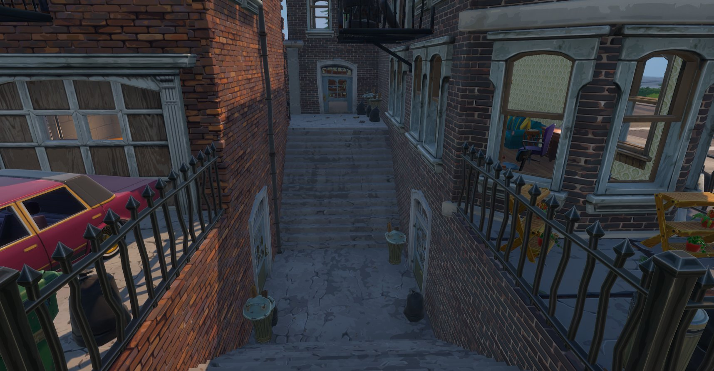
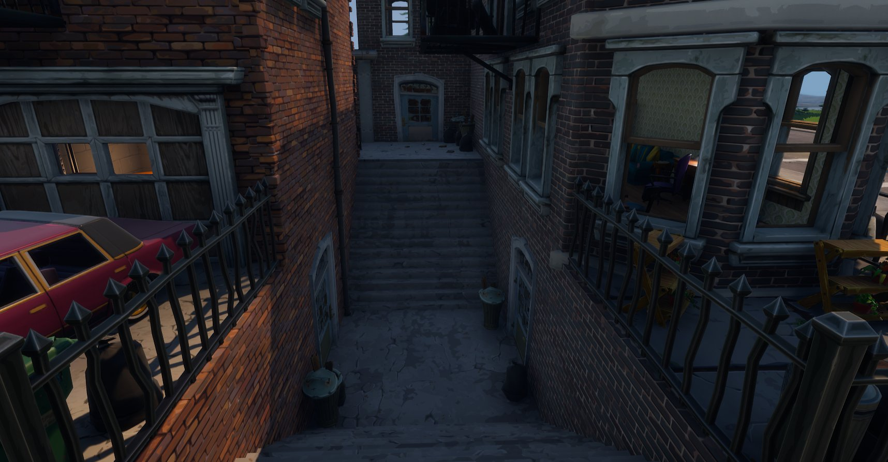

# 使用距离场环境光遮蔽

> 路径：虚幻引擎5.7文档 / 构建虚拟世界 / 为场景设置光照 / 网格体距离场 / 使用距离场环境光遮蔽

> 原始页面：https://dev.epicgames.com/documentation/unreal-engine/using-distance-field-ambient-occlusion-in-unreal-engine

开发游戏时，你可能主要依赖屏幕空间方法来提供动态环境光遮蔽（AO）乃至预计算照明，以使世界场景中的对象看起来更加真实。这些方法虽然有用但却存在局限性。[屏幕空间环境光遮蔽（Screen Space Ambient Occlusion）](../../../../designing-visuals-rendering-and-graphics/post-process-effects/index.md)(SSAO)仅限于使用场景深度的情况而且仅在可见屏幕空间中有效。预计算方法仅对世界场景中的静态对象有效，这意味着它们无法实时更新。[距离场环境光遮蔽（Distance Field Ambient Occlusion）](../distance-field-ambient-occlusion/index.md)(DFAO)是一种全动态AO方法，它将[网格体距离场（Mesh Distance Field）](../index.md)用于可移动静态网格体。它不仅可在动态照明的世界场景中使用，也可用于预计算照明。

在本指南中，你将学习如何为使用天空光照（Sky Light）的场景启用DFAO并了解可以调整的设置。

## 步骤

> [!NOTE]
> 该功能要求你在 **项目设置（Project Settings）** 的 **渲染（Rendering）** 部分中启用 **生成网格体距离场（Generate Mesh Distance Fields）**。请在此处查看如何[启用网格体距离场（Mesh Distance Field）](../index.md#%E5%90%AF%E7%94%A8%E8%B7%9D%E7%A6%BB%E5%9C%BA) （如果尚未启用）。

1. 首先，导航至 **放置Actor（Place Actors）** 面板，在 **光源（Lights）** 选项卡中，选中并将 **天空光照（Sky Light）** 拖动到关卡视口中。
2. 选择好天空光照（Sky Light）之后，导航至其 **细节（Details）** 面板并将其 **可移动性（Mobility）** 设置为 **可移动（Movable）**。

## 最终结果

在将天空光照（Sky Light）设置为"可移动（Movable）"之后，将自动为关卡启用"距离场环境光遮蔽（Distance Field Ambient Occlusion）"。

天空光照（Sky Light） | （不使用 | 距离场环境光遮蔽（Distance Field Ambient Occlusion））

天空光照（Sky Light） | （使用 | 距离场环境光遮蔽（Distance Field Ambient Occlusion））

你可以从该比较示例中看出在启用"距离场环境光遮蔽（Distance Field Ambient Occlusion）"的情况下为场景添加"天空光照（Sky Light）"带来的影响。

## 其他天空光照（Sky Light）设置

请参阅[距离场参考](../mesh-distance-fields-properties/index.md#%E5%A4%A9%E7%A9%BA%E5%85%89%E7%85%A7)来了解[距离场环境光遮蔽](../distance-field-ambient-occlusion/index.md)设置（特定于"天空光照（Sky Light）"）。这些设置使你能够对场景进行艺术控制，例如控制遮蔽的精确性、其色调和对比度等等。
