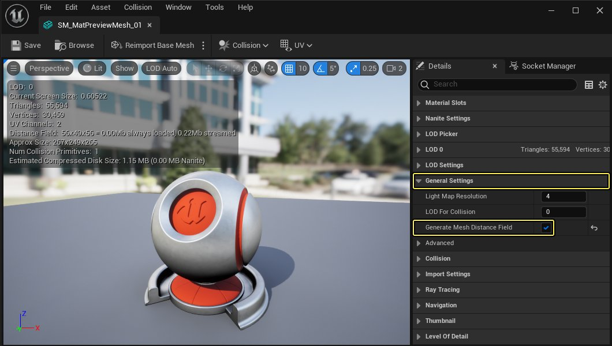
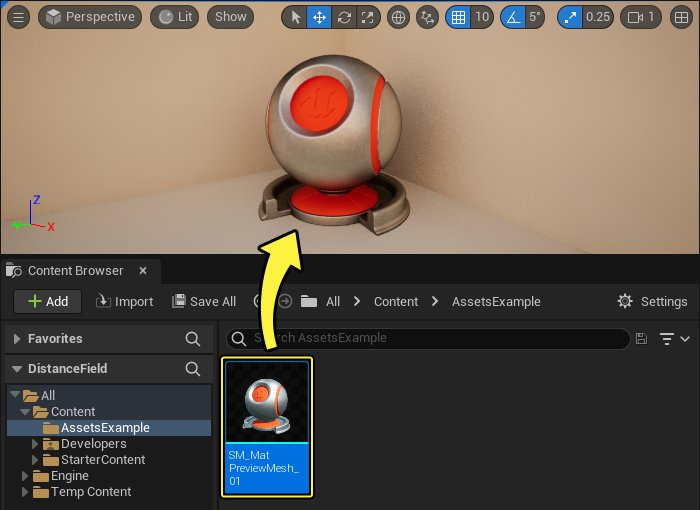
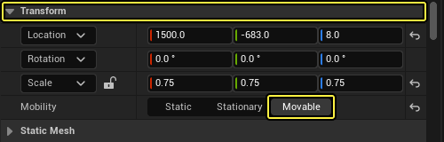
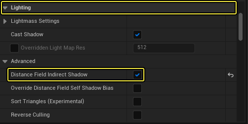
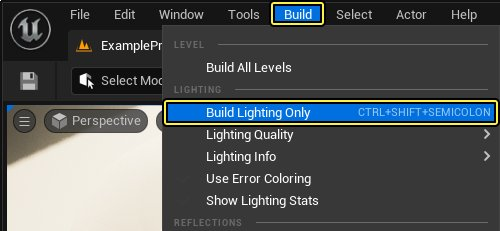

# 使用距离场间接阴影

> 路径：虚幻引擎5.7文档 / 构建虚拟世界 / 为场景设置光照 / 网格体距离场 / 使用距离场间接阴影

> 原始页面：https://dev.epicgames.com/documentation/unreal-engine/using-distance-field-indirect-shadows-in-unreal-engine

如果游戏针对间接光照区域使用预计算照明，混合可移动对象可能会非常具有挑战性，因为它们不会拥有柔和区域阴影。有时需要模拟这种类型的效果，以使用复杂材质设置乃至贴花将动态对象与场景的其他部分混合起来。**距离场间接阴影（Distance Field Indirect Shadows）**（DFIS）使你能够为用于间接光照区域中的区域阴影的单个静态网格体生成[网格体距离场](../index.md)。在这些区域中，传统的阴影贴图方法表现不佳。

距离场间接阴影（Distance Field Indirect Shadowing）的工作原理与用于骨架网格体的[胶囊体阴影](../../shadowing/capsule-shadows/index.md)的相似，都是使用在照明构建过程中生成的预计算照明样本。这些照明样本使用[体积光照贴图](../../global-illumination/volumetric-lightmaps/index.md)来确定间接照明的方向性和强度。

在本指南中，你将学习如何为单个网格体启用距离场，然后将这类网格体在关卡中用于使用静态间接照明照亮的区域，从而得到类似于该视频中的效果：

> 动图已省略：Final result example animation

## 步骤

> [!NOTE]
> 与其他[网格体距离场（Mesh Distance Field）](../index.md)功能不同，DFIS不要求为整个项目启用 **生成网格体距离场（Generate Mesh Distance Fields）**。它可以在网格体级别启用，如以下步骤所述。

1. 在 **内容浏览器（Content Browser）** 中，首先选择任意 **静态网格体（Static Mesh）** 资源，然后双击以打开"静态网格体编辑器（Static Mesh Editor）"。

   
2. 在"静态网格体编辑器（Static Mesh Editor）"中，导航至 **细节（Details）** 面板。在 **静态网格体设置（Static Mesh Settings）** 部分中，将 **生成网格体距离场（Generate Mesh Distance Fields）** 设置为启用。启用它后，可以 **保存** 并 **关闭**"静态网格体编辑器（Static Mesh Editor）"。

   

   点击查看全图
3. 从 **内容浏览器（Content Browser）** 中，选择 **SM_MatPreviewMesh_01** 网格体并将它拖动到关卡 **视口** 中。

   
4. 在关卡中选中该Actor之后，转至 **细节（Details）** 面板并将其 **可移动性（Mobility）** 设置为 **可移动（Movable）**。

   
5. 然后，在 **照明（Lighting）** 选项卡下面，启用 **距离场间接阴影（Distance Field Indirect Shadow）**。

   
6. 如果场景尚未进行光照构建，点击 **主** 菜单中的 **构建** 并选择 **仅构建光照（Build Lighting Only）** 来为场景构建光照。

   

## 最终结果

在有很多反射光照的间接光照区域中，应该可以看到可移动静态网格体能在间接光照区域中投射柔和阴影，而之前并没有阴影投射。

请记住，在采用直接光照的区域或采用通明光照的区域，间接阴影基本上不存在。

## 其他设置

使用[距离场参考](../mesh-distance-fields-properties/index.md#actor%E7%BB%84%E4%BB%B6)来了解特定于静态网格体Actor的距离场间接阴影（Distance Field Indirect Shadows）设置。
