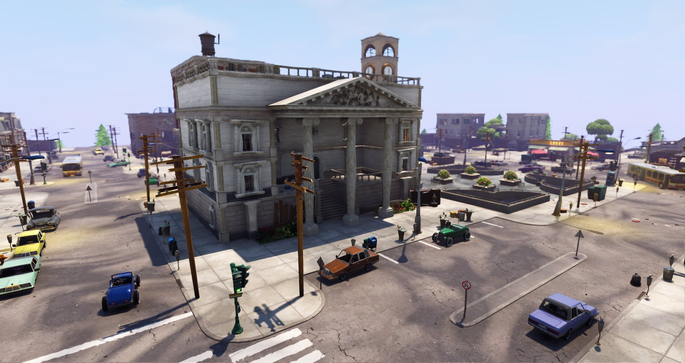
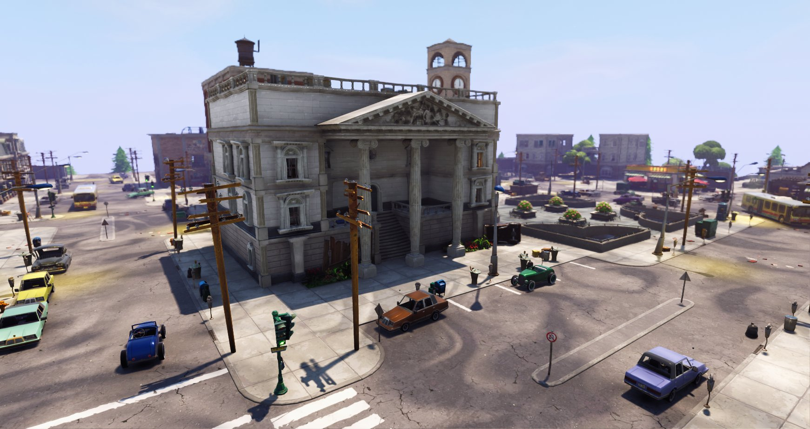

# 使用距离场阴影

> 路径：虚幻引擎5.7文档 / 构建虚拟世界 / 为场景设置光照 / 网格体距离场 / 使用距离场阴影

> 原始页面：https://dev.epicgames.com/documentation/unreal-engine/using-distance-field-shadows-in-unreal-engine

开发游戏时，您可能发现有时动态照明是用于关卡的最佳选择，例如，可视距离很大的关卡或者具有大型开放世界场景的关卡。在这类情况下，预计算照明可能效率很低或对于目标系统的资源要求过高。**距离场阴影（Distance Field Shadows）** 也称为 **距离场阴影（Distance Field Shadow）**，与配合[定向光源](../../light-types-and-their-mobility/directional-lights/index.md)使用的传统 **级联阴影贴图（Cascaded Shadow Map）**（CSM）相比，它使您能够在更远的距离投射阴影。

在本指南中，您将学习如何为定向光源、点光源和聚光源等不同的[光源类型](../../light-types-and-their-mobility/index.md)启用距离场阴影。

## 步骤

> [!NOTE]
> 该功能要求您在 **项目设置（Project Settings）** 的 **渲染（Rendering）** 部分中启用 **生成网格体距离场（Generate Mesh Distance Fields）**。请在此处查看如何[启用网格体距离场（Mesh Distance Field）](../index.md#%E5%90%AF%E7%94%A8%E8%B7%9D%E7%A6%BB%E5%9C%BA) （如果尚未启用）。

1. 首先，导航至 **放置Actor（Place Actors）** 面板，在 **光源（Lights）** 选项卡中，选中 **定向（Directional）**、**聚（Spot）** 或 **点（Point）** 光源并将其拖动到主要视口中。

   > [!NOTE]
   > 在任意光源组件上启用距离场阴影的过程与此相同。本指南的其他部分将介绍这些光源类型的特定属性。
2. 选择好光源之后，导航至其 **细节（Details）** 面板并将它的"可移动性（Mobility）"设置为 **可移动（Movable）** 或 **静止（Stationary）**。
3. 在 **细节（Details）** 面板的 **距离场阴影（Distance Field Shadow）** 下面，将 **距离场阴影（Distance Field Shadows）** 设置为启用。

   |  |  |
   | --- | --- |
   | 定向光源 | 聚/点光源 |

   > [!NOTE]
   > 如果该选项显示为灰色，确保先在"项目设置（Project Settings）"中启用 **生成网格体距离场（Generate Mesh Distance Fields）** 选项，然后确保光源的"可移动性（Mobility）"设置为 **可移动（Movable）** 或 **静止（Stationary）**。

## 最终结果

在将光源设置为"可移动（Movable）"或"静止（Stationary）"并将 **距离场阴影（Distance Field Shadowing）** 切换为启用后，在关卡中光源将自动使用它们。对于定向光源，将为超出级联阴影贴图（Cascaded Shadow Map）**动态阴影距离（Dynamic Shadow Distance）** 值的任意距离启用"距离场阴影（Distance Field Shadowing）"。

仅级联阴影贴图（Cascaded Shadow Maps）

级联阴影贴图（Cascaded Shadow Maps） | 和 | 距离场阴影（Distance Field Shadows）

在《堡垒之夜（Fortnite）》的这一测试关卡中，级联阴影贴图（CSM）**动态阴影距离（Dynamic Shadow Distance）** 是距离摄像机4500 cm（厘米），在启用"距离场阴影（Distance Field Shadowing）"之后，它们可以处理超出CSM阴影距离的任何阴影。 当仅使用CSM阴影处理方法时，远距离对象(例如法院大楼圆形石柱)会发生漏光，因为它位于阴影距离之外。远距离对象也将无法正确投射阴影。

> [!TIP]
> 使用定向光源时，将级联阴影贴图 **动态阴影距离可移动光源（Dynamic Shadow Distance Moveable Light）** 滑块设置为 **0** 非常有用，因为它使仅从网格体距离场产生阴影成为可能。除了使用可视化视图模式以外，这也是一种测试场景和判断潜在的距离场质量问题的有用方式。

## 其他光源设置

请参阅[距离场参考](../mesh-distance-fields-properties/index.md) 来了解[距离场阴影（Distance Field Shadowing）](../distance-field-ambient-occlusion/index.md)设置（特定于[定向光源](../mesh-distance-fields-properties/index.md#%E5%AE%9A%E5%90%91%E5%85%89%E6%BA%90)和[点/聚光源](../mesh-distance-fields-properties/index.md#%E7%82%B9/%E8%81%9A%E5%85%89%E6%BA%90)）。这些设置使您能够对场景进行艺术控制，例如控制阴影的柔和度和阴影能够投射到的最远距离。也可进行一些特定于定向光源的全局调整，以去除场景中由距离摄像机较远的LOD（细节层次）网格体引起的自身阴影瑕疵。
