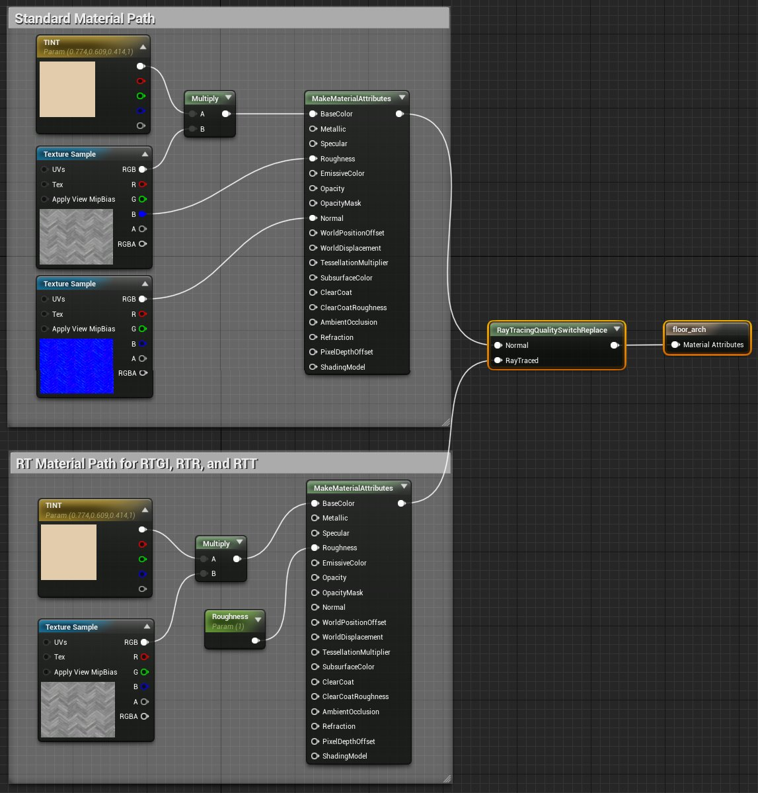
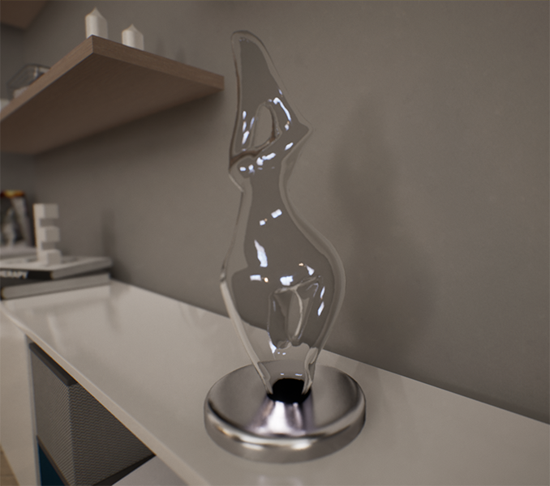
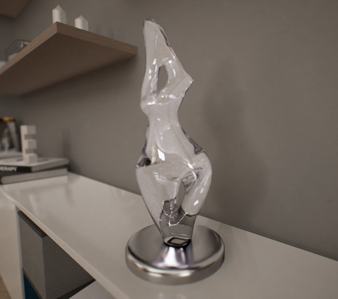
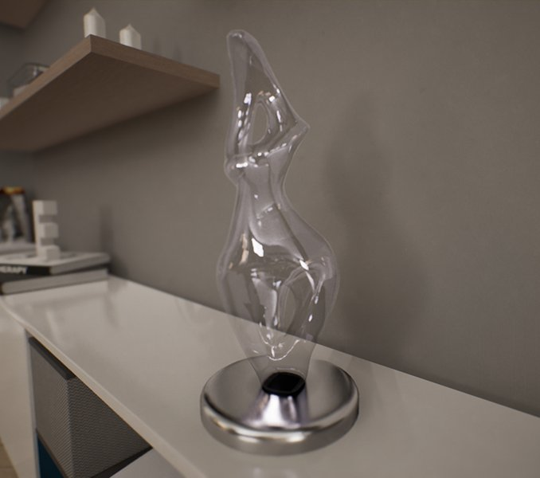
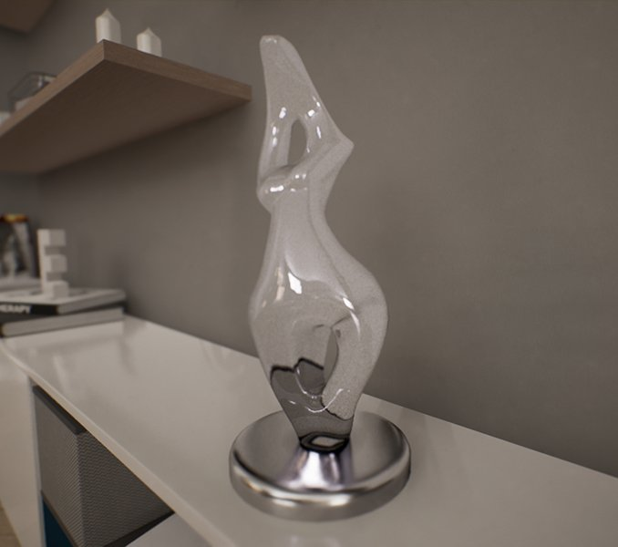
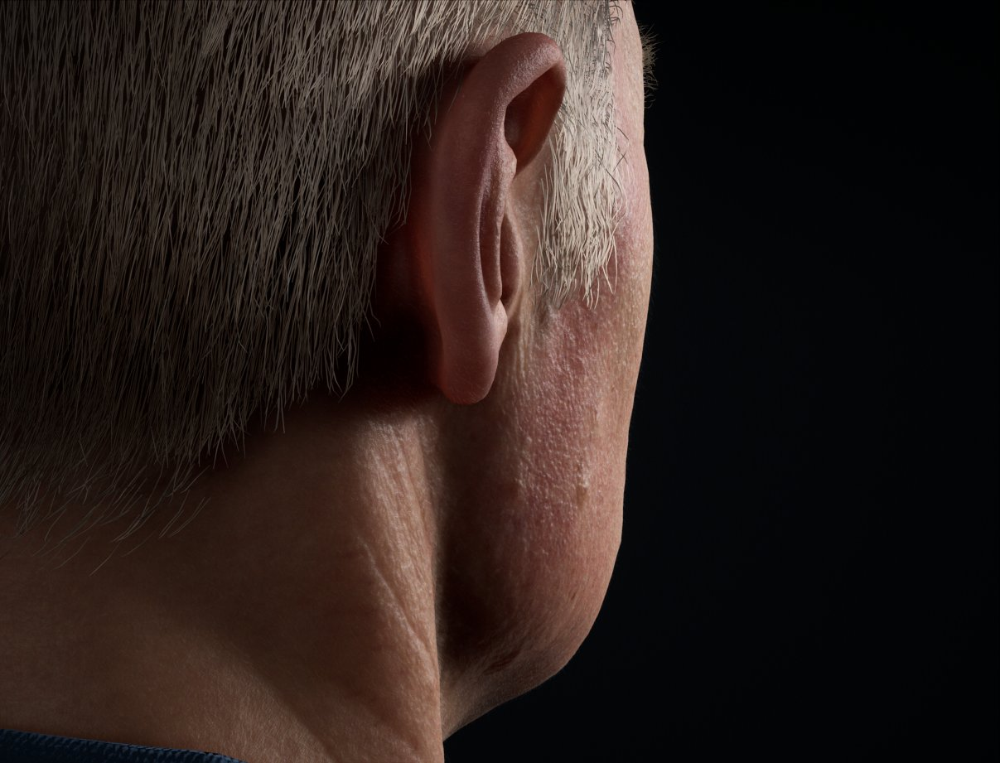

# 硬件光线追踪的建议和技巧

> 路径：虚幻引擎5.7文档 / 构建虚拟世界 / 为场景设置光照 / 硬件光线追踪和路径追踪功能 / 硬件光线追踪的建议和技巧

> 原始页面：https://dev.epicgames.com/documentation/unreal-engine/hardware-ray-tracing-tips-and-tricks-in-unreal-engine

本页面包含了使用[硬件光线追踪](../hardware-ray-tracing/index.md)功能的建议。

## 材质

以下建议适合[材质](../../../../designing-visuals-rendering-and-graphics/unreal-engine-materials/index.md)和硬件光线追踪功能。

### 光线追踪质量开关替换节点

该节点（指Ray Tracing Quality Switch Replace节点）可以整体替换材质的逻辑部分，通过不算复杂的逻辑，降低光线追踪全局光照、反射和半透明等功能的开销。在材质中应用这些功能时，它会影响到关卡中应用该节点的材质的所有光线追踪。

以下示例展示了漫反射、粗糙度和法线贴图纹理相关的 **常见** 逻辑路径。**光线追踪** 逻辑去除了法线贴图纹理，粗糙度所用的逻辑也不那么复杂。这一变化使得材质在渲染光追效果时开销更低，特别是在涉及光追全局光照和反射时。

点击查看大图。

### 逐材质光线追踪阴影

使用 **投射光线追踪阴影（Cast Ray Traced Shadows）** 勾选框，可以设置是否让材质投射光线追踪阴影。这很适合控制分配到几何体的材质的特定元素，设置其是否应当投射光线追踪阴影。

### 测试材质开销

复杂材质可能会对硬件光线追踪功能的性能产生影响。使用控制台命令"r.RayTracing.EnableMaterials"可以测试性能影响。

### 半透明折射率(IOR)

在设置材质使用光线追踪反射时，**反射（Refraction）** 材质输入控制了半透明材质的折射率（IOR）。

折射量是在对象应用的材质中设置的。在关卡中，后期处理设置控制了折射是否启用光线追踪，以及允许的最大折射反弹次数。

光栅化半透明 | 伪折射

光线追踪半透明 | 折射

材质设置：

- 在材质中启用

  双面（Two Sided）

  选项。

  - 虽然并非强制要求，但单面/非流形几何体（non-manifold geometry）难以有效处理体积追踪或光线介质堆叠。双面材质可以提供精准的结果，也是在使用光线追踪半透明时，处理所有半透明材质的推荐方式。
- 将

  光照模式（Lighting Mode）

  设置为

  表面半透明体积（Surface Translucency Volume）

  或

  表面前向着色（Surface Forward Shading）

  。
- 使用

  折射（Refraction）

  输入控制折射率。

后期处理体积渲染功能设置：

- 在

  半透明（Translucency）

  类别下，将

  类型（Type）

  设置为

  光线追踪（Ray Tracing）

  。
- 在

  光线追踪半透明（Ray Tracing Translucency）

  类别下进行以下设置：

  - 折射（Refraction）：

    启用
  - 最大折射光线（Max Refraction Rays）：

    设置使用的最大光线数量。这个值必须设置得足够高，才能让光线通过到另一面。

> [!TIP]
> 使用[材质实例](../../../../designing-visuals-rendering-and-graphics/unreal-engine-materials/instanced-materials/index.md)可以使用实例结果，动态地控制材质的IOR。

### 控制折射量

折射量和光传输是通过材质中的 **折射（Refraction）** 输入控制的。后期处理体积必须启用 **折射（Refraction）** 勾选框，并且 **最大折射光线（Max Refraction Rays）** 设置必须大于1。

以下半透明材质使用的折射输入值为0.04。后期处理的最大折射光线数为6，可以让光线通过半透明材质。

光线追踪折射： | 禁用

光线追踪折射： | 启用

以下示例展示了材质所用的不同折射输入值对折射率产生的影响。

拖动滑块可显示折射量为0.01、0.05到0.1的应用效果。

以下示例展示了后期处理体积的 **最大折射光线** 值对穿过半透明材质的光传输产生的影响。单独的光线无法产生足够多的反弹次数，难以穿透材质，因此材质显得较为黯淡。提高最大折射光线数量后，光线就有更多机会穿过材质。并非所有材质或光线都有最大折射光线数量要求，但在大部分情况下，这会导致材质比预期效果显得更暗。

拖动滑块可显示使用1、3和5条折射光线的效果。

### 单面和双面材质折射

单面和双面材质都可使用光线追踪折射，使光线通过对象体积。虽然折射支持使用单面材质，但是双面材质提供的物理效果更为精准，建议对所有半透明材质使用光线追踪半透明。

光线追踪半透明 | 单面材质 | 折射

光线追踪半透明 | 双面材质 | 折射

使用后期处理体积 **最大折射光线** 属性设置光传输应当使用的折射反弹数量。

## 次表面轮廓材质的光线透射

当关卡中放置的光源Actor启用了 **透射(Transmission)** 属性，使用[次表面轮廓](../../../../designing-visuals-rendering-and-graphics/unreal-engine-materials/unreal-engine-material-properties/shading-models/subsurface-profile-shading-model/index.md)的材质就可以进行光透射。

> 图片已省略：光线追踪次表面轮廓 | 光透射

栅格次表面轮廓 | 光透射

光线追踪次表面轮廓 | 光透射

光线追踪阴影计算期间会进行一次小规模的散射模拟，用于计算从媒介到投射阴影的光源之间的预期体积散射距离。在光照期间，散射距离会用于计算光源的内散射。

## 反射

以下建议适合[反射环境](../../reflections-environment/index.md)和硬件光线追踪功能。

### 光线追踪反射捕捉回退

在渲染多重反弹、在反射中再次产生反射时，光线追踪反射的开销比较昂贵。如果没有多重反弹，内反射材质就会显得黯淡无光。有一种开销较低的解决方案，即先使用光线追踪反射，随后在最后一次反弹时回退，将反射捕捉Actor放入关卡。

你可以使用控制台变量 `r.RayTracing.Reflections.ReflectionCaptures` 启用反射捕捉回退。

拖动滑块可以展示单反弹光线追踪反射、无反射捕捉回退的双反弹光线追踪反射，有反射捕捉回退的单反弹情况。

### 在反射中包含半透明对象

在 **光线追踪反射（Include Translucent Objects）** 类别的后期处理体积设置中启用 **包含半透明对象（Ray Tracing Reflections）**，就能让使用半透明材质的对象出现在光线追踪反射中。

## 天空光照

除非有必要，否则天空光照应该关闭贡献捕捉远处的对象，例如天穹网格体。这样可以节省性能，优化场景。

初学者关卡内含的 **BP_SkySphere** 天穹网格体和蓝图默认禁用了天空光照贡献。它会使天空的反射效果和预期有所不同，但能够节省硬件光线追踪的性能。

在关卡中选中对象时，可以在 **细节** 面板中使用 **在光线追踪中可见（Visible in Ray Tracing）** 勾选框，启用或者禁用对象贡献。

## 光线追踪的几何体考量

- 带有小洞或大量微小细节的几何体会产生巨大的性能影响。例如带有许多叶子的树木和灌木，以及有支撑物的栅格和栅栏。
- 室内环境的渲染速度比室外环境慢，因为光线通常会从外部射入，必须经过充足的反弹才能照亮房间。被光线直接照亮的区域渲染速度较快，而间接照亮的区域较慢。另外，在这些情况下，反射和半透明等光线追踪功能的考量也会对性能产生影响。

## 硬件光线追踪功能的综合优化

- 设置反射和半透明最大粗糙度

  - 使用

    最大粗糙度（Max Roughness）

    ，为材质的光线追踪反射设置阈值。可以在后期处理体积中进行设置，或者使用控制台命令 r.RayTracing.Reflections.MaxRoughness。

***为全局光照、反射和半透明设置最大光线距离*** 这会为各项功能设置最大光线距离，从而降低开销和场景贡献。 *使用控制台，为各项光线追踪功能设置 **MaxRayDistance** 控制台变量。你可以在r.RayTracing.* 下找到它们。

- **光线追踪全局光照优化**

  - 屏幕百分比和逐像素采样的默认设置分别为

    50

    和

    4

    。如果需要使用其他值，可以使用控制台命令

    r.RayTracing.GlobalIllumination.ScreenPercentage

    和

    r.RayTracing.GlobalIllumination.SamplesPerPixel

    。
  - 光源对全局光照的贡献可以在每个光源Actor处，通过启用或禁用

    影响全局光照（Affect Global Illumination）

    进行设置。

## 光线追踪立体角和基于距离的剔除

使用光线追踪的场景需要摄像机视角之外的对象也出现在场景中，特别是高反射表面，而这提高了渲染的开销。剔除不可见或不需要的对象，就可以优化并提升性能。

光线追踪提供了多种剔除场景中对象的方法：基于摄像机距离判断；或者在摄像机后投射一个区域（或一个角）并检测每个对象的边界，判断是否需要剔除；两种方法也可能同时使用。使用的剔除类型可以通过控制台变量 `r.RayTracing.Culling` 及以下任一值进行设置。

- 0

  禁用剔除。
- 1

  根据距离和立体角，剔除摄像机后的对象。（默认的剔除方法）
- 2

  根据距离和立体角，剔除摄像机前后的对象。
- 3

  根据距离

  或

  立体角，剔除摄像机前后的对象。

这个值越高，世界场景中剔除的对象就越多。

另外，光线追踪控制台变量（"r.RayTracing.*"）使用两个命令来配置立体角剔除：Angle和Radius。

- Angle

  会设置在摄像机后投射区域的角度（度数），根据该区域检测对象的边界，判断是否需要剔除。提高角度会显著剔除大量物体。
- Radius

  会剔除所有位于指定半径之外的对象。半径的默认设置为100米（或者10000厘米/虚幻单位）。

光线追踪控制台变量使用这些命令的例子包括 `r.RayTracing.Culling.Angle` 和 `r.RayTracing.StaticMeshes.WPO.CullingRadius`。

> [!NOTE]
> 如果需要使用基于距离的剔除，半径变量应当设置为 **-1**。

## 评估降噪器质量

硬件光线追踪功能主要依靠降噪算法来减少使用的像素，使用降噪器来弥补其余的差异。你可以根据以下步骤，评估不同光线追踪效果的降噪器质量：

1. 禁用

   时序抗锯齿（Temporal Anti-Aliasing）

   和

   景深（Depth of Field）

   1. 这两个设置都是在虚幻引擎渲染器的线性色彩空间中运行的。它们会运用一些HDR色彩加权技巧，避免在阴影和高光之间产生锯齿。
2. 比较降噪的逐像素单采样和未降噪的逐像素单采样。

   1. 由于能量差异，结果看起来可能并不正确，降噪器会使阴影变得过于黯淡。然而，由于色调映射器是非线性运作的，逐像素单采样会显得更为明亮。
   2. 为了更好地对比，降噪的逐像素

      单

      采样应当和未降噪的逐像素

      多

      采样进行对照测试。

> 图片已省略：降噪的逐像素单采样

> 图片已省略：未降噪的逐像素多采样

降噪的逐像素单采样

未降噪的逐像素多采样

由于信息丢失，降噪的逐像素单采样并不是完美的。然而和未降噪的逐像素多采样相比，其结果是一致的。

> [!NOTE]
> 需要注意的是，对于硬件光线追踪功能，降噪器支持最多每个像素四次采样。使用的采样越多，它就和未降噪的逐像素多采样结果更匹配。
