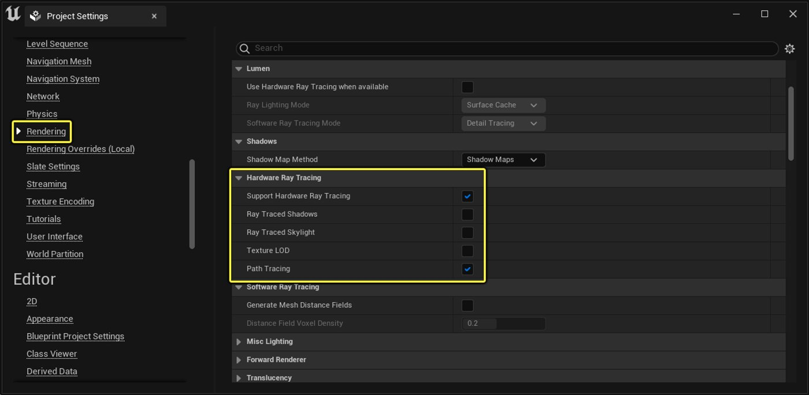
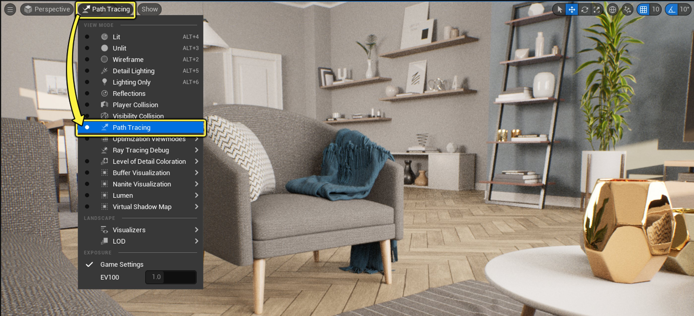
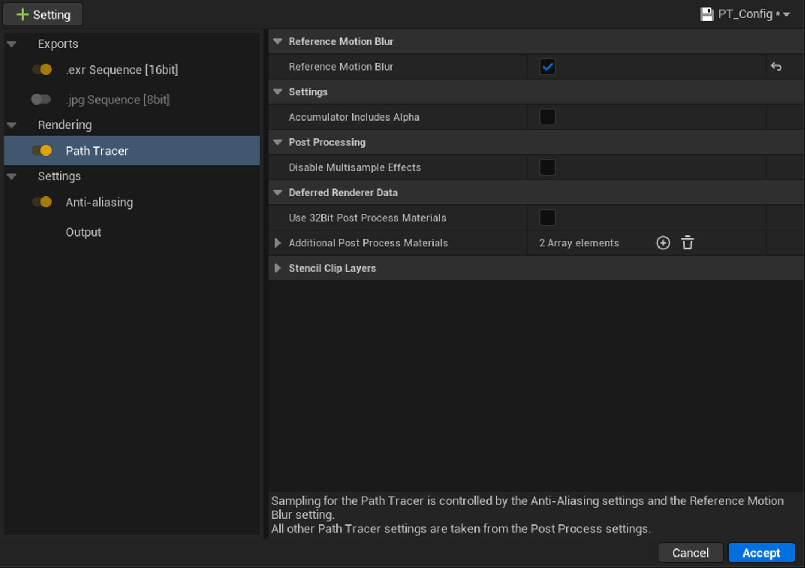
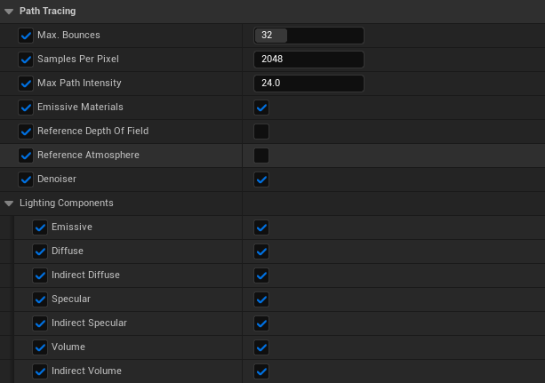
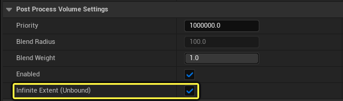
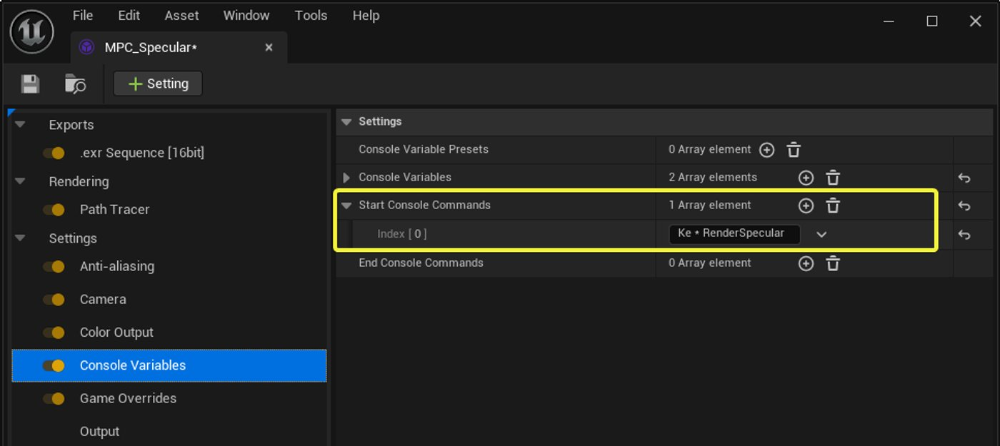
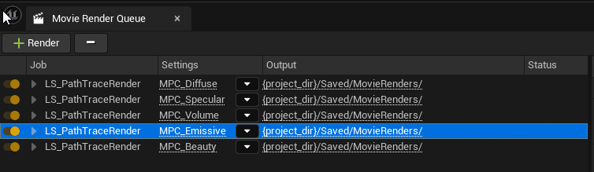
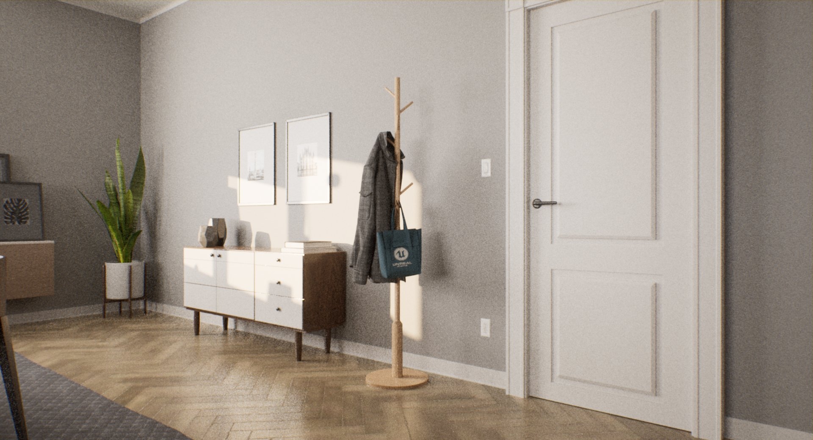

# 路径追踪器

> 路径：虚幻引擎5.7文档 / 构建虚拟世界 / 为场景设置光照 / 硬件光线追踪和路径追踪功能 / 路径追踪器

> 原始页面：https://dev.epicgames.com/documentation/unreal-engine/path-tracer-in-unreal-engine

路径追踪器是一种渐进式硬件加速渲染模式，可通过材质在物理上正确且无损的全局光照、反射和折射等来弥补实时特性的不足。 它拥有虚幻引擎中的内置光线追踪架构，几乎不需要额外的设置，即可实现干净而逼真的渲染。

ARCHVYZ的"虚幻引擎虚拟之旅"。 设计：Toledano Architects。

路径追踪器采用与其他光线追踪功能相同的光线追踪架构，例如[实时光线追踪](../hardware-ray-tracing/index.md)和[GPU Lightmass](../../global-illumination/gpu-lightmass-global-illumination/index.md)，是用作[基准对照物](index.md)和产品渲染的理想之选。 路径追踪器仅使用场景中存在的几何体和材质来渲染无偏差的结果，不使用为实时渲染而开发的相同光线追踪代码。

## 路径追踪器的好处

与其他渲染模式相比，路径追踪器具有以下优势：

- 能生成具有精确物理结果的高质量逼真渲染。
- 获得与其他离线渲染器相当的结果，几乎不需要额外的设置。
- 缩小与同类实时功能之间的功能差距。 例如，反射和折射中看到的材质可以不受限制地渲染，如存在全局光照和路径追踪阴影。
- 与Sequencer和影片渲染队列完全集成，以支持影视质量级别的渲染输出。

## 路径追踪的示例

以下场景是使用路径追踪器实现的高质量渲染示例。

ARCHVYZ的"虚幻引擎虚拟之旅"。 设计：Toledano Architects。

## 在你的项目中启用路径追踪器

路径追踪器要求项目启用[硬件光线追踪](../hardware-ray-tracing/index.md)。 必须满足以下系统要求，并且必须启用这些设置。

系统要求：

- 操作系统：**Windows 10 1809或更高版本**
- GPU：**NVIDIA RTX和支持DXR驱动程序的GTX系列显卡**

项目设置：

- 平台（Platforms） > Windows > 目标RHI（Targeted RHIs） > 默认RHI（Default RHI）：**DirectX 12**
- 引擎（Engine） > 渲染（Rendering） > 硬件光线追踪（Hardware Ray Tracing）：启用 **路径追踪（Path Tracing）**
- 引擎（Engine） > 渲染（Rendering） > 硬件光线追踪（Hardware Ray Tracing）：启用 **支持硬件光线追踪（Support Hardware Ray Tracing）**
- 引擎（Engine） > 渲染（Rendering） > 硬件光线追踪（Hardware Ray Tracing）：启用 **路径追踪（Path Tracing）**

  > [!NOTE]
  > 虚幻引擎5引入了相应设置，用于为材质控制特定于路径追踪器的着色器排列的创建。 根本不打算使用路径追踪器的项目可以禁用此设置，缩短着色器编译时间。
- 引擎（Engine） > 渲染（Rendering） > 优化（Optimizations）：启用**支持计算皮肤缓存（Support Compute Skin Cache）**

> [!NOTE]
> 当项目启用了对硬件光线追踪的支持时，如果**支持计算蒙皮缓存（Support Compute Skin Cache）**尚未启用，会有弹出窗口要求你将其启用。 要支持硬件光线追踪和路径追踪功能，这是必要操作。

> [!WARNING]
> 重启引擎，使更改生效。

## 在关卡编辑器中使用路径追踪器

使用**视图模式（View Modes）**下拉菜单选择**路径追踪（Path Tracing）**，即可在关卡视口（Level Viewport）中启用路径追踪器（Path Tracer）视图。

启用后，渲染器在摄像机不移动的情况下连续添加示例，从而逐步累加当前视图中的示例。 当达到目标示例数时，将对该帧去噪（如果在后期处理设置（Post Process Setting）中启用了去噪），以去除渲染中存在的剩余噪点。

在大多数情况下，当场景发生变化时，示例将失效，该过程重新开始。 移动摄像机、更改视图、更新或更改对象上的材质以及将对象移动或添加到场景中，都会导致场景的示例无效。

路径追踪器可以交互使用，并且会随着示例的累加迅速开始显示着色的像素。 渲染所需的时间在很大程度上取决于场景的复杂性和取样材质。 室外场景往往渲染得更快，因为光线能够以更少和更快的反射逃逸。 室内场景，尤其是那些反射率接近1.0的材质，会导致光线路径更长，从而渲染时间更长。

## 将路径追踪器用于影片渲染队列

> [!NOTE]
> 本小节将详细介绍如何使用影片渲染队列生成路径追踪渲染输出。 如需了解一般用法和工作流程，请先参阅[影片渲染队列](../../../../animating-characters-and-objects/cinematics-and-movie-making/movie-render-pipeline/index.md#movie-render-queue)，然后再继续。

在生成高质量渲染输出时，**影片渲染队列**（MRQ）对开发流程很有用。 当与路径追踪器结合使用时，它的渲染效果比其他方式好很多。

**路径追踪器**模块让你能用路径追踪器输出渲染帧，并为其渲染路径提供了专用设置项。

放置在关卡中的**后期处理体积（Post Process Volumes）**还能控制特定的路径追踪功能，例如最大光线反射次数、支持自发光材质和曝光等。

MRQ还包含其他设置模块，这些模块提供额外的功能按钮和选项，可以实现更高质量的渲染。

- [高分辨率](../../../../animating-characters-and-objects/cinematics-and-movie-making/movie-render-pipeline/cinematic-render-settings-and-formats/cinematic-rendering-image-bb951eea/index.md)模块提供了将帧作为单独图块渲染的设置，这些图块可以组合起来，渲染出比其他方式更高的单帧分辨率。 单个图块可以使用显卡支持的最大分辨率（例如，对于RTX 3080显卡，分辨率为7680x4320）。
- [抗锯齿](../../../../animating-characters-and-objects/cinematics-and-movie-making/movie-render-pipeline/cinematic-render-settings-and-formats/cinematic-rendering-image-bb951eea/index.md)模块提供了调整逐像素取样数的专用设置，并且可以获得更好的动态模糊质量。 该模块提供了关卡加载和视觉效果准确渲染场景所需的预热时间。

  - **时间取样数（Temporal Sample Count）**能在稍有偏差的时间点上内插多个渲染帧，从而提高动态模糊质量。 这种示例累加发生在去噪之后，有助于稳定来自各个空间通道的残余瑕疵。 但如果启用了**参考动态模糊（Reference Motion Blur）**，系统将在降噪之前获取所有时间取样。 在这种情况下，我们推荐将空间示例数保留为1，并推动所有取样经过时间示例，最大限度提高动态模糊质量。
  - **空间取样数（Spatial Sample Count）**决定了各时间取样会使用的逐像素取样数。 增加逐像素示例可减少每个渲染通道中存在的噪点，同时增加渲染每帧所需的时间。 使用MRQ时，将忽略逐像素后期处理体积示例数设置。
  - > [!NOTE]
    > 逐像素采集的示例总数是空间和时间示例计数的乘积。 在某些情况下，将示例在空间和时间上扩散可以产生更好的效果。 例如，如果你想逐像素使用16个示例，可以将4个示例应用于空间，4个应用于时间，或将16个应用于空间，1个应用于时间，或将1个应用于空间，16个应用于时间。 至于哪种方式最好，这主要取决于所需的动态模糊质量。 对于定格画面，我们推荐使用所有空间示例（1个时间示例），而对于动画，我们推荐使用1个空间示例和许多时间示例并开启参考动态模糊。
- [控制台变量](../../../../animating-characters-and-objects/cinematics-and-movie-making/movie-render-pipeline/cinematic-render-settings-and-formats/cinematic-rendering-image-bb951eea/index.md)模块让你能添加与渲染帧相关的控制台变量。 这包括覆盖质量，或切换与路径追踪器相关的某些设置。
- [输出](../../../../animating-characters-and-objects/cinematics-and-movie-making/movie-render-pipeline/cinematic-render-settings-and-formats/cinematic-rendering-image-bb951eea/index.md)模块提供了设置项供你配置输出目录、文件名、图像分辨率和你要渲染的开始帧/结束帧。

### 路径追踪器后期处理体积设置

关卡中放置的后期处理体积为路径追踪器提供了可配置属性。 其中包括最大光线反射次数、逐像素示例、抗锯齿质量（或过滤器宽度）等设置。

路径追踪器的设置可以在**PathTracing**类别下的后期处理体积细节（Post Process Volume Details）面板中找到。

路径追踪器后期处理体积设置

| 属性 | 说明 |
| --- | --- |
| **最大 反射次数（Max. Bounces）** | 设置光线在被终止之前应该前进的最大可能反弹次数。 |
| **逐像素取样数（Samples Per Pixel）** | 为收敛设置每个像素要使用的取样数。 更高的取样数量会减少所渲染图像的噪点。 |
| **最大路径强度** | 设置路径追踪能够使用的最大曝光，以减少[萤火虫瑕疵](https://en.wikipedia.org/wiki/Fireflies_computer_graphics)。 将曝光调整为比场景曝光更高的值有助于缓解这些伪影。 （请参阅此页面的[其他信息](index.md#additional-information)小节，了解此类型瑕疵的细节以及示例）。 |
| **自发光材质（Emissive Materials）** | 具有自发光颜色设置的材质是否应对场景的光照产生贡献？ 禁用时，此类颜色仍对摄像机光线可见，但不会向场景发出光照。 这可用于快速决定某些贡献是否被重复计算，例如具有建模几何体但也由本地光源表示的灯具。 为了更精细的控制，可以在材质内部使用**PathTracingRayTypeSwitch**节点。 |
| **参考景深（Reference Depth of Field）** | 启用参考质量景深，以取代后期处理效果。 此模式可以正确处理半透明表面、体积和毛发几何体。 |
| **参考大气（Reference Atmosphere）** | 在大气中启用路径追踪，而不是将天空大气贡献烘焙到天空光照中。 启用此设置后，将自动忽略场景中存在的天空光照组件。 请参阅本页面的[参考大气](index.md#reference-atmosphere)小节。 |
| **降噪器（Denoiser）** | 此开关使用上一次取样中目前加载的降噪器插件来从渲染的输出中删除噪点。 默认使用NNE降噪器。 如果未启用降噪器插件，此开关对渲染的输出不起作用。 |
| **光照组件（Lighting Components）** | 此分段包含许多复选框，可用于限制特定光源路径的计算，允许选择性输出图像。 这可以用于将图像分解为多个通道，这些通道保证稍后会拼装回来，实现美观的效果。 间接自发光稍有特殊，因为它控制自发光材质的反射光照。 你可能需要关闭此属性，以防止对同时由实际光源表示的表面光照重复计数，并减少来自小型发射器的噪点。 例如，让自发光材质表示一个小灯泡，同时使用点光源或聚光光源来照亮该区域，在这种情况下就会重复计数。 |

### 使用MRQ渲染光照组件

路径追踪器可以使用影片渲染队列通过可调用的蓝图事件输出单独的光照组件渲染（例如漫反射和高光度）。

为此，你需要创建一个包含**后期处理体积（Post Process Volume）**的**Actor蓝图**。 将体积设为**无限范围（无边界）（Infinite Extent (Unbound)）**并为其设置足够高的**优先级（Priority）**，以确保它始终优先于场景中的其他后期处理体积。

此后期处理体积的用途是通过蓝图中的自定义事件设置所需光照组件配置。 使用**开始控制台命令轨道（Start Console Command Track）**并使用语法`Ke * [自定义事件名称]`分别调用各事件，即可通过影片管线配置文件来执行这些自定义事件。

在下方示例中，影片管线配置使用控制台命令`Ke * RenderSpecular`调用了名为**RenderSpecular**的自定义事件。

利用此过程，可以更轻松地设置唯一的光照组件配置，具体取决于项目的需要。

要运行多个光照组件渲染，镜头必须在MRQ中多次受到调用，即为每个所需的通道配置调用一次。 队列中的每个项目需要引用不同的影片管道配置，其中每个配置调用不同的自定义事件来设置光照组件（如以下示例所示）。

> [!NOTE]
> 此设置需要渲染运行多次，但请记住，路径追踪器确实有早期输出，所以在渲染多个光照组件配置时，渲染时间并不存在直接的线性比例。

在你创建的蓝图中，你需要设置以下事件：

|  |  |  |
| --- | --- | --- |
| [光线组件拆分](https://dev.epicgames.com/community/api/documentation/image/3f7e49f3-d8e8-4cb7-a50d-1c9dd8de2d9e?resizing_type=fit) | [光线路径拆分](https://dev.epicgames.com/community/api/documentation/image/024093f2-7f32-41c4-8975-8339a7e868b2?resizing_type=fit) | [路径配置拆分](https://dev.epicgames.com/community/api/documentation/image/4f196e0e-4983-421d-8172-6f921cd3c257?resizing_type=fit) |
| 光线组件拆分 | 光线路径拆分 | 路径配置拆分 |
| 点击查看大图。 | 点击查看大图。 | 点击查看大图。 |

## 路径追踪器的局限性

以下是虚幻引擎中路径追踪当前存在的一些局限性。

- **明亮的材质会使室内渲染速度放慢**

  - 反射率值接近1.0的材质（例如亮白色）会导致帧的渲染用时超过要求，因为路径追踪器需要模拟具有多次反射的光源路径。 室内场景尤其容易受到这种影响，因为光线在终止之前，可能需要更长的时间才能逃离环境。

    路径追踪器采用俄罗斯轮盘技术来更快地终止不太可能为场景做贡献的光线。 光线在场景中连续反射的情况不太可能出现，因为光线会在可能的情况下被俄罗斯轮盘技术终止。 当材质的反射率值接近1.0时，光线路径不太可能终止，并且会导致帧的渲染时间更长。
  - 在现实世界中，很少有能够反射所有入射光的材质，而且这类材质的表面往往会褪色。 因此，建议你将所有漫反射材质的基础颜色保持在0.8以下。
- **动态场景元素**

  - 路径追踪器的工作原理是让渲染器随时间累加样本。 这很适合静态场景，而对于包含移动光源、动画蒙皮网格体和视觉效果等元素的动态场景来说则不然。 这些类型的元素不会使编辑器中的路径追踪无效，并且会在帧中显示为模糊或纹路瑕疵。 这仅在编辑器中运行时出现，并且可以通过使用影片渲染队列渲染最终元素来补救。

    以不同于视口的分辨率捕获高分辨率屏幕截图，这是解决此问题的另一种方法，因为它会取所有示例，而且不会向前更新时间。
- **Path Tracing Material Quality Switch节点**

  - 使用**PathTracingQualitySwitch**节点降低材质的复杂度，从而优化材质的路径追踪功能，这可降低标准材质中使用的复杂度或变通方案。 由于运行时不是问题，因此不需要对材质折中。 使用这些节点有助于提供无折中的结果，而不复制材质。
- **Ray Tracing Material Quality Switch节点**

  - 使用**Ray Tracing Quality Switch**节点降低材质的复杂度，从而优化材质的光线追踪功能，进而降低运行时成本。 这样一来，虚幻引擎的光线追踪功能就可以使用相较于延迟渲染器更简单的材质。

    由于路径追踪器旨在用于高质量输出，因此虽然路径追踪器是基于光线追踪的，但它也会使用这些Switch节点的**法线（Normal）**端口。 要专门为路径追踪器控制材质的行为，请改用**PathTracingQualitySwitch**节点。
- **HDRIBackdrop不兼容路径追踪器**

  - HDRIBackdrop组件的当前实现方案会导致路径追踪器出现光照重复计数，并禁用HDRI光照的重要性取样。 推荐使用带有指定纹理的天空光源，并设置路径追踪器控制台变量`r.PathTracing.VisibleLights 2`，以显示背景。

  > [!NOTE]
  > 这不会提供捕获阴影的地平面。

## 支持的路径追踪器功能

> [!NOTE]
> 路径追踪器的局限性在于，当前实现存在限制或有些功能未计划支持。 此功能列表旨在让你了解当前版本目前支持的功能。 这并非引擎所有支持功能/属性的完整列表。

> [!TIP]
> 路径追踪器与虚幻引擎的[实时光线追踪](../hardware-ray-tracing/index.md)功能拥有相同的代码。 通常，如果实时光线追踪支持某个功能，那么路径追踪器应该也是支持的。

| 功能名称 | 是否支持？ | 其他说明 |
| --- | --- | --- |
| 几何体类型 |  |  |
| **Nanite** | 是（Yes） | 默认情况下，回退网格体适用于启用了Nanite的网格体。 降低静态网格体编辑器中的**回退相对误差（Fallback Relative Error）**参数值，以使用更多源网格体的三角形。 （试验性）设置控制台变量`r.RayTracing.Nanite.Mode 1`时，启用了对Nanite网格体原生路径追踪的初始支持。 这样可以保留所有细节，而所用GPU内存比零误差回退网格体少得多。 |
| **蒙皮网格体（Skinned Meshes）** | 是（Yes） | 动画不会使路径追踪器失效，可能会导致视口中出现模糊或纹路。 影片渲染队列应该用于输出最终图像。 |
| **世界位置偏移驱动型动画（World Position Offset-driven Animation）** | 是（Yes） | 应该对单个场景Actor启用**世界位置偏移求值（Evaluate World Position Offset）**。 它们不会使路径追踪器失效，可能会导致视口中出现模糊或纹路。 影片渲染队列应该用于输出最终图像。 |
| **发束（Hair Strands）** | 是（Yes） | 发束支持仍被视为试验性，因为它可能需要许多资源来构建高效的加速结构。 你可以使用控制台变量`r.HairStrands.RaytracingProceduralSplits`来平衡渲染性能和加速结构编译性能（内存占用量）。 使用默认值4时，会强调渲染性能，但大量Groom可能导致不稳定。 如果你遇到GPU超时，尝试降低该值，或减少Groom中的毛发片段数量。 |
| **地形（Landscape）** | 是（Yes） |  |
| **样条线网格体（Spline Meshes）** | 是（Yes） |  |
| **实例化静态网格体（Instanced Static Mesh）** | 是（Yes） |  |
| **分层实例化静态网格体（Hierarchical Instanced Static Mesh）** | 是（Yes） |  |
| **水几何体（Water Geometry）** | 是（Yes） | 必须使用控制台变量`r.RayTracing.Geometry.Water 1`启用。 |
| 视觉效果 |  |  |
| **Niagara粒子系统（Niagara Particle Systems）** | 是（Yes） | 粒子系统不会使路径追踪器失效，会导致视口中出现模糊/纹路。 影片渲染队列应该用于输出最终图像。 |
| 光源类型 |  |  |
| **定向光源（Directional Light）** | 是（Yes） |  |
| **天空光源（Sky Light）** | 是（Yes） | 当前，天空光源捕获仅在启用**实时捕获（Real Time Capture）**时可见。要提高渲染质量，请将天空光源捕获的分辨率提高到高于实时捕获所用的分辨率。如果光照来自天空大气和体积云，请考虑通过使冗余的天空盒对光源追踪不可见来隐藏。为了获得最佳质量，请从路径追踪器设置部分的后期处理设置中启用**参考大气**模式。当不使用实时捕获（Real Time Capture）模式时，天空盒/球体应该会呈现天空。 其材质必须在材质设置中启用**是天空（Is Sky）**标记，否则其光照将针对天空光照重复计算，并可能产生噪点，因为它不会进行重要性取样。天空盒/球体的形状也应该**不**投射阴影，因为它们可以遮挡来自天空光源和定向光源的贡献。 |
| **点光源（Point Light）** | 是（Yes） |  |
| **聚光光源（Spot Light）** | 是（Yes） |  |
| **矩形光源（Rect Light）** | 是（Yes） |  |
| 光照特性/属性 |  |  |
| **自发光材质（Emissive Materials）** | 是（Yes） | 自发光小部件会给渲染后的场景带来大量噪点。 如果自发光部件有与之关联的光源，它们也可能导致光照重复计数。 使用后期处理体积（Post Process Volume）设置中的**自发光材质（Emissive Materials）**复选框禁用它们，或使用控制台变量`r.PathTracing.EnableEmissive 0`。 |
| **天空大气（Sky Atmosphere）** | 是（Yes） | 场景中需要在组件上启用了**实时捕获（Real Time Capture）**的天空光源。 或者，启用后期处理体积设置**参考大气（Reference Atmosphere）**，它会对大气进行路径追踪，而不是将天空大气的贡献烘焙到天空光源中。 启用此设置后，将自动忽略场景中存在的天空光照。 请参阅本页的[雾和大气](index.md#fog-and-atmosphere-volumetrics)小节。 |
| **体积云（Volumetric Clouds）** | 部分 | 类似于天空大气，这将由天空光照捕获，或在路径追踪器设置部分的后期处理设置中使用**参考大气**模式时以原生方式表示。 |
| **指数高度雾（Exponential Height Fog）** | 是（Yes） | 需要启用**体积雾（Volumetric Fog）**设置。 并非所有功能按钮都支持，因为一些功能按钮具有非物理含义。 请参阅本页的[雾和大气](index.md#fog-and-atmosphere-volumetrics)小节。 |
| **体积雾（Volumetric Fog）** | 是（Yes） | 必须在指数高度雾组件上启用。 请参阅本页的[雾和大气](index.md#fog-and-atmosphere-volumetrics)小节。 |
| **IES配置文件（IES Profiles）** | 是（Yes） |  |
| **光源函数（Light Functions）** | 是（Yes） | 启用`r.PathTracing.LightFunctionColor`后还支持彩色光源函数。 |
| 后期处理 |  |  |
| **景深（Depth of Field）** | 是（Yes） | 路径追踪器会渲染器本身的深度通道，而不是使用光栅器生成的通道。 这可以使深度和RGB结果更精准地匹配，改进依赖深度的后期处理通道。 这不会影响引用景深选项，后者可以在后期处理体积设置中启用。 |
| **动态模糊（Motion Blur）** | 部分 | 在**路径追踪（Path Tracing）**模块上启用**参考动态模糊（Reference Motion Blur）**后，使用影片渲染队列可获得最准确的结果。 此选项可实现更准确的动态模糊，以更高性能开销获得流畅的结果。 在此模式下，不会应用后期处理向量模糊，并且会在所有空间和时间采样累积之后应用降噪。 应当应用更高的时间取样数以提高质量。 在使用非常高的时间取样数量时，请注意Sequencer中的更新分辨率限制。 |
| 材质着色模型 |  |  |
| **无光照（Unlit）** | 是（Yes） |  |
| **默认光照（Default Lit）** | 是（Yes） |  |
| **次表面（Subsurface）** | 是（Yes） |  |
| **预集成蒙皮（Preintegrated Skin）** | 是（Yes） | 渲染与次表面着色模型相同。 |
| **AlphaHoldout** | 是（Yes） |  |
| **透明涂层（Clear Coat）** | 是（Yes） |  |
| **次表面轮廓（Subsurface Profile）** | 是（Yes） | 需要启用了**Burley**次表面散射的次表面轮廓。 |
| **双面植被（Two Sided Foliage）** | 是（Yes） |  |
| **毛发（Hair）** | 是（Yes） | 对此着色模型的支持仍被视为**试验性**，尚未针对**光照（Lit）**着色模型的行为进行校准。 |
| **布料（Cloth）** | 是（Yes） |  |
| **眼睛（Eye）** | 是（Yes） |  |
| **单层水面（SingleLayerWater）** | 是（Yes） | 添加了对此着色模型的试验性支持。 栅格实现在很大程度上依赖于后期处理，目前无法实现密切匹配。 |
| **薄半透明（Thin Translucent）** | 是（Yes） |  |
| **基于材质表达式（From Material Expression）** | 是（Yes） |  |
| 材质特性 |  |  |
| **Substrate材质（Substrate Materials）** | 是（Yes） | 已实现初步支持。 [Substrate](../../../../designing-visuals-rendering-and-graphics/unreal-engine-materials/substrate-materials/index.md)是一项试验性功能，仍在积极开发中。 |
| **稀疏体积纹理（Sparse Volume Textures）** | 部分 | 已添加了初步支持。 如需了解相关设置和用法，请参阅[稀疏体积纹理](../../environmental-light-with-fog-clouds-sky-and-atmosphere/sparse-volume-textures/index.md)。 |
| **异类体积（Heterogeneous Volumes）** | 部分 | 已添加了初步支持。 尚不支持天空大气组件。 如需更多信息，请参阅[异类体积](../../environmental-light-with-fog-clouds-sky-and-atmosphere/heterogeneous-volumes/index.md)。 |
| **彩色阴影（Colored Shadows）** | 是（Yes） | 可以通过**薄半透明（Thin Translucent）**或实心玻璃实现。 请参阅本页面的[使用路径追踪器的玻璃渲染](index.md#glass-rendering-with-the-path-tracer)和[颜色吸收](index.md#color-absorption)小节。 |
| **半透明阴影（Translucent Shadows）** | 是（Yes） |  |
| **折射（Refraction）** | 是（Yes） |  |
| **贴花（Decals）** | 是（Yes） | 贴花Actor和网格体贴花都受到支持。 |
| **各向异性（Anisotropy）** | 是（Yes） |  |
| 系统支持 |  |  |
| **多个GPU（Multiple GPU）** | 是（Yes） | 需要GPU支持NVIDIA NvLink/SLI。 请参阅本页面的[允许使用多个GPU渲染](index.md#enabling-support-for-multiple-gp-us)小节。 |
| **Sequencer影片渲染队列（Sequencer Movie Render Queue）** | 是（Yes） |  |
| **正交摄像机（Orthographic Camera）** | 是（Yes） |  |
| **逐实例的自定义数据（Per Instance Custom Data）** | 是（Yes） |  |
| **逐实例的随机数据（Per Instance Random Data）** | 是（Yes） |  |

## 其他信息

路径追踪模式的运行方式与虚幻引擎中的其他一些渲染方法不同。 这意味着适用于实时渲染的内容可能不适用于路径追踪渲染。 以下小节将介绍其中的一些不一致和常见问题，以及你可以采取哪些步骤来改善使用路径追踪器的结果。

### 减少萤火虫瑕疵

路径追踪器模拟光源的方式是根据材质属性随机追踪光线。 当场景的明亮区域被发现的可能性较低时，生成的示例可能会变得过亮，从而产生在帧内出现后又消失的光源（或萤火虫）规格。 路径追踪尝试将这些影响的最常见来源降至最低，但在某些情况下仍然可能发生。

当路径追踪结果与泛光后处期理通道相结合时，生成的像素会特别显眼，因为它会在出现后又消失，或者变亮后又变暗。

后期处理设置**最大路径强度（Max Path Intensity）**控制渲染的路径追踪场景中使用的最大强度。 默认值对萤火虫的限制相当严格，在大多数情况下不需要更改。 增加该值将产生更准确的渲染结果，但代价是更多噪点，而减少该值可以产生更积极的抑制，但代价是一些能量损失。 请注意，这里的值与当前曝光有关，因此在所有情况下都可以保持恒定。

### 降噪选项

通过视口使用路径追踪器交互式渲染帧时，使用[影片渲染图表](../../../../animating-characters-and-objects/cinematics-and-movie-making/movie-render-pipeline/index.md#movie-render-graph)或[影片渲染队列](../../../../animating-characters-and-objects/cinematics-and-movie-making/movie-render-pipeline/index.md#movie-render-queue)渲染帧时，帧内总是会存在一些噪点。 降低噪点的一种方式是，使用降噪算法来稳定最终结果，生成噪点更少的更干净图像。

在路径追踪**（Path Tracing）**分段下启用**降噪器（Denoiser）**时，路径追踪器会通过**后期处理体积（Post Process Volume）**设置启用降噪。

默认情况下有两个插件可用：

- **[NNE降噪（NNE Denoise）](../../../../gameplay-systems/artificial-intelligence/neural-network-engine/nne-denoiser/index.md)**是默认实现。 它搭建的网络与Intel的Open Image Denoise相同，但在GPU上运行以提高性能。 它是默认格式，也是推荐格式。
- [NFOR降噪器](https://dev.epicgames.com/documentation/unreal-engine/API/Plugins/NFORDenoise?application_version=5.6)是针对动画渲染优化的降噪器。 它考虑了相邻帧，在通过影片渲染队列渲染动画序列时可以产生比默认降噪器更稳定的结果。

此外，还支持以下第三方降噪库：

- [Intel的开放图像降噪](https://www.openimagedenoise.org/)库是基于CPU的降噪器，可以为上一份取样去除噪点，并提高长时间运行帧的质量。 这将产生与内置NNE降噪器相同的结果。
- [NVIDIA Optix AI加速降噪器](https://developer.nvidia.com/optix-denoiser)库是GPU加速的人工智能，其使用了数以万计的图像进行训练，以降低视觉噪点，同时提供更快的降噪时间。 这可能产生与默认降噪器不同的结果；但它需要NVIDIA GPU。

下图为已应用降噪和未应用降噪的帧对比：

> 图片已省略：应用降噪后

应用降噪前

应用降噪后

#### NNE降噪器

NNEDenoiser插件默认启用。

此降噪器为通用降噪器插件，可以导入任意神经降噪器网络，并以不同的NNE运行时运行。 配备了不同版本的英特尔开放图像降噪器（快速、均衡以及高质量，有或无阿尔法均可），可以在CPU或GPU上运行。 默认设置为GPU运行的有阿尔法均衡预设，提供质量较好的交互式降噪。

如需详细了解如何更改预设或添加并启用自己的神经网络降噪器，请参阅[NNE降噪器](../../../../gameplay-systems/artificial-intelligence/neural-network-engine/nne-denoiser/index.md)。

#### 开放图像降噪插件

此降噪器在CPU上运行，并非为交互式降噪而设计，而是用于帮助提高长时间运行帧的质量。 此降噪器不保证在所有情况下取得时间一致性，并可能需要每个像素有很高的取样数量，才能实现稳定输出。 要提高时间稳定性，可以使用影片渲染队列增加**抗锯齿（Anti-Aliasing）**模块设置中的**时间取样数量（Temporal Sample Count）**。

#### Optix降噪插件

> [!WARNING]
> 此插件为试验性

你必须在**插件（Plugins）**浏览器中为你的项目启用**OptixDenoise**插件。

此降噪器会使用GPU加速的人工智能降低视觉噪点，同时能提供更快的降噪时间。 该降噪器还包含一个时间组件，可试图减少降噪后动画中的闪烁。

若你的项目同时启用了多个插件，则必须使用控制台变量，从而在后期处理体积设置启用了**降噪器（Denoiser）**时，选择使用哪个降噪器。 使用控制台变量`r.PathTracing.SpatialDenoiser.Type`即可决定使用空间（0，默认）还是时间（1）降噪。 使用空间降噪时，设定`r.PathTracing.Denoiser.Name`（例如默认的`NNEDenoiser`，或`OIDN`）即可决定使用哪款降噪器。 使用时间降噪时，设定`r.PathTracing.TemporalDenoiser.Name`（例如默认的`NFOR`、`NNEDenoiser`或`Optix`）即可决定使用哪款降噪器。

### 使用路径追踪器进行天空光照

天空光源的处理方式有两种：一是使用应用了天空材质的传统天空盒，二是使用天空光源的**实时捕获（Real Time Capture）**模式来捕获场景中的天空、大气和云。

|  |  |
| --- | --- |
|  |  |
| 天空盒网格体 | 天空光照实时捕获 |

若要使用天空盒表示天空，需要在网格体和材质中进行一些设置，以便顺畅地与路径追踪器配合使用。 首先，天空材质必须在材质的**细节（Details）**面板设置中启用标记**是天空（Is Sky）**。 这样可以确保当场景中存在天空光照时，天空盒材质的光照不会被计算两次。 如果天空盒实际上被计算两次，这也有可能减少可能出现的噪点量。

> 图片已省略：材质设置中的"是天空"标记

在关卡中，选择天空盒Actor并使用**细节（Details）**面板以禁用**投射阴影（Cast Shadows）**，防止网格体遮挡场景中天空光源和定向光源的贡献。

> 图片已省略：禁用天空盒网格体上的阴影

或者，为天空光源启用**实时捕获（Real Time Capture）**模式，以捕获来自于[天空大气](../../environmental-light-with-fog-clouds-sky-and-atmosphere/sky-atmosphere-component/index.md)和[体积云](../../environmental-light-with-fog-clouds-sky-and-atmosphere/volumetric-cloud-component/index.md)系统的光照贡献。 由于在呈现天空光源时，存在捕获天空盒、天空大气和体积云的这种限制，它们的分辨率将取决于天空光源的**立方体贴图分辨率（Cubemap Resolution）**。

|  |  |
| --- | --- |
|  |  |
| 天空光照立方体贴图分辨率：128（默认值） | 天空光照立方体贴图分辨率：512 |

### 雾和大气体积

路径追踪器支持天空大气和指数高度雾组件中的体积。

#### 参考大气

在后期处理体积设置中启用**参考大气（Reference Atmosphere）**后，天空大气光照将根据体积计算，以此产出更逼真的结果。 在此模式下，将自动忽略场景中的天空光照，因为天空光照仅受本地和定向光源影响。 路径追踪器将行星表示为非常大的球体，这样就会呈现正确的阴影投射，并且地面颜色会在反射光照中从所有方向正确反射到天空。

> 图片已省略：不使用参考大气的路径追踪场景

> 图片已省略：使用参考大气的路径追踪场景

不使用参考大气的路径追踪场景

使用参考大气的路径追踪场景

关于使用参考大气的附加说明：

- 要按预期使用**天空大气（Sky Atmosphere）**，请将其**变换模式（Transform Mode）**设置调整为**组件变换时的行星顶部（Planet Top at Component Transform）**，并将组件移至场景下方，以使行星的地平面不会干扰你的场景。
- 从虚幻引擎5.6开始支持体积云组件。 默认情况下，使用近似形式的多重散射以确保与光栅化管线的兼容性并提高性能。 可以使用`r.PathTracing.CloudMultipleScatterMode 2`启用云中的真实多重散射，尽管这会显著增加渲染时间。 默认值1使用云材质中体积高级输出节点中配置的参数。
- 建议在使用参考大气模式时禁用任何天空盒几何体，除非它们缩放超过行星大气的大小（在这种情况下，它们可以用来表示月球、星星或存在于行星大气之外的其他物体）。 要仅对路径追踪器隐藏天空盒，最简单的方法是将网格体标记为对光线追踪不可见。
- 只有在代表太阳的远距离光照中启用此功能时，云体才会在几何体上投射阴影。

#### 体积雾

使用启用了体积雾的指数高度雾组件时，支持雾。

并非所有功能按钮都受支持，因为一些参数具有非物理含义。支持的主要参数为：

- 雾密度和雾高度衰减
- 散射分布
- 反射率
- 消光范围
- 视野距离

  - 这用于限制高度雾的影响区域，因为无限范围可能导致漫长的渲染时间。

### 异类体积的渲染

要渲染异类体积，你可以使用Niagara流体插件，或将场景中使用[稀疏体积纹理](../../environmental-light-with-fog-clouds-sky-and-atmosphere/sparse-volume-textures/index.md)材质的异类体积实例化。

> 图片已省略：由Niagara流体粒子系统生成的路径追踪异类体积示例。

如需详细了解如何使用路径追踪器渲染异类体积，请参阅文档[异类体积](../../environmental-light-with-fog-clouds-sky-and-atmosphere/heterogeneous-volumes/index.md)和[稀疏体积纹理](../../environmental-light-with-fog-clouds-sky-and-atmosphere/sparse-volume-textures/index.md)。

### 光源的直接可见性

默认情况下，非精确光源（例如具有源半径的点光源、矩形光源和天空光照）对于直射摄像机光线不可见。 例外情况是启用了**实时捕获（Real Time Capture）**的天空光源。

与天空盒几何体和静态或指定的立方体贴图配对的天空光照通常不会被摄像机光线看到。 这可以通过设置控制台变量`r.PathTracing.VisibleLights 1`来修改。

> [!NOTE]
> 无论是否启用了可见光源控制台变量，所有光源在反射和折射中都可见。 这确保了所有可能的光线路径都能看到光源。 但是，在某些情况下，这可能会导致意外行为。 例如，直接放置在玻璃窗后面的矩形光源将可见，并且会阻挡从窗户望出去的视野，这仅适用于真折射，且折射率不等于1时。

### 使用路径追踪器进行玻璃渲染

#### 基本玻璃材质

路径追踪器中玻璃的基本材质设置取决于几个因素。 首先必须决定要着色的网格体是否已使用厚度建模。 我们会首先查看实心（或"厚"）的情况。 在此情况下，需要在材质上使用以下设置：

- 着色模型：默认光照
- 混合模式：半透明
- 光照模式：表面前向着色（以允许访问所有着色器参数）
- 折射方法：折射率

此基本配置完成后，我们现在可以将不透明度设置为0，使材质的一些部分折射光线。 你可以将不透明度参数视为在"默认光照"着色模型（其中包含漫反射和高光度）与纯折射着色模型（表示透明玻璃）之间的混合。 默认情况下，折射量自动从高光度颜色派生。 要更精细地控制，你可以将值插入材质中的"折射率"插槽以覆盖此项，并独立于IOR的光线弯曲效果控制反射率。 下面是最简单的玻璃材质的示例：

> 图片已省略：基本玻璃材质的示例。

点击查看大图。

现在我们来看看如何使用独立的IOR控制菲涅尔效果和折射，更好控制地玻璃着色。 我们不使用高光度，它只能生成最高0.08的SpecularColor（对应于大约1.8的IOR），而是会将金属感设置为1.0以使SpecularColor=BaseColor，更直接地驱动高光度颜色。 然后，我们可以利用[公式](https://en.wikipedia.org/wiki/Fresnel_equations#Normal_incidence)**SpecularColor=((IOR-1)/(IOR+1))^2**，在给定折射率值的情况下计算合适的SpecularColor。 下面是示例材质：

> 图片已省略：拥有更多控制权的玻璃材质的示例。

下面是分别控制高光度和折射的 示例：

> 图片已省略：拖动滑块以查看玻璃材质的高光度变化。 高光度值的范围是0到1.0，增量尺度为0.1。 这些变化相当于1.0到1.789之间的IOR值。

**拖动滑块以查看玻璃材质的高光度变化。 高光度值的范围是0到1.0，增量尺度为0.1。 这些变化相当于1.0到1.789之间的IOR值。**

> 图片已省略：拖动滑块以查看玻璃材质的高光度变化。 高光度值的范围是0到1.0，增量尺度为0.1。

**拖动滑块以查看玻璃材质的高光度变化。 高光度值的范围是0到1.0，增量尺度为0.1。**

#### 薄半透明着色模型

**薄半透明（Thin Translucency）**着色模型很适合在对象没有厚度（例如，如果玻璃窗格使用单个扁平多边形表示）时实现物理准确的结果。 薄玻璃材质的设置大体上与上述情况相同，唯一需要更改的是：

- 着色模型：薄半透明
- 添加一个**Thin Translucent Material**节点以控制颜色（请参阅下文关于颜色吸收的小节）

所有其他行为对于实心和薄的情况都是相同的。 但是，这里有一项重要的差异，对于薄的情况，粗糙度很低时，折射率实际上不会更改光线的方向。 但是，它确实会对反射率和透射数量有细微的影响，并且会影响反射粗糙度和透射粗糙度之间的比率控制。 随着折射率更接近1，透射粗糙度会减小，而反射粗糙度会保持不变。 将结果与使用实心玻璃材质的一块薄玻璃比较，就可以看到这种效果。

在以上两种情况下，如果折射方法未被设为**折射率（Index Of Refraction）**，路径追踪器将使用透明度而不是折射。 透明度不计为散射事件，因此不计入反射次数。 它还意味着，在这些模式中不会应用粗糙度。

|  |  |
| --- | --- |
|  |  |
| 实心玻璃材质 | 薄半透明玻璃材质 |
| 点击查看大图。 | 点击查看大图。 |

#### 颜色吸收

要控制通过玻璃透射的颜色（即"比尔定律"），可以使用实心玻璃材质的材质图表中的**Absorption Medium**材质输出节点。 此功能仅可用于路径追踪器，因为它需要追踪光线颜色在多次反射中的状态。

要将此功能添加到上面的实心玻璃示例，你可以将额外一小组节点添加到类似下面的材质示例的材质。

> 图片已省略：颜色吸收材质示例。

> [!TIP]
> 设置RGB颜色时，接近**1**的值不会表现出吸收效果。

上方示例材质使用**透射颜色（Transmittance Color）**控制正在发生的吸收量。 统一设为在距离超过100个单位之后呈现指定的颜色。 要更改此距离，请使用公式`Transmittance Color = Color^(100/Distance)`。

|  |  |  |  |
| --- | --- | --- | --- |
|  |  |  |  |
| 吸收：0倍 | 吸收：1倍 | 吸收：10倍 | 吸收：100倍 |

要控制通过薄玻璃的吸收量，需使用"Thin Translucent Output"节点完成。 这里，透射颜色将随虚拟厚度发生变化，因此距离控制可以简化为相对的控制：

> 图片已省略：带有颜色吸收的薄半透明示例。

#### 节能

虚幻引擎5的节能实现用于减少金属和玻璃材质的高光度叶中的能量损失。

你可以从"项目设置（Project Settings）"中的"引擎（Engine）> 渲染（Rendering）> 材质（Materials）"分段打开节能。

> [!NOTE]
> 为了保留向后兼容性，此功能目前默认禁用。 在引擎的未来版本中，此功能预计会默认启用。

> 图片已省略：节能：禁用

> 图片已省略：节能：启用

节能：禁用

节能：启用

#### 近似焦散

路径追踪器将使用近似焦散路径来帮助减少噪点，尤其是在玻璃或金属表面的粗糙度值较低的情况下。 对于这些类型的材质，反射焦散会产生各种图案，并且会占用不合理的时间或示例量来收敛，以便获得无噪点图像。

例如，在渲染和示例累加过程中，这些图像是按顺序拍摄的，最终的图像就是完成后的去噪结果。

> 图片已省略：近似焦散的示例。

点击查看大图。

因为焦散通常需要很长时间才能收敛为无噪点结果，路径追踪器将使用控制台命令`r.PathTracing.ApproximateCaustics 1`来近似图像中存在的焦散，从而降低图像噪点。 此变量默认启用。

> 图片已省略：近似焦散：禁用

> 图片已省略：近似焦散：启用

近似焦散：禁用

近似焦散：启用

另一个需要考虑的因素是折射焦散和近似焦散之间的区别。 你可以使用降噪器预览在给予足够时间收敛的情况下焦散的外观，而近似焦散可以在更短的时间内提供可可投入使用的图像。

> 图片已省略：折射焦散 | 近似焦散：禁用

> 图片已省略：折射焦散 | 近似焦散：启用

折射焦散 | 近似焦散：禁用

折射焦散 | 近似焦散：启用

### 粗糙面的光透射和反射

路径追踪器的独特之处在于，除了粗糙面反射之外，它还支持渲染粗糙面透射，而对于路径追踪器，这些着色器参数会耦合在一起。

在下面的示例中，玻璃材质的粗糙度值会发生变化，以便展示近似焦散、反射粗糙度以及它对投射的半透明阴影的影响。

> 图片已省略：拖动滑块即可看到玻璃材质从无粗糙度变为有粗糙度。 粗糙度值范围为0到0.2

**拖动滑块即可看到玻璃材质从无粗糙度变为有粗糙度。 粗糙度值范围为0到0.2**

### Ray Type Switch材质节点

你可以使用**Path Tracing Ray Type Switch**节点替换阴影、间接高光度、体积和漫反射光线的材质信息。

> 图片已省略：Path Tracer Ray Type Switch材质节点

| 输入选项 | 说明 |
| --- | --- |
| **主要（Main）** | 用于摄像机光线，或非路径追踪的着色。 |
| **阴影（Shadows）** | 由路径追踪器用于阴影光线，并且仅应用于使用非不透明混合模式的材质。 |
| **间接漫反射（IndirectDiffuse）** | 由路径追踪器用于间接漫反射光线，替换其颜色。 |
| **间接高光度（IndirectSpecular）** | 由路径追踪器用于间接高光度光线，替换其颜色。 |
| **间接体积（IndirectVolume）** | 由路径追踪器用于间接体积光线，替换其颜色。 |

下面的示例场景显示了使用Path Tracing Ray Type Switch节点设置的两种材质：不透明材质和半透明材质。 不透明材质应用于球体，并将反射材质的间接高光度显示为蓝色，红色球体周围的间接光照现在为绿色。 而半透明棋盘格材质将其阴影替换为遮罩纹理示例。

> 图片已省略：将Ray Type Switch用于各种材质的示例场景。

|  |  |
| --- | --- |
|  |  |
| 不透明材质替换间接高光度和间接漫反射。 | 半透明材质替换材质投射的阴影。 |

### 后期处理材质缓冲区

后期处理材质缓冲区包括专门用于路径追踪器的更多输出。 使用**Path Tracing Buffer Texture**材质表达式即可访问这些缓冲区。 此节点提供辐射（Radiance）、去噪辐射（Denoised Radiance）、反射率（albedo）、法线（Normal）和方差（Variance）数据。 使用细节（Details）面板即可选择想要应用到材质图表中节点的缓冲器类型。

> 图片已省略：Path Tracing Buffer Texture材质表达式

| 属性 | 说明 |
| --- | --- |
| **辐射（Radiance）** | 原始辐射。 |
| **去噪辐射（Denoised Radiance）** | 如果在路径追踪器的后期处理设置中启用了去噪功能，则存储去噪辐射，并为当前帧完成去噪，否则它将显示为黑色。 |
| **反射率（Albedo）** | 当前采样数的平均反射率。 |
| **法线（Normal）** | 当前采样数的平均法线值。 |
| **方差（Variance）** | 存储为标准派生的路径追踪方差。 方差可以是逐通道方差，也可以是基于路径追踪配置的亮度、反射率或法线值方差。 连接此缓冲区会造成额外的开销。 |

### DBuffer贴花材质表达式

当贴花材质需要提供更广泛的响应，而不仅仅是半透明度及阿尔法复合混合模式时，DBuffer材质表达式会比较有用。 这些节点会直接将纹理数据从DBuffer读取到材质图表，为你的贴花材质提供可定制的灵活性，比如响应旧版行为的近似行为，或更复杂的光照交互。

如需详细了解这些表达式在材质中的用法，请参阅[贴花材质](../../../../designing-visuals-rendering-and-graphics/unreal-engine-materials/decals/index.md)文档中的"DBuffer材质表达式"小节。

## 实用的控制台变量

以下是在使用路径追踪器时启用的一些实用的控制台变量。

| 控制台变量 | 说明 |
| --- | --- |
| `r.PathTracing.VisibleLights` | 使所有光源对摄像机光线可见。 此功能默认禁用，以便匹配引擎的基于光栅的模式，但它有助于了解光源的建模方式以及发现光源重叠的情况。 如果将其设置为2，只有天空光照可见 |
| `r.PathTracing.ProgressDisplay` | 这会向视图添加小进度条，显示逐像素配置示例的进度。 累加完成后进度条会自动隐藏。 它不会影响使用影片渲染队列的渲染，可安全保持开启。 此功能默认启用。 |
| `r.PathTracing.Denoiser` | 此选项可用于快速切换降噪器的开关状态（假设当前示例累加已完成）。 与后期处理体积（Post Process Volume）设置不同，更改此设置不会导致累加重新启动，并且可用于快速比较启用和不启用降噪的渲染帧。 |
| `r.PathTracing.HeterogeneousVolumes` | 此选项将允许使用路径追踪器渲染异类体积。 如需详细了解异类体积和路径追踪器，请参阅[异类体积](../../environmental-light-with-fog-clouds-sky-and-atmosphere/heterogeneous-volumes/index.md)。 |

## 常见问题解答

### 使用HighResShot捕获收敛的路径追踪图像

使用等于你的场景中当前活动的**逐像素取样数（Samples Per Pixel）**的控制台变量`r.HighResScreenshotDelay`。 要验证是否捕获了正确输出，最好将`r.PathTracing.ProgressDisplay`保持为1。 如果捕获的图像中没有进度条，说明示例累积已完成。

### 在运行时启用路径追踪器

使用蓝图节点**Enable Path Tracing**即可在支持的硬件和平台上调用路径追踪器。

> 图片已省略：用于在运行时启用路径追踪器的蓝图节点。

### 避免Windows上因"D3D Device Removed Crashes"而出现超时延迟

Windows会试图限制GPU内核可以使用的时间量，以维持系统响应能力。 对于耗费资源的进程，例如暴力路径追踪，可能会更频繁地达到此限制，尤其是在较低端的GPU上，或当光源模拟变得太复杂而无法在合理时间内完成时。

> [!WARNING]
> 引擎会公开一些控制台变量，用于控制同时执行的工作量，不过这些变量如果设置不正确，可能会降低总体性能。 推荐使用`stat gpu`命令持续监控总体性能。

- 使用`r.PathTracing.DispatchSize`即可以像素为单位控制路径追踪渲染的最大宽度和高度。 如果该值低于你的视口或图像分辨率，渲染可能分多步执行，这会增加Windows可以验证GPU是否仍有响应的时间量。 默认值为2048。
- `r.PathTracing.FlushDispatch`可控制在路径追踪过程中清空命令列表的频率。 如果将其设置为1，Windows就有更多机会验证GPU是否仍有响应。 其默认值为2。

在极端情况下，可能很难在避免崩溃的同时维持良好的性能。 在这种情况下，可以更改Windows超时限制本身。 请参阅[如何修复GPU驱动程序崩溃](../../../../designing-visuals-rendering-and-graphics/optimizing-and-debugging-projects-for-realtime-rendering/dealing-with-a-gpu-crash-when-using/index.md)。

对于包含毛发的场景，可能会发生加速结构（BLAS）超时。 在此情况下，请尝试将`r.HairStrands.RaytracingProceduralSplits`的值降低为**1**或**2**。

### 实例在路径追踪的视图中消失

硬件光线追踪的默认剔除实现在路径追踪的上下文中可能过度激进，因为光线追踪也用于摄像机可视性。 如果在切换到路径追踪器视图时缺失了实例，请尝试将`r.RayTracing.Geometry.InstancedStaticMeshes.Culling`设为**0**。

### 将路径追踪器用于启用了Nanite的网格体

对于启用了Nanite的网格体，我们提供了原生路径追踪的试验性支持，使用`r.RayTracing.Nanite.Mode 1`即可将其启用。 此模式使用Nanite流送系统动态准备光线追踪的网格体，保留的细节比回退网格体可能实现的细节要多得多。

路径追踪器还支持使用启用了Nanite的网格体回退网格体进行表示。 回退网格体会使用源网格体中一定百分比的三角形来表示，但会导致启用了Nanite的网格体在场景中的细节更少。 如需在静态网格体编辑器中增加退却网格体的细节，请调整**退却三角形百分比（Fallback Triangle Percent）**和**退却相对误差（Fallback Relative Error）**。

如需详细了解如何配置这些设置，请参阅[Nanite文档的退却网格体](../../../../designing-visuals-rendering-and-graphics/optimizing-and-debugging-projects-for-realtime-rendering/nanite/nanite-virtualized-geometry/index.md#fallback-mesh)小节。

### 启用对多个GPU的支持

> [!WARNING]
> 需要Windows 10版本2004或更高版本才能使用多个GPU。

NVIDIA的可扩展链接接口（SLI）技术可将多个NVIDIA GPU链接在一起，从而让用户使用多个GPU（mGPU）计算光照。 这可提高使用核心硬件光线追踪功能（例如路径追踪器和GPU Lightmass）渲染场景所需的处理能力。

通过以下方式启用对多个GPU配置的支持：

- 将GPU与NVLink桥接器连接，并在NVIDIA控制面板中启用SLI。
- 传递命令行参数`-MaxGPUCount=N`，其中N是可用的GPU数量。 例如，`-MaxGPUCount=2`。
- 打开编辑器后，使用控制台变量`r.PathTracing.MultiGPU 1`启用多GPU支持。 你还可以转到**[虚幻引擎根目录]/Engine/Config**的`[/Script/Engine.RendererSettings]`路径下，找到**DefaultEngine.ini**文件，并在该文件中添加此控制台变量。

打开编辑器后，你可以检查**输出日志（Output Log）**，确认多GPU模式已启用。 查找`LogD3D12RHI: Enabling multi-GPU with 2 nodes`。
