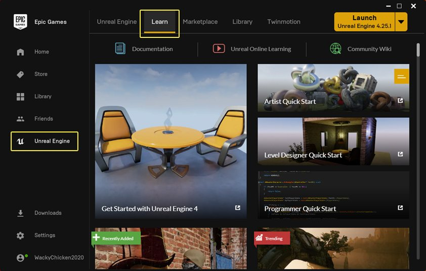
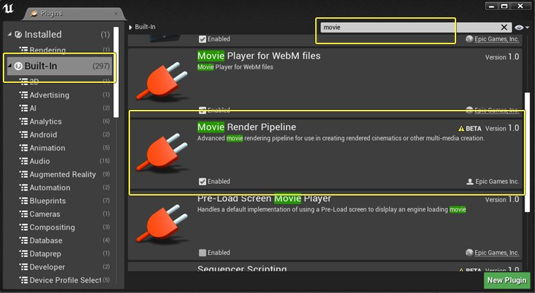
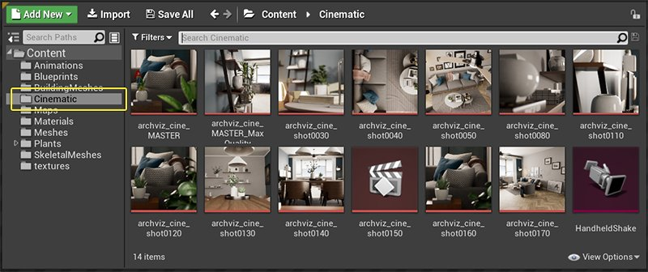
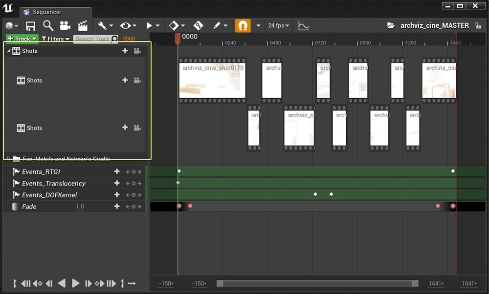

# 如何将影片渲染队列用于高质量渲染

> 路径：虚幻引擎5.7文档 / 构建虚拟世界 / 为场景设置光照 / 硬件光线追踪和路径追踪功能 / 如何将影片渲染队列用于高质量渲染

> 原始页面：https://dev.epicgames.com/documentation/unreal-engine/rendering-high-quality-frames-with-movie-render-queue-in-unreal-engine

> [!NOTE]
> 本指南面向使用64位Windows 10操作系统的用户。

假如你的目标是实现高质量的离线（非实时）渲染，你就无需在意实时渲染以及它的开销。你可以利用这个机会，通过设置选项和命令，极大提升某些画面效果的品质、精度和效果，例如 *光线追踪全局光照* 和 *光线追踪反射*。 你还可以提升 *动态模糊* 的效果，并且去除不想看到的抗锯齿异常。

本指南将引导你完成一些设置，你可以使用这些设置生成非实时高质量渲染。你将了解如何使用影片渲染队列（Movie Render Queue）、自定义设置、以及控制台变量来配置一段序列示例。

观看下方视频，了解高品质渲染的完整效果：

本指南所遵循的步骤与生成上方视频所需的步骤类似。主要区别在于你将使用影片渲染队列而非蓝图导演（Blueprint Director）。

## 目标

读完本指南后，你将对以下内容更加了解：

- 使Sequencer准备就绪，以便与影片渲染序列结合使用
- 输出高质量图像序列
- 使用光线跟踪渲染图像时，调整输出设置以便改进图像
- 使用控制台变量以便应用你的自定义设置

为了获得最佳效果，请按顺序执行以下步骤。

## 步骤1.项目设置

开始之前，你需要更改系统设置，下载本指南随附的示例项目，并启用 **影片渲染管线** 插件。

### 系统配置（可选步骤，推荐完成）

假如GPU在执行指令时花的时间过长，Windows就会认为显卡出现了崩溃，然后会重置驱动器，从而导致引擎关闭。

可以通过更改Windows注册表中的超时检测和恢复（TDR）时间，来增加Windows检测到GPU超时之前所需的时间。

> [!NOTE]
> 你需要获取管理员权限才能在电脑上进行此类编辑。

要编辑TDR（加载示例项目之前），你需要：

1. 使用 **Windows启动菜单搜索栏**，输入 **regedit** 启动 **注册表编辑器**。
2. 导航至类别 **Computer\HKEY_LOCAL_MACHINE\SYSTEM\CurrentControlSet\Control\GraphicsDrivers**。
3. 从列表中选择 **TdrDelay**，然后右键点击并选择 **修改（Modify）**。
4. 该值以秒为单位。选择 **十进制（Decimal）**，将 **数值数据（Value data）** 设置为 **60**，然后点击 **确定（OK）**。

> [!TIP]
> 有关TDR的其他信息，可在[Microsoft超时检测和恢复（TDR）注册表项](https://docs.microsoft.com/en-us/windows-hardware/drivers/display/tdr-registry-keys) 文档中找到。

### 下载示例项目

本指南使用 **ArchViz Interior** 作为示例项目，以便生成最后渲染的最终图像序列。该示例项目提供了一个拥有光线跟踪效果（例如阴影、环境光遮蔽）和全局光照效果的逼真场景。

1. 打开 **Epic Games启动器（Epic Games Launcher）**。点击左侧选项中的 **虚幻引擎（Unreal Engine）**，然后选择顶部的 **学习（Learn）** 标签。

   
2. 向下滚动到 **引擎功能示例（Engine Feature Samples）** 分段，然后选择 **ArchViz Interior**。当 **内容细节（CONTENT DETAIL）** 窗口打开时，点击 **免费（Free）** 下载项目，然后点击 **创建项目（Create Project）**。本指南中，我们将项目名称保留为 **ArchVizInterior**。
3. 选择下载路径或接受默认路径。

> [!NOTE]
> 此项目要求显卡兼容光线追踪功能，并提供DirectX 12光线追踪支持。有关光线追踪系统要求的更多信息，请查阅[实时光线追踪](../hardware-ray-tracing/index.md)。

要了解更多关于Arkviz室内项目和它的开发过程，请参考Arkviz室内渲染图。

### 启用影片渲染管线插件

你必须先启用 **影片渲染管线（Movie Render Pipeline）** 插件，然后才能使用 **影片渲染队列**。

1. 下载ArchViz项目并在引擎中打开后，前往 **编辑（Edit）> 插件（Plugins）**。
2. 如果尚未选择，请选择 **内置（Built-In）**，然后搜索 **影片**。然后你就能看到 **影片渲染管线**。

   
3. 如果尚未启用，请勾选 **启用（Enabled）** 复选框以便激活插件，然后关闭窗口。

## 步骤 2：将项目序列加载到Sequencer编辑器中

在这一步中，你将用到在建筑可视化室内项目中设置的 **过场动画序列**，简称 **过场动画** 。

> [!NOTE]
> 如果你还不熟悉Sequencer和影片渲染队列功能，请参阅本页面顶部列出的参考文档，这会帮助你加深理解。

1. 打开Archviz Interior项目，在 **内容浏览器** 中找到关卡序列。在此项目中，所有关卡序列都位于 **内容（Content）> 过场动画（Cinematic）** 文件夹中。

   
2. 双击 **archviz_cine_MASTER** 序列，在 **Sequencer编辑器** 中打开它。界面应类似于下图。

   

   此主序列包含此示例项目中使用的所有单个镜头。

> [!TIP]
> 你还可以通过关卡编辑器访问主序列。点击过场动画（Cinematics）下拉菜单，选择和访问已打开项目中的任何现有主序列。

### Sequencer编辑器

**序列编辑器（Sequence Editor）** 提供了一种以可视化方式检查现有镜头的有效方法，可以帮助你决定在使用影片渲染队列时要渲染的帧范围。

在本练习中，我们已近指定了帧范围，但之后你可能会想自己选择帧范围。如果你刚接触Sequencer编辑器，请先熟悉以下功能。否则，直接前往[步骤3：添加序列到影片渲染序列](#%E6%AD%A5%E9%AA%A43%EF%BC%9A%E6%B7%BB%E5%8A%A0%E5%BA%8F%E5%88%97%E5%88%B0%E5%BD%B1%E7%89%87%E6%B8%B2%E6%9F%93%E5%BA%8F%E5%88%97)。

**镜头轨迹（Shots Track）** 包含过场动画中所有摄像机的信息。在此过场动画中，每个镜头都包含渲染时会用到的摄象机。点击左侧的下拉列表，查看所有折叠轨迹。

点击面板中任何摄像机的 **摄像机按钮**，将关卡视口转到到该摄像机的视角。

使用 **播放控制面板** 或 **滑块** 推移时间轴并查看镜头和帧范围。请注意，滑块会显示当前帧的编号。

> [!TIP]
> 打开Sequencer后，从关卡编辑器中选择 **视角（Perspective）> 过场动画视口（Cinematic Viewport）**。
>
> 这会在视口中打开一个播放控制面板，其中包含有关过场动画的其他信息。

## 步骤3：添加序列到影片渲染队列

接下来，你需要在影片渲染队列中添加一个序列。你将借助这个序列渲染一组高品质图像。

> [!NOTE]
> 假如你习惯了[Sequencer中的影片渲染流程](https://dev.epicgames.com/documentation/404)，请注意，影片渲染序列的访问方法和使用界面会很不一样。

1. 在编辑器菜单栏中选择 **窗口（Window）> 过场动画（Cinematics）> 影片渲染队列（Movie Render Queue）**。

   首次打开时，窗口应为空，如下图所示。
2. 点击 **+Render（+渲染）** 按钮，然后从下拉列表中点击 **archviz_cine_MASTER关卡序列** 文件，将其添加到队列中。

   > [!TIP]
   > 你还可以通过从内容浏览器将序列拖到队列窗口中，将序列添加到队列。

**如需删除序列**，请使用以下任意一种方法：

- 选择序列，然后点击 **–** 按钮。
- 高亮显示并按键盘上的

  删除（Del）

  键。
- 右键点击序列，然后点击

  删除（Delete）

  。

**要高亮显示多个序列**，请按住 **Shift** 键并点击进行选择。然后，你可以同时删除多个序列。

## 步骤4：如何选择配置选项

在渲染任何加载进队列的序列前，你都需要先配置设置。有许多设置可供调整，例如输出格式、文件名，以及抗锯齿设置。

第一步是选择你要配置的设置。

1. 在窗口打开且列表中显示主序列的情况下，点击 **未保存配置（Unsaved Config）**。
2. 这会打开 **设置/预设（Setting/Presets）** 窗口。
3. 你可以在此窗口中更改配置，但首先你需要选择你要配置的设置。要添加设置，请点击 **+设置（+ Setting）** 按钮，将打开选项列表。

   选项分为三组：**设置**、**渲染** 和 **输出**（下面将详细介绍）。
4. 要将其中任一选项从此列表移至设置/预设（Setting/Presets）窗口，请点击下拉菜单中的条目。当你将项目添加到该窗口时，该项目将从此列表中删除。
5. 重复步骤3和4，将更多选项添加到列表中。

> [!NOTE]
> 你在设置/预设（Setting/Presets）窗口中添加的每项内容都有一个 **切换开关**。使用这些切换开关可以 **启用** 或 **禁用** 渲染过程选项。这将关闭该渲染的设置（仅限该渲染），但不会从这些预设中完全删除该选项。
>
> 要从设置/预设（Setting/Presets）窗口中 **删除项目**，请高亮显示该项目，然后按 **删除（Del）** 键。将从设置/预设（Setting/Presets）窗口中删除它，然后添加回选项列表中。

### 输出设置说明

有几种 **图像类型** 可以用于 **输出**。每种类型都各有利弊，因此你需要找到最适合自己项目工作流程的类型。

一个考虑因素是文件类型是否提供 *alpha通道*。如果你需要带有透明背景的图像，则这一点很重要。

另一个考虑因素是图像使用无损格式还是有损格式。*无损压缩* 表示文件解压时，可以恢复所有原始图像数据，而 *有损压缩* 则表示不能恢复所有原始数据。

| 输出类型 | Alpha通道 | 有损或无损 | 说明 |
| --- | --- | --- | --- |
| **.bmp序列[8位]** | 否 | 无损 | 能快速写入磁盘，但由于其无压缩格式，文件尺寸较大。 |
| **.jpg序列[8位]** | 否 | 有损 | 较小的文件大小使此格式适合预览。 |
| **.png序列[8位]** | 是 | 无损 | 文件较大，但图像质量更高。 |
| **.exr序列[16位]** | 是 | 无损 | 由工业光魔公司开发的一种高动态范围格式，用于视频合成。 |
| **.wav音频** | 不适用 | 不适用 | 用于音频输出。 |

有关图像类型的更多信息，请查阅[影片渲染队列导出格式指南](../../../../animating-characters-and-objects/cinematics-and-movie-making/movie-render-pipeline/cinematic-render-settings-and-formats/cinematic-rendering-export-formats/index.md)。

> [!NOTE]
> .png和..exr图像格式都允许在输出图像时带有alpha通道，但是首先你需要启用此支持。在编辑器菜单栏中，选择 **编辑（Edit）> 引擎（Engine）> 渲染（Rendering）> 后期处理（Postprocessing）> 在后期处理（实验性）中启用alpha通道支持（实验性功能）（Enable alpha channel support in post processing（experimental））> 仅限线性色彩空间（Linear color space only）**。
>
> 应用此更改后，系统将提示你重新启动引擎。如需创建透明背景，你需要隐藏场景中的不透明对象，例如天空和大气雾。

你可以选择多种输出格式，但在本练习中，我们只使用一种。

### 渲染设置说明

为你提供两种 **渲染** 设置。其用于指定最终图像如何输出。

| 渲染类型 | 说明 |
| --- | --- |
| **延迟渲染（Deferred Rendering）** | 默认选项。关闭 **延迟渲染** 会禁用最终帧渲染，但不会使队列停止处理配置设置中的其他步骤。请按照本指南中的步骤启用它。 |
| **UI渲染器（非合成）（UI Renderer（Non-Composited））** | 将UMG小部件渲染到单独的.png或.exr文件中可提供灵活性，该文件可以与单独的合成应用程序（如Adobe Premiere或Final Cut Pro）中的帧渲染合成，在合成与界面相关的图形时很有用。 |

### 其他设置说明

借助 **设置选项（Settings options）**，你可以指定在渲染最终输出图像时要使用的其他可配置项。

| 设置类型 | 说明 |
| --- | --- |
| **抗锯齿（Anti-aliasing）** | 控制渲染最终图像时使用的采样数量和采样类型。 |
| **烧入（Burn In）** | 用于添加带有信息的覆层，信息包括场景或镜头的名称、日期、时间或帧信息等。这些覆层也称烧入（Burn Ins），因为它们在渲染时被烧录进影片。如有需要，可以替换为自定义控件。 |
| **摄像机（Camera）** | 可用于控制快门设置，进而影响运动模糊和曝光等效果。 |
| **控制台变量（Console Variables）** | 通过影片渲染队列进行渲染时，特地调用并执行某些控制台变量。 |
| **游戏覆盖（Game Overrides）** | 覆盖一些与游戏相关的常见设置，例如游戏模式（Game Mode）和过场动画质量（Cinematic Quality）设置。如果游戏在正常模式下会显示你不想采集的UI元素或加载屏幕，则此功能很有用。 |
| **高分辨率（High Resolution）** | 允许你使用平铺渲染生成更大的图像，生成通常情况下因最大纹理尺寸或GPU内存限制而无法生成的超大图像。 |

在本练习中，你只会使用其中几个选项，但之后你可以（并且应该）自己探索所有这些选项。

有关这些设置的更多信息，请参阅[影片渲染队列图像设置指南](../../../../animating-characters-and-objects/cinematics-and-movie-making/movie-render-pipeline/cinematic-render-settings-and-formats/cinematic-rendering-image-bb951eea/index.md)。

## 步骤5：选择你的选项

添加以下选项到设置/预设（Setting/Presets）窗口：

- .png序列[8位]（.png Sequence [8bit]）
- 延迟渲染（Deferred Rendering）
- 抗锯齿（Anti-Aliasing）
- 控制台变量（Console Variables）

另一选项 **输出（Output）** 也将位于 **设置（Settings）** 中的列表上。这是唯一无法删除的选项。

这是你的 设置/预设（Setting/Presets） 窗口此时应呈现的外观。

### 步骤6：配置抗锯齿设置

**抗锯齿** 是一种使线条平滑并消除视觉失真的方法。**空间采样** 和 **临时采样** 各自使用不同的方法解决抗锯齿和噪点相关的问题。

- **空间采样** 的工作原理是在相同的时间点渲染，但是摄象机位置的偏移略有不同，并且在两个不同的空间样本之间没有时间流逝，同时会累加来自不同偏移位置的样本。
- **临时采样** 的工作方式是将摄像机快门的打开时间切割成若干个指定的子帧，然后使用引擎运动模糊在较小的片段之间插值。它特别适合提高运动模糊质量。

有关临时采样和空间采样之间的区别，以及何时以一种方法代替另一种方法的更多指引信息，请参阅[影片渲染队列抗锯齿设置](../../../../animating-characters-and-objects/cinematics-and-movie-making/movie-render-pipeline/cinematic-render-settings-and-formats/cinematic-rendering-image-bb951eea/index.md#%E6%8A%97%E9%94%AF%E9%BD%BF)。

本指南中使用的值是两种方法的组合。

> [!NOTE]
> 本指南基于RTX-2080 Ti显卡开发。根据你的设置，你可能需要在此处降低某些数值才能生成最终的帧画面，或者，如果你使用的是高端显卡（如Quadro RTX），则你可以增加采样数量。

1. 在 **影片渲染队列（Movie Render Queue）** 窗口中，点击 **未保存配置（Unsaved Config）** 链接，打开设置。（***** 表示尚未保存这些设置。输入所有设置后，你将保存预设。）
2. 在 **设置/预设（Setting/Presets）** 窗口中，点击 **抗锯齿（Anti-aliasing）**，打开设置对话框。
3. 添加以下数值：

   - 空间采样数量（Spatial Sample Count）：

     1
   - 临时采样数量（Temporal Sample Count）：

     64
   - 覆盖抗锯齿模式（Override Anti Aliasing Mode）：

     已启用（Enabled）
   - 抗锯齿方法（Anti Aliasing Method）：

     无（None）
   - 渲染预热计数（Render Warm Up Count）：

     120
   - 引擎预热计数（Engine Warm Up Count）：

     120

在构建临时历史记录和模拟时，**渲染预热计数（Render Warm Up Count）** 和 **引擎预热计数（Engine Warm Up Count）** 这两个参数能提供足够的缓冲时间，使其在采集帧之前稳定下来。例如，这将允许自动曝光或其他屏幕效果在渲染第一帧之前有一个良好的起点。

这些设置将渲染高质量图像。此处旨在展示，与实时渲染相比，你能从中获得更高质量的画面。因此，你不必担心实时性能或渲染所花费的时间。

质量与性能之间的权衡意味着，采样数量越高，每帧渲染所耗费的时间就越长。

> [!WARNING]
> 建议你先使用几帧进行测试，而不要在开始之前将所有项都设置为最高值。你的目标应该是根据你的GPU和设置找到最适合你的项目的设置。

## 步骤7：配置控制台变量

借助影片渲染队列进行渲染时，你可以调用并执行大多数 **控制台变量（CVAR）**。当你在渲染那些实时开销过大的高质量效果时，这些参数会很有用。

> [!NOTE]
> 队列中所列的CVAR仅在图像通过队列渲染时执行。这些设置不会永久更改关卡中已设置的任何内容，它可以兼容现有设置，并且只会覆盖那些在队列中指示的、用于最终图像输出的设置。
>
> 这种方法对于光线跟踪特别有价值，因为在启用这类功能后，增加采样数量和反射次数会直接影响性能，但会大大提高光照效果的质量和精度。

1. 点击 **控制台变量（Console Variables）**，打开设置对话框。
2. 点击 **+** 按钮，按下述列表输入变量及其数值：

   - r.MotionBlurQuality:

     4
   - r.MotionBlurSeparable:

     1
   - r.DepthOfFieldQuality:

     4
   - r.BloomQuality:

     5
   - r.Tonemapper.Quality:

     5
   - r.RayTracing.GlobalIllumination:

     1
   - r.RayTracing.GlobalIllumination.MaxBounces:

     2
   - r.RayTracing.Reflections.MaxRoughness:

     1
   - r.RayTracing.Reflections.MaxBounces:

     2
   - r.RayTracing.Reflections.Shadows:

     2

   > [!TIP]
   > 输入这些CVAR的最快、最准确的方法是从此文档剪切并粘贴，然后按 **Tab** 键将光标移至值字段。
3. 重复步骤2直至添加全部。

与抗锯齿值一样，此处使用的控制台变量注重质量而不是性能。

对于光线追踪全局光照（`r.RayTracing.GlobalIllumination`），设置数值 **1** 可调用暴力方法。这样可确保准确，并支持多次间接光照反射，但是计算开销大。如果你将此值更改为 **2**，它将使用临时历史记录方法，该方法速度更快，但是仅支持单次间接光照反射，并生成一些 *重影瑕疵* （运动图像后的尾迹像素）。

本练习中的其他CVAR使用可缩放数值控制质量级别。

如果你要了解控制台变量的细节，你可以使用反引号（**`**）键打开控制台并搜索该控制台命令。使用以下格式显示提示文本：

`[consolevariablename] ?`

例如，如果你输入 r.RayTracing.GlobalIllumination ?`，提示文本的输出如下所示：

~~~ HELP for 'r.RayTracing.GlobalIllumination': -1：后期处理体积驱动的值（默认） 0：光线追踪全局光照关闭 1：启用光线追踪全局光照暴力方法 2：启用光线追踪全局光照最终收集方法 ~~~

该查询结果将在 **输出日志** 中显示。要访问，请前往 **窗口（Window）> 开发人员工具（Developer Tools）> 输出日志（Output Log）**。

> [!NOTE]
> 本指南中选择的所有变量和值为项目渲染提供了高质量的起始点。
>
> 在你处理自己的项目时，你可能想要尝试不同的变量和值。对于光线追踪的特定CVAR，请参阅[影片渲染队列概述](https://dev.epicgames.com/documentation/404)和本指南最后的 [自主操作！](#%E8%87%AA%E4%B8%BB%E6%93%8D%E4%BD%9C%EF%BC%81) 环节。

## 步骤8：配置输出

**设置/预设（Setting/Presets）** 窗口的最终配置步骤为 **输出（Output）**。

你可以渲染整个序列、一系列帧或单个帧。由于高质量输出很耗时，因此在本练习中，你将把输出限制为序列中的一小段。

1. 在 **影片渲染队列（Movie Render Queue）** 窗口中点击 **未保存配置（Unsaved Config）** 链接，打开设置。
2. 在 **文件输出（File Output）** 中，输入：

   - **输出目录（Output Directory）：** 你要渲染图像的目标目录。默认情况下，它将保存到你的项目文件夹。要浏览其他目录，请点击右侧的...。
   - **文件名格式（File Name Format）：** 如果未更改，默认名称是序列名称和渲染的帧数。
   - **输出分辨率（Output Resolution）：** 目标图像尺寸。默认为1920（宽度）乘以1080（高度）。保留默认值。
   - **使用自定义帧率（Use Custom Frame Rate）：** 更改输出帧率。保留禁用状态。
   - **覆盖现有输出（Override Existing Output）：** 点击此复选框以启用。
3. 在 **帧（Frames）** 中，输入：

   - **处理帧数（Handle Frame Count）：**此练习中未使用。保留默认值0。要了解关于此选项的更多信息，请参阅[Sequencer概述](https://docs.unrealengine.com/en-US/Engine/Sequencer/Overview/index.html)。
   - **输出帧步（Output Frame Step）：** 此练习中未使用。保留默认值1。
   - **使用自定义播放范围（Use Custom Playback Range）：**点击可启用。
   - **自定义起始帧（Custom Start Frame）：**设置渲染范围的首帧。输入 **450**。
   - **自定义终止帧（Custom End Frame）：** 设置范围的最终帧。输入 **550**。100帧的范围足以呈现反射、动态模糊和全局光照的质量，而无需花费大量时间等待渲染完成。
4. 点击 **接受（Accept）**，保存所有输入的设置。

## 步骤9：保存你的配置设置

保存你的设置以便于将其再次用于此项目和其他项目。保存了预设后，你可以随时回到这里，根据项目工作流程编辑这些设置，或者将预设复制到其他项目中。

当你找到方法调整特定项目工作流的设置时，你还可以编辑设置，然后保存或者将它们另存为。

1. 从 **影片渲染序列（Movie Render Queue）** 窗口，点击 **未保存配置（Unsaved Config）**，打开 **设置/预设（Setting/Preset）** 窗口。
2. 点击 **预设（Presets）**，然后点击 **另存为预设（Save As Preset）**。
3. 在 **保存配置预设（Save Config Preset）** 窗口中，为你的预设资产命名。

   > [!NOTE]
   > 新的目录路径将在项目内容浏览器中自动生成：**过场动画（Cinematics）> 影片管线（MoviePipeline）> 预设（Presets）**。接受默认位置，或使用左侧的内容导航面板选择其他目录。
4. 点击 **保存（Save）**。

> [!NOTE]
> 因为该预设现在是一项资产，它现在可以在内容浏览器中打开，然后独立于序列文件复制到其他项目中。

如果已保存预设未显示，点击下来菜单，查看此项目的所有已保存预设。

## 步骤10：最终输出和结果

在最后的练习步骤中，你将使用你设置和保存的值从采样序列中渲染出选定的图像范围。

为你提供两种渲染选项：

- **渲染（本地）（Render（Local））：** 渲染当前编辑器实例中的序列，类似于在编辑器中运行（PIE）。由于迭代时间较短，此工作流最常用，也推荐你使用。
- **渲染（远程）（Render（Remote））：** 默认行为是启动一个单独进程来渲染队列，类似于老版渲染影片系统中的"使用单独进程（Use Separate Process）"。对文件的更改需要在单独启动进程时保存。此按钮的行为可以被内部解决方案替代，例如使用渲染农场。

对于本练习，你将进行 **本地渲染**，方便预览。

1. 在 **影片渲染队列（Movie Render Queue）** 窗口中，确保你的序列与你保存的预设一起加载，然后点击 **渲染（本地）（Render（Local））** 按钮。
2. 预览窗口将启动，然后它会根据预设中的参数和值采集并输出每一帧画面。

   状态信息显示在左侧底部，序列信息显示在右侧。

   > [!NOTE]
   > 设置渲染输出是出于质量而非速度的考虑。如果你的计算机速度很慢，请耐心等待，这可能是一个缓慢的过程。
3. 渲染完成后，预览窗口将关闭。可以在 **已保存输出** 目录中找到已采集的帧。要快速导航至该文件夹，请在 **输出（Output）** 一列中点击影片渲染队列（Movie Render Queue）窗口中的链接。

这是一段视频剪辑，显示了100帧镜头渲染的最终效果。

你可能发现仍有一些瑕疵需要处理，例如金杯上闪烁的反射。这类问题可以使用材质中的其他技术优化或解决。（有关这些技术的更多信息，请参阅 [建筑可视化室内渲染](../../../../samples-and-tutorials/index.md)）。

而你会发现抗锯齿、阴影、动态模糊以及多重反射全局光照和反射已改善。利用下面的对比资料，了解采用默认设置的帧540（左）和采用为此练习中输出的指定设置（右）的帧540之间的差异。

采用默认设置的帧540。

采用增强品质数值的帧540。

在本指南中，你已经了解如何设置和配置影片渲染队列，以便以多种格式渲染高质量图像序列。你可以将这些图像序列置于第三方编辑和合成软件中，如Adobe Premiere、After Effects、Final Cut Pro、Nuke或Resolve，以便生成视频剪辑或执行进一步的镜头编辑和颜色分级。此过程与用于为Archviz Interior示例项目生成视频的过程相同：

## 渲染故障处理

如果渲染失败，或者如果引擎停止工作或崩溃，你可以检查以下项。

- **你是否有安装适用你显卡的最新GPU驱动程序？**

  如果你没有，请下载它。
- **你的GPU是否支持光线追踪？**

  如需进一步了解光线追踪的要求，请参阅[实时光线追踪](../hardware-ray-tracing/index.md)。

如果这些方法没有解决问题，请尝试下一步骤。

## 禁用GPU超时

以下信息也有助于避免或减少GPU超时，但仅应当你在渲染过程中遇到超时问题或引擎崩溃时才应用。

控制台命令 `r.D3D12.GPUTimeout` 设置是否启用GPU超时，该设置可能导致引擎关闭。

- 0

  表示禁用GPU超时。使用时应格外小心，因为此操作可能导致PC死机。
- 1

  表示启用GPU超时。此为默认设置，当操作花费太长时间而无法在GPU上完成时，会导致编辑器关闭。

因为你仅将其应用于你的项目，而不是整个系统，所以请在你已下载ArchViz Interior示例项目，并在虚幻引擎关闭后执行这些步骤。

1. 在关闭虚幻引擎的情况下，前往 *项目配置文件夹**。 示例： `D:\ue_local_project_Epic_official_demo\ArchVizInterior\Config`
2. 在文本编辑器中打开 `ConsoleVariable.ini` 文件，并滚动至文件底部，然后在末尾添加以下两行：

   `; disable GPU Timeout`

   `r.D3D12.GPUTimeout=0`

   第一行是注释，提醒你CVAR的用途。第二行是具有预期值的实际CVAR。
3. **保存** 文件。如果提示要覆盖，点击 **确定（OK）**。关闭你的文本编辑器。
4. 启动引擎并加载Archviz项目。GPU超时CVAR现已生效。

## 自主操作！

你已经了解影片渲染队列的基本工作流程，但是你此处使用的设置只是起始点。以下是一些供你自主尝试的建议。

### 本地渲染和远程渲染

在[步骤10：最终输出和结果](#%E6%AD%A5%E9%AA%A410%EF%BC%9A%E6%9C%80%E7%BB%88%E8%BE%93%E5%87%BA%E5%92%8C%E7%BB%93%E6%9E%9C)中，你在本地输出渲染。此方法适用于预览，同时仍然提供高质量结果。然而，使用远程渲染不会在过程中运行虚幻编辑器代码。

如果你可以访问渲染农场，那么你还可以自己实现 **渲染（远程）** 命令，然后将任务发送给渲染农场。目前虚幻引擎尚不支持任何现有的第三方渲染农场软件。虚幻引擎4.25目前要求使用C++编写新的实现内容。我们希望不久的将来能支持使用Python编写实现内容。

### 临时采样和降噪

有两种临时取样方法可解决图像处理中的抗锯齿问题。

在编辑器中实时工作时，你将使用 **临时抗锯齿（TAA）**，这是一种特定的实时、抗锯齿技术。它存在一些缺陷，例如当摄像机快速移动或物体在精细的材质上移动时，会出现重影或噪点瑕疵，这使其没那么适合用于高质量图像输出。

或者，你可以使用 **临时采样（Temporal Sampling）**。此方法使用与TAA类似的技术，使用真实的渲染数据减少图像的锯齿。它借助实时TAA解决问题，但处理速度较慢，因为它使用的样本更多，以便生成更好的效果。例如，如果它使用8倍的样本，则处理时间将是实时TAA的八倍。

另一方面，光线追踪的许多功能都使用不同的降噪器。它使用的样本更少，但是通过模糊和平滑处理 *柔化* 样本后，产生的效果与使用更多样本的效果相同。使用影片渲染队列时，由于你不关心实时性能，因此你可以禁用降噪器，并使用更多样本生成物理上更精确的结果。

考虑到这一点，在将影片渲染队列与光线追踪功能结合使用时，你可以禁用以下降噪器，方法是将其添加至你的控制台变量列表：

- r.AmbientOcclusion.Denoiser: 0
- r.DiffuseIndirect.Denoiser: 0
- r.RayTracing.SkyLight.Denoiser: 0
- r.Reflections.Denoiser: 0
- r.Shadow.Denoiser: 0
- r.RayTracing.GlobalIllumination.Denoiser: 0

当在配置设置（Configuration Settings）对话框中通过将 **抗锯齿方法（Anti Aliasing Method）** 设置为 **无（None）** 禁用TAA时，如果在CVAR中禁用了降噪器，也可以关闭临时采样累加。在你自己的影片渲染队列测试中，浏览以下内容：

- r.AmbientOcclusion.Denoiser.TemporalAccumulation: 0
- r.GlobalIllumination.Denoiser.TemporalAccumulation: 0
- r.Reflections.Denoiser.TemporalAccumulation: 0
- r.Shadow.Denoiser.TemporalAccumulation: 0

### 其他光线追踪控制台命令

许多光线追踪特征值已针对实时使用进行了优化。这意味着它们通过减少样本数量，限制最大反射数量或其他措施，从而牺牲质量以换取性能。

下面是你可以在影片渲染队列中使用的更多控制台变量，以质量换取性能。这一点特别有用，因为仅当从队列运行渲染时，此功能才执行这些命令，并且对于你可能已在编辑器中的后期处理体积中设置的任何实时设置，该设置不会永久覆盖。

**逐像素采样：** 每个光线追踪功能都可以使用很少或很多样本生成最终结果。去噪器使用像素较少，通常用于计算量繁重的任务。借助影片渲染队列，你可以选择禁用降噪器，并增加逐像素样本，以便提高质量。

部分示例为：

- r.RayTracing.Reflections.SamplesPerPixel
- r.RayTracing.Shadow.SamplesPerPixel
- r.RayTracing.GlobalIllumination.SamplesPerPixel

**最大反射数（Maximum Number of Bounces）：**在场景中进行多次反射或光线反射，生成更自然、更高质量的效果，从而让光线跟踪功能（例如反射、全局光照和透明涂层）从中受益。这些设置对于实时渲染来说开销很大。

- r.RayTracing.GlobalIllumination.MaxBounces
- r.RayTracing.Reflections.MaxBounces
- r.RayTracing.Reflections.MaxUnderCoatBounces

**天空光照（Sky Light）：** 在实时光线追踪中，为反射和全局光照等功能计算每帧时，由于距离无限，天空光照可能造成额外的开销。

使用影片渲染队列工作时，以下CVAR可以在光线跟踪中启用其他天空光照选项：

- r.RayTracing.GlobalIllumination.EvalSkyLight
- r.RayTracing.SkyLight.EnableTwoSidedGeometry
- r.RayTracing.Reflections.RayTraceSkyLightContribution
- r.RayTracing.SkyLight.EnableMaterials

> [!TIP]
> 这些是部分可用CVAR。你可以通过打开控制台窗口并输入 `r.RayTracing` 查看可用变量列表，从而浏览其他CVAR。
