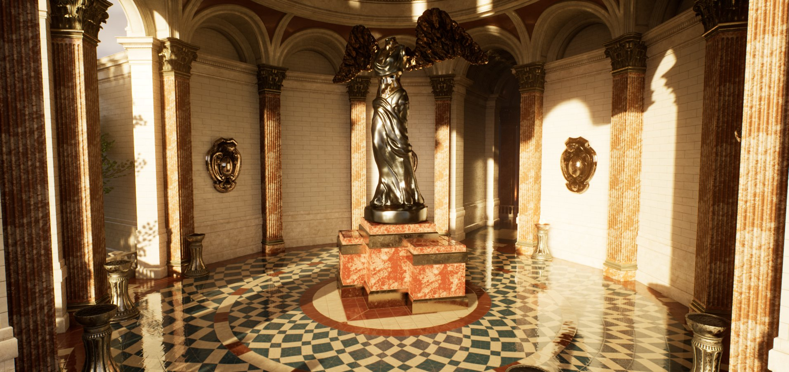
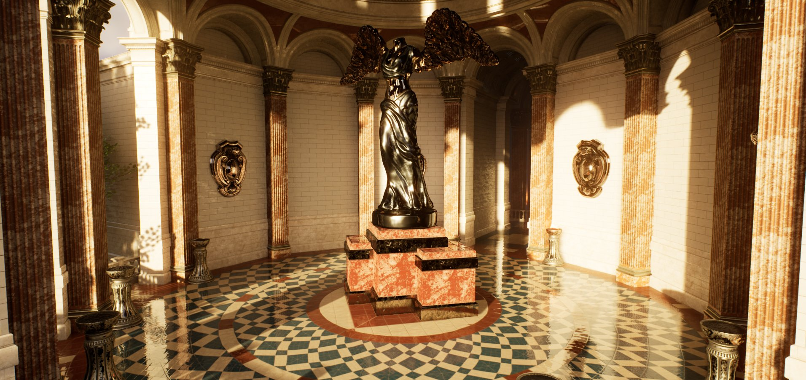
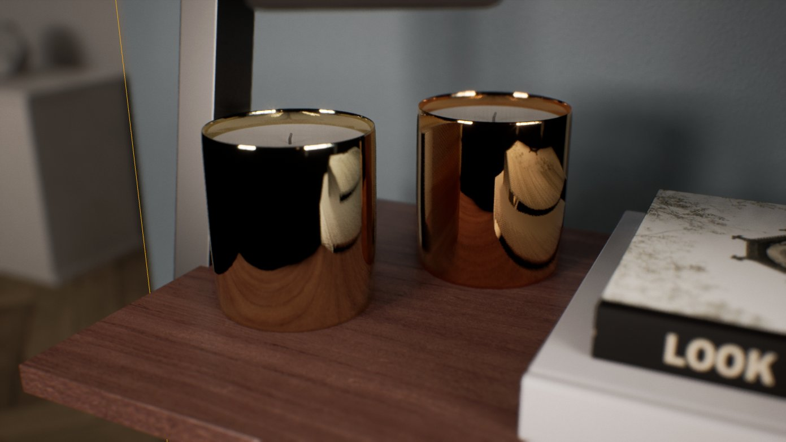
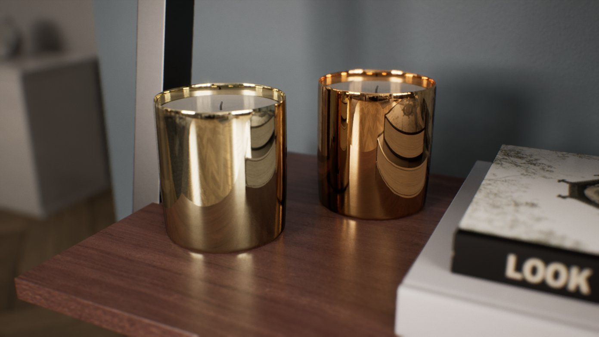
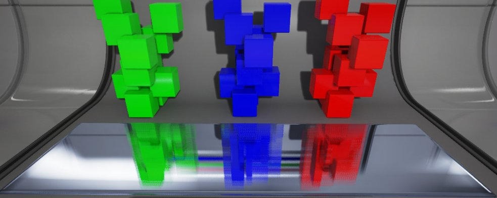
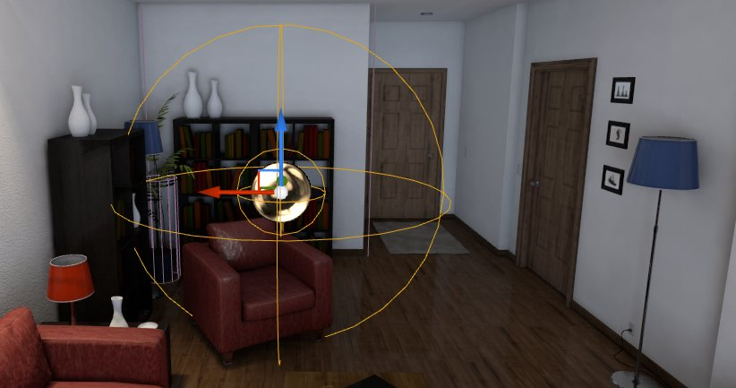
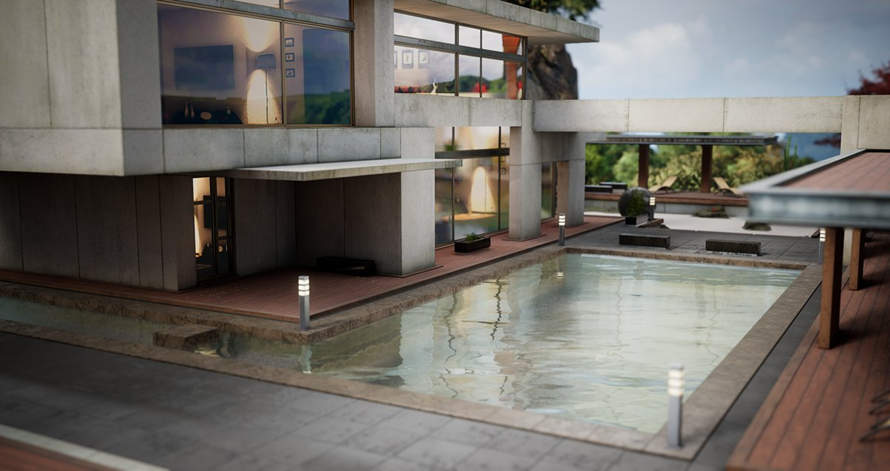
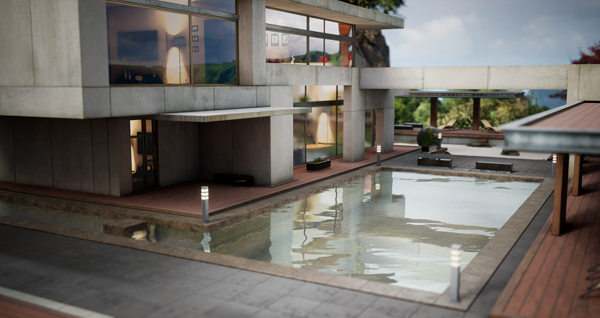

# 反射环境

> 路径：虚幻引擎5.7文档 / 构建虚拟世界 / 为场景设置光照 / 反射环境

> 原始页面：https://dev.epicgames.com/documentation/unreal-engine/reflections-environment-in-unreal-engine

反射可以为场景中的对象添加添加更多光照，对于场景是否逼真至关重要。在实时3D渲染中，实现反射需要从设置[材质](../../../designing-visuals-rendering-and-graphics/unreal-engine-materials/index.md)开始。低粗糙度材质的表面或多或少会反射一些光线。这就像镜面和拉丝金属的表面的区别一样。

虚幻引擎提供了多种反射系统，供你的项目使用。有些系统可以和其它系统搭配使用，也可以单独使用。为你的项目选用哪种类型的反射取决于你想要达到的质量和你的目标平台。一些反射系统会要求大量的性能，仅能在特定系统使用，或者有硬件上的限制。

## 反射种类

在开发项目时，你需要考虑是否要使用动态反射，想要达到哪种反射品质，以及你的目标平台能够支持哪种反射。

比如，对于大多数平台来说，同时搭配使用静态反射捕获和动态屏幕空间反射后期处理特效效果很好，这种方式可以快速渲染，但是也不可避免地有渲染瑕疵。相比较之下，Lumen全局光照反射系统或者光线追踪反射可以更好地模拟光线和反射来准确地显示场景中的物体，但是渲染需要更高的性能，而且并不适用于所有平台。

以下是可用的反射系统、反射种类以及支持的平台：

| 反射系统 | 反射种类 | 支持平台 |
| --- | --- | --- |
| **Lumen反射（Lumen Reflections）** | 动态 | 高性能PC和次世代游戏主机 |
| **光线追踪反射（Ray Tracing Reflections）** | 动态 | 装有Windows 10、DirectX 12以及受支持的英伟达GPU的PC |
| **屏幕空间反射（Screen Space Reflections）** | 动态 | 电脑和游戏主机 |
| **反射捕获（Reflection Captures）** | 静态 | 所有平台 |
| **平面反射（Planar Reflections）** | 动态 | 所有平台 |

### Lumen反射

**Lumen反射（Lumen Reflections）** 是Lumen全局光照反射系统的一部分，使用基于软件或者硬件的光线追踪来为场景生成反射。Lumen将多种方法混合，在软件光线追踪模式下通过屏幕追踪来准确展示场。启用硬件光线追踪时，它会增强现有的光线追踪架构以用于反射，但是需要受支持的英伟达GPU来运行。

Lumen全局光照反射

屏幕空间反射

更多信息，请参阅[Lumen全局光照反射系统](../global-illumination/lumen-global-illumination-and-reflections/index.md).

### 光线追踪反射

> [!WARNING]
> 该光线追踪功能已弃用并可能在未来版本中移除。

硬件 **光线追踪反射（Ray Tracing Reflections）** 使用光线追踪技术来模拟光线，以此来准确展示环境并且实现多重反射。虚幻引擎中的光线追踪需要受支持的英伟达GPU和支持DirectX 12的Windows操作系统。

屏幕空间反射

光线追踪反射

更多信息，请参阅[硬件光线追踪](../ray-tracing-and-path-tracing-features/hardware-ray-tracing/index.md).

### 屏幕空间反射

**屏幕空间反射（Screen Space Reflections）** (SSR) 是一种动态后期处理特效，仅限于反射屏幕中显示的物体。屏幕外或者被其它物体挡住的物体无法使用屏幕空间反射显示，这会导致反射中的渲染瑕疵。

更多信息，参阅[屏幕空间反射](screen-space-reflections/index.md).

### 反射捕获Actor

**反射捕获（Reflection Capture）** Actors是一种对性能要求较低的，反射探头周围区域的静态捕获。可以在关卡中放置很多这样的探头而不影响性能，因为这些反射会在运行时之前完成运算。

可以选择两种反射捕获：**盒型（Box）** 和 **球体（Sphere）**。 它们会捕获其周围环境的图像，然后将图像映射到反射捕获形状上。反射捕获可以互相重叠和混合，通常会放置一个大的捕获来显示周围区域和一个小的来显示表面更清晰的静态反射。

更多信息，参阅[反射捕获Actors](reflections-captures/index.md).

### 平面反射

**平面反射（Planar Reflections）** 是一种可以放在表面的Actor，用于创建场景的准确、动态的反射，它会从反射的方向二次渲染关卡。这种反射方法对性能要求较高，但是可以提供更准确的反射，并且支持所有平台。

屏幕空间反射

平面反射

更多信息，参阅[平面反射](planar-reflections/index.md).

## 高质量反射

默认的反射质量设置追求性能和视觉效果的平衡。然而，对于一些对性能要求不高但是要求高质量反射的项目，你可以使用 **高精度法线（High Precision Normals）** GBuffer。

高质量反射的一个重要因素在于顶点的法线和切线如何表示。高密度网格体可能导致相邻的顶点量化为同样的顶点法线和切线值，从而造成法线方向的突变。将法线和切线使用每通道16位编码，可以让开发者牺牲编码顶点时占用的内存来达到更高的反射质量。

> 图片已省略：GBuffer：默认

> 图片已省略：GBuffer：高精度法线

GBuffer：默认

GBuffer：高精度法线

以下是启用高精度法线反射所需要的设置：

- 在项目设置（Project Settings）中，找到 **引擎（Engine） > 渲染（Rendering） > 优化（Optimizations）** ，将 **GBuffer格式（GBuffer Format）** 更改为 **高精度法线（High Precision Normals）**。

  > 图片已省略：项目设置高精度法线
- 打开任意一个静态网格体资产，使用静态网格体编辑器的 **细节（Details）** 面板，找到 **LOD 0 > 编译设置（Build Settings）** ，启用 **使用高精度切线基础（Use High Precision Tangent Basis）**。

  > 图片已省略：静态网格体高精度切线基础设置
