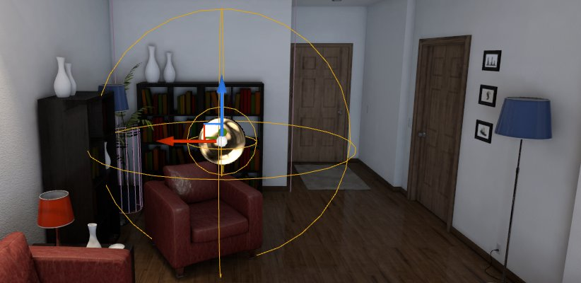
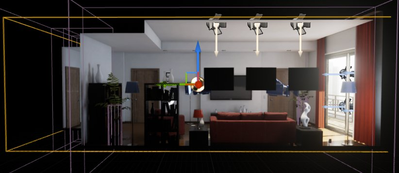
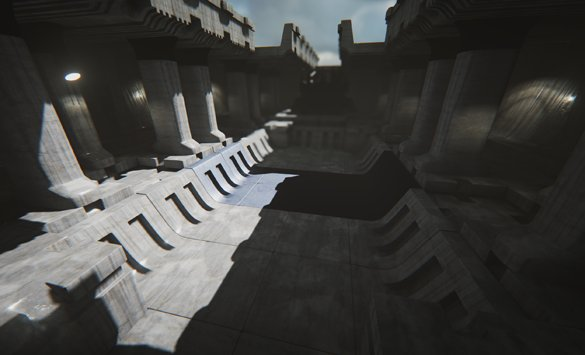
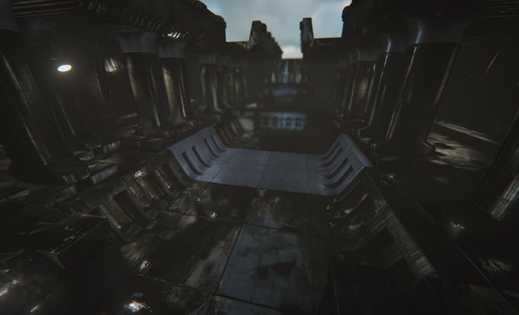
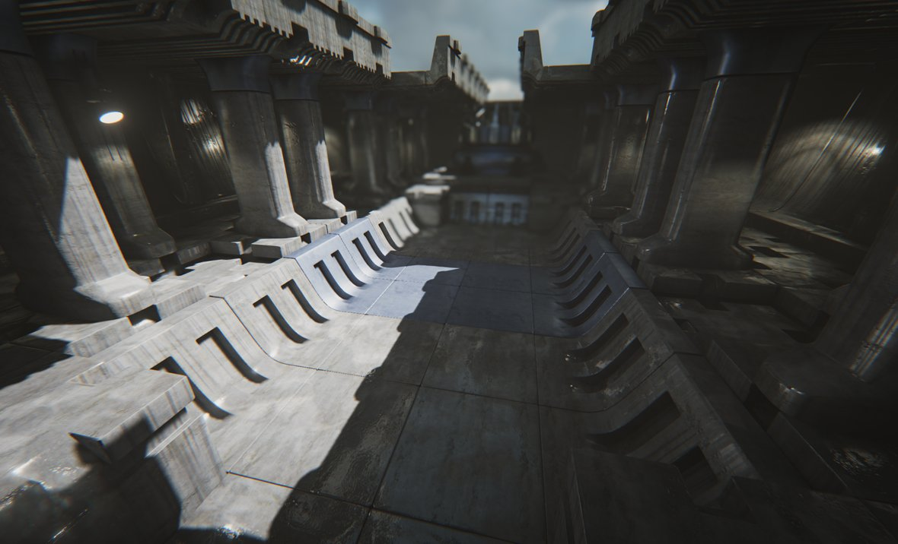
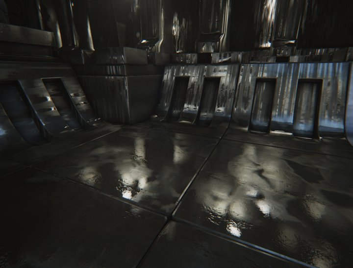
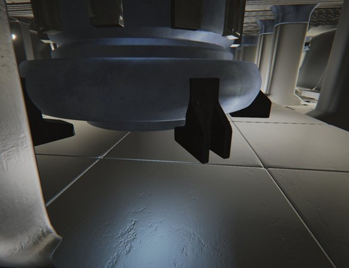
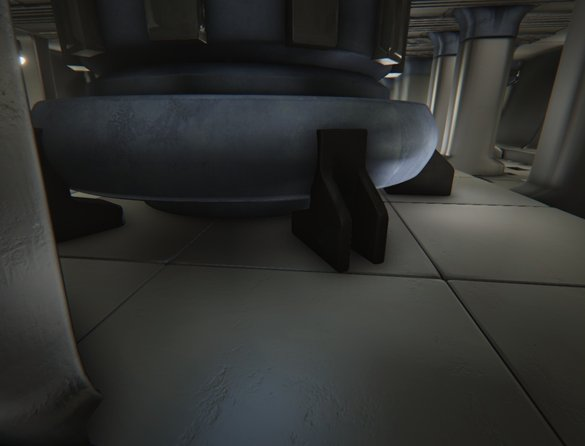

# 反射捕获

> 路径：虚幻引擎5.7文档 / 构建虚拟世界 / 为场景设置光照 / 反射环境 / 反射捕获

> 原始页面：https://dev.epicgames.com/documentation/unreal-engine/reflections-captures-in-unreal-engine

**反射捕获（Reflection Capture）** Actor是可以放置在世界中的探头（probe），用于捕获它们所覆盖区域的静态图像。此反射方法将捕获的立方体贴图重新投射到周围的反射性材质上。它是一种没有运行时性能成本的低成本反射方法。

## 反射捕获形状

当前有两个反射捕获形状：球体和盒体。形状十分重要，因为它控制着场景的哪个部分将被捕获到立方体贴图中、反射中关卡被重新投射到什么形状上，以及关卡的哪个部分可以接收来自该立方体贴图的反射（影响区域）。

### 球体形状

球体形状是目前最为实用的。它绝不会匹配被反射几何体的形状，但不含中断或拐角，因此，误差是均匀的。

球体形状拥有橙色的影响半径，此半径控制受立方体贴图影响的像素，以及关卡将被重新投射到的球体。

较小的捕获将覆盖较大的捕获，因此在关卡周围放置较小的捕获可以提高精度。

### 盒体形状

盒体形状的实用性十分有限，一般只适用于走廊或矩形房间。原因是只有盒体内的像素可以看到反射，同时盒体内的所有几何体都投射到盒体形状上，在许多情况下会产生明显的瑕疵。

选中盒体时，投射形状将具有橙色预览。它仅在此盒体外的 **盒体过渡距离** 内捕获关卡。此捕获的影响也会在盒体内随过渡距离淡入。

## 设置关卡以使用反射环境

构建良好反射的第一步是使用光照贴图来设置漫反射光照 （包括间接光照）。如不熟悉用法，请参阅[Lightmass](../../global-illumination/index.md#precomputedglobalillumination)页面上有关如何完成此操作的更多信息。如果构建后Lightmass间接光照无法正常工作，常见错误包括但不限于：

- 投射阴影的天空盒。
- 缺少

  LightmassImportanceVolume

  。
- 光照贴图UV缺失或设置错误。
- 在

  世界属性（World Properties）

  中将

  强制无预计算光照（Force No Precomputed Lighting）

  设置为

  True

  。

由于关卡的漫反射颜色将通过反射环境进行反射，因此你需要执行以下操作以获得最佳效果。

- 确保直接光照区域和阴影区域之间拥有较高的对比度。
- 注意明亮的漫反射光照区域将清晰地显示在反射中。
- 反射可见度最高的区域是较暗的阴影区域。
- 在禁用高光度显示标记的情况下使用光照视图模式可以了解反射捕获看到的关卡效果。

同时，设置关卡的材质时务必注意以下几点，以便与反射环境实现良好兼容。

- 平坦的镜像表面将暴露出将投射到简单形状上的立方体贴图组合起来的不准确问题。
- 曲面几何体或粗糙表面都可以掩盖这些瑕疵，提供更逼真的结果。
- 使用细节法线贴图并在将用于平坦区域的材质上指定一定程度的粗糙度非常重要，因为这将有助于更好地展示反射。

| Curvy and Sharp | Flat and Rough | Flat and Sharp |
| --- | --- | --- |
| 表面平滑的曲面几何体：高质量反射 | 表面粗糙的平面几何体：高质量反射 | 表面平滑的平面几何体：反射明显不匹配 |

将反射捕获放置在需要反射的区域中。尝试将球体捕获放置在合适的位置，使得需要反射的关卡部分恰好包含在它们的半径内，因为关卡将被重新投射到该球体形状之上。尽量避免让捕获靠近任何关卡几何体，因为这样做将导致附近的几何体会占据主导，阻挡其后方的重要细节。

## 光泽间接高光度

从技术层面看，反射环境将提供间接高光度。我们可以通过解析光源获得直接高光度，但这只能在几个明亮的方向上提供反射。我们还可以通过天空光照从天空获得高光度，但由于天空光照立方体贴图无限远，因此无法提供局部反射。间接高光度使关卡的所有部分反射到所有其他部分上，这对于像金属这样没有漫反射反应的材质而言尤其重要。

仅漫反射

仅反射

**全光照**

反射环境的工作原理是在许多点处捕获静态关卡，并将其重新投射到反射中的简单形状（例如球体）上。美术师通过放置 **反射捕获** Actor来选择捕获点。反射在编辑期间会实时更新以协助进行放置，但在运行时为静态。 将捕获到的关卡投射到简单的形状上可以提供反射的近似视差。每个像素在多个立方体贴图之间混合得到最终效果。 较小的ReflectionCapture Actor会覆盖较大的Actor，因此可以根据需要来优化区域中的反射视差精度。 例如，可以在房间的中心位置放置一个捕获，然后通过在房间的角落放置较小的捕获来优化反射。

通过从捕获的立方体贴图生成模糊的Mipmap，支持具有不同光泽度的材质。

但是，仅仅在非常粗糙的表面上使用立方体贴图反射将导致反射过于明亮，而由于缺乏局部遮蔽，过于明亮的反射会出现严重泄露。通过重新使用Lightmass生成的光照贴图数据即可解决此问题。根据材质的粗糙度，立方体贴图反射与光照贴图间接高光度进行混合。非常粗糙的材质（完全漫反射）会在光照贴图结果上收敛。 本质上，这种混合是将一组光照数据（立方体贴图）的高细节部分与另一组光照数据（光照贴图）的低频部分进行组合。

但是，为了使此混合正常进行，光照贴图中只能具有间接光照。这意味着，只有来自固定光源的间接光照才能提高粗糙表面上的反射质量。**静态光源类型不应与反射环境一起使用，因为它们会将直接光照放入光照贴图中**。 请注意，这种与光照贴图的混合还意味着贴图必须包含有意义的间接漫反射光照，并且必须已经构建光照，才能看到结果。

粗糙表面上的反射，没有阴影

粗糙，有阴影

## 反射捕获光照贴图混合

使用反射捕获Actor时，UE4会将来自反射捕获的间接高光度与来自光照贴图的间接漫反射光照进行混合。这有助于减少泄露，因为反射立方体贴图只会在空间中的一个点被捕获，但光照贴图是在所有接收表面上计算的并包含局部阴影信息。

虽然光照贴图混合非常适合用于粗糙表面，但此方法在平滑表面上会失效，因为来自反射捕获Actor的反射与来自其他方法的反射（如屏幕空间反射或平面反射）不再匹配。因此，光照贴图混合不再应用于非常平滑的表面。粗糙度值为0.3的表面将获得完整的光照贴图混合，而在粗糙度为0.1及以下时则会淡出至无光照贴图混合。这也使得反射捕获与屏幕空间反射可以更好地匹配，两者之间的过渡也更加自然。

### 光照贴图混合与现有内容

默认情况下会启用光照贴图混合，这意味着它将影响现有内容。如果在平滑的表面上存在反射泄露，该泄露会更加明显。要解决此问题，可在关卡周围放置额外的反射捕获Actor，以帮助减轻泄露。或者，也可以恢复为旧的光照贴图混合行为，方法是点击 **主菜单（Main）** 上的 **编辑（Edit）** 然后选择 **项目设置（Project Settings）** 。

> 图片已省略：Open Project Settings

然后找到 **引擎（Engine） > 渲染（Rendering） > 反射（Reflections）**， 取消勾选 **减少光滑表面上的光照贴图混合（Reduce lightmap mixing on smooth surfaces）**。

> 图片已省略：undefined

点击查看大图。

可通过UE4控制台调整以下命令来微调将发生的光照贴图混合量。

- r.ReflectionEnvironmentBeginMixingRoughness (default = 0.1)
- r.ReflectionEnvironmentEndMixingRoughness (default = 0.3)
- r.ReflectionEnvironmentLightmapMixBasedOnRoughness (default = 1)
- r.ReflectionEnvironmentLightmapMixLargestWeight (default = 1000)

## 编辑反射探头

对反射探头进行编辑时，必须注意要执行许多不同的操作，以确保获得所需的结果。在以下小节中，我们将介绍这些注意事项，以及如何确保在项目中获得质量最佳的反射。

### 在反射探头中使用自定义的HDRI立方体贴图

反射探头不仅能够指定应该用于反射数据的立方体贴图，还能够指定立方体贴图的大小。以前，UE采用硬编码的方式来编码反射探头将使用的烘焙立方体贴图的分辨率。现在，开发者可以权衡性能、内存和质量因素来选择最符合自身需求的分辨率。以下对比图显示了使用 **捕获的场景（Captured Scene）** 选项与 **指定的立方体贴图（Specified Cubemap）** 选项之间的差异。

> 图片已省略：捕获的场景

> 图片已省略：指定的立方体贴图

捕获的场景

指定的立方体贴图

要为项目的反射探头指定自定义的HDRI立方体贴图，需要执行以下操作：

1. 首先，确保拥有可用的HDRI立方体贴图纹理。如果项目中没有HDRI立方体贴图纹理，可使用初学者内容包中包含的 **HDRI_Epic_Courtyard_Daylight**。

   > 图片已省略：Select HDRI Asset in the Content Browser
2. 找到 **放置Actor（Place Actors）** 面板，在 **视觉效果（Visual Effects）** 选项卡，选中 **球体反射捕获（Sphere Reflection Capture）** Actor并将其拖放到关卡中。

   > 图片已省略：undefined

   点击查看大图。
3. 选择已放置在关卡中的 **反射探头** Actor，并在 **细节（Details）** 面板中的 **反射捕获（Reflection Capture）** 分段下将 **反射源类型（Reflection Source Type）** 从 **捕获的场景（Captured Scene）** 更改为 **指定的立方体贴图（Specified Cubemap）**。

   > 图片已省略：undefined

   点击查看大图。
4. 在关卡中保持反射探头的选中状态，前往 **内容浏览器（Content Browser）** 并选择要使用的HDRI纹理。然后，在 **反射捕获** Actor中的 **反射捕获（Reflection Capture）** 下，将HDRI纹理从 **内容浏览器（Content Browser）** 拖到 **立方体贴图（Cubemap）** 输入中。

   > 图片已省略：undefined

   点击查看大图。
5. 点击 **主菜单** 面板上的 **编译（Build** 并选择 **编译反射捕获（Build Reflection Capture）** 以使用刚指定的新HDRI立方体贴图纹理。

   > 图片已省略：undefined

   点击查看大图。

### 调整反射探头分辨率

通过执行以下操作可全局调整用于反射捕获Actor的HDRI立方体贴图的分辨率：

1. 前往 **主工具栏（Main Toolbar）** 并选择 **编辑（Edit） > 项目设置（Project Settings）** 以打开 **项目设置（Project settings）**。
2. 在 **项目设置（Project Settings）** 菜单中，前往 **引擎（Engine） > 渲染（Rendering）** 分段，然后查找 **反射（Reflections）** 选项。 调整 **反射捕获分辨率（Reflection Capture Resolution）** 选项以增大或减小指定的HDRI立方体贴图纹理。

   > 图片已省略：undefined

   点击查看大图。

   > [!WARNING]
   > 请注意，立方体贴图分辨率数字只能是2的幂次方，如16、64、128、256、512和1024。在使用2的幂次方之外的数字时，它会被四舍五入至最接近的可接受分辨率值。此外，使用很高的分辨率值时应格外小心，由于对显存的要求，性能可能会受到极大影响。

下图显示了"反射捕获分辨率（Reflection Capture Resolution）"设为 **1**、**4**、**8**、**16**、**32**、**64**、**128**、**256**、**512** 和 **1024** 时反射的效果。

**拖动滑块可查看不同的分辨率如何影响反射的外观。**

### 调整天空光照反射分辨率

与反射探头一样，天空光照也能够定义和调整用于反射的HDRI立方体贴图的分辨率。要在UE项目中使用此功能，需要执行以下操作：

1. 在 **放置Actor（Place Actors）** 面板的 **光源（Lights）** 选项卡中，选择一个 **天空光照（Skylight）** 并将其拖到关卡中。

   > 图片已省略：undefined

   点击查看大图。
2. 选择该天空光照，然后在 **细节（Details）** 面板中的 **光源（Light）** 分段下关闭 **实时捕获（Real Time Capture）**，然后将 **源类型（Source Type）** 更改为 **SLS指定的立方体贴图（SLS Specified Cubemap）**。

   > 图片已省略：undefined

   点击查看大图。
3. 单击 **立方体贴图（Cubemap）** 分段中的下拉框，然后从列表中选择一个HDRI立方体贴图。
4. 选择立方体贴图后，可通过更改 **立方体贴图分辨率（Cubemap Resolution）** 输入中的值来调整其分辨率。

   > [!WARNING]
   > 请注意，立方体贴图分辨率数字只能是2的幂次方，如16、64、128、256、512和1024。在使用2的幂次方之外的数字时，它会被四舍五入至最接近的可接受分辨率值。此外，使用很高的分辨率值时应格外小心，由于对显存的要求，性能可能会受到极大影响。

### 混合多个反射探头数据

为反射捕获Actor提供不同的HDRI立方体贴图即可在多个不同立方体贴图反射之间进行混合。要在UE项目中完成此操作，只需执行以下操作：

1. 首先，确保已将至少一个 **反射探头** 添加到关卡，已将 **反射源类型（Reflection Source Type）** 更改为 **指定的立方体贴图（Specified Cubemap）**，并将HDRI纹理输入到 **立方体贴图（Cubemap）** 输入中。

   > 图片已省略：undefined

   点击查看大图。
2. 将一个反射探头复制到关卡或向关卡添加一个新的反射探头，然后放置/调整其 **影响半径（Influence Radius）**，使其黄色影响半径的一部分与第一个反射探头相交。

   > 图片已省略：undefined

   点击查看大图。
3. 选择新复制/创建的反射探头Actor，然后在 **细节（Details）** 面板中的 **立方体贴图（Cubemap）** 分段下将HDRI立方体贴图改为其他HDRI立方体贴图。

   > 图片已省略：undefined

   点击查看大图。
4. 点击 **主菜单 （Main Menu）** 面板并选择 **编译反射捕获（Build Reflection Capture）**，使用刚刚指定的新HDRI立方体贴图。

   > 图片已省略：undefined

   点击查看大图。

### 可视化

使用添加的"反射覆盖（Reflection Override）"视图模式可以更轻松地查看反射的设置情况。 此视图模式将所有法线覆盖为平滑的顶点法线，并使所有表面具有完全高光度且完全平滑 （像镜面一样）。反射环境的限制和瑕疵在此模式下同样清晰可见， 因此应定期切换到"光照（Lit）"，以便查看反射在正常条件下的效果 （凹凸的法线、变化的光泽度、模糊的高光度）。

> 图片已省略：Reflection Override

可使用新增的一些显示标记来隔离光照组件：

| 标记 | 描述 |
| --- | --- |
| **光照组件（Lighting Components）> 漫反射（Diffuse）** | 禁用漫反射将隐藏所有光照方法的漫反射贡献。 |
| **光照组件（Lighting Components）> 高光度（Specular）** | 禁用高光度将隐藏所有反射方法的高光度贡献。 |
| **光照功能（Lighting Features）> 反射环境（Reflection Environment）** | 这将禁用反射环境功能，但其他反射功能仍然激活（SSR、解析高光度）。 |

## 性能注意事项

反射环境成本只取决于有多少个捕获会影响屏幕上的像素。 在这一点上与延迟光照非常相似。反射捕获受限于自身的影响半径， 因此可以非常高效地剔除它们。光泽度通过立方体贴图Mipmap实现， 因此清晰或粗糙发射之间的性能差异并不大。

## 局限性

- 此方法通过近似模拟实现反射。具体而言，由于投射到简单形状上，对象的反射很少能与关卡中的实际对象相匹配。此方法通常会在反射中创建该对象的多个版本（因为多个立方体贴图将混合在一起）。产生镜面反射的平滑表面会非常明显地显示出误差。使用细节法线贴图和粗糙度可以帮助分解反射和这些瑕疵。
- 将关卡捕获到立方体贴图中是一个缓慢的过程，必须在游戏会话之外进行。这意味着无法反射动态对象，但它们可接收来自静态关卡的反射。如果需要考虑品质，可以启用光照函数（

  r.reflectioncapture.enablelightfunctions 1

  ），在光照构建或关卡初始阶段改善体积和复杂光照捕获捕获。
- 只捕获关卡的漫反射来减少错误。纯高光度表面（金属）将应用高光度，效果类似于捕获期间的漫反射。
- 一堵墙两面的光照条件不同时，可能会出现大量泄露。一面可以设置为具有正确的反射，但它总是会泄露到另一面。
- 由于DX11硬件限制，用于捕获关卡的立方体贴图每一面都是128个反射捕获，而在世界中的同一时间最多可以启用341个反射捕获。
