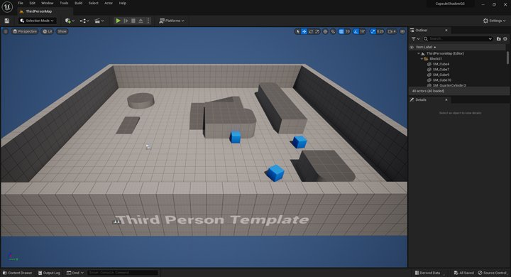
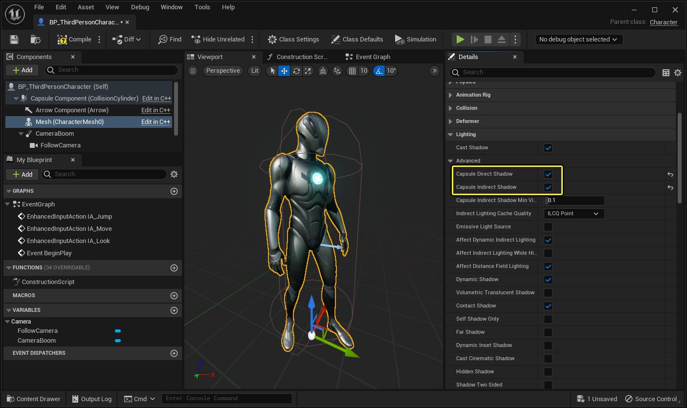

# 胶囊体阴影快速入门

> 路径：虚幻引擎5.7文档 / 构建虚拟世界 / 为场景设置光照 / 阴影 / 胶囊体阴影 / 胶囊体阴影快速入门

> 原始页面：https://dev.epicgames.com/documentation/unreal-engine/capsule-shadows-quick-start-in-unreal-engine

完成本指南后，将得到类似之前所示的场景。

### 目标

"胶囊体阴影快速入门"旨在协助用户快速掌握使用物理资产创建角色的胶囊体代表物和在游戏不同光照环境下 启用角色的胶囊体阴影的基础知识。

### 目的

完成本教程后，开发者将会了解以下知识：

- 创建阴影物理资产的方法。
- 将阴影物理资产指定到骨架网格体的方法。
- 在关卡中启用角色胶囊体阴影的方法。

## 1 - 必要设置

开始前，首先需新建项目，以便在本指南的剩余章节进行操作。 在以下步骤中，将使用虚幻引擎4的项目浏览器创建项目。 完成此步后，便拥有了可在之上构建的未来项目模板。

### 步骤

1. 首先在

   Epic Games Launcher

   中 打开

   虚幻引擎

   。将显示

   项目浏览器

   。
2. 使用 **游戏（Games）** > **第三人称（Third Person）** 模板新建一个项目。请使用以下设置创建：

   - 选择

     蓝图（Blueprint）
   - 选择

     不含初学者内容包（No Starter Content）
3. 点击

   创建项目（Create Project）

   。

### 最终结果

创建项目后，虚幻编辑器完成加载时，将显示下图所示的主编辑器界面。在内容浏览器中， 将显示后续步骤中将使用的蓝图第三人称模板的不同文件夹。

点击查看大图。

在下一步中，将首先设置第三人称角色的新物理资产，其将用于胶囊体阴影。

## 2 - 角色 - 创建阴影物理资产

项目现已准备完毕，在此步骤中将新建第三人称角色骨架网格体的物理资产，其将用于具有胶囊体阴影的阴影代表物。

### 步骤

1. 在 **内容浏览器** 中，使用文件夹层级导航到 **Mannequin** > **Character** > **Mesh** 文件夹。在此可找到名为 **SKMannequin** 的资源，将使用该资源。选中其，然后点击右键，开启快捷菜单。在菜单中选择 **创建** > **物理资产** > **创建**。
2. 点击"创建"后，**新资源（New Asset）** 窗口将打开，以新建物理资产。将 **最小骨骼大小** 设为15，然后点击 **OK**。

   > [!NOTE]
   > 使用长菱形形体才可得到最佳结果。也可使用球形形体，但与骨架网格体同时使用时不够灵活。
3. 接下来，[物理资产工具](../../../../../gameplay-systems/physics/physics-asset-editor/index.md)将会打开，将显示骨架网格体 `SKMannequin` 的新物理资产。
4. 此为可选步骤。继续操作前，建议对新建物理资产进行命名。为此，请最小化PhAT窗口，然后在 **内容浏览器** 中的 **Mesh** 文件夹中找到SKMannequin的物理资产。对其命名以便稍后进行查找（建议使用"SPAMannequin"）。完成此操作后，可重新最大化PhAT窗口。
5. 在PhAT窗口中，需调整各种物理形体，使胶囊体能更准确地代表角色。此操作需删除部分现有形体 ，并缩放和旋转剩余形体以更好适应。以下是调整和删除胶囊体时的注意事项列表：

   - 删除不必要的胶囊体来限制形体数量；例如手、手臂、躯干和颈部的多个胶囊体等。
   - 放置足部胶囊体可使角色看起来脚踏实地，之后可能需进行微调使其更精确。
   - 胶囊体关节间使用些许重叠，以免阴影中出现缝隙。
   - 本快速入门中无需手臂的胶囊体，可将其移除。
6. 完成调整后，应得到与此类似的结果。放置无需完美， 之后可随时进行微调来优化阴影问题。

### 最终结果

角色胶囊体代表的的物理资产已完成，已对新建和设置物理资产， 和使用最少的形体代表角色的过程有所了解。

|  |  |
| --- | --- |
| 之前：21个胶囊体 | 之后：10个胶囊体 |

下一步中将把新物理资产指定到骨架网格体。

## 3 - 角色 - 指定物理资产

现已新建骨架网格体角色的物理资产，将在此步骤中用于在[骨架编辑器](../../../../../animating-characters-and-objects/skeletal-mesh-animation-system/index.md)中进行指定。

### 步骤

1. 在 **内容浏览器** 中，使用文件夹层级导航至 **Mannequin** > **Mesh** 文件夹。选择 **SKMannequin** 资源，双击打开。
2. 骨架编辑器打开后，导航至 **资源细节** 面板，向下滚动并找到 **光照** 选项卡。点击 **阴影物理资产** 旁的选择框，选择上一步中创建的物理资产。

   > [!TIP]
   > 使用"阴影物理资产"选择框时，将在此处列出项目的所有物理资产，因此务必对物理资产进行明确命名。
3. 现在可 **保存** 并 **关闭** 骨架编辑器。

### 最终结果

现在已将上一步中创建的物理资产指定到角色的阴影物理资产插槽。利用此操作，角色可将此物理资产用于阴影目的。

下一步中将把角色添加到关卡，然后启用胶囊体阴影。

## 4 - 关卡 - 启用角色的胶囊体阴影

上一步中已将物理资产作为其阴影物理资产指定到骨架编辑器中的角色。 完成此步后，启用时可使用直接和间接光照区域中的角色胶囊体阴影。

### 步骤

1. 在 **内容浏览器** 中，使用文件夹层级导航至 **ThirdPersonBP** > **Blueprints** 文件夹。选择 **ThirdPersonCharacter** 蓝图，双击打开。
2. 蓝图编辑器打开后，使用 **组件** 窗口，并选择 **网格体（继承）**。然后在 **细节** 面板中，向下滚动并找到 **光照** 选项卡。在高级卷栏下， 找到并启用下列选项：

   - 胶囊体直接阴影
   - 胶囊体间接阴影

   

   点击查看大图。
3. 启用直接和间接光照的胶囊体阴影后，可 **保存** 并 **关闭** ThirdPersonCharacter 蓝图。
4. 全面测试胶囊体阴影前，需先在关卡中创建部分间接光照区域，以使用胶囊体间接阴影。在关卡视口中，选择 **地板** Actor， 然后长按 **ALT** 键并左键点击，沿Z轴（蓝色）向上拖出副本。将地板Actor移动到外墙顶端， 然后使用平移工具上的X轴（红色）将它移回，以部分覆盖地板。重新构建场景的光照时，此操作可提供使用间接光照的区域。
5. 现在，在 **世界大纲视图** 选择名为"Light Source"的 **定向光源**。在其 **细节** 面板中，将光源的 **强度** 设为 10。这样便可确保有足够光线照亮被覆盖的区域。
6. 在主工具栏中点击 **构建** 按钮，重新构建该场景的光照。此操作确保能使用角色的胶囊体间接阴影。

### 最终结果

现在便拥有有在直接和间接光照下支持胶囊体阴影的角色。可在 **编辑器中运行**（PIE），将角色在场景中四处移动，以查看软阴影的效果。

可单独启用两种胶囊体阴影设置，因此如角色在开放区域中被照亮，则无需软阴影。 可禁用此选项，仅启用间接光照区域的胶囊体间接阴影。

最后一步包含部分可尝试的挑战，同时还有创建阴影物理资产的提示。

## 5 - 自行尝试！

现在已创建胶囊体阴影的样本阴影物理资产，可尝试进行以下操作：

- 尝试使用不同光照角度，或一天中不同时间的情景，如中午、黄昏或晚上。
- 调整定向光源的

  光源角度

  柔化间接光照区域中的胶囊体阴影，使角色融入周围阴影。
- 使用门廊和窗户（或类似物体），在洞穴开口添加一些封闭区域，得到高对比的光照，其可在启用

  胶囊体间接阴影

  时提供光源的方向性。
- 在角色的"细节"面板中使用

  胶囊体间接阴影最小可视性

  ，将软阴影的强度与环境混合。
- 添加角色手臂的部分额外胶囊体，使其在靠近墙壁表面（例如在掩体系统下）或角色俯卧时产生阴影。

欲了解虚幻引擎的更多功能，请参阅：

- 胶囊体阴影的相关信息，参见

  胶囊体阴影

  。
- 欲了解物理资产工具的相关信息，参见

  物理资产工具

  。
- 欲了解光照的相关信息，参见

  为场景设置光照

  。
