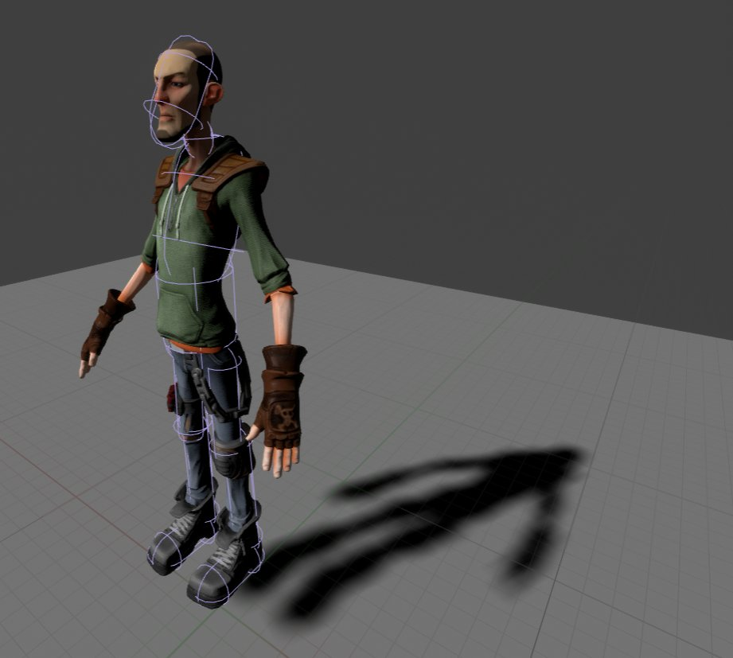
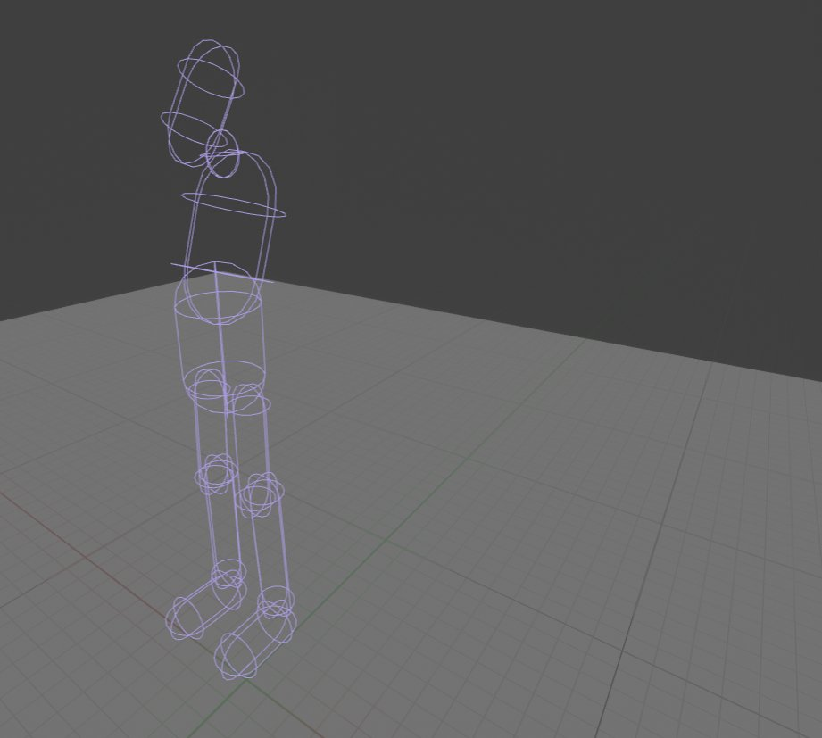
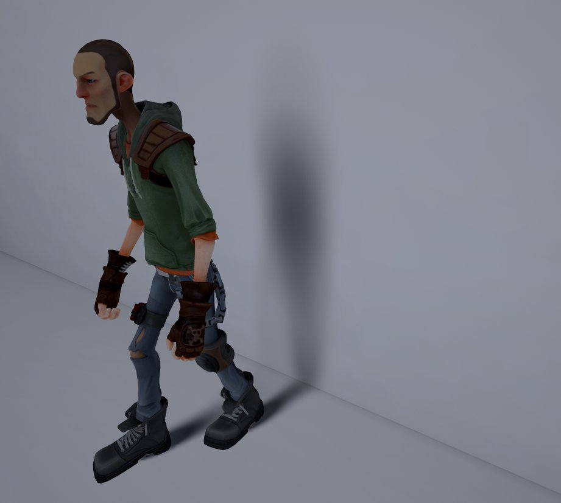
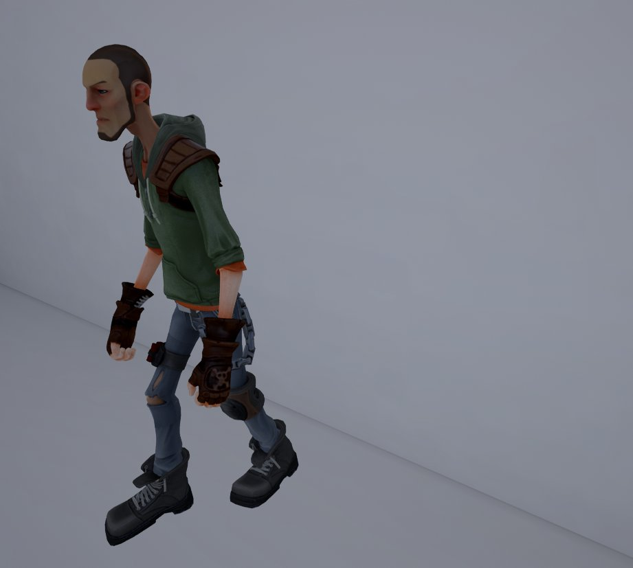
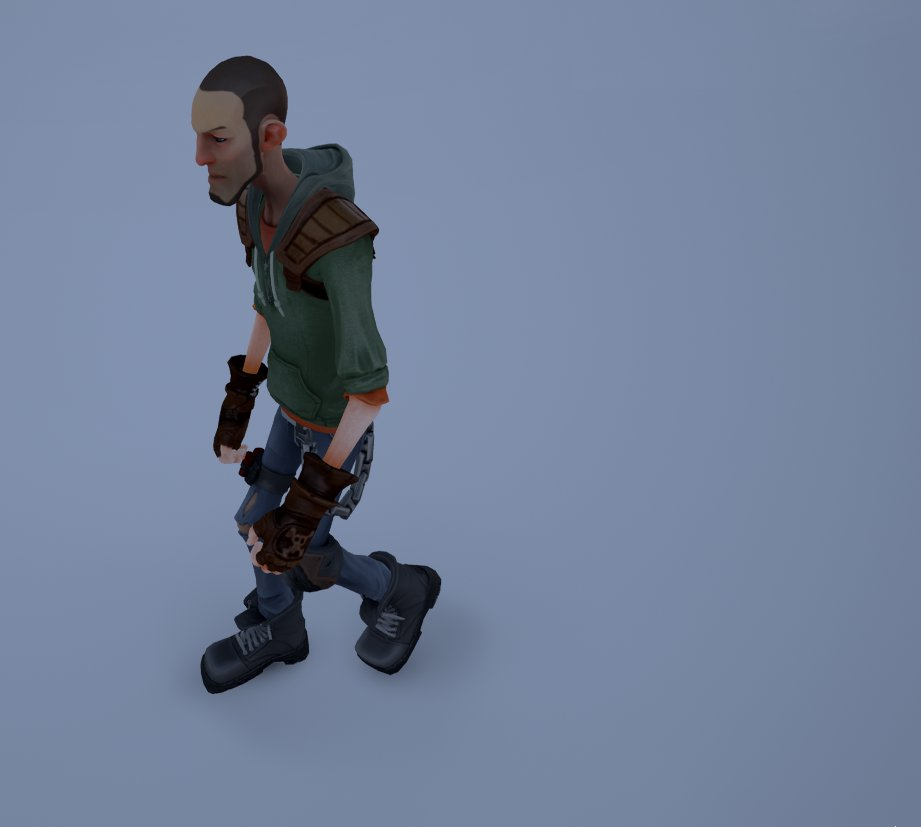
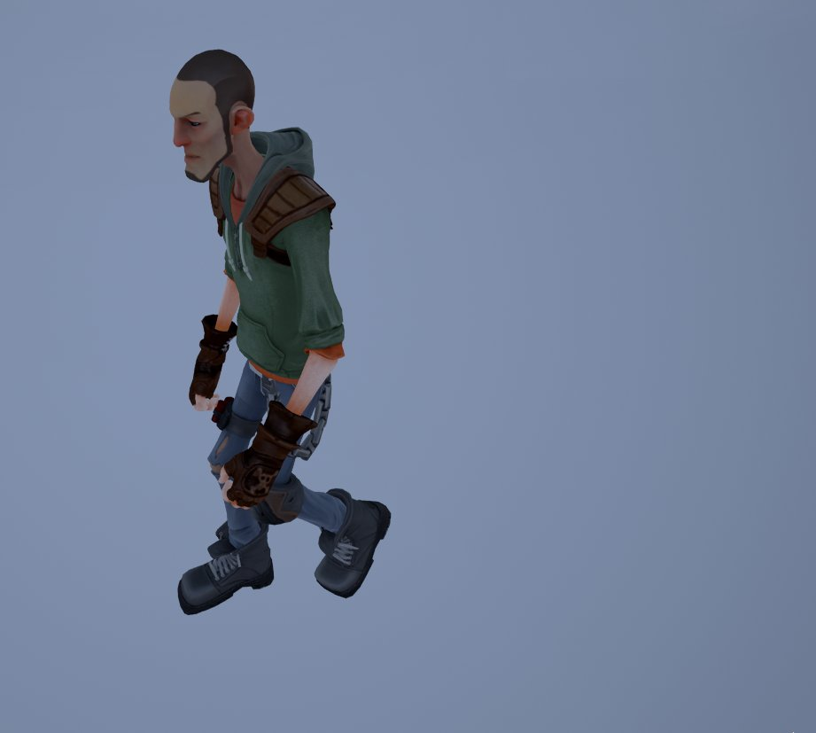
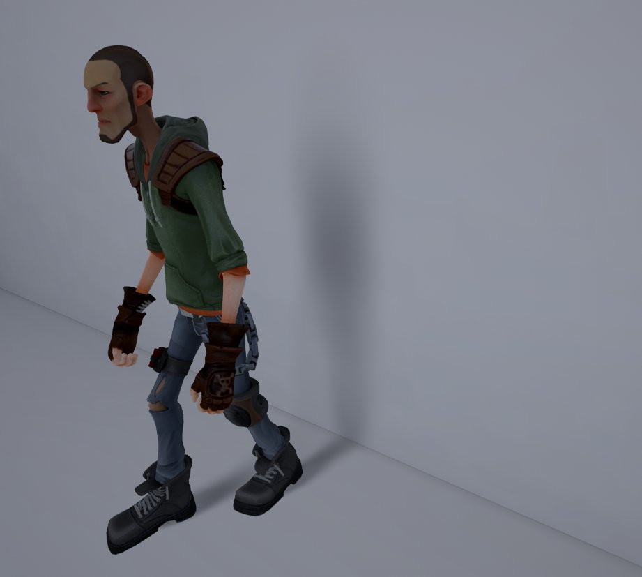

# 胶囊体阴影

> 路径：虚幻引擎5.7文档 / 构建虚拟世界 / 为场景设置光照 / 阴影 / 胶囊体阴影

> 原始页面：https://dev.epicgames.com/documentation/unreal-engine/capsule-shadows-overview-in-unreal-engine

虚幻引擎 支持角色通过 **胶囊体阴影**，使用物理资源中的骨架网格体胶囊体代表，在光照区域内投射柔和阴影。这种投影方法能使在场景中的角色拥有柔和区域投影，尤其在间接光照区域。传统阴影映射技术无法实现此效果。

## 角色胶囊体代表

[物理资源](../../../../gameplay-systems/physics/physics-asset-editor/index.md)用于创建合适的角色代表，以支持极为柔和的阴影。由于胶囊附于角色骨骼， 因此可在场景中精确移动和投射阴影。

使用胶囊体代表的角色

仅胶囊体代表

> [!NOTE]
> 物理资源视口中的地面阴影并非胶囊体阴影的代表。

## 使用

打开骨架网格体，在 **资源细节（Asset Details）** 面板中，使用 **阴影物理资源（Shadow Physics Asset）** 选项指定要用于胶囊体阴影的物理资源。

## 胶囊体阴影设置

| 属性 | 说明 |
| --- | --- |
| **胶囊体直接阴影（Capsule Direct Shadow）** | 将胶囊体代表指定到骨架网格体的阴影物理资源插槽时，利用此属性，直接（可移动）光源可产生柔和阴影。 |
| 胶囊体间接阴影（Capsule Indirect Shadow） | 将胶囊体代表指定到骨架网格体的阴影物理资源插槽时，利用此属性，预计算光照（光照贴图和天空光照）可产生柔和阴影。 |
| **胶囊体间接阴影最低可见度（Capsule Indirect Shadow Min Visibility）** | 美术师可利用此属性控制间光照区域内胶囊体阴影的明暗度。 |

### 胶囊体间接阴影

启用 **胶囊体间接阴影（Capsule Indirect Shadow）** 后，将基于光照构建时放置和计算的[体积光照采样](../../global-illumination/indirect-lighting-cache/index.md)， 使用角色的胶囊体代表投射定向柔和阴影。胶囊体间接阴影可使角色在间接光照区域中拥有真实着地的感觉，而传统阴影映射则效果欠佳。

启用胶囊体间接阴影后，角色将投射柔和阴影，在仅有反射光照的区域中呈现出真实落地的感觉。

Capsule Indirect Shadow Enabled

Capsule Indirect Shadow Disabled

在光源仅为天空光照的空旷区域，由于光线来自四面八方，因此几乎无方向性。使用预计算光照时，角色下方 将产生微妙柔和的"团状"阴影。

Indirect Capsule Shadows Enabled

Indirect Capsule Shadows Disabled

在光线透过开口射入的密闭空间内，[间接光照缓存](../../global-illumination/indirect-lighting-cache/index.md)将向胶囊体阴影提供 方向性和柔和性。原理是角色在空间中移动时在放置的体积光照范例间插值。在门口的角色阴影强度稍弱，几乎无方向性；随着角色逐渐远离门口， 阴影的强度和方向性均会增加。

#### 间接最小阴影可见度

美术师可通过调整 **胶囊体间接阴影最小可见度（Capsule Indirect Shadow Min Visibility）** 进一步控制效果。利用此属性可调整间接光照区域中胶囊体阴影的明暗度（使用预计算光照）。此操作可有效减少此类区域中胶囊体的自身阴影，或柔化阴影的强度，使其与周围的阴影进行较好的混合。

Capsule Shadow Indirect Min Visibility:0.1 (Default)

Capsule Shadow Indirect Min Visibility:0.45

### 胶囊体直接阴影

在光源上启用 **胶囊体直接阴影（Capsule Direct Shadow）** 后，可基于光照角度或光源大小，定义阴影投射物在阴影接收处的区域投影柔和度。

> [!TIP]
> 直接光照的胶囊体阴影应用作可延展性选项，开销低于将高细节多边形骨架网格体渲染到阴影贴图。若需更多信息，直接参阅下方章节，了解光源所需的特定移动性。另请参阅下方"限制"章节。

#### 光源角度

对于定向光源，可使用 **光源角度（Source Angle）** 属性指定太阳的角度（以度计）来柔和阴影。

> [!NOTE]
> 启用 **胶囊体直接阴影（Capsule Direct Shadow）** 后，此属性适用于所有光源移动性（静态、固定和可移动）。

> 图片已省略：Light Source Angle:1.0 (Default)

> 图片已省略：Light Source Angle:2.0

Light Source Angle:1.0 (Default)

Light Source Angle:2.0

#### 光源半径

对于聚光源和点光源，**光源半径（Source Radius）** 将设置光源发射光照的大小；光源越大，阴影越柔和，光源越小，阴影接触越硬。

> [!NOTE]
> 胶囊体直接阴影要求将光源移动性设为 **静止（Stationary）**，且需在光源的 **光源半径（Source Radius）** 生效前构建场景的光照。

> 图片已省略：Source Radius:5.0

> 图片已省略：Source Radius:15.0

Source Radius:5.0

Source Radius:15.0

> [!NOTE]
> 构建场景的光照后，即可调整 **光源半径（Source Radius）** 属性，而无需重新构建光照。此属性只会影响启用了胶囊体阴影或网格体距离场的可移动Actor。

## 性能

胶囊体阴影的GPU性能开销与以下因素成正比：使用的胶囊体数量、角色数量，以及受其阴影影响的画面尺寸。

例如，使用1080p的Radeon 7870：

| 10个胶囊体的GPU开销 | 时间（以毫秒计） |
| --- | --- |
| **屏幕上的单个角色（A single character on screen）** | 0.29 ms |
| **屏幕上的各额外角色（Each additional character on screen）** | 0.05 ms |

此实现十分有效，因为它通过感知深度的上采样以半分辨率计算阴影；同时使用画面平铺剔除，使投影量控制在需要的范围内。

## 限制

- 由于平铺延迟实现使用计算着色器，需要配备DirectX 11。
- 目前不支持可移动点光源和聚光源。
- 任意网格体形状可能存在自阴影瑕疵。
- 胶囊体代表仅可使用长菱体和球体。
- 胶囊体阴影变得十分柔和并成为环境光遮蔽后，阴影中的瑕疵将导致出现硬线条。
- 由于使用可移动点光源和聚光源将对象移出整个场景阴影，并逐对象投影的开销较高，因此目前不支持这两类光源。静止光源固定为逐对象投影法，建议使用胶囊体直接阴影进行更快阴影渲染。
