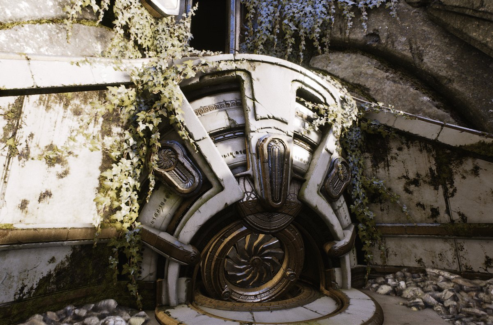
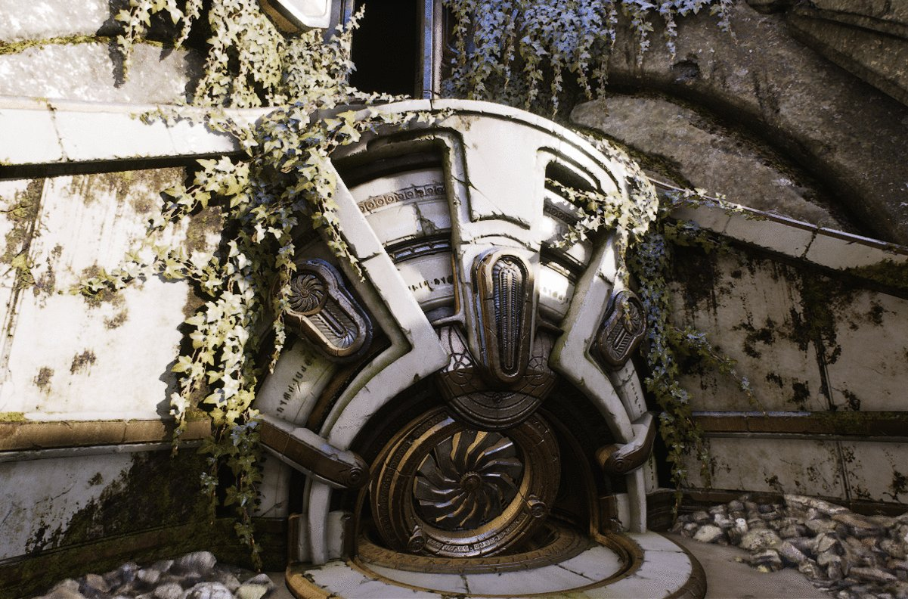
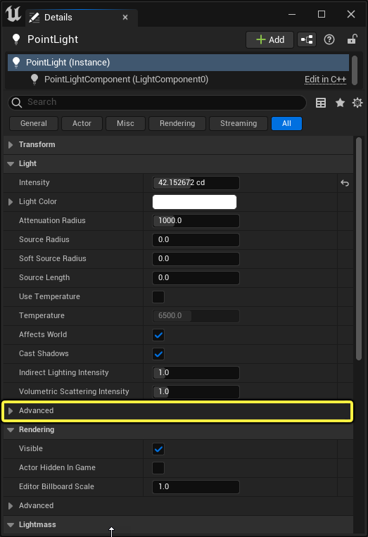
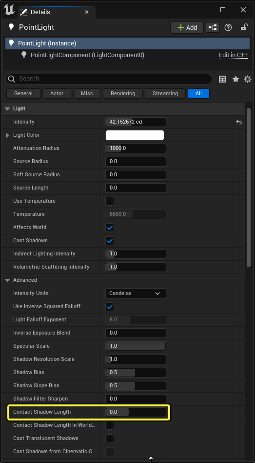

# 接触阴影

> 路径：虚幻引擎5.7文档 / 构建虚拟世界 / 为场景设置光照 / 阴影 / 接触阴影

> 原始页面：https://dev.epicgames.com/documentation/unreal-engine/contact-shadows-in-unreal-engine

为应用程序创建场景和角色时，有时需添加渲染的视觉深度。 添加 **接触阴影** 是改善场景视觉深度和保真度的有效方法。 因为提供了一个更为准确的阴影近似， 实现其他阴影算法难以达到的波状外形阴影。

## 为角色添加细节

为给定 [点光源](../../light-types-and-their-mobility/point-lights/index.md) 启用接触阴影的一个使用情况是为角色渲染一个额外的细节级别（LOD）。 下图较好地展示了接触阴影为角色增添的效果。从右至左拉动比对滑条时， 您将注意到启用接触阴影的点光源半径中的角色上有更多额外细节， 而接触阴影关闭时则没有这些细节。

Contact Shadow Off

Light's Contact Shadow Length = 0.1

开启接触阴影后，渲染器便会以逐光源基础执行逐像素屏幕空间算法。 这意味着接触阴影算法是执行光计算通道， 执行场景深度渲染光线行进， 以确定被查询的像素是否将从启用接触阴影的点光源处进行遮蔽。

## 带接触阴影的场景

启用接触阴影的另一个使用情况：如果材质的像素着色器只支持一个灯光， 则无需计算其中的视差遮蔽映射阴影。 下图展示了启用和未启用接触阴影的视差遮蔽映射材质之间的对比。

> [!NOTE]
> 需注意：视差遮蔽映射材质应输出像素深度偏移。

以下是接触阴影与视差遮蔽映射材质进行交互的实例。

两个光源上的接触阴影长度为 0.1。

## 启用接触阴影

点光源上的接触阴影默认已禁用，因此点光源的接触阴影长度被初始化为 0。 启用接触阴影需要执行以下步骤：

1. 首先将一个 **点光源** 拖入场景。
2. 点击新建点光源组件的展开箭头，展开 **Details** 面板的 **Light** 部分。

   

   点击查看全图。
3. 将 **Contact Shadow Length** 设为大于零的值即可启用接触阴影。

   

   点击查看全图。

将接触阴影的长度设为大于零的值后，渲染器将通过场景的深度缓存从像素的位置到光源进行光线追踪。 举一个典型的例子来说，将接触阴影长度的最大值设为 1，此处的 1 则代表光线遍历整个屏幕。 而将接触阴影长度的值设为 0.5 则意味着光线遍历半个屏幕。 注意：场景深度缓存中的获得的采样将保持不变，意味着增加接触阴影的长度时将出现更多噪点（穿帮）。 长度为 0.75 的接触阴影比长度为 0.1 的接触阴影生成的噪点更多。
