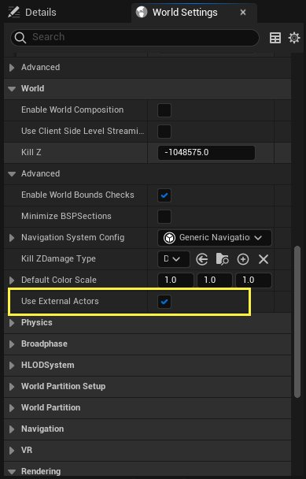
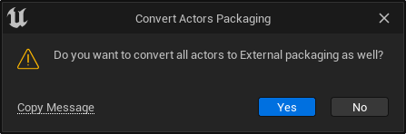
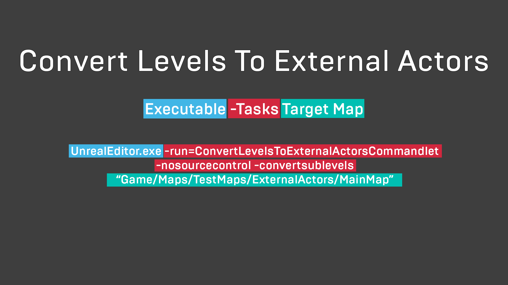
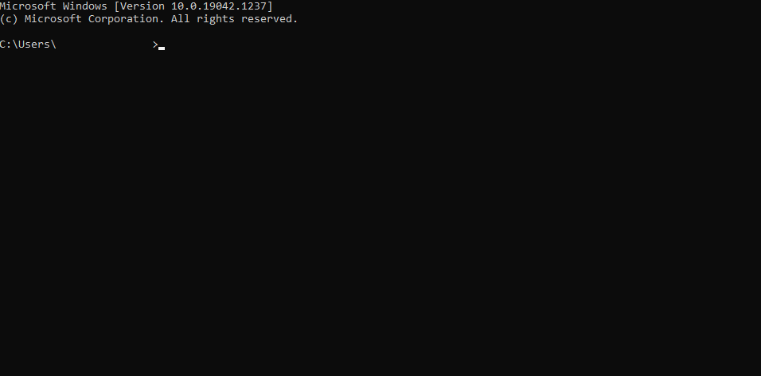
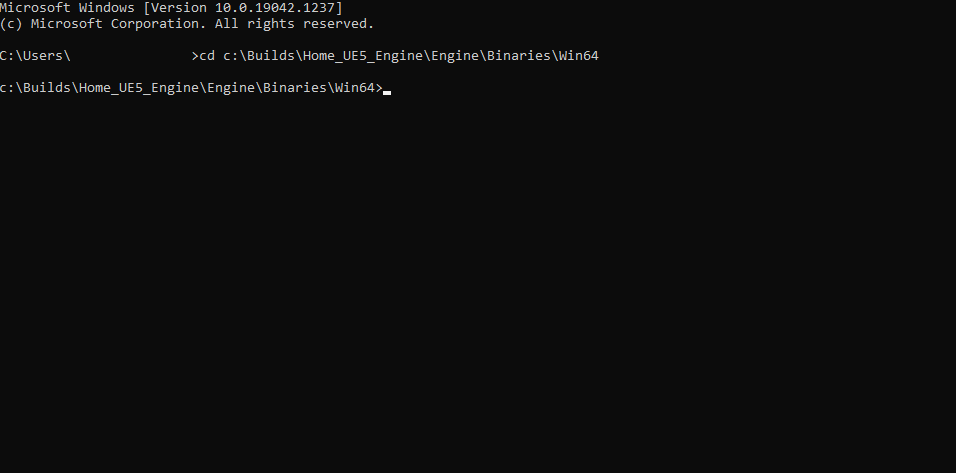
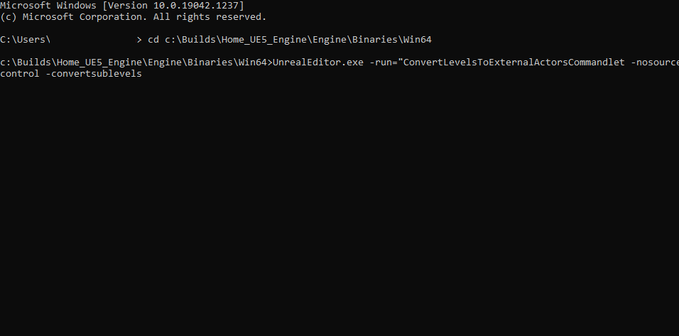
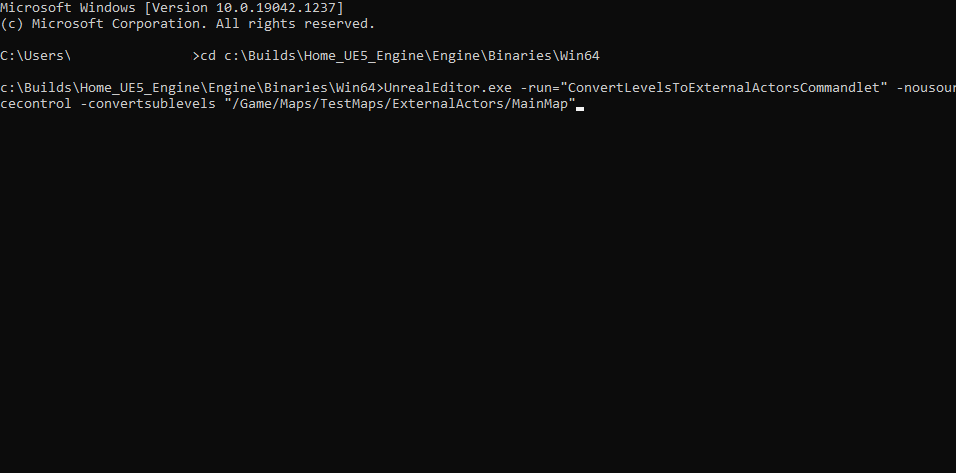
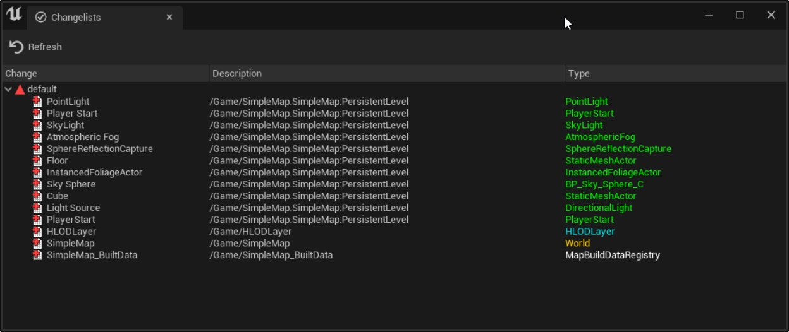

# 一Actor一文件

> 路径：虚幻引擎5.7文档 / 构建虚拟世界 / 一Actor一文件

> 原始页面：https://dev.epicgames.com/documentation/unreal-engine/one-file-per-actor-in-unreal-engine

在之前的虚幻引擎版本中，要更改关卡中的一个或多个Actor，必须从源控制中检出文件。在你完成工作之前，其他团队成员访问不了该文件；这样会导致开发流程速度变慢，因为一次只有一个人员可以处理该文件。

**一Actor一文件（One File Per Actor，简称OFPA）** 可以将Actor实例的数据保存到外部文件中，更改Actor时不再需要保存主关卡文件，从而减少用户之间的重叠。

> [!NOTE]
> "一Actor一文件"功能仅在编辑器中可用。在烘焙时，所有Actor都嵌入到各自的关卡文件。

## 启用"一Actor一文件"

使用[世界分区](../world-partition/index.md)时，默认启用"一Actor一文件"。要在非分区世界中启用OFPA，请执行以下操作：

为一个关卡启用OFPA。

1. 在主菜单中，找到

   窗口（Window）> 世界设置（World Settings）

   ，打开 **世界设置（World Settings）面板。
2. 在面板中找到

   世界（World）

   分段，点击

   使用外部Actor（Use External Actors）

   旁边的复选框。
3. 引擎将询问你是否要将所有Actor转换为外部打包模式。点击 **是（Yes）** 完成OFPA转换。

   

   点击"是（Yes）"以转换关卡中的所有Actor。
4. 保存关卡。

## 转换子关卡

务必要注意，当你为关卡激活 **使用外部Actor（Use External Actors）** 选项时，只有当前关卡会转换为OFPA。要转换子关卡，你必须将其加载并为其启用 **使用外部Actor（Use External Actors）** ，如上所述。如果你的关卡包含多个子关卡，这样做可能会出现问题，你可以使用Commandlet自动转换关卡及其子关卡。

Commandlet的详细讲解。

请按照下面的步骤使用此Commandlet：

1. 打开命令提示符窗口。

   
2. 在提示符处，找到 **UnrealEditor.exe** 文件的位置。例如：`C:\Builds\Home_UE5_Engine\Engine\Binaries\Win64` 。

   
3. 接下来，开始输入命令。先键入将运行该Commandlet的

   .exe

   文件的名称，即

   UnrealEditor.exe

   。
4. 添加Commandlet的名称和以下参数：

   - -run="ConvertLevelsToExternalActorsCommandlet"

     是Commandlet的名称。
   - -nosourcecontrol

     将告知Commandlet不使用源码控制。
   - -convertsublevels

     将告知Commandlet转换贴图可能拥有的所有子关卡。

   
5. 使用关卡位置完成命令：`"/Game/Maps/TestMaps/ExternalActors/MasterMap"` 在此示例中， **Game** 是项目名称， **MainMap** 是你希望转换的贴图的名称。

   
6. 按

   Enter

   键运行Commandlet。它会将关卡和所有子关卡转换为OFPA。

## 将OFPA用于源码控制

在你的源控制应用程序中工作时，你会注意到外部Actor文件名称已编码。要解决此问题，你可以在提交之前使用 **查看变更列表（View Changelist）** 窗口查看和验证变更列表的内容。

使用OFPA的关卡的现有变更列表。

此窗口将显示现有更改列表以及列表包含的文件。对于外部Actor，你可以看到Actor名称、关卡路径和资产类型，而不是编码的文件名。

在编辑器中内置变更列表支持的情况下，你可以先验证变更列表的内容，然后再将其提交到源码控制。这是必须执行的操作，因为OFPA给项目带来了更多的复杂性。例如，用户可能检出多个文件，但只提交了其中的一部分，可能会导致出现悬空的引用。

如需详细了解如何在虚幻引擎中使用源码控制，请参阅"编辑器中的源码控制"。

> [!TIP]
> 使用OFPA时，内容和Actor文件应该从编辑器中提交到源码控制。

> [!NOTE]
> 仅当使用Perforce作为源码控制提供程序时，才会提供变更列表支持。
