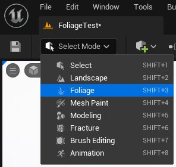
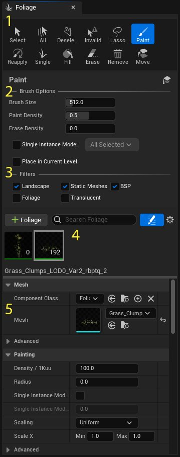
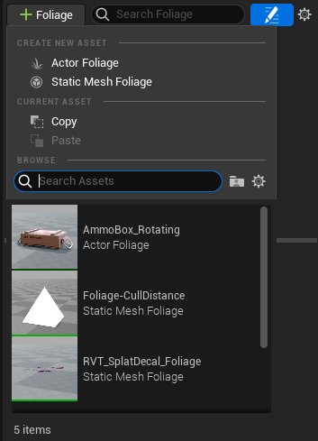
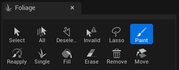
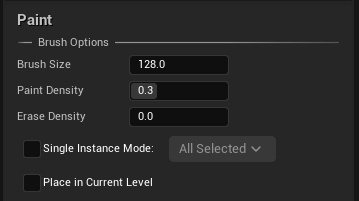
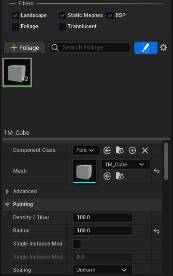
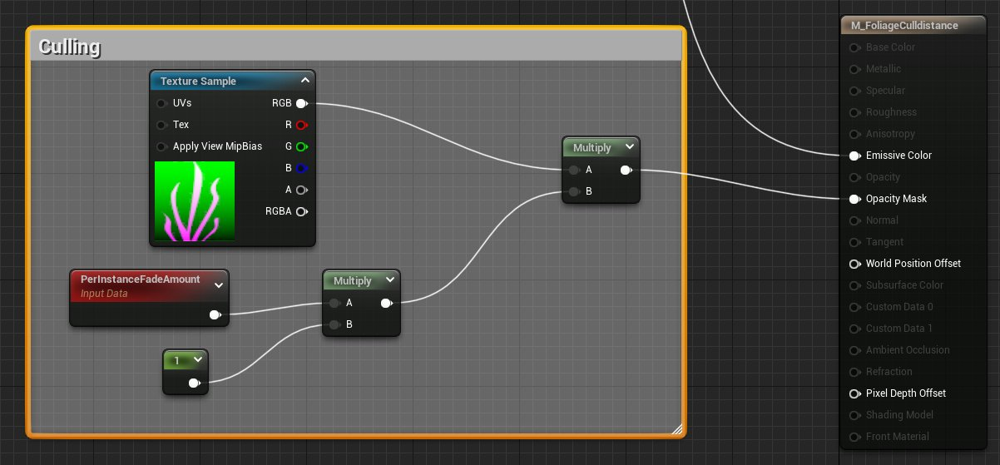
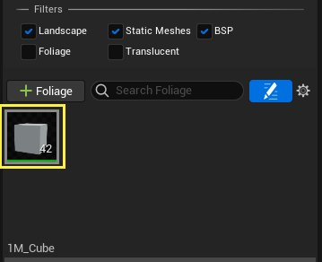

# 植被模式

> 路径：虚幻引擎5.7文档 / 构建虚拟世界 / 开放世界工具 / 植被模式

> 原始页面：https://dev.epicgames.com/documentation/unreal-engine/foliage-mode-in-unreal-engine

**植被模式（Foliage Mode）** 允许你在经过筛选的Actor和几何体上批量绘制或擦除 **静态网格体（Static Meshes）** 或 **Actor植被（Actor Foliage）** 。借助此模式，你可以在大型户外场景中填充植被。

> 图片已省略：植被小屋

植被是为户外场景快速添加细节的一种好方法。

> [!NOTE]
> **植被（Foliage）** 工具的实际操作，请参阅 **地形内容示例（Landscapes Content Examples）** 项目中的 **植被（Foliage）** 部分。

## 植被编辑模式

要使用 **植被（Foliage）** 工具，请点击 **模式（Modes）** 下拉菜单中的 **植被（Foliage）** 选项（**Shift+3**）。

点击查看大图

这将打开 **植被（Foliage）** 面板。

### 植被模式面板

点击查看大图

| **数字** | **说明** |
| --- | --- |
| **1** | 工具控制板 |
| **2** | 笔刷选项 |
| **3** | 筛选器选项 |
| **4** | 植被控制板 |
| **5** | 植被细节 |

### 植被类型

点击查看大图

打开 **添加植被类型（Add Foliage Type）** 下拉菜单后可以添加以下内容：

| **植被类型** | **说明** |
| --- | --- |
| **Actor植被（Actor Foliag）** | 一种植被类型，可以将蓝图或原生Actor的实例放在场景中。高密度的植被可能会导致性能问题。 |
| **静态网格体植被（Static Mesh Foliage）** | 一种使用网格体实例化的植被类型。该类型最适合用于非破坏性植被。 |

使用植被编辑模式放置的静态网格体会自动分组，并使用硬件实例化渲染。其中，许多实例只需一次绘制调用。而Actor植被的渲染开销与场景中普通的Actor的相同。

## 使用植被模式

植被模式是一组工具，可以直接在地形或其他启用筛选器的Actor上绘制植被。

### 植被工具

点击查看大图

| **工具** | **说明** |
| --- | --- |
| **选择（Select）** | 选择单独的植被实例。你可以按住 **Ctrl** 键来选择多个植被网格体。 |
| **全部（All）** | 选择所有植被实例。 |
| **取消选择（Deselect）** | 清除当前选中项。 |
| **无效（Invalid）** | 选择所有无效的植被实例。 |
| **套索（Lasso）** | 在使用笔刷绘制时，选中所有与当前所选植被类型相同的植被实例。 |
| **绘制（Paint）** | 绘制所选植被类型的实例。在绘制时按住 Shift 键来擦除所选植被类型的实例。 |
| **重新应用（Reapply）** | 有选择地调整场景中植被实例的参数。按如下所示使用： 选择"重新应用（Reapply）"工具，然后在网格体列表中选择你想将更改应用于的植被类型。 在"植被细节（Foliage Details）"分段中，做出更改。 将更改绘制到关卡中的植被实例上。 |
| **单个（Single）** | 绘制所选植被类型的单个实例。 |
| **填充（Fill）** | 向所选目标填充植被实例。 |
| **擦除（Erase）** | 在使用笔刷绘制时擦除所选植被类型。 |
| **删除（Remove）** | 删除所选植被实例。 |
| **移动（Move）** | 将所选植被实例移至当前关卡。 |

### 笔刷选项

**笔刷选项（Brush Options）** 的显示内容取决于当前情景，可能包含一个或多个选项：

点击查看大图

| **选项** | **说明** |
| --- | --- |
| **笔刷大小（Brush Size）** | 调整植被笔刷大小。 |
| **点密度（Point Density）** | 调整所选工具所影响的植被的密度。这是所选植被类型细节中 **密度（Density）** 属性的乘数。 |
| **擦除密度（Erase Density）** | 调整在按住 **Shift** 键擦除时留下的植被密度。 |
| **单实例模式（Single Instance Mode）** | 启用该选项后，在光标位置处绘制单个植被实例。可以在两种模式下使用： **所有选中项（All Selected）** ：放置所有选定植被类型的单个实例。 **在选中项中循环（Cycle Through Selected）** ：循环放置每个所选植被类型的单个实例，每次点击鼠标时仅放置一个类型。 |
| **放置在当前关卡中（Place in Current Level）** | 启用该选项后，将所选植被类型的实例放置在当前关卡中。否则，将所选植被类型的实例放置在包含正绘制该网格体或Actor的关卡中。 |

### 筛选器设置

在"筛选器（Filters）"分段中，你可以控制选中的工具会影响哪片区域，以及当前哪些植被类型处于活跃状态。这也是添加新植被类型的位置。

点击查看大图

| 选项 | 说明 |
| --- | --- |
| 地形（Landscape） | 将所选植被类型放置到地形上。 |
| 静态网格体（Static Mesh） | 将所选植被类型放置到静态网格体上。 |
| BSP | 将所选植被类型放置到BSP几何体上。 |
| 植被（Foliage） | 将所选植被类型放置到其他阻挡植被几何体上。 |
| 半透明（Translucent） | 将所选植被类型放置到半透明几何体上。 |
| 网格体列表（Mesh List） | 列出了所有用作植被的静态网格体和Actor植被。 将鼠标指针移到植被类型上时会显示一个复选框，允许你启用或禁用该植被类型。 当你选中一种或多种植被类型后，会在"网格体列表（Mesh List）"区域下方的"植被细节（Foliage Details）"中显示其细节。 |
| 植被细节（Foliage Details） | 显示所选植被类型的细节的区域。包含各种属性，用于自定义静态网格体或Actor植被的行为。 |

有关将植被类型添加到网格体列表的更多信息，请参阅[将植被添加到地形Actor](#%E5%B0%86%E6%A4%8D%E8%A2%AB%E6%B7%BB%E5%8A%A0%E5%88%B0%E5%9C%B0%E5%BD%A2actor)

### 剔除设置

植被实例会作为一个集群，在单次绘制调用中渲染；每个植被集群会基于遮挡关系决定是否渲染。植被细节面板中的 **剔除距离（End Cull Distance）** 参数可以调整超出多少距离后群集被剔除。但是，这有可能导致网格体组在整个集群超出范围时突然消失。

要缓解这一情况，可以添加 **开始剔除距离（Start Cull Distance）** 参数，然后相应设置材质。在顶点着色器中，会为每个实例计算一个过渡系数，范围是1.0（开始距离）到0.0（结束距离）。你可以在材质中通过 **PerInstanceFadeAmount** 节点来访问该系数。通过将它连到一个不透明度或遮罩值，你可以让植被实例在一段距离内逐渐消失，而不是在达到 **剔除距离结束（Cull Distance End）** 时突然消失。降低 **FadeMultiplier** 能提高过渡的速度。值为0时，植被在任何距离都不可见。

在下面的材质示例中，我们将材质遮罩与一个过渡系数，以便植被网格体的叶子逐渐稀疏，直至完全消失。

点击查看大图

> [!NOTE]
> Nanite网格体不受剔除距离和消退的影响。

### LOD设置

植被支持使用静态网格体LOD，但有一些注意事项：

- 静态网格体的"元素（Elements）"数组（在

  LOD0

  下可见）中只能有一个条目。
- 不同级别的LOD会共享相同的光照贴图和阴影贴图，因此所有LOD都需要使用相同的展开方式。
- 目前，实例集群会作为一个整体来切换LOD。未来我们可能会让实例实现单独的LOD切换。

### 光照

Lightmass会根据每个实例的具体需求，分别生成阴影贴图和光照贴图。在预计算批次（precomputed batch）中，这些贴图会平铺在一起。你需要仔细检查下静态网格体上的一些设置，才能使预计算光照在实例化植被上获得较好的效果。在为实例化网格体生成阴影贴图时，Lightmass的容错率往往比较低。如果设置不对，可能导致在网格体在重新构建光照后变成一片黑。

- 光照贴图坐标索引（Light Map Coordinate Index）

  ：必须使用一个有效的UV通道——有一个唯一的UV展开。静态网格体编辑器的

  生成唯一UV（Generate Unique UVs）

  功能（可从"窗口（Window）"菜单访问）允许你快速生成一个唯一UV展开。
- 光照贴图分辨率（Lightmap Resolution）

  ：这个数字必须足够小，这样单个集群中实例的所有阴影贴图（默认为100个）都可以平铺到一起，而且不超过最大纹理分辨率（4094x4096）。

### 植被可扩展性

植被静态网格体可以使用"可扩展系统"来增减当前渲染的植被实例数数量

要在项目中使用此功能：

1. 找到 **植被网格体列表（Foliage Mesh List）** 并选择一种 **植被类型** 。

   
2. 在 **植被细节（Foliage Details）** 中，找到 **可扩展性（Scalability）** 分段。

   > 图片已省略：Foliage Scalability Settings
3. 选中 **启用密度缩放（Enable Density Scaling）** 的复选框。

   > 图片已省略：Enable Density Scaling

现在你可以使用命令 `foliage.DensityScale` 控制运行时期间所渲染的植被的密度。

你可以在下方看到，随着 `foliage.DensityScale` 设置设为0.1、0.2、0.3、0.4、0.5、0.6、0.7、0.8、0.9、1.0，植被的密度也相应发生变化。

拖动滑块，在0.1到1.0的范围内调整foliage.DensityScale设置。

### 将植被用于世界分区

在世界分区贴图中，植被实例的默认网格大小为256米。这与世界分区网格大小是独立的。

要更改新贴图的实例化植被网格的默认大小：

> 图片已省略：Project Settings Foliage Instance Grid Size

点击查看大图

1. 打开

   编辑（Edit）

   菜单，选择

   项目设置（Project Settings）

   选项，从而打开项目设置。
2. 在搜索框中，搜索

   Foliage

   。
3. 将

   实例化植被网格大小（Instanced Foliage Grid Size）

   的值更改为所需的值，以厘米为单位。在上述示例中，25600厘米等于256米。

你可以使用 **世界分区构建器命令（World Partition Builder Commandlet）** 更改现有贴图的默认网格大小：

> 图片已省略：Foliage Grid Size Commandlet

点击查看大图

要更改植被实例的默认网格大小：

1. 在Windows中，打开"命令提示符"窗口。

   > 图片已省略：Windows Command Prompt
2. 在提示符中，首先找到 `UnrealEditor.exe` 可执行文件。在上述示例中：`c:\Builds\Home_UE5_Engine\Engine\Binaries\Win64`。

   > 图片已省略：Begin the command line with the executable
3. 然后，在命令开头提供将要运行该命令的.exe文件的名称，即

   UnrealEditor.exe

   。
4. 添加项目的名称。此处为 `QAGame` 。

   > 图片已省略：Add Project Name
5. 添加目标地图的名称。

   > 图片已省略：Add Target Map
6. 在命令末尾添加命令的名称和以下参数：

   - -run=WorldPartitionBuilderCommandlet

     是命令的名称。
   - -Builder=WorldPartitionFoliageBuilder

     是命令中构建器的名称。
   - -NewGridSize

     是实例化植被网格的新值，以厘米为单位。在该示例中，值51200等于512米。

   > 图片已省略：Finish the Command Line
7. 按

   Enter

   键，命令将更改指定贴图的植被实例网格设置。

## 将植被添加到地形

在地形Actor上绘制一种或多种植被，是为户外场景快速添加细节的绝佳方式。

> 图片已省略：Foliage Landscape Painting

点击查看大图

1. 如果你的关卡尚无地形Actor，请首先创建一个新的地形Actor。隆起一些绵延起伏的山丘。有关创建和处理地形Actor的更多信息，请参阅《地形快速入门指南》。

   > 图片已省略：Add Landscape Actor
2. 打开

   模式（Modes）

   下拉菜单，选择

   植被（Foliage）

   模式。你也可以使用热键

   Shift + 3

   。
3. 在 **内容侧滑菜单（Content Drawer）** 中，找到你想用作植被类型的静态网格体，例如这个 **静态网格体立方体（Static Mesh Cube）** 。点击 **内容侧滑菜单（Content Drawer）** 中的 **静态网格体（Static Mesh）** ，将其拖入 **植被（Foliage）** 面板中的 **网格体列表（Mesh List）** 。

   > 图片已省略：Drag Static Mesh from Content Drawer to Mesh List
4. 选择 **绘制（Paint）** 工具。将 **笔刷选项（Brush Options）** 中的 **笔刷大小（Brush Size）** 调整为 **128**。将 **笔刷密度（Paint Density）** 调整为 **0.3** 。

   > 图片已省略：Adjusting Foliage Paint Setting
5. 选择 **网格体列表（Mesh List）** 中的 **静态网格体（Static Mesh）** 。在 **植被细节（Foliage Details）** 的 **绘制（Painting）** 分段下，将 **半径（Radius）** 值更改为 **100**。在该示例中，这样做可确保将在地形上绘制的立方体实例不会重叠。
6. 接下来，将 **比例X（Scale X）** 的 **最小值（Min）** 调整为 **0.4** ，并将 **最大值（Max）** 调整为 **0.8** 。这将在绘制植被时带来大小的一些变化。
7. 在视口中，点击并按住 **LMB** 以在整个 **地形（Landscape）** 中绘制植被。

   > 图片已省略：Foliage Landscape Painting

## 重新绑定植被实例

有些时候，植被实例可能需要脱离它的底层组件。例如，有时植被本身没有问题，但我们需要调整它底下的地形。

要将植被重新绑定底下的组件，请执行以下步骤：

1. 在植被模式下，选择你想重新绑定的植被实例。
2. 在视口中，将所选实例移到目标组件上方。
3. 按

   End

   键，将植被对齐到地面。这会将目标组件重设为植被实例的父节点。如果植被最初用

   对齐法线（Align to Normal）

   模式放置，植被还会基于组件的法线对齐到组件。该设置位于植被类型的"细节（Details）"的

   放置（Placement）

   分段中。
