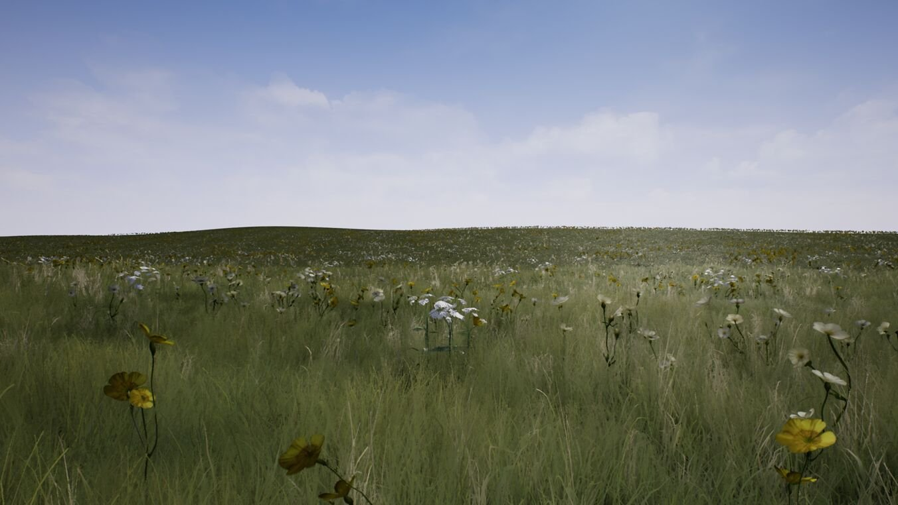
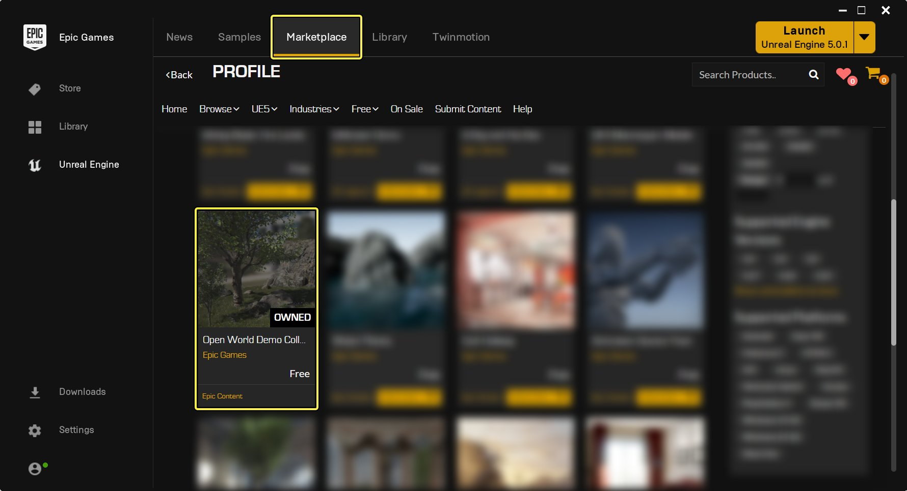
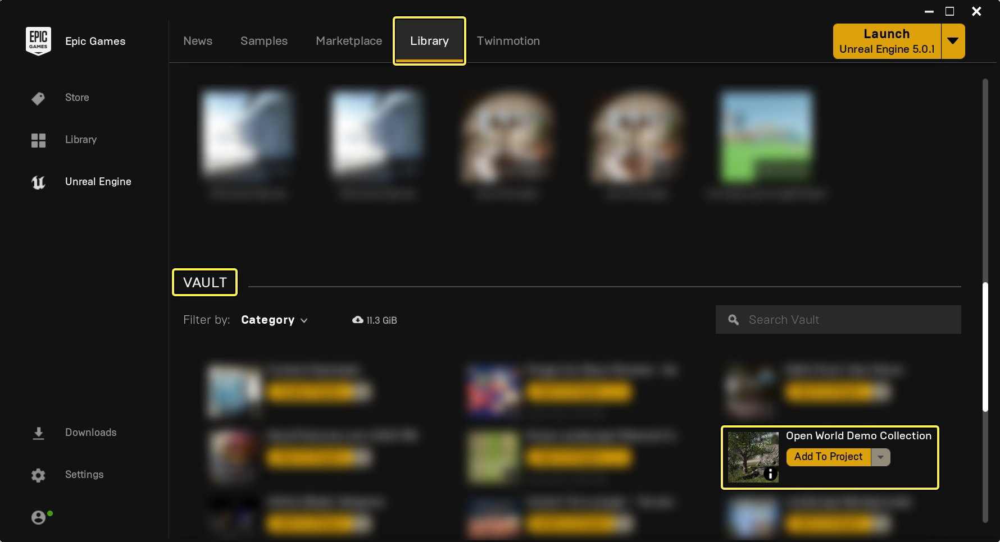
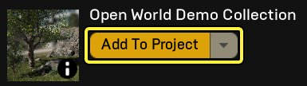
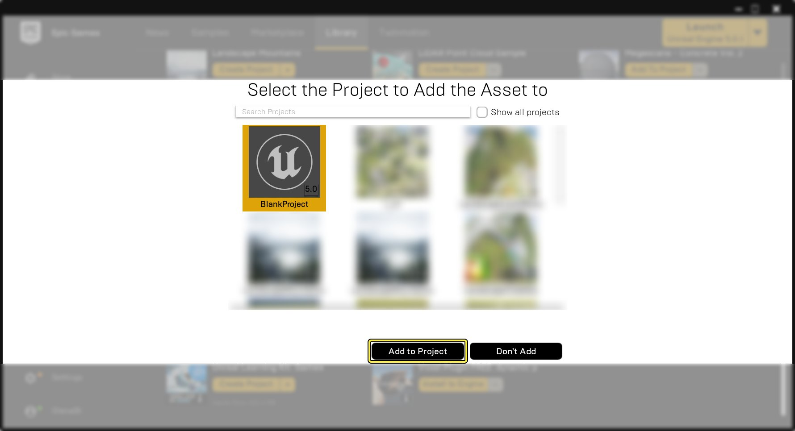
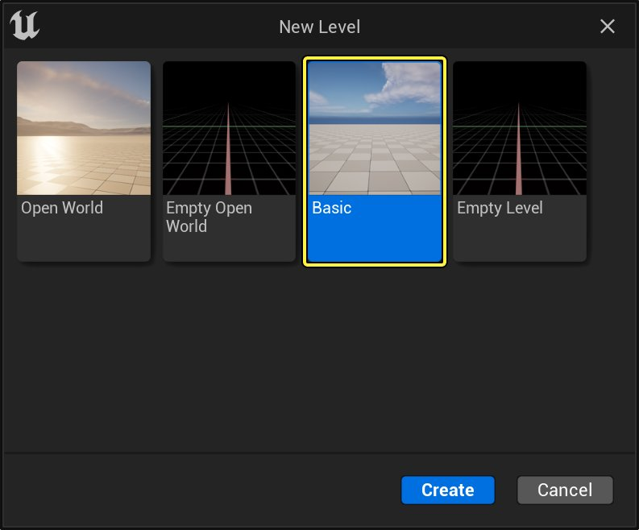
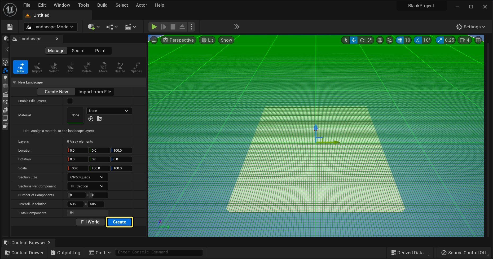
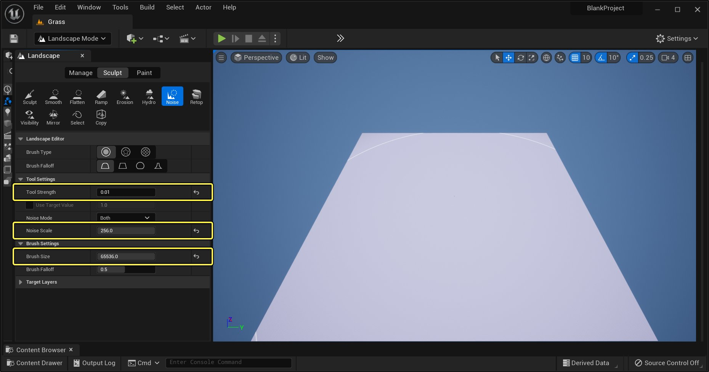

# 草地工具快速入门

> 路径：虚幻引擎5.7文档 / 构建虚拟世界 / 开放世界工具 / 草地工具快速入门

> 原始页面：https://dev.epicgames.com/documentation/unreal-engine/grass-quick-start-in-unreal-engine

### 概述

此快速入门指南将讲解如何为地形设置和并应用草地纹理。 本快速入门教程将介绍创建、设置和生成静态网格体的方法，给地形覆盖上茂密的草地。 本文还将介绍关键属性和设置，可协助打造虚拟草地，以适应项目需求。

点击查看大图。

同时还可了解所有必要Actor和属性，以保证草地效果正常生效并输出理想结果。 完成本快速入门时，将得到类似下图的新关卡。

> [!NOTE]
> 当前草地系统仅能与地形Actor配合使用。在其他任何Actor类型上使用草地系统，将无法生成草地。

## 1 - 必备软件

下载 **Open World Demo Collection** 内容包，因为接下来的快速入门中将使用该内容包的部分内容。 下载Open World Demo Collection后，执行以下步骤将其添加到用于进行本快速入门练习的项目：

1. 在Epic Games 启动程序的 **学习** 或**商城** 页面中找到并下载 **Open World Demo Collection**。

   

   点击查看大图。
2. 前往启动程序的 **库** 部分，在 **保管库（Vault）** 部分找到Open World Demo Collection。

   

   点击查看大图。
3. 点击 **添加到项目** 按钮。

   

   点击查看大图。
4. 将显示可添加此包的项目列表。选择本快速入门练习所用的属性，然后按 **添加到项目** 按钮。

   

   点击查看大图。

## 2 - 初始关卡设置

现在，要新建关卡和地形以便获得应用草地的对象。

1. 新建关卡，使用空白的 **默认** 模板。

   

   点击查看大图。
2. 在关卡中添加一个新的地形Actor（Landscape Actor）。在主工具栏中，点击 **模式（Modes）** 按钮，然后选择 **地形（Landscape）** 按钮，显示地形面板和工具栏，然后点击 **创建（Create）** 按钮。

   

   点击查看大图。
3. 为更好展示草地工具，向地形地面添加少许噪点，使其不完全平坦。在 **地形（Landscape）** 工具栏的 **雕刻(Sculpt)** 选项卡中，在工具列表中选择 **噪点（Noise）** 工具， 将噪点属性设置成以下值。

   

   点击查看大图。

   | 属性名称 | 值 | 更多详情 |
   | --- | --- | --- |
   | **笔刷大小** | 65536.0 | 该属性提供大型笔刷，足以一次性影响整个地形。 |
   | **工具强度（Tool Strength）** | 0.01 | 由于只需十分细微的效果，因此将工具强度设至极低，并利用绘制添加强度。 |
   | **噪点缩放（Noise Scale）** | 256 | 设置粳稻的噪点缩放，使噪点应用到地形时更平滑、更自然。 |
4. 将地形笔刷放入视口中，以便其覆盖整个地形，然后点击鼠标左键 **3** 到 **4** 次，向地形添加部分十分细微的噪点。
5. 退出地形模式。点击 **模式（Modes）** 按钮，然后选择 **选择（Select）** 显示 **放置Actor（Place Actors）** 面板。

   > 图片已省略：Place Actors

   点击查看大图。

   完成后，应能得到类似下图的结果。

   > 图片已省略：Noise On Landscape

   点击查看大图。

   > [!NOTE]
   > 草地系统也适用于完全平坦的地形。以上对地形的修改纯粹出于美术目的，以便更好展示最终效果。

## 3 - 创建和设置草地工具Actor

接下来要创建所需的Actor和材质，以便草地工具能正常工作。 我们会继续使用上一步中创建的关卡。

1. 创建地形草地类型：在 **内容浏览器** 中 **点击右键**，然后在显示的快捷菜单中选择 **植被（Foliage）** > **地形草地类型（Landscape Grass Type）** 并将其命名为 **Grass_00**。

   > 图片已省略：Create LS Grass

   点击查看大图。
2. 打开地形草地类型并在 **草地品种（Grass Varieties）** 阵列中添加一个新项目：**双击** **地形草地类型**，并在其打开后按下 **草地品种（Grass Varieties）** 名称右侧的 **加号** 图标。

   > 图片已省略：Add_New Grass Varieties

   点击查看大图。
3. 在 **地形草地类型** Actor中找到 **草地网格体** 部分，然后点击显示为 **无** 的输入框，输入 **SM_FieldGrass_01** 作为搜索词，再点击 **SM_FieldGrass_01** 将其加载为 **草地网格体**。

   > 动图已省略：Set Grass Type

   点击查看大图。
4. 添加静态网格体后，需设置下列属性确保生成足够草地网格体，并使此类网格体随机旋转和对齐到地形。

   > 图片已省略：Grass Props

   点击查看大图。

   | 属性名称 | 值 | 更多详情 |
   | --- | --- | --- |
   | **草地密度** | 400.0 | 如想得到草地效果，须生成大量静态网格体使地形看起来覆盖着茂密的草地。 |
   | **使用网格** | Enabled | 使静态网格体放置得更自然，此值将偏移其放置位置。 |
   | **随机旋转** | Enabled | 将随机旋转给予用于植被和草地的静态网格体，确保不会总是看到所用静态网格体的相同面，增加场景的视觉多样性。 |
   | **对齐到表面** | Enabled | 此属性可确保所用静态网格体与地形表面贴合。 |

## 4 - 地形材质与草地工具

开始使用草地工具前，还须创建可与地形及 **地形草地类型** 同时使用的材质。 下一章节中将介绍设置此材质及与其链接的方法，以使其与地形草地类型配合使用。

> [!TIP]
> 如要更深入地了解UE4中地形的工作原理，请查看[地形](../../landscape-outdoor-terrain/index.md)页面了解更多信息。

1. **内容浏览器** 中 **点击右键**，然后在 **创建基本资源** 部分选择 **材质和纹理（Material & Textures）** 选项新建用于地形的材质，并将其命名为 **MAT_GT_Grass**

   > 图片已省略：Create New Material

   点击查看大图。
2. 在 **内容浏览器** 中 **双击** **MAT_GT_Grass** 材质将其打开，然后将下列两个纹理从 **Open World Demo Collection** 添加到材质图表。

   - T_AlpinePatch001_D_alt_R
   - T_GDC_Grass01_D_NoisyAlpha

   > 图片已省略：Added Textures

   点击查看大图。
3. 使用 **控制板** 搜索功能搜索下方列出的材质表达式节点。 找到所需材质表达式节点后，在控制板中选中，然后拖进材质图表中。

   | 材质表达式命名 | 数量 | 更多详情 |
   | --- | --- | --- |
   | **Landscape Layer Blend** | 1 | 要使地形更加逼真，时常需将多个地形同时或分别混合和绘制，利用地形图层混合（Landscape Layer Blend）便可进行此操作。 |
   | **Landscape Layer Sample** | 1 | 利用此材质表达式，材质和地形可互相对话，确保绘制某个材质图层时使用正确的静态网格体。 |
   | **Landscape Grass Output** | 1 | 利用此表达式，地形能够根据地形材质中的设置生成草地类型。 |

   > 动图已省略：Add Material Nodes

   点击查看大图。

   > [!TIP]
   > 如不太熟悉UE4材质编辑器的工作方式，或希望了解更多相关信息，请查看官方 **[虚幻引擎材质文档](../../../designing-visuals-rendering-and-graphics/unreal-engine-materials/index.md)，了解材质相关事物的更多信息。
4. 选择 **Landscape Layer Blend** 节点，然后在 **细节** 面板中的 **图层** 部分中，双击 **加号** 图标，向其添加两个新图层。

   > 图片已省略：Landscape Layer Blend Add Layers

   点击查看大图。
5. 添加两个图层后，将其中一个的 **图层命名** 设为 **Grass**，另一个的 **图层命名** 设为 **Rock**，并将两者的 **预览权重（Preview Weight）** 都设为 **1.0**。

   > 图片已省略：LS Layer Blend Setup

   点击查看大图。
6. 将 **T_AlpinePatch001_D_alt_RDaltR** 纹理连接到 **Landscape Layer Blend** 节点上的 **图层岩石** 输入，然后将 **T_GDC_Grass01_D_NoisyAlpha** 连接到 **图层草地** 输入，最后将 **Landscape Layer Blend** 节点的 **输出** 连接到主材质节点 **Mat_GT_Grass** 上的 **基础颜色（Base Color）** 输入。

   > 图片已省略：Hook Up Textures

   点击查看大图。
7. 在 **内容浏览器** 中，选择上一步中创建的 **Grass_00** 地形草地类型。
8. 在 **材质** 中的 **草地类型** 选项下，按 **箭头** 图标加载当前内容浏览器内选中的Actor。

   > 图片已省略：Input Grass Type

   点击查看大图。
9. 选择 **Landscape Layer Sample** 节点，在 **参数命名（Parameter Name）** 下输入 **Grass** 作为命名，并将 **Landscape Layer Sample** 的输出连接到 **Landscape Grass Output** 节点的输入。

   > 图片已省略：Landscape Layer Weight Setup

   点击查看大图。
10. 完成后可得到类似下图的材质。和往常一样，记住按 **应用** 和 **保存** 按钮编译并保存材质。

    > 图片已省略：Final Material

    点击查看大图。

## 5 - 使用草地工具

为了查看草地系统的效果，需将上一步中创建的材质应用到地形，然后使用地形绘图工具定义要生成草地的位置。 下一章节中将介绍将材质应用到地形，再使用地形绘图工具定义应生成草地的区域的方法。 我们将继续使用上一步创建的关卡。

1. 在视口中点击并选择关卡中放置的地形Actor。

   > 图片已省略：Selected Landscape

   点击查看大图。
2. 在 **内容浏览器** 中找到 **MAT_GT_Grass** 材质，点击并选择。
3. 在地形上，在 **细节** 面板的 **地形材质** 部分中，按 **箭头** 图标将 **MAT_GT_Grass** 材质应用到地形。

   > 图片已省略：Apply Material

   点击查看大图。
4. 在 **主工具栏（Main Toolbar）** 中点击 **模式（Mode）** 按钮，选择 **地形（Landscape）** 模式。在 **地形（Landscape）** 工具栏中，点击 **绘制（Paint）** 选项卡进入 **绘制（Paint）** 模式。

   > 图片已省略：Landscape Paint Mode

   点击查看大图。

   > 图片已省略：Landscape Paint Mode

   点击查看大图。
5. 在 **目标图层** 部分，按位于图层命名最右端的 **加号** 图标添加新的 **图形信息**。

   > 图片已省略：Add Target Layers

   点击查看大图。
6. 弹出提示时，选择 **权重混合图层（法线）（Weight- Blended Layer(normal)）** 选项，然后在内容浏览器中选择要保存新图层混合的位置。 确保创建Rock和Grass的 **图层信息**。
7. 选择 **草地** 目标图层，然后在视口中长按 **鼠标左键** 开始将草地材质绘制到地形。 在此步中，要尽量完全覆盖地形，便可得到类似此图的结果。

   > 图片已省略：Painting Grass

   点击查看大图。

   > [!NOTE]
   > 开始在地形上绘制时，生成草地时编辑器可能会失去响应，这取决于开发PC的性能。 绘制完成后将动态生成草地，因此这是正常现象。 在操作时调低 **地形草地类型** 中的 **草地密度（Grass Density）**，完成后再重新调至所需水平，以便缓解此现象。
8. 要在地形中删除草地，选择岩石目标图层，然后在视口中长按 **鼠标左键**，开始使用岩石纹理替换草地纹理。

   调整 **笔刷大小** 和 **工具强度（Tool Strength）**，在地形上绘制时有助于更好定义放置或删除草地的方式。

## 6 - 自行尝试

现已了解草地工具带有的功能，请尝试利用刚学到的知识，结合下列工具，制作出类似下图的关卡：

> 图片已省略：On Your Own

- 使用[程序性植被工具](../procedural-foliage-tool/index.md)，使地形被茂密的草地、花朵和灌木覆盖。
- 使用 **[地形雕刻](../../landscape-outdoor-terrain/editing-landscapes/landscape-sculpt-mode/index.md)** 工具添加丘陵、山脉和湖泊等特征，以定义地形的外观和效果。
- 创建包含可在地形上绘制的多种纹理的[地形材质](../../landscape-outdoor-terrain/landscape-materials/index.md)，使地形表面的视觉效果更多样，细节更丰富。
- 调整 **[定向光源](../../lighting-the-environment/light-types-and-their-mobility/directional-lights/index.md)**，使关卡的光照呈现出清晨或黄昏的光照效果。
- 设置关卡光照，使用完全基于动态的光照解决方案，其将利用动态阴影及 **[光线追踪距离场软阴影](../../lighting-the-environment/mesh-distance-fields/distance-field-soft-shadows/index.md)**。
- 尝试使用[植被系统](../foliage-mode/index.md) 工具删除或微调由过程植被工具放置的植被网格体的放置、旋转和比例，以便得到理想效果。
- 使用 **[摄像机](../../../understanding-the-basics/actors-and-geometry/unreal-engine-actors-reference/camera-actors/index.md)** 结合 **[Sequencer](../../../working-with-media/integrating-media/real-time-compositing-with-composure/real-time-compositing-with-sequencer/index.md)** 渲染出关卡的视频，向他人展示创作成果。
