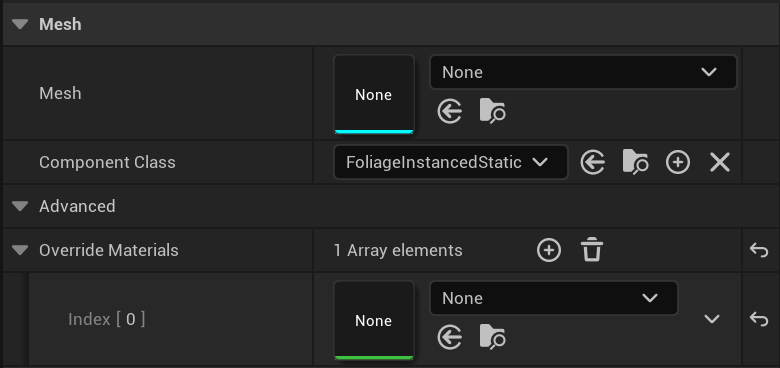
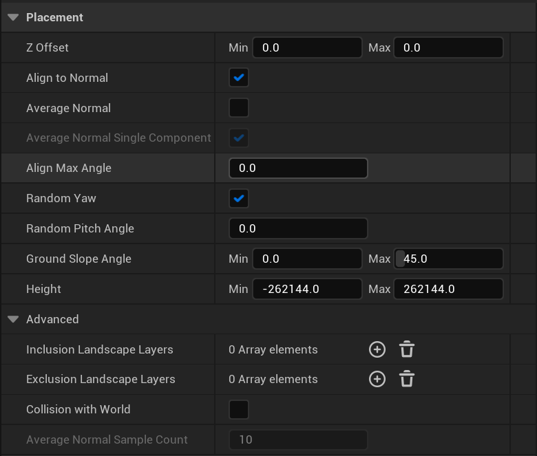
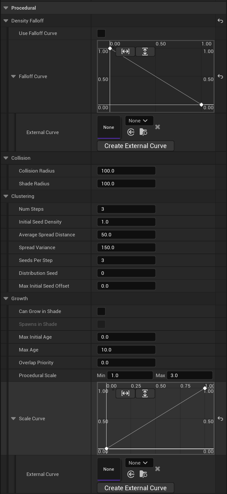
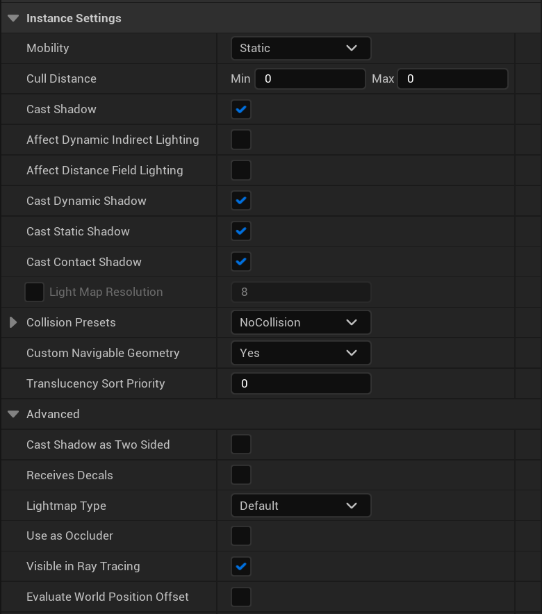
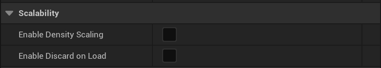
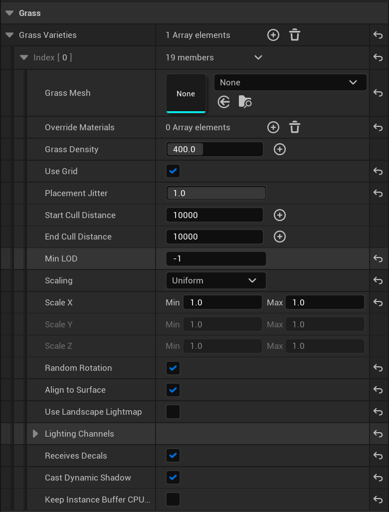
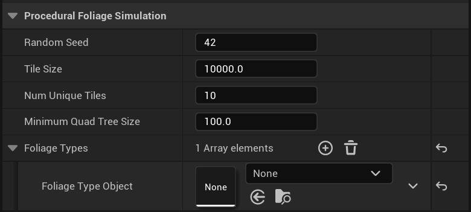

# 开放世界工具属性参考

> 路径：虚幻引擎5.7文档 / 构建虚拟世界 / 开放世界工具 / 开放世界工具属性参考

> 原始页面：https://dev.epicgames.com/documentation/unreal-engine/open-world-tools-property-reference-in-unreal-engine

## 概述

本文列出了你在使用开放世界工具时可以参考的属性列表。

## 植被类型

### 网格体

点击查看大图。

| 属性 | 说明 |
| --- | --- |
| **网格体（Mesh）** | 定义将使用哪个静态网格体。 |
| **组件类（Component Class）** | 要用于植被实例的组件类。你可以创建FoliagedInstancedStaticMeshComponent的蓝图子类来实现自定义行为并在此处分配该类。 |
| **覆盖材质（Override Materials）** | 植被实例的材质覆盖。 |

### 放置

点击查看大图。

| 属性 | 说明 |
| --- | --- |
| **Z偏移（Z Offset）** | 指定偏移从最小值到最大值的范围，以应用于植被实例的Z位置。 |
| **分配到法线（Align to Normal）** | 植被实例是否应该将其角度调整为偏离垂直线，以匹配它们绘制到的表面的法线。如果启用了AlighnToNormal，并禁用了RandowYaw，则实例将旋转，以便+X轴沿斜面向下指。 |
| **随机偏转（Random Yaw）** | 如果选择该属性，植被实例将围绕其垂直轴应用随机偏转旋转。 |
| **随机俯仰角（Random Pitch Angle）** | 随机俯仰角调整可以应用于每个实例，最高为距离原始垂直线的指定角度，以度为单位。 |
| **地面斜面角度（Ground Slope Angle）** | 植被实例只会放在距离水平线指定角度范围的表面斜面上。 |
| **高度（Height）** | 将放置植被实例的有效海拔范围，使用最小和最大世界坐标Z值来指定。 |
| **地形图层（Landscape Layers）** | 如果指定了图层名称，在地形上绘制会将植被限制为绘制了指定图层的地形区域。 |
| **与世界碰撞（Collision with World）** | 如果选中该属性，将在放置每个实例之前执行与现有世界几何体的重叠测试。 |

### 程序化

点击查看大图。

| 属性 | 说明 |
| --- | --- |
| **碰撞半径（Collision Radius）** | CollisionRadius将确定两个实例何时重叠。两个实例重叠时，将根据规则和优先级选择胜出者。 |
| **阴影半径（Shade Radius）** | ShadeRadius将确定两个实例何时重叠。如果实例可以在阴影中生长，则忽略此半径。 |
| **步数（Num Steps）** | 让物种年龄增长并扩散种子的次数。 |
| **初始种子密度（Initial Seed Density）** | 指定要在10米内填充的种子数量。该数量将隐式求平方以覆盖10米 x 10米的面积。 |
| **平均扩散距离（Average Spread Distance）** | 扩散的实例与其种子之间的平均距离。例如，如果一棵树的AverageSpreadDistance为10，就可确保树与种子之间的平均距离为10厘米。 |
| **扩散方差（Spread Variance）** | 指定种子距离与平均值的差异程度。例如，如果一棵树的AverageSpreadDistance为10，SpreadVariance为1，则生成的种子的平均距离为10厘米加减1厘米。 |
| **每步的种子数（Seeds Per Step）** | 实例将在模拟的单个步骤中扩散的种子数。 |
| **分布种子（Distribution Seed）** | 确定初始种子位置的种子。 |
| **可以在阴影中生长（Can Grow in Shade）** | 如果为true，此类型的种子将忽略与其他类型的阴影半径重叠测试。 |
| **在阴影中生成（Spawns in Shade）** | 新种子是否完全在阴影中生成。所有不在阴影中生成的类型都已模拟之后，在第二轮中发生。仅当CanGrowInShade为true时有效。 |
| **最大初始年龄（Max Initial Age）** | 允许新种子在创建时的年龄大于0。新种子将随机分配[0,MaxInitialAge]范围内的年龄。 |
| **最大年龄（Max Age）** | 指定种子可以达到的最大年龄。达到此年龄之后，实例仍将扩散种子，但不再增加年龄。 |
| **重叠优先级（Overlap Priority）** | 两个实例重叠时，我们必须确定删除哪个实例。OverlapPriority较低的实例将被删除。在OverlapPriority相等的情况下，普通模拟规则适用。 |
| **程序化比例（Procedural Scale）** | 程序化生成时此类型的比例范围。使用比例曲线配置。 |
| **比例曲线（Scale Curve）** | 作为规范化年龄的函数的实例比例因子（即，当前年龄/最大年龄）。X = 0对应于年龄 = 0，X = 1对应于年龄 = 最大年龄。Y = 0对应于最小比例，Y = 1对应于最大比例。 |
| **外部曲线（External Curve）** | 适用于外部曲线。 |

### 实例设置

点击查看大图。

| 属性 | 说明 |
| --- | --- |
| **移动性（Mobility）** | 要应用于植被组件的移动性属性。 |
| **剔除距离（Cull Distance）** | 使用PerInstanceFadeAmount材质节点时，实例将开始淡出的距离。值为0将禁用。整个群集超过此距离时，群集将完全剔除，根本不渲染。 |
| **投射阴影（Cast Shadow）** | 控制植被是否应该投射阴影。 |
| **影响动态间接光照（Affect Dynamic Indirect Lighting）** | 控制植被是否应该将光注入到光传播体积。此标记仅在CastShadow为true时使用。 |
| **影响距离场光照（Affect Distance Field Lighting）** | 控制图元是否应该影响动态距离场光照方法。此标记仅在CastShadow为true时使用。 |
| **投射动态阴影（Cast Dynamic Shadow）** | 控制植被是否应该在非预先计算的阴影投射情况下投射阴影。此标记仅在CastShadow为true时使用。 |
| **投射静态阴影（Cast Static Shadow）** | 控制植被是否应该根据投射阴影的光源投射静态阴影。此标记仅在CastShadow为true时使用。 |
| **光照贴图分辨率（Light Map Resolution）** | 覆盖静态网格体中定义的光照贴图分辨率。 |
| **碰撞预设（Collision Presets）** | 选择碰撞预设。你可以在项目设置中设置此数据。 |
| **自定义可导航几何体（Custom Navigable Geometry）** | **否（No）**：图元没有自定义导航几何体，如果启用碰撞，则其凸包/三角网格图碰撞将用于生成寻路网格体。 **是（Yes）**：如果图元会影响寻路网格体，应该调用DoCustomNavigableGeometryExport()来导出此图元的可导航几何体。 **即使不可碰撞（Even if not Collidable）**：即使网格体非可碰撞，并且通常不会影响寻路网格体，也应该调用DoCustomNavigableGeometryExport()。 **不导出（Dont Export）**：即使图元与导航相关（仍可以添加修饰符），也不导出可导航几何体。 |
| **投射双面阴影（Cast Shadow as Two Sided）** | 此植被是否应该如同双面材质那样投射动态阴影。 |
| **接收贴花（Receives Decals）** | 植被是否接收贴花。 |
| **用作遮挡物（Use as Occluder）** | 如果启用该属性，植被将渲染一个预通道，允许它遮挡其他图元，还允许它正确接收DBuffer贴花。启用此设置可能会带来负面性能影响。 |

### 可扩展性

点击查看大图。

| 属性 | 说明 |
| --- | --- |
| **启用密度缩放（Enable Density Scaling）** | 此植被类型是否应该受到引擎可扩展性系统的植被可扩展性设置的影响。针对实际不会影响游戏的细节网格体启用。针对所有主要对象禁用。通常，该属性会针对不带碰撞的小网格体（例如，草地）启用，而针对带碰撞的大网格体（例如，树木）禁用。 |

## 地形草地类型

### 草地变体

点击查看大图。

| 属性 | 说明 |
| --- | --- |
| **草地变体（Grass Varieties）** | 草地变体。 |
| **草地网格体（Grass Mesh）** | 草地网格体。 |
| **使用网格体（Use Grid）** | 如果为true，则将抖动网格序列用于位置，否则使用Halton序列。 |
| **位置抖动（Placement Jitter）** | 位置抖动。 |
| **开始剔除距离（Start Cull Distance）** | 使用PerInstanceFadeAmount材质节点时，实例将开始淡出的距离。值为0将禁用。 |
| **结束剔除距离（End Cull Distance）** | 使用PerInstanceFadeAmount材质节点时，实例将完全淡出的距离。值为0将禁用。整个群集超过此距离时，群集将完全剔除，根本不渲染。 |
| **最小LOD（Min LOD）** | 指定将用于此组件的最小LOD。如果为-1（默认值），将改用静态网格体资产的MinLOD。 |
| **缩放（Scaling）** | 指定草地实例缩放类型。 |
| **比例X（Scale X）** | 指定要应用于草地实例的X比例属性的比例范围，从最小值到最大值。 |
| **比例Y（Scale Y）** | 指定要应用于草地实例的Y比例属性的比例范围，从最小值到最大值。 |
| **比例Z（Scale Z）** | 指定要应用于草地实例的Z比例属性的比例范围，从最小值到最大值。 |
| **随机旋转（Random Rotation）** | 草地实例是应该按随机旋转放置（true），还是全部按相同旋转放置（false）。 |
| **对齐到表面（Align To Surface）** | 草地实例是应该向地形法线倾斜（true）还是始终垂直（false）。 |
| **使用地形光照贴图（Use Landscape Lightmap）** | 渲染草地时是否使用地形的光照贴图。 |

## 程序化植被生成器

### 程序化植被模拟

点击查看大图。

| 属性 | 说明 |
| --- | --- |
| **随机种子（Random Seed）** | 用于生成模拟的随机性的种子。 |
| **图块大小（Tile Size）** | 图块沿一个轴的长度（以厘米为单位）。图块的总面积将为TileSize * TileSize。 |
| **唯一图块数量（Num Unique Tiles）** | 要生成的唯一图块的数量。最终模拟是各种唯一图块的程序化确定的组合。 |
| **植被类型（Foliage Types）** | 要程序化生成的植被类型。 |
| **植被模拟对象（Foliage Type Object）** | 程序化植被模拟将生成的植被类型。 |
