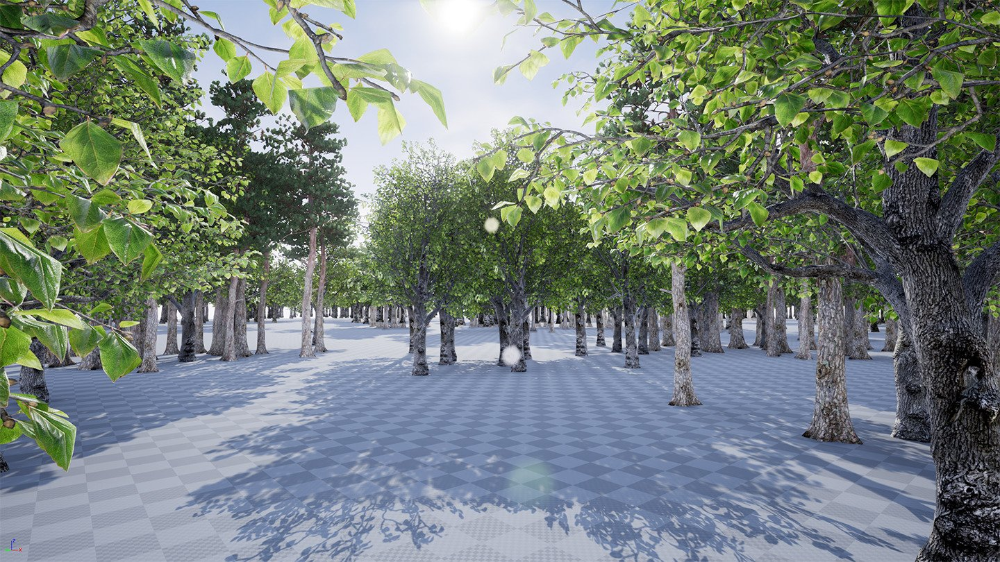
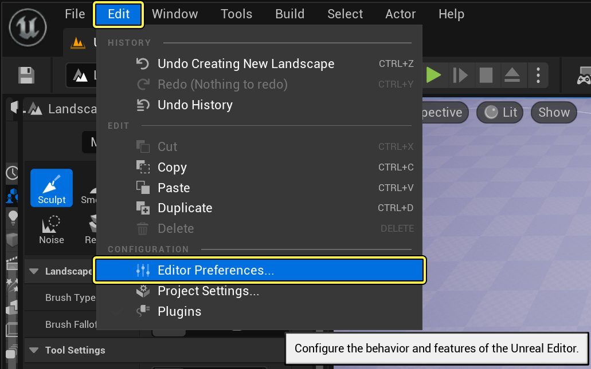
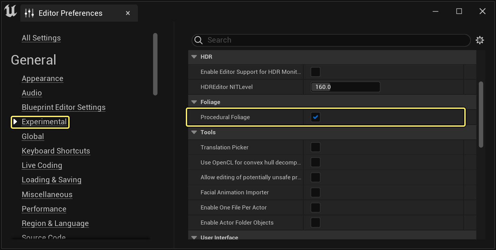
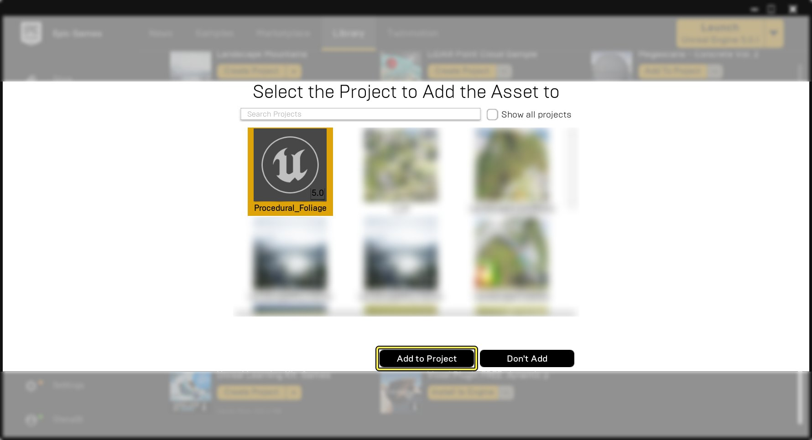

# 程序化植被工具

> 路径：虚幻引擎5.7文档 / 构建虚拟世界 / 开放世界工具 / 程序化植被工具

> 原始页面：https://dev.epicgames.com/documentation/unreal-engine/procedural-foliage-tool-in-unreal-engine

在本篇快速入门指南中，我们将学习 **程序化植被工具** 的工作方式。随着你学习本教程，你将学会如何在虚幻引擎5中仅使用程序化植被工具来创建、设置并大量生成组成整个森林的树木。你还可以了解主要的属性和设置，以帮助你生成满足项目需求的虚拟森林。

此外你还将了解到程序化植被工具正常使用并实现所需效果，应必备的所有资产和属性。完成本教程后，你创建的关卡效果和上图类似。

### 先决条件

在项目中使用程序化植被工具之前，你必须首先按照以下步骤启用工具：

1. 从 **主工具栏** 中单击 **编辑（Edit）** 选项，然后单击 **编辑器首选项（Editor Preferences）**。

   

   点击查看大图。
2. 右键单击

   编辑器首选项中的

   Experimental

   部分。
3. 通过单击 **程序化植被** 字样旁的勾选框，启用程序化植被选项。

   

   点击查看大图。

你还需要从 **虚幻引擎虚幻商城** 下载 **开放世界场景演示集（Open World Demo Collection）** 内容包，因为接下来的教程会使用其中的部分内容。开放世界场景演示集下载完成后，你可以通过以下步骤将其添加至项目，以便你在接下来跟随教程操作：

1. 在Marketplace中的Epic游戏启动器中，找到 **开放世界场景演示集** 并下载。

   

   点击查看大图。
2. 前往启动器的 **Library** 部分，并在 **Vault** 部分找到开放世界场景演示集。

   

   点击查看大图。
3. 单击 **添加至项目（Add to Project）** 按钮。

   

   点击查看大图。
4. 你会看到可添加该演示集的项目列表，选中你用于跟随本教程操作的项目，单击 **添加至项目** 按钮。

   

   点击查看大图。

## 1 - 创建植被类型的Actor

在该步骤中，你将新建关卡、地形及程序化植被工具所需的所有资产。

1. 使用 **默认模板** 作为基础创建新关卡。

   

   点击查看大图。
2. 首先在 **模式** 下拉菜单中选中 **地形**，打开 **地形面板**，然后点击 **创建（Create）** 按钮，将新的 **地形Actor** 添加至关卡。

   > 图片已省略：Modes Landscape

   点击查看大图。

   > [!TIP]
   > Landscape Terrain Actor能为你快速提供大片区域，以便你生成森林。

   > 图片已省略：Placed Landscape

   点击查看大图。

   > [!NOTE]
   > 如果你对地形的运行模式尚不熟悉，或想要了解更多相关信息，请查阅[Landscape室外地形](../../landscape-outdoor-terrain/index.md) 获取更多信息。
3. 在 **内容浏览器** 中 **单击右键**，展开 **植被（Foliage）** 分段，随后单击 **程序化植被生成器**，创建新的程序化植被生成器。

   > 图片已省略：Create Procedural Foliage Spawner

   点击查看大图。
4. 为程序化植被生成器命名，如本例中的为 **PFS_Example** 或其他类似名称。

   > 图片已省略：Name Procedural Foliage Spawner

   点击查看大图。
5. 将程序化植被生成器从 **内容浏览器** 拖入关卡，将其置于关卡中心或使其X、Y和Z轴坐标分别为 **0,0,200**。

   > 图片已省略：Place Procedural Foliage Spawner

   点击查看大图。
6. 将程序化植被生成器的X、Y和Z轴方向展开至 **100,100,10**，从而为后续大量生成森林创建足够大的面积。

   > 图片已省略：PFS Example Details

   点击查看大图。
7. 现在有了生成器，我们需要为其指定一些要生成的植被类型。为此，在 **内容浏览器** 中 **单击右键**，展开 **其他（Miscellaneous）** 部分，随后单击 **植被类型（Foliage Type）**。将该植被类型命名为 **Tree_00** 或其他类似名称。

   > 图片已省略：Create Static Mesh Foliage

   点击查看大图。
8. 如果尚未完成，请保存你的工作和关卡，按 **全部保存（Save All）** 按钮可保存所用内容，按 **保存（Save）** 按钮可保存关卡。提示输入关卡名称时，使用名称 **PFT_00**。至此，你应该已获得与下图类似的结果。

   > 图片已省略：Save All

   点击查看大图。

## 2 - 为生成器设置生成内容

接下来这部分，我们将说明如何设置 **植被类型Actor**，从而使用程序化植被生成器。你将继续在上一步创建的 **PFT_00** 关卡中进行操作。

1. 在内容浏览器中 **双击**，打开 **程序化植被生成器**。

   > 图片已省略：Procedural Foliage Spawner Opened

   点击查看大图。
2. 单击位于 **植被类型（Foliage Types）** 菜单选项右侧的 **加号** 图标，向 **植被类型** 数组添加新条目。

   > 图片已省略：Procedural Foliage Spawner Add Foliage Types

   点击查看大图。
3. 在内容浏览器中，选中Tree_00静态网格体植被，将它拖入 **植被类型对象（Foliage Types Object）**，或者按下 **箭头** 图标，将选中的静态网格体植被加载至程序化植被生成器。

   > 图片已省略：Add Foliage Mesh

   点击查看大图。
4. 在内容浏览器中 **双击** 打开Tree_00静态网格体植被。

   > 图片已省略：PFT Window

   点击查看大图。
5. 在Tree_00静态网格体植被顶端，找到 **网格体（Mesh）** 部分，然后单击内容为 **无（None）** 的下拉菜单。

   > 图片已省略：PFT Mesh Section

   点击查看大图。
6. 在搜索菜单中输入 "HillTree_02" 或滚动列表，直至在 **开放世界场景演示集** 找到 **HillTree_02** 静态网格体，然后点击它并加载它。

   > 图片已省略：Select HillTree _02

   点击查看大图。
7. 回到视口，选择置于关卡中的 **程序化植被生成器**，展开 **细节（Details）** 面板下的 **程序化植被（Procedural Foliage）** 部分。

   > 图片已省略：PFV Select In Level

   点击查看大图。
8. 单击 **程序化植被（Procedural Foliage）** 部分下的 **再次模拟（Resimulate）** 按钮，现在你应该可以看到程序化植被生成器密集生成了树木（如下图所示）。

   > 图片已省略：Final Results

   点击查看大图。

   > [!WARNING]
   > 每当你使用"重新模拟"按钮来创建或调整程序化植被时，为了看到正确的结果，你都需要点击 **主工具栏** 中的 **构建** 按钮来重新构建光照。由于涉及大量静态网格体，这可能会花费很多时间。

## 3 - 调整植被类型属性

通过调整 **植被类型对象（Foliage Type Objects）** 的各种属性，你可以从关卡中植被被放置的方式到植被生成器中植被的生长和散布方式，对其进行整体控制。接下来这部分，我们将学习 **植被类型** 中哪些属性可以调用，以及如果通过控制这些属性获得理想的效果。我们将继续在上一步使用的 **PFT_00** 关卡中进行操作。

1. 打开 **Tree_00** 静态网格体植被。
2. 展开 **放置（Placement）** 部分，确保 **对齐法线（Align to Normal）** 和 **随机偏航角（Random Yaw）** 同时启用。

   > 图片已省略：Placement Options

   点击查看大图。

   > [!NOTE]
   > 在"放置（Placement）"部分，你可以调整关卡中植被类型对象的网格体如何被放置到关卡中的对象上。
3. 在静态网格体植被的 **程序化（Procedural）** 分段下展开 **碰撞（Collision）** 部分，并将 **着色半径（Shade Radius）** 设置为 **50**。

   > 图片已省略：Shade Radius

   点击查看大图。

   > [!NOTE]
   > 当两种植被类型对象竞争同一片生成位置或相对空间时，会由"碰撞（Collision）"部分决定哪种植被类型对象被保留。当一种虚拟种子的碰撞半径，与另一种植被类型对象的种子现存的碰撞半径或着色半径重叠时，将会根据植被类型对象的优先级，确定哪种植被的种子会被取代或移除。
4. 选择被置于关卡中的 **程序化植被生成器**，在 **程序化植被（Procedural Foliage）** 部分下，点击 **重新模拟** 按钮。

   > 图片已省略：Press ReSimulate

   点击查看大图。
5. 回到 Tree_00 静态网格体植被，叠起 **碰撞** 部分，展开 **集群（Clustering）** 部分，将 **阶数（Num Steps）** 设为 **0**，这样我们生成的树木会拥有同样的尺寸和年龄，然后按下 **重新模拟（Resimulate）** 按钮。模拟完成后，你应该获得与下图类似的效果。

   > 图片已省略：Num Steps 0

   点击查看大图。

   > [!NOTE]
   > "集群（Clustering）"部分有多个属性（如密度、年龄及邻近度），帮助确定特定植被类型对象的网格体实例在程序化植被生成器中应该被如何放置、分组和散布。
6. 虽然现在树木间有了一些空隙，但总体密度仍然有些偏高。要解决此问题，请将 **初始种子密度（Initial Seed Density）** 设置为 **0.25**，然后单击 "重新模拟" 按钮。

   > 图片已省略：Num ISD 0.125

   点击查看大图。
7. 如图所见，将 "初始种子密度（Initial Seed Density）" 设置为 0.25 能极大降低森林密度，因为树木的生长和散布时间只有一年。为了解决该问题，将 "阶数（Num Steps）" 重新设为 3，此时树木会在3年期内生长并传播，然后单击 "重新模拟（Resimulate）" 按钮。

   > 图片已省略：Num Steps 3

   点击查看大图。
8. 展开 **生长（Growth）** 部分，按照下列设置调整以下参数。

   - 最大年龄（Max Age）

     ：

     20.0
   - 最大程序范围（Procedural Scale Max）

     ：

     10.0

   > 图片已省略：Set Growth

   点击查看大图。

   > [!NOTE]
   > "生长（Growth）"部分允许你对调整植被类型对象的网格体实例如何随时间生长和长大。
9. 最后，在 **剔除距离（Cull Distance）** 选项下的 **实例设置（Instance Settings）** 中，将 **最大（Max）** 值设为 **20,000**，然后单击 **重新模拟（Resimulate）** 按钮。模拟完成后，你应该获得与下图类似的效果。

   > 图片已省略：Cull Distance

   点击查看大图。

   > [!NOTE]
   > "实例设置（Instance Settings）"允许你对该植被类型对象的静态网格体在关卡中显示方式进行调整。在"实例设置（Instance Settings）"内，你可以对剔除距离（Cull Distance）、阴影（Shadowing）和碰撞（Collision）等属性进行设置或调整。

## 4 - 使用多种植被类型对象

在我们的虚拟森林中加入另一品种的树木，可以极大地提高真实感及总体观感和感受。幸运的是，**程序化植被生成器** 允许你生成多种 **植被类型对象**，因此，你可以用一个 **程序化植被生成器** 生成包含多个品种树木的森林。接下来这部分，我们将学习如何设置程序化植被生成器，从而生成多种植被类型。我们将继续在上一步使用的 **PFT_00** 关卡中进行操作。

1. 在 **内容浏览器** 内选中 Tree_00静态网格体植被类型，按住键盘上的 **Ctrl + W** 进行复制，并将其命名为 **Tree_01**。

   > 图片已省略：Dup FT

   点击查看大图。
2. 打开新创建的 Tree_01 静态网格体植被类型，在 "网格体（Mesh）" 分段下，将网格体改为 **ScotsPineTall_01** 静态网格体。

   > 图片已省略：New Mesh

   点击查看大图。
3. 从 **内容浏览器** 打开 **程序化植被生成器**，展开 **植被类型（Foliage Types）** 部分。

   > 图片已省略：Expand FT

   点击查看大图。
4. 单击 **加号** 图标，添加选项输入另一种植被类型对象。

   > 图片已省略：Add New FT

   点击查看大图。
5. 从内容浏览器中，选中 Tree_01静态网格体植被，将它拖入植被类型对象，或者点击箭头图标，将选中的静态网格体植被添加至程序化植被生成器中。

   > 图片已省略：PFS Add Foliage Mesh

   点击查看大图。
6. 选择被置于关卡中的程序化植被生成器，然后单击重新模拟（Resimulate）按钮。完成后，你应该会看到以下图像。

   > 图片已省略：FT In Level

   点击查看大图。
7. 为了增加森林外观的趣味性，打开Tree_01静态网格体植被，按照下列值调整以下参数。之所以选择下方所列出的数值和选项，是因为它们会结合已经使用的静态网格体植被实例，生成的森林具有有趣的集群和生长互动性。不过，你可以随意尝试使用这些数值和设置，直到获得你满意的效果为止。

   - 阶数（Num Steps）：

     4
   - 初始种子密度（Initial Seed Density）：

     0.125
   - 平均散布距离（Average Spread Distance）：

     100
   - 能在阴影中生长（Can Grow in Shade）：

     启用
   - 在阴影中生成（Spawns in Shade）：

     启用
   - 最大年龄（Max Age）：

     15
   - 重叠优先级（Overlap Priority）：

     1
   - 程序范围（Procedural Scale）：

     最大值 5.0
8. 当设置调整完成后，单击程序化植被生成器上的 **重新模拟（Resimulate）** 按钮，你得到的模拟效果应该与下图类似。

   > 图片已省略：Adjust Settings

   点击查看大图。

## 5 - 设置程序化植被阻挡体积

**程序化植被阻挡体积** 是一个体积Actor，可将其置于关卡中并根据需要设置范围大小，让程序化植被生成器避免在程序化植被阻挡体积之内生成任何植被对象类型。在接下来的内容中，我们将学习如何将 **程序化植被阻挡体积** 添加至关卡中，并用其避免植被网格体的生成。你将继续在上一步使用的 **PFT_00** 关卡中进行操作。

1. 首先，在 **放置Actor（Place Actors）** 面板，将 **Proc** 作为搜索词进行搜索，找到 **程序化植被阻挡体积（Procedural Foliage Blocking Volume）**。

   > 图片已省略：Find Procedural Foliage Blocking Volume

   点击查看大图。
2. 选择程序化植被阻挡体积，并将其从"放置Actor"面板拖入关卡。

   > 图片已省略：Procedural Foliage Blocking Volume

   点击查看大图。
3. 为了避免植被网格体在程序化植被生成器的后部生成，用以下位置和缩放值移动并缩放程序化植被阻挡体积。

   - X轴位置：

     5430.0 cm
   - Y轴位置：

     -3900.0 cm
   - Z轴位置：

     200.0 cm
   - 缩放X轴：

     41.75
   - 缩放Y轴：

     65.5
   - 缩放X轴：

     41.75

   > 图片已省略：Procedural Foliage Blocking Volume Postion

   点击查看大图。
4. 选择关卡中的程序化植被生成器，单击 **细节（Details）面板中的"重新模拟（Resimulate）"按钮。重新模拟完成后，你树林的后面部分应该都消失了，这就是插入了程序化植被阻挡体积的地方。

   > 图片已省略：Procedural Foliage Blocking Volume Before After

   点击查看大图。

   在下图中，我们可以看到前后效果的对比。

   | 图像编号 | 结果 |
   | --- | --- |
   | 1: | 程序化植被阻挡体积添加前 |
   | 2: | 程序化植被阻挡体积添加后 |

## 6 - 看你的了！

现在你已经了解了程序化植被工具提供的功能，试着结合刚刚学到的相关知识，使用下列工具制作出类似于下图的关卡。

> 图片已省略：On Your Own

- 试着使用植被Actor而非静态网格体植被。
- 使用[草地工具](../grass-quick-start/index.md)让地形看起来铺满了花、草和灌木。
- 使用[地形造型](../../landscape-outdoor-terrain/editing-landscapes/landscape-sculpt-mode/index.md)工具在地形中加入丘陵、山脉和湖泊等，描绘出该地形的观感效果。
- 通过创建[地形材质](../../landscape-outdoor-terrain/landscape-materials/index.md)，利用其中能在地形上绘制的多种纹理，赋予地表更多视觉多样性和细节。
- 调整[定向光源](../../lighting-the-environment/light-types-and-their-mobility/directional-lights/index.md)，让关卡的光线更类似于清晨和黄昏的阳光。
- 用完全动态的光源解决方案设置关卡光照，充分利用动态阴影及[光线追踪距离场柔和阴影](../../lighting-the-environment/mesh-distance-fields/distance-field-soft-shadows/index.md)。
- 尝试使用[植被系统](../foliage-mode/index.md)，对程序化植被工具放置的植被网格体的位置、旋转和缩放进行移除或调整，以获得所需的外观。
- 结合使用[摄像机](../../../understanding-the-basics/actors-and-geometry/unreal-engine-actors-reference/camera-actors/index.md)和[Sequencer](../../../working-with-media/integrating-media/real-time-compositing-with-composure/real-time-compositing-with-sequencer/index.md)渲染出关卡的视频，将你的作品与世界分享。
