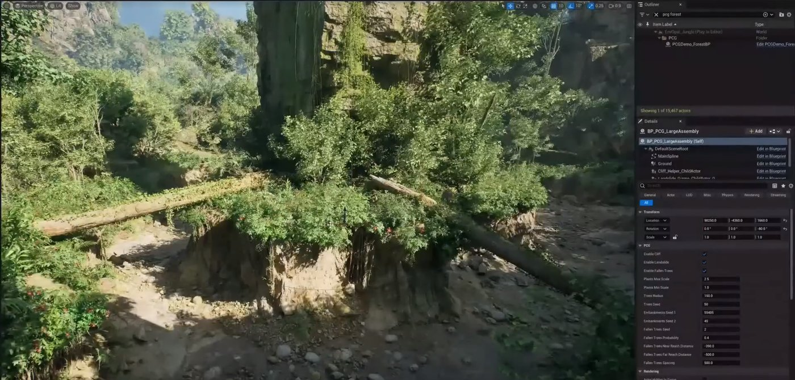

# 程序化内容生成框架

> 路径：虚幻引擎5.7文档 / 构建虚拟世界 / 程序化内容生成框架

> 原始页面：https://dev.epicgames.com/documentation/unreal-engine/procedural-content-generation-framework-in-unreal-engine

**程序化内容生成框架（Procedural Content Generation Framework (PCG)）**是用于在虚幻引擎内创建你自己的程序化内容的工具集。 利用PCG，美术师和设计师能够构建任意复杂度的快速迭代式工具，从资产工具（如建筑物或群系生成等）到整个世界，不一而足。

PCG框架专为可扩展性和交互性而构建，可轻松集成到现有世界构建管线中，实际上模糊了程序化和更传统的工作流程之间的界限。

GDC 2023中的程序化生成框架演示

- [程序化内容生成概述](procedural-content-generation-overview/index.md) - 程序化内容生成框架及其在项目中的用法简介。
- [将形状语法用于PCG](using-shape-grammar-with-pcg/index.md) - 介绍如何将形状语法用于程序化内容生成框架。
- [PCG开发指南](pcg-development-guides/index.md) - 使用程序化内容生成（PCG）框架的参考和最佳实践指南。
- [PCG群系](pcg-biome/index.md) - 了解如何通过PCG群系核心和示例插件使用PCG框架。
- [利用GPU处理进行程序化内容生成](using-pcg-with-gpu-processing/index.md) - 介绍如何利用GPU执行进行程序化内容生成，以及如何将其用于你的PCG工作流程。
- [PCG编辑器工具模式](pcg-editor-mode/index.md) - PCG编辑器工具模式概述。
- [程序化植被编辑器（PVE）](procedural-vegetation-editor-pve/index.md) - 使用程序化植被编辑器可生成逼真、高质量且适配Nanite的植被。
- [PCG Runtime Generation Debugging](pcg-runtime-generation-debugging/index.md) - An overview of PCG runtime generation debugging tools.
