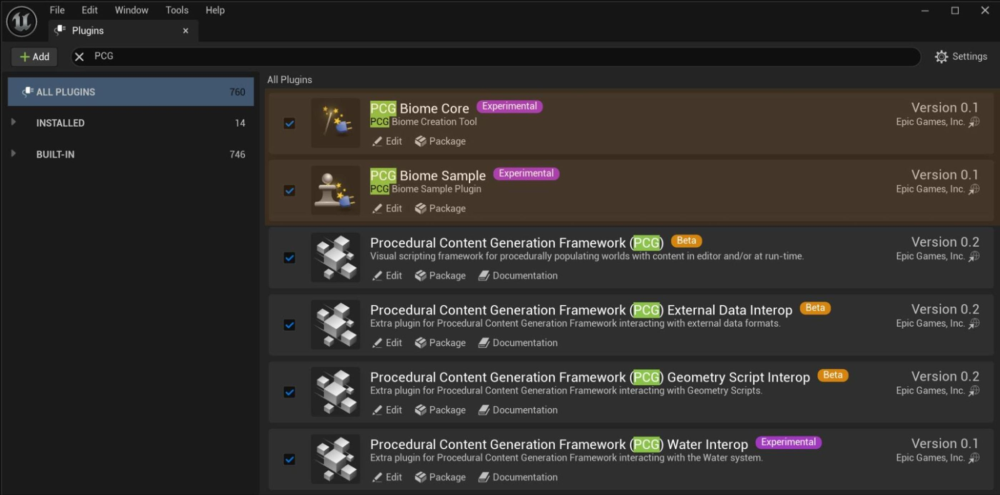
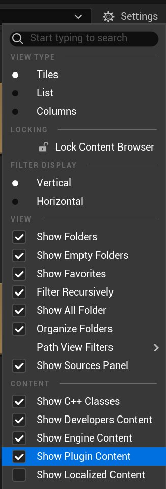
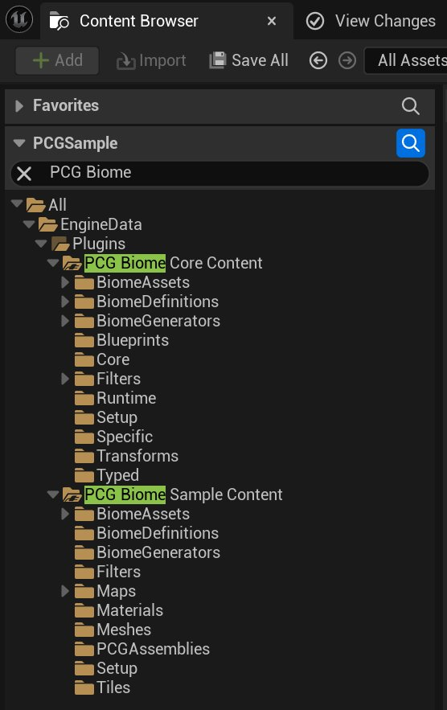
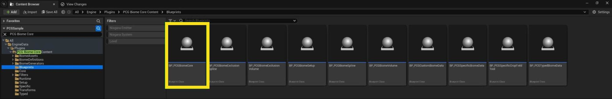
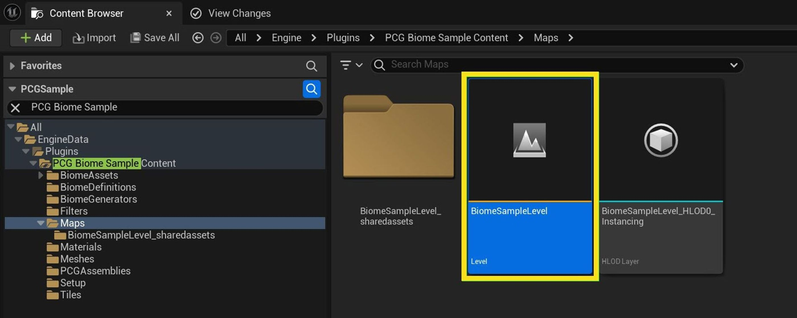
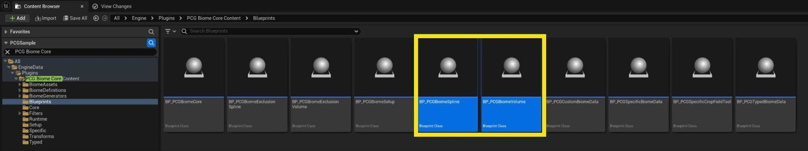
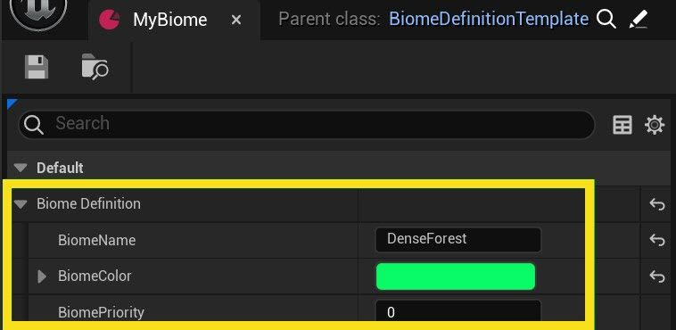
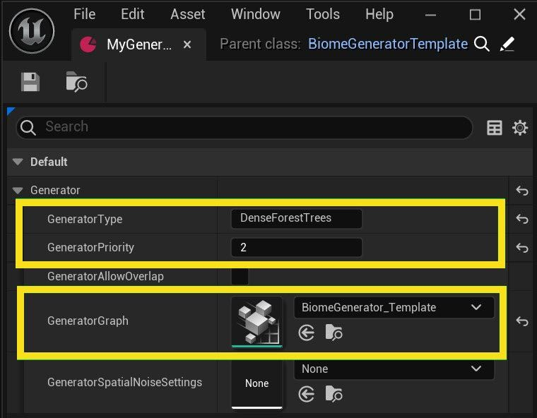

# PCG Biome Quick Start

> 路径：虚幻引擎5.7文档 / 构建虚拟世界 / 程序化内容生成框架 / PCG群系 / PCG Biome Quick Start

> 原始页面：https://dev.epicgames.com/documentation/unreal-engine/procedural-content-generation-pcg-biome-core-and-sample-plugins-quick-start-guide-in-unreal-engine

该页面没有可用的官方中文版本；以下内容保留原文，并按本项目人工译文规则逐步回译。

PCG Biome Core 和 Sample 插件是使用 [PCG Framework](https://dev.epicgames.com/documentation/assets/building-virtual-worlds/procedural-generation/procedural-content-generation-overview) 的示例，包含 Attribute Set Table、反馈循环、递归子图以及 [Runtime Hierarchical Generation](https://dev.epicgames.com/documentation/assets/building-virtual-worlds/procedural-generation/pcg-development-guides/using-pcg-generation-modes).

本快速入门指南说明如何从零开始使用生物群系创建工具，随后介绍如何添加新的生物群系和资产。

## 要求

本节介绍让 PCG Biome Core 在世界中工作所需的要求和步骤。

## 启用插件

PCG Biome Core 和 PCG Biome Sample 是两个不同插件：

- **PCG Biome Core**: 一个独立插件，仅包含生物群系创建工具运行所需内容。 该插件依赖 **PCG Framework** 和 **PCG Geometry Script Interop** 插件。
- **PCG Biome Sample**：一个展示生物群系创建工具的内容示例，可在任意项目中启用。该插件依赖 **PCG Biome Core** 插件。

要启用插件，请打开 Plugins 设置。启用 **PCG Biome Core** 以访问工具，并启用 **PCG Biome Sample** 以访问内容示例。有关启用插件的更多信息，请参阅 [使用插件](https://dev.epicgames.com/documentation/assets/understanding-the-basics/customizing-unreal-engine/working-with-plugins).

## 资源

要访问与 PCG Biome Core 和 Sample 插件相关的全部内容，必须启用 Content Browser 设置中的 **Show Engine Content** 和 **Show Plugin Content** 。 **Settings** 打开 **Content Browser** 中的 Settings 菜单，并勾选这两个选项旁的复选框。

Content Browser 路径：

- `/All/EngineData/Plugins/PCGBiomeCore`
- `/All/EngineData/Plugins/PCGBiomeSample`

磁盘路径：

- `..\Engine\Plugins\Experimental\PCGBiomeCore\`
- `..\Engine\Plugins\Experimental\PCGBiomeSample\`

## PCG Biome Core Content

所有基础蓝图类都位于以下文件夹： `/All/EngineData/Plugins/PCGBiomeCore/Blueprints`

该 **BP_PCGBiomeCore** 是主蓝图类。它预配置了一个 PCG 组件，该组件引用 Biome Core PCG 图，并包含一个作为体积的盒体碰撞组件。

位于插件根目录的 Biome Core PCG 图是源图和主图，用于执行 Biome Core 工作所需的所有逻辑。 它包含多个子图，这些子图又有自己的嵌套子图。 所有这些单独子图都存储在 `Core` 文件夹下。

Biome Core 图位于以下路径： `/Script/PCG.PCGGraph'/PCGBiomeCore/BiomeCore.BiomeCore'`

该工具依赖多个由特定结构的预制类创建的数据资产来生成内容。这些资产包括： **BiomeDefinitions**, **BiomeAssets** 和 **BiomeGenerators**. 它们位于各自的文件夹和 `../Setup` 子文件夹中。 每种类型的默认资产也可用于测试和调试。

### PCG Biome Sample Content

该 **BiomeSampleLevel** 世界位于以下文件夹： `/All/EngineData/Plugins/PCGBiomeSample/Maps`

该世界包含预配置的 **BP_PCGBiomeCore**、生物群系纹理、体积和样条 Actor。可以将其作为起点，学习如何设置和理解该工具。

该示例包含多个生物群系、生成器和资产，以及从基础 Biome Core 类继承的自定义结构和数据资产类。 这些资产位于各自的 `BiomeSample` 文件夹和 `../Setup` 子文件夹中。

PCG Biome Sample 插件包含额外数据，包括位于 Tiles 文件夹中的 BiomeMap纹理、平铺 Flow 和 SunExposure texture2Darray, located in the Tiles 文件夹下。 Sample 插件还包含示例 PCG assembly、网格体和过滤图实例。

## 世界设置

要设置世界并开始使用 PCG Biome Core，请执行以下步骤：

1. 创建新关卡或打开现有世界。PCG Biome Core 同时支持 [World Partitioned](https://dev.epicgames.com/documentation/assets/building-virtual-worlds/world-partition) 和非分区关卡。
2. 添加新的 Landscape，并通过 Landscape Editor 模式设置世界缩放。如果从 Open World 模板开始，或现有关卡中已经有 Landscape，则无需执行此步骤。

   > [!NOTE]
   > 使用 PCG Biome Core 时，Landscape 的存在是 **可选的** 。
3. 添加或拖入一个 **BP_PCGBiomeCore** actor into the level. The provided BP_PCGBiomeCore 蓝图类位于以下文件夹： `/Script/Engine.Blueprint'/PCGBiomeCore/Blueprints/BP_PCGBiomeCore.BP_PCGBiomeCore'`
4. 调整 BP_PCGBiomeCore Actor 的 **Volume** 组件缩放，以改变世界覆盖范围。该工具会使用此体积来约束其生成和输出。

下一节说明如何放置一个 Biome Actor，用于在 Biome Core 体积内生成并生成资产。

## 生物群系、生成器和资产设置

完成并验证初始世界设置后，可以使用定义和资产创建新的生物群系。

要创建新的生物群系，请添加或拖入新的 **BP_PCGBiomeVolume** 或 **BP_PCGBiomeSpline** Actor 到世界中。该 Actor 必须添加在 Biome Core Actor 体积内，并且必须与 Landscape 表面重叠。

蓝图类位于以下文件夹：

- `/Script/Engine.Blueprint'/PCGBiomeCore/Blueprints/BP_PCGBiomeVolume.BP_PCGBiomeVolume'`
- `/Script/Engine.Blueprint'/PCGBiomeCore/Blueprints/BP_PCGBiomeSpline.BP_PCGBiomeSpline'`

接下来，需要为生物群系定义、生成器和资产创建一组数据资产。可以从 Content Browser、右键菜单添加数据资产，或复制同类现有资产。

> [!NOTE]
> 在 Unreal Engine 5.6 及更高版本中，Biome Actor 支持本地生物群系资产和直接保存在 Actor 中的本地默认生物群系定义。这样无需为生物群系定义和生物群系资产使用单独数据资产。单独资产仍然受支持，并可在处理多个关卡或实例时用于共享和维护。

### 设置生物群系定义

要设置 Biome 定义，请打开 **BP_PCGBiomeVolume** 资产并设置 **BiomeName**, **BiomeColor**和 **BiomePriority** 属性。这样会设置该生物群系的默认定义。

也可以按以下步骤创建单独数据资产来覆盖默认定义：

1. 向项目内容文件夹添加一个类为 **BiomeDefinitionTemplate** 的数据资产。
2. 打开数据资产并设置 **BiomeName**, **BiomeColor**和 **BiomePriority** 属性。
3. 打开 **BP_PCGBiomeVolume** 资产并设置 **Definition**属性，使其引用第 1 步创建的定义数据资产。这会覆盖体积资产的默认定义。

定义资产可以在多个生物群系体积、样条和世界中共享并复用。

有关生物群系定义的更多信息，请参阅 [Biome Definition](../procedural-content-generation-pcg-biome-core-and-sample-plugins-reference-guide/index.md#biome-definition).

### 创建生物群系生成器

要创建生物群系生成器，请添加一个类为 **BiomeGeneratorTemplate** 的新数据资产，并设置其 **GeneratorType**, **GeneratorPriority**和 **GeneratorGraph** 属性。

这些属性定义生成器。生成器资产可以且应当在多个资产中共享和复用，因为它提供来自链接 **GeneratorGraph** 的初始点数据，用于分配和生成资产。

该 **GeneratorGraph** 是 PCG 图或 PCG 图实例，会通过 world ray hit 或 raycast 采样世界，创建并输出点数据。

要设置 **GeneratorGraph** 属性，请使用 **TPL_BiomeCore_Generator** 模板创建新的 PCG 图，或从以下文件夹复制它：

`/Script/PCG.PCGGraph'/PCGBiomeCore/GraphTemplates/TPL_BiomeCore_Generator.TPL_BiomeCore_Generator'`

> 图片已省略：The generator graph template.

有关 Biome 生成器的更多信息，请参阅 [Biome Generator](../procedural-content-generation-pcg-biome-core-and-sample-plugins-reference-guide/index.md#generators).

### 创建生物群系资产

要创建 Biome 资产，请打开 **BP_PCGBiomeVolume** 资产，并向 **Local Assets** 数组属性添加一个条目。设置该资产的 **Generator** 属性，这是对上面创建的生物群系生成器数据资产的必需引用；然后设置 **Mesh** 属性，即对要生成的可视对象的引用。

也可以按以下步骤创建并添加单独数据资产：

1. 添加一个单独的新数据资产，类为 **BiomeAssetTemplate** 。
2. 打开该数据资产。
3. 向 **Biome Assets** 数组属性添加一个条目，并设置其 **Generator** 和 **Mesh** 属性。
4. 打开 **BP_PCGBiomeVolume** 资产。
5. 将该数据资产作为新条目引用到 **Assets** 数组属性。

生成本地生物群系时，所有本地资产和资产引用会组合在一起。

在数据资产中， **Biome Assets** 数组是要处理和生成的资产集合。每个条目包含多个可配置属性。共享同一生成器引用的资产会使用相同点数据进行生成，并根据权重值随机分布到生成点上。生物群系资产可以很容易地在任意生物群系之间共享和复用。

> 图片已省略：The Generator and Mesh properties in a Biome Assets array entry.

有关生物群系资产的更多信息，请参阅 [Biome Assets](../procedural-content-generation-pcg-biome-core-and-sample-plugins-reference-guide/index.md#biome-assets-and-structures).

### Biome Generation

设置生物群系定义、生成器和资产后，会自动刷新。系统会在 BP_PCGBiomeVolume 和 Biome Core 体积约束内生成定义好的资产，从而创建新的生物群系。

现在可以使用更多生成器和资产扩展生物群系。可以使用同一流程创建任意数量的生物群系，并让它们存在于同一世界或多个世界中。完整设置请参阅 **BiomeSampleLevel** ，位于 **PCGBiomeSample** 插件中。

作为参考，下图中的生物群系体积 Actor 已配置多个资产，这些资产仅引用并共享 2 个自定义生成器：一个用于树木，一个用于岩石。

> 图片已省略：Screenshot of a single biome filled with rocks and trees.

在以下示例中，多个生物群系样条 Actor 及其各自资产和优先级相互重叠，并使用 64m 混合范围淡出。

> 图片已省略：Screenshot of five overlapping biomes filled with various levels of trees and rocks.
