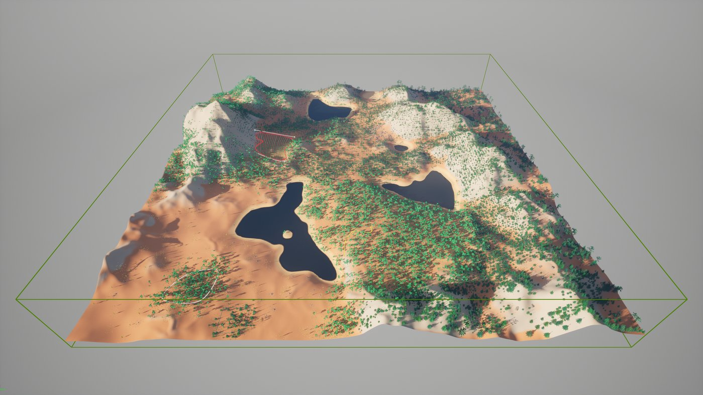

# PCG Biome Core Overview

> 路径：虚幻引擎5.7文档 / 构建虚拟世界 / 程序化内容生成框架 / PCG群系 / PCG Biome Core Overview

> 原始页面：https://dev.epicgames.com/documentation/unreal-engine/procedural-content-generation-pcg-biome-core-and-sample-plugins-overview-guide-in-unreal-engine

该页面没有可用的官方中文版本；以下内容保留原文，并按本项目人工译文规则逐步回译。

PCG Biome Core 和 Sample 插件提供示例，展示如何使用 [PCG 框架](https://dev.epicgames.com/documentation/assets/building-virtual-worlds/procedural-generation/procedural-content-generation-overview) 以及 Attribute Set Tables、Feedback loops、Recursive Sub-graphs 和 [Runtime Hierarchical Generation](https://dev.epicgames.com/documentation/assets/building-virtual-worlds/procedural-generation/pcg-development-guides/using-pcg-generation-modes)等功能。本节包含 PCG Biome Core 和 Sample 插件的定义以及工具功能列表。

关于程序化内容生成（PCG）框架的更多信息，请参阅 [程序化内容生成框架](https://dev.epicgames.com/documentation/assets/building-virtual-worlds/procedural-generation/procedural-content-generation-overview).

## 什么是 PCG Biome Core

PCG Biome 概述

PCG Biome Core 是一个数据驱动的 biome 创建工具，由原生 PCG Framework 节点和图表构成，并使用数据资产。该工具采用系统化方式构建，提供固定管线，并以逻辑分段组织可自定义步骤。

它既是学习 PCG Framework 的示例，也利用了 Attribute Set Tables、Feedback loops、Recursive Sub-graphs 和 [Runtime Hierarchical Generation](https://dev.epicgames.com/documentation/assets/building-virtual-worlds/procedural-generation/pcg-development-guides/using-pcg-generation-modes).

制作团队可以用它作为世界创建工具集的起点，并根据特定需求进行复制、修改或扩展，且不需要或只需要很少编程支持。

> [!NOTE]
> 该插件本身标记为实验性，并会在后续更新中继续演进；它依赖处于 Beta 或 Ready for Production 状态的 PCG Framework 与标准 UE 功能。如果要在生产中使用，建议复制该插件，以避免未来版本破坏现有内容。

PCG Biome Core 插件是独立插件，只包含工具运行所需的内容，例如基础数据资产、结构体、蓝图类和 PCG 图表。关于启用插件的更多信息，请参阅 [使用插件](https://dev.epicgames.com/documentation/assets/understanding-the-basics/customizing-unreal-engine/working-with-plugins).

## 什么是 PCG Biome Sample

PCG Biome 概述

PCG Biome Sample 是展示 PCG Biome Core 工具的内容示例。它包含以下功能：

- 包含预配置 Biome Core 的 World
- 多个 biome，包括 biome volume、biome spline、biome texture 等资产以及其他注入数据
- 一个特定的农田生成器

Biome Sample 插件可以通过插件设置在任意项目中启用。它依赖 Biome Core 插件及自身内容。Biome Sample 是设置 Biome Core 的指南和参考，不需要加载单独项目。

## 功能列表

PCG Biome Core 包含以下功能：

- 数据驱动。可针对任何制作需求复制、修改或扩展。
- 仅使用 PCG 原生节点。没有自定义代码，也没有自定义蓝图元素。
- 固定管线，以逻辑分段组织，并通过 PCG 图表和数据资产提供可自定义步骤。
- 不限数量的用户定义 biome。
- 可直接使用的类、结构体、数据资产和图表。
- 可以通过体积、样条和纹理在空间上定义 biome。
- 按每个 Biome Actor 进行本地生成，并支持实时更新。
- 本地属性集表，用于保存由 biome Actor 中所有数据资产引用构建出的 biome 资产属性。
- 可选的本地资产和 biome 定义，按每个 Biome Actor 嵌入且唯一。
- Local Biome Cache，用于按每个 biome Actor 和 biome Actor 类型（体积、样条或纹理）在 3D 空间中定义 biome 边界。
- 多个 biome 的分层和优先级排序。
- 按每个 biome 进行本地混合，并可控制混合范围、噪声和密度。
- 创建新 Biome 时的本地预览模式。
- 支持排除体积和排除样条。
- 支持生成网格体、PCG Data Assets、PCG Assemblies 和 Actor。
- 从网格体获取点边界，并支持自定义边界缩放。
- 生成点的分层；重叠由生成器优先级和精确边界管理。
- 支持多种生成器子类型，以便更好地控制 biome 中的资产分布，例如使用 Landscape 图层权重绘制。
- 通过可自定义的计算和纹理投射筛选图表（例如高度、密度和流向）进行全局根点和子点筛选。
- 按资产进行递归分层变换和生成，并支持每个递归层级有多个子项。
- 递归最大深度和比例控制。
- 按每个资产条目覆盖静态网格体属性，例如投射阴影或碰撞。
- 按每个资产条目设置变换偏移和缩放。
- 在 Landscape 和网格体上生成 GPU Hierarchical Generation 细节。

> [!WARNING]
> Unreal Engine 5.6 版本中为 Biome Core 引入的主要更改与既有 Biome 资产和 Actor 向后兼容，但需要执行一次全局刷新；可通过在给定 World 中切换 Biome Actor 的启用状态触发刷新。Biome Setup Actor 类已弃用，必须替换为 Biome Texture 体积，具体做法如 Biome Sample Level 所示。
