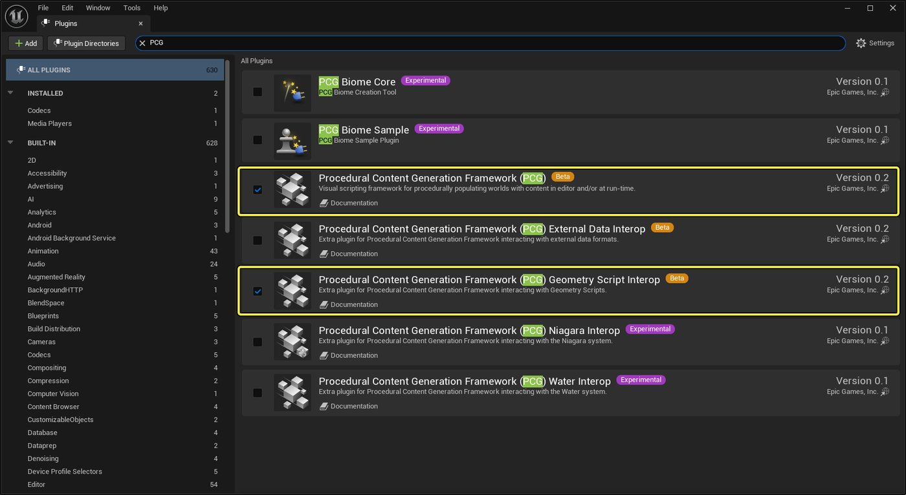
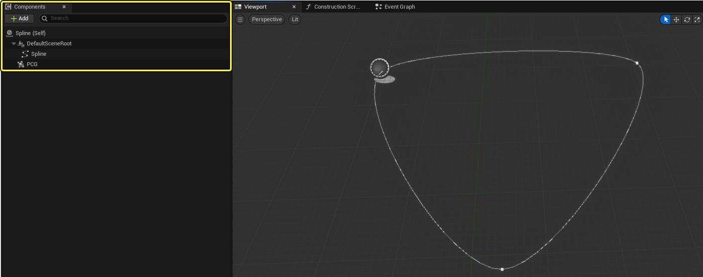
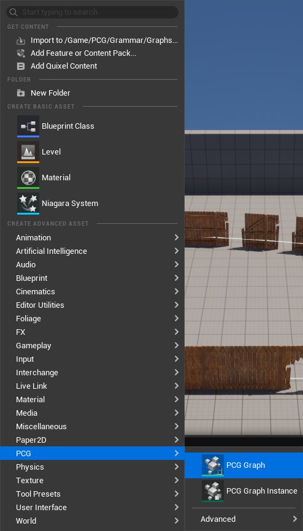
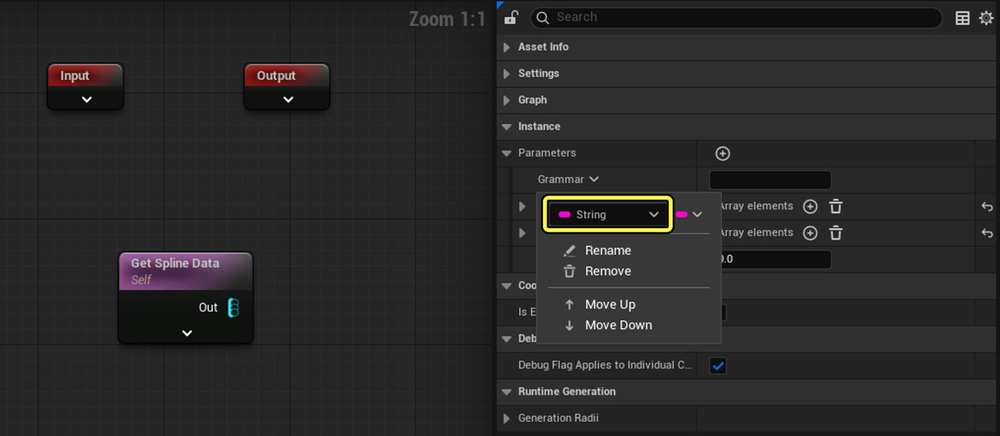
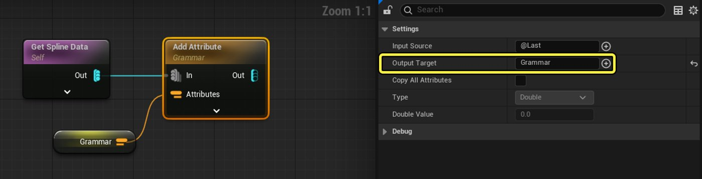
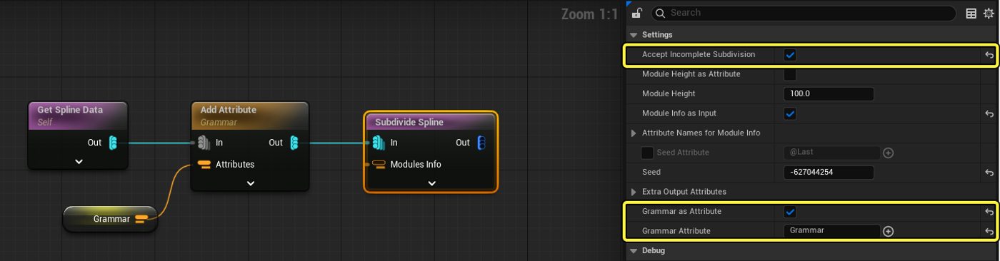
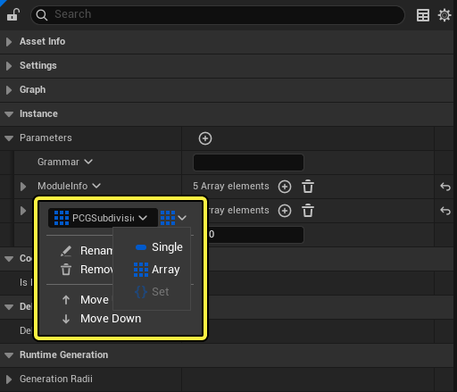
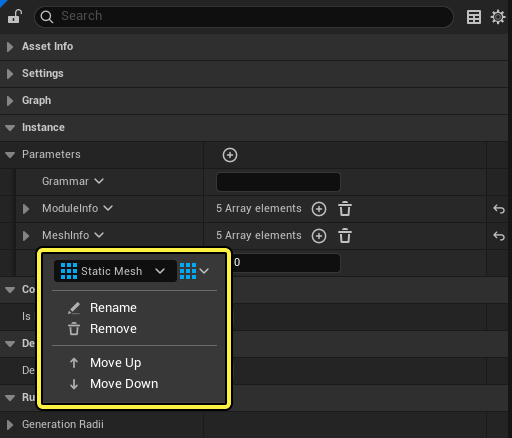

# 使用形状语法创建栅栏生成器

> 路径：虚幻引擎5.7文档 / 构建虚拟世界 / 程序化内容生成框架 / PCG开发指南 / 使用形状语法创建栅栏生成器

> 原始页面：https://dev.epicgames.com/documentation/unreal-engine/creating-a-fence-generator-using-shape-grammar-in-unreal-engine

[形状语法](../../using-shape-grammar-with-pcg/index.md)在虚幻引擎的[程序化内容生成框架](../../procedural-content-generation-overview/index.md)中的常见用途是构建系统。 在本示例中，你将创建一个栅栏生成器。它可以使用语法沿样条线生成数个静态网格体，并在样条线控制点变动时随之修改网格体。

> [!NOTE]
> 此示例使用Fab商城中的免费[私人栅栏包（含破损分段）](https://www.fab.com/listings/71f4143b-a429-4c8b-9ae6-8e03609cbaf4)资产包。 但此示例可以使用你选择的任意静态网格体来创建。

## 先决条件

本操作指南所使用的术语和概念已在以下文档中有所讨论：

- [程序化内容生成概述](../../procedural-content-generation-overview/index.md)
- [将形状语法用于PCG](../../using-shape-grammar-with-pcg/index.md)

## 项目设置

1. 在虚幻引擎中[新建项目](../../../../understanding-the-basics/working-with-projects-and-templates/creating-a-new-project/index.md)。
2. 使用基本（Basic）关卡模板[创建新关卡](../../../../understanding-the-basics/levels/working-with-levels/index.md)。 保存关卡。
3. 打开**编辑（Edit） > 插件（Plugins）**并确认激活了以下插件：

   1. **程序化内容生成框架（PCG）**
   2. **程序化内容生成框架（PCG）几何体脚本互操作**

## 创建样条线

将PCG图表连接到一个PCG组件和一个样条线，它们包含在一个新的蓝图类中。 创建蓝图类的步骤如下：

1. 在**内容侧滑菜单**或**内容浏览器**中点击右键，选择**蓝图类（Blueprint Class**）以创建一个新蓝图类。
2. 将新蓝图类命名为**FenceSpline**。
3. 在**组件（Components）**选项卡中添加一个工具**样条线**和一个**PCG**组件。
4. 保存蓝图类。

## PCG图表资产

**PCG图表**是栅栏生成器的基础，包含了用于沿样条线生成栅栏分段的指令。 新建PCG图表资产的步骤如下：

1. 在**内容侧滑菜单**或**内容浏览器**中点击右键，找到**PCG**并选择**PCG图表**。

   
2. 将新资产命名为**PCG_FenceGen**并按**Enter**键。
3. 双击**PCG_ForestGen**打开PCG图表编辑器。

## 创建PCG语法

语法以字符串的形式存储在图表参数中。 由于将值存储在参数中，因此它可以通过**参数重载（Parameter Overrides）**来自定义关卡中每个栅栏生成器的实例。 之后，**语法（Grammar）**属性会被添加到样条线数据，并传递给**细分样条线（Subdivide Spline）**节点，从而沿着样条线分配点。

1. 在**PCG图表编辑器窗口**中，将一个**Get Spline Data**节点添加到图表。
2. 点击屏幕上方的按钮，打开**图表设置（Graph Settings）**以新建一个**参数（Parameter）**。 将新参数命名为**Grammar**并将其类型改为**字符串（String）**。

   
3. 将**Grammar**的初始值设置为`A*`。 这会让图表放置一个初始静态网格体，然后使用静态网格体填充样条线的剩余部分，直至填满所有空间。
4. 拖出**Get Spline Data**节点的输出引脚，创建一个**Add Attribute**节点。 在细节面板中，将**输出目标（Output Target）**改为`Grammar`。
5. 为**Grammar**参数创建一个“Get”节点，并将其连接到**Add Attribute**节点的**Attributes**输入。

   
6. 勾选**接受不完整细分（Accept Incomplete Subdivision）**复选框。
7. 勾选**以语法为属性（Grammar as Attribute）**复选框并将**语法属性（Grammar Attribute）**设为`Grammar`。

   

## 为语法分配网格体

你需要为语法中的每个符号都分配一个静态网格体，以便生成。 这要用到两个参数：**模块信息（Module Info）**和**网格体信息（Mesh Info）**。 模块信息包含一组符号。 网格体信息包含一组静态网格体。 此信息在稍后会以属性集的形式被传递到**细分样条线（Subdivide Spline）**节点。

1. 选中**细分样条线（Subdivide Spline）**节点，勾选**以模块信息为输入（Module Info as Input）**。 这会为属性添加一个输入，它被用于将模块信息分配给语法符号。
2. 在图表设置中新建一个参数，将其命名为Module Info。 将其类型改为**PCG细分子模块（PCG Subdivision Submodule）**并点击类型旁的下拉菜单，选择**数组（Array）**。 它将保存我们的符号信息。

   
3. 点击**+**按钮，添加一个新的数组元素。再点击**索引[0]（Index [0]）**旁的箭头打开此条目。
4. 将**符号（Symbol）**值设置为`A`并勾选**可缩放（Scalable）**复选框。
5. 在图表设置中新建一个参数，将其命名为**Mesh Info**。 将其类型改为**静态网格体（Static Mesh）**并点击类型旁的下拉菜单，选择**数组（Array）**。 它将保存我们的静态网格体信息。

   
6. 点击**+**按钮，在Mesh Info中添加一个新的数组元素。
7. 打开**索引[0]（Index [0]）**旁的下拉菜单，选择**Fence_17_DE**静态网格体。

## 创建提取信息子图表

细分过程会为每个模块分配一个尺寸，并在边界中心放置一个枢轴点。 如果网格体在之后发生变化，或其枢轴点没有位于网格体中心，这就会造成问题。 此子图表会直接从所选网格体的边界上提取尺寸信息，并调整其枢轴点，使其位于网格体中心。

### 设置Input节点

1. 在**内容侧滑菜单**或**内容浏览器**中新建一个**PCG图表**并将其命名为**PCG_ExtractInfo**。
2. 点击**Input**节点，在细节面板中打开**引脚（Pins）**选项。 **打开索引[0]（Open Index [0]）**并将**标记（Label）**改为`Mesh Info`。
3. 将**允许的类型（Allowed Types）**选项改为**点或参数（Point or Param）**。
4. 将**引脚状态（Pin Status）**选项改为**普通（Normal）**。
5. 将**说明文本（Tooltip）**改为`要提取信息的网格体列表（List of meshes to extract info from）`。

   > 图片已省略：输入节点设置

### 提取网格体边界

1. 打开**图表设置**并创建一个新的参数。 将其命名为**Mesh Attribute Name**并设置类型为**Name**。 将其初始值设置为`Mesh`。
2. 拖出**Input**节点的输出引脚，创建一个**Attribute Rename**节点。
3. 在细节面板中，将**新属性名称（New Attribute Name）**设为`Mesh`。
4. 创建一个**Get Mesh Attribute Name**节点，将其连接到**Attribute Rename**节点的**Attribute to Rename**输入。
5. 从**Attribute Rename**节点拖出引线，新建一个**Bounds From Mesh**节点。
6. 点击新节点，将网格体属性（Mesh Attribute）值设置为`Mesh`。

   > 图片已省略：添加Attribute Rename节点和设置
7. 拖出**Attribute Rename**的输出引脚，将其连接到**Bounds From Mesh**节点的**Attribute**输入。 图表会自动创建一个筛选器来创建恰当的输入。
8. 按住**ALT**键并点击新筛选器节点的输出引脚，断开其连接。
9. 从断开的筛选器节点拖出引线，创建一个**Attribute Set To Point**节点。 将该节点的输出连接到**Bounds From Mesh**的输入。 这可以让图表同时支持点和属性集数据类型。
10. 点击“Bounds From Mesh”节点，将**网格体属性（Mesh Attribute）**选项设为`Mesh`。

    > 图片已省略：图表结构处理点和属性集数据

### 调整枢轴点

1. 静态网格体上的枢轴点需要调整，才能在样条线上正确显示。首先，从**Bounds From Mesh**拖出引线，创建**Multiply**节点。
2. 点击新节点，将**Input Source 1**的值设置为`$Extents.X`。这将从边界数据中提取X范围。
3. 从**In B**输入拖出引线，创建**Create Attribute**节点。 将**Double Value**改为`2.0`。
4. 再次点击**Multiply**节点，将**Output Target**值更改为`Size`。 这将输出X值乘2后的结果，并将其存储在名为Size的属性中。

   > 图片已省略：添加Multiply节点和设置
5. 从**Multiply**节点拖出引线，创建**Copy Attributes**节点。 再从**Multiply**的输出拖出引线，将其连接到新节点的**Source**输入。 此节点会从边界数据中提取X的范围，并将其存储在属性中以备在将来有需求时帮助进行缩放。
6. 点击**Copy Attributes**，将**Input Source**设为`$Extents.Z`。
7. 将**Output Target**设为`ExtentsZ`。

   > 图片已省略：拷贝属性节点
8. 从**Copy Attributes**的输出拖出引线，再创建一个**Multiply**节点。 此节点将帮助把枢轴点移动到网格体的中心。
9. 从**In B**输入拖出引线，创建**Create Attribute**节点。 将**Double Value**改为`-1.0`。
10. 再次点击**Multiply**节点。 在细节面板中将**Input Source 1**的值设为`$LocalCenter`。
11. 将**Output Target**的值设为`PivotOffset`。

    > 图片已省略：添加第二个Multiply节点

### 设置Output节点

1. 点击**Output**节点，将其放在图表的末端。
2. 在细节面板中打开**引脚（Pins）**选项。 **打开索引[0]**并将**允许的类型（Allowed Types）**改为**属性集（Attribute Set）**。
3. 将**引脚状态（Pin Status）**选项改为**普通（Normal）**。

   > 图片已省略：输出节点设置
4. 从**Multiply**节点的输出拖出引线，新建一个**Point to Attribute Set**节点。
5. 将新节点的输出连接到**Output**节点的**Out**引脚。

   > 图片已省略：将点数据转换为属性集
6. 保存完成的图表。

   > 图片已省略：完整子图表
7. 回到**PCG_FenceGen**图表编辑器窗口。 将你的**PCG_ExtractInfo**图表资产从**内容侧滑菜单**或**内容浏览器**拖放到视口中，并选择**创建PCG_ExtractInfo子图表节点**。

   > 图片已省略：创建子图表节点

## 应用模块和网格体信息

1. 返回**PCG_FenceGen**图表，创建一个**Add Attribute**节点，并将其放在**细分样条线（Subdivide Spline）**节点附近。
2. 创建一个**Get Module Info**节点，将其连接到**Add Attribute**的**In**输入。
3. 创建一个**Get Mesh Info**节点，将其连接到**Add Attribute**的**Attributes**输入。
4. 将**Add Attribute**的**Out**连接到**PCG_ExtractInfo**子图表节点的 **Mesh Info** 输入。
5. 将子图表节点的输出连接到**细分样条线（Subdivide Spline）**节点的**Modules Info**输入。

   > 图片已省略：连接模块和网格体数据
6. 从**细分样条线（Subdivide Spline）**节点的输出拖出引线，创建一个**Match and Set Attributes**节点。 将子图表节点的输出连接到其**Match Data**输入。 此节点会接收来自**细分样条线（Subdivide Spline）**的点数据和语法，并将其与来自那些参数的**模块信息（Module Info）**和**网格体信息（Mesh Info）**进行匹配。
7. 点击"Match and Set Attributes" 节点并对以下选项进行设置：

   1. 勾选**匹配属性（Match Attributes）**复选框。
   2. 将**输入属性（Input Attribute）**和**匹配属性（Match Attribute）**的值设为`Symbol`。

   > 图片已省略：Match and Set Attributes节点

## 应用枢轴偏移变换

1. 从**Match and Set Attribute**的输出拖出引线创建**Multiply**节点。此节点会使用来自**PCG_ExtractInfo**子图表的数据缩放每一个网格体的枢轴。
2. 从**Match and Set Attribute**节点的输出拖出引线，将其连接到**Multiply**节点的**In B**输入。
3. 点击**Multiply**节点。 将**Input Source 1**值设为`PivotOffset`，**Input Source 2**值设为`$Scale`。

   > 图片已省略：使用Multiply节点缩放枢轴
4. 从**Multiply**节点拖出引线，创建一个**Vector: Transform Direction**节点。 此节点会旋转枢轴，以匹配样条线上的点。
5. 从**Multiply**节点的输出拖出引线，连接到**Vector: Transform Direction**节点的**Transform**输入。
6. 点击新节点，将**操作（Operation）**设为**变换方向（Transform Direction）**。
7. 将**Input Source 1**值设为`PivotOffset`，**Input Source 2**值设为`$Transform`。

   > 图片已省略：使用Transform Direction旋转枢轴
8. 从**Vector: Transform Direction**节点拖出引线，新建一个**Add**节点。 此节点会将最终枢轴偏移加到网格体枢轴的位置上。
9. 从**Vector: Transform Direction**的输出拖出引线，连接到**Add**节点的**In B**输入。
10. 将**Input Source 1**值设为`$Position`，**Input Source 2**值设为`PivotOffset`。

    > 图片已省略：使用Add节点应用偏移

## 生成静态网格体

1. 从**Add**节点的输出拖出引线，新建一个**Static Mesh Spawner**节点。 此节点将沿样条线生成静态网格体。
2. 在细节面板中，将**网格体选择器类型（Mesh Selector Type）**设为**PCGMeshSelectorByAttribute**。
3. 将**属性名称（Attribute Name）**值设为`Mesh`。
4. 保存图表。

   > 图片已省略：连接Static Mesh Spawner
5. 点击关卡中的**FenceSpline** Actor。 在细节面板中，选择**PCG**组件并使用下拉菜单将**图表（Graph）**选项设为**PCG_FenceGen**。

   > 图片已省略：连接PCG图表到PCG组件

## 结果

你应该会看到一系列栅栏静态网格体按着样条线的长度方向生成出来。

> 图片已省略：完整的栅栏生成器

你还可以为语法添加符号，在模块信息（Modules Info）中定义它们，并在网格体信息（Meshes Info）中为它们分配静态网格体，从而提升静态网格体的多样性。 这可以在图表中进行，也可以使用**参数重载（Parameter Overrides）**在实例上逐个进行。

> 图片已省略：参数重载基于每个实例工作

在下面的示例中，栅栏行还具有以下特征：

- 柱子使用符号`P`。
- 门使用符号`G`。
- 大破损分段使用符号`BL`。
- 小破损分段使用符号`BS`。

语法已更新为`{[A,P]:2,[BL,P]:1,[BS,P]:1}*,[G,P], {[A,P]:2,[BL,P]:1,[BS,P]:1}*`。

> 图片已省略：更新的语法产生了更有趣的结果
