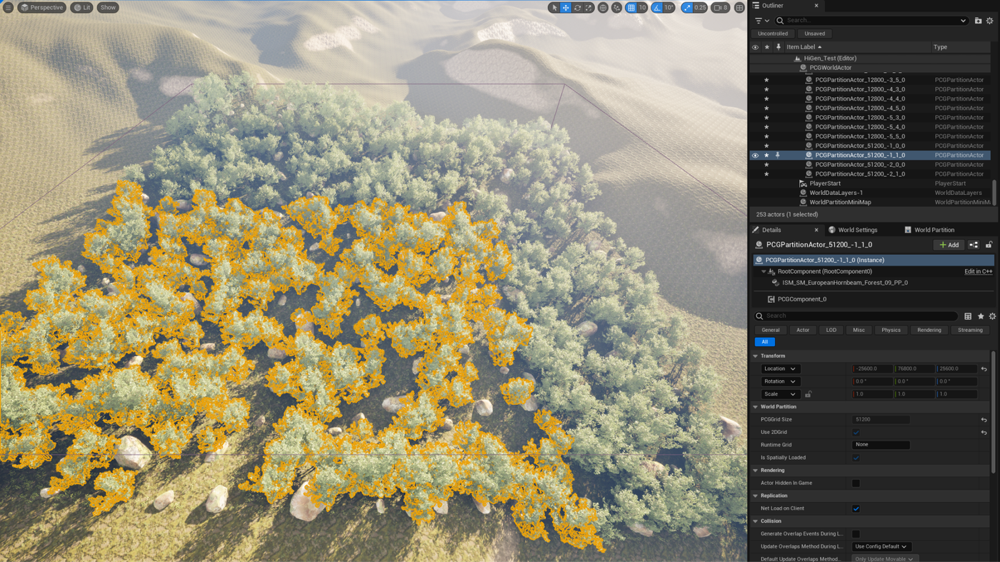
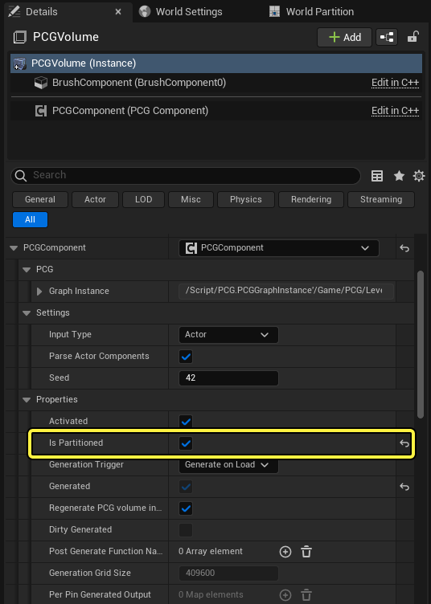
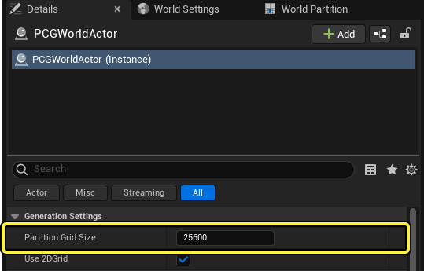
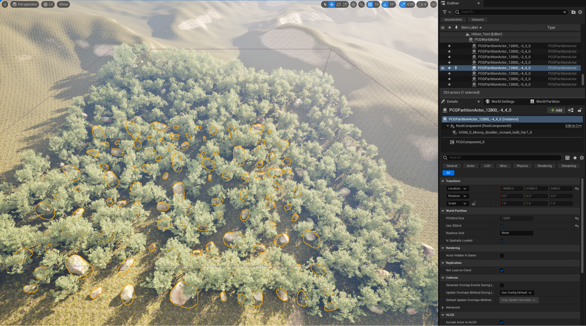
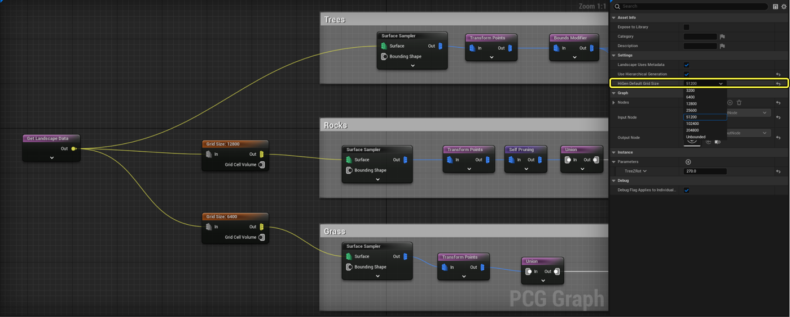
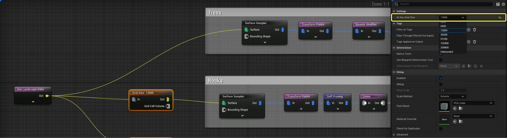
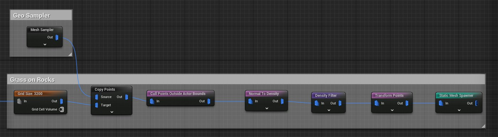
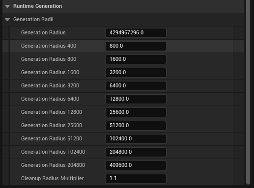

# 使用PCG生成模式

> 路径：使用PCG生成模式

> 原始页面：https://dev.epicgames.com/documentation/unreal-engine/using-pcg-generation-modes-in-unreal-engine

程序化内容生成框架（PCG）是用于在虚幻引擎中创建你自己的程序化内容和工具的工具集。 该框架包含多种PCG生成模式，便于使用PCG创建更大的世界。 生成模式会将PCG组件的生成域分拆到一个网格中，其中每个单元格包含自己的本地PCG组件。

> 图片已省略：PCG森林示例

在斜坡上生成树木、草和其他地被植物的PCG森林示例

在大型网格上，你可以生成显眼的大型网格体，例如树木和巨石。 在小型网格上，可以创建更小的细节，例如草、花和石头。 此方法可以更精细地控制PCG工具的执行，并用于微调覆盖大型区域的工具的性能。

PCG生成模式共有四个：

- **非分区生成（默认）**
- [分区生成](index.md)
- [分层生成](index.md)
- [运行时生成](index.md)

## 使用分区生成

默认情况下，PCG组件生成的所有网格体都被包含在组件的域中，例如体积或被绑定到样条线。 此模式适用于较小的PCG资产，但对于覆盖很大区域的资产，可能会造成性能问题。 分区生成会在用户定义的网格中生成网格体。 数据会被分拆到各单元格中，让你能更容易地使用其他系统（如[世界分区](https://dev.epicgames.com/documentation/assets/building-virtual-worlds/world-partition)和[关卡实例化](../../../world-partition/level-instancing/index.md)）进行流送。

分区PCG组件的示例。

### 在图表中启用分区

要在PCG组件上开启分区生成，请执行以下操作：

在PCG体积细节面板中开启PCG分区生成。

1. 在你的关卡中选择PCG资产。
2. 转到**细节（Details）**面板，点击**分区（Is Partitioned）**分段旁的复选框。

### 配置分区网格大小

分区网格的大小由**PCGWorldActor**的**分区网格大小（Partition Grid Size）**选项决定：

配置PCGWorldActor的分区网格大小选项

要配置网格大小，请执行以下操作：

1. 在**大纲视图**中选择**PCGWorldActor**。
2. 调整**分区网格大小（Partition Grid Size）**选项的值。
3. 选择关卡中的所有PCG资产，点击**细节（Details）**面板中的**清理（Cleanup）**。
4. 点击**生成（Generate）**按钮以重新生成结果。

## 使用分层生成

分层生成支持按多个比例使用PCG生成网格体。 此类型的生成会使用**Grid Size**节点重载分区生成中使用的分区网格大小，从而让你能够微调网格体生成。

显示以较小的网格大小生成高亮岩石的示例

Grid Size节点为在其下游生成的所有数据自定义生成网格的大小，应该放置在所有取样器节点之前。

### 在图表中启用分层生成

要在PCG图表中启用分层生成，请执行以下操作：

在PCG图表设置中切换PCG分层生成

1. 打开你的PCG图表并点击"图表设置（Graph Settings）"。
2. 点击"使用分层生成（Use Hierarchical Generation）"旁边的复选框。
3. 打开"分层生成默认网格大小（HiGen Default Grid Size）"的下拉框并选择值。
4. 保存你的PCG图表。

> [!WARNING]
> 分层生成需要你的PCG组件已分区。 请确保在你的关卡中启用[分区生成](index.md)，然后再使用此功能。

### 配置网格大小设置

使用Grid Size节点在PCG图表中自定义你的网格体的生成：

使用Grid Size节点设置分层生成网格大小

1. 搜索**Grid Size**节点，并将其添加到PCG图表中各个需要重载默认分层生成网格大小的分支中的取样器节点之前。
2. 点击**Grid Size**节点并调整**分层生成网格大小（HiGen Grid Size**）设置。
3. 保存图表。
4. 在你的关卡中重新生成你的结果。

> [!NOTE]
> 在图表中根据你的网格体大小来确定相应的网格大小。 大型网格体的数量常常少于小型网格体，所以大型网格体应该放置在较大的网格上，便于流送。 小型网格体数量更多，应该放置在较小的网格中。

分层生成使用以下执行指南：

- 在你的PCG图表中，不位于Grid Size节点之后的节点将使用**分层生成默认网格大小（HiGen Default Grid Size）**设置中定义的值生成数据。
- 在执行较小网格期间，较大网格大小上生成的数据可作为缓存数据使用。 它在图表中从较大网格大小下降到较小网格大小，但不会从较小网格上升到较大网格。
- 如果节点拥有来自多个网格大小的数据输入，输出将使用最小的网格大小生成。

### 使用未绑定网格大小

在下面的示例中，一个Mesh Sampler节点在PCG体积中对一个巨石网格体取样：

显示未绑定网格大小用法的示例

取样器会按**分层生成默认网格大小（HiGen Default Grid Size）**对体积内容取样，并运行性能密集型运算四次，体积中的每个网格单元格一次。 使用此图表设置，性能会随着体积增大而变差。

对于这种情况，推荐使用**未绑定（Unbounded）**网格大小。 未绑定（Unbounded）会删除PCG组件的网格限制，并将使用此网格大小执行节点一次。 然后，可以使用Grid Size节点再应用网格限制。

> [!NOTE]
> PCG子图表禁用了其网格大小，并使用其输入数据或父图表的网格大小。

> [!WARNING]
> 将数据从较大网格传递到较小网格时，可能会生成重复的点数据。 当为较大网格生成的数据在较小网格的每个单元格中复制时会发生此情况，这会显著影响性能。 你可以使用**Cull Points Outside Actor Bounds**节点从点数据中删除位于较小网格单元之外的点，从而删除重复数据。

## 使用运行时生成

运行时生成是PCG组件的特殊生成模式，在**PCG生成源（PCG Generation Sources）**附近动态生成并清理内容。 它可以在编辑器、PIE和独立构建中使用。

> 动图已省略：SearchText

> [!TIP]
> 运行时生成在配合分层生成时效率最高，可以只在需要的地方高效散布较高级别的细节。

### 生成源

生成源是世界中的一些点，它们能使附近运行时生成的组件生成网格体。

类似于世界分区，PCG使用以下内容作为流送源：

- **编辑器视口源（Editor Viewport sources）**：在**PCGWorldActor**上开启**将编辑器视口视为生成源（Treat Editor Viewport as Generation Source）**选项时，附加到活动的或作为焦点的编辑器视口的源。
- **玩家源（Player sources）**：附加到关卡中玩家控制器的源。
- **世界分区流送源（World Partition streaming sources）**：附加到充当世界分区系统中的流送源提供程序（PlayerController、WorldPartitionStreamingSourceComponent等）的任意对象的源。
- **PCG生成源组件（PCG Generation Source Components）**：用作可附加到任何Actor的通用生成源的源。

PCG图表中的**生成半径（Generation Radii）**设置决定了生成源影响PCG组件的范围，并针对各分区网格大小分别设置。 当运行时生成的PCG组件位于此半径之内时，将安排生成。 当组件不再位于此半径之内时（按**清理半径乘数（Cleanup Radius Multiplier）**缩放），该组件就会被清理。

你还可以在细节面板中开启**重载生成半径（Override Generation Radii）**设置，从而重载关卡中各个PCG组件上的生成半径。

> [!NOTE]
> 基础**生成半径（Generation Radius）**适用于非分区组件，以及分区分层生成组件的未绑定网格级别。

PCG图表设置中的PCG生成半径设置

> [!WARNING]
> 推荐避免让较小的网格大小的生成半径大于较大网格大小。 每个生成半径的大小应该比前一个更大。

### 调度策略

安排策略用于提供实际规则，从而确定按怎样的顺序来安排运行时生成的组件进行生成。 默认安排策略使用距离和查看方向，优先生成位于生成源前面和附近的组件。

安排策略需按组件设置，位于PCG组件的细节面板中。

> 图片已省略：位于PCG资产的细节面板中的PCG调度策略设置

位于PCG资产的细节面板中的PCG调度策略设置

> [!WARNING]
> 在虚幻引擎5.5中，新增的分层生成网格大小指数（HiGen Grid Size Exponential）大大提高了方向权重在调度策略中的相对重要性。 如果你的内容是在5.5版本之前创建的，可能需要降低方向权重。

#### 使用视锥体剔除

在某份PCG资产的**细节**面板中选择**使用视锥体剔除（Use Frustum Culling）**后，该资产在生成组件时会先根据给定的观察视锥体来检查该组件是否可见。 例如，如果玩家摄像机提供了视锥体，那么该资产会剔除（即决定不生成）那些在玩家摄像机视角中不可见的组件。

用**生成边界修改器（Generate Bounds Modifier）**和**清理边界修改器（Cleanup Bounds Modifier）**选项即可让组件在进入观察视锥体前在一定的距离上被生成或清理。 这样可以避免在摄像机对准组件时，组件突然出现的情况。 清理修改器的值总是大于或等于生成修改器的值。

### 启用运行时生成

要在你的PCG图表中启用运行时生成，请执行以下操作：

> 图片已省略：PCG启用运行时生成

PCG启用运行时生成

在你的PCG资产的细节面板中，将**生成触发器（Generation Trigger）**更改为**在运行时生成（Generate at Runtime）**。

要在视口中测试运行时生成，请执行以下操作：

1. 在大纲视图中选择**PCGWorldActor**。
2. 确保勾选**将编辑器视口视为生成源（Treat Editor Viewport as Generation Source）**的复选框。

你应该会在视口中看到在摄像机视图周围半径内生成的网格体。

### 配置运行时生成

你可以在PCG图表设置中为每个级别的网格大小定义生成半径，也可以根据关卡的需要在PCG组件的**细节**面板中设置。

要配置生成半径，请执行以下操作：

1. 打开**PCG图表设置（PCG Graph Settings）**并展开**运行时生成（Runtime Generation）**>**生成半径（Generation Radii）**。
2. 为每个网格大小调整生成半径。 **生成半径（Generation Radius）**选项会应用于默认网格大小，或在你使用未绑定（Unbounded）选项时应用。
3. 调整**清理半径乘数（Cleanup Radius Multiplier）**。 此乘数应用于生成半径，以确定从关卡中删除网格体的半径。
4. 保存图表。

PCG资产现在将仅在查看者周围的半径之内生成网格体。

### 调试和运行时重载

以下是一些实用的控制台命令，用于在运行时期间调试运行时生成。

| 控制台命令 | 说明 |
| --- | --- |
| **pcg.RuntimeGeneration.Enable** | 开启运行时生成。 |
| **pcg.RuntimeGeneration.EnableDebugging** | 开启运行时生成安排程序的冗长日志记录，以便清晰了解其具体行为。 |
| **pcg.RuntimeGeneration.EnablePooling** | 开启运行时生成的分区Actor的池，避免固定分配。 该选项默认启用。 |
| **pcg.RuntimeGeneration.BasePoolSize** | 设置池中运行时生成的分区Actor的初始数量。 默认设置为`100`。 |
| **pcg.RuntimeGeneration.FramesBetweenGraphSchedules** | 设置运行时生成安排程序在安排组件进行生成之间必须等待的更新次数。 者在调试你的安排策略以观察安排组件的确切顺序时很有用。 默认设置为0，这允许在单次更新中安排所有生成。 |
| **pcg.RuntimeGeneration.NumGeneratingComponents** | 设置并行生成的PCG组件的数量。有助于限制PCG的CPU占用，并控制特定组件的屏幕显示时间。 较低的数量会显著影响距离和方向的权重，因为当组件并行生成时，将无法保证执行。 默认设置为`16`。 |
| **pcg.FrameTime** | 分配PCG每帧要执行的时间（以毫秒为单位）。 默认设置为`16.667`毫秒。 |
| **pcg.EditorFrameTime** | 分配PCG在编辑器（非PIE）中运行时每帧要执行的时间（以毫秒为单位）。 默认设置为`50`毫秒。 |

## 在PCG图表中可视化网格大小

使用调试对象树可视化PCG图表中的每个节点使用的网格大小。

要在PCG图表中可视化网格大小，请执行以下操作：

1. 从位于左下角的调试对象树列表中选择本地PCG组件。 每个组件名称都包含网格大小。 例如，`PCGPartitionActor_12800_1_5_0/PCGComponent_1/NewPCGGraph`是12800厘米网格的一部分。
2. 点击组件名称旁边的箭头并选择组件。

> 图片已省略：可视化PCG网格大小

显示分层生成网格大小的可视化的示例

在以上示例中，选择了生成树木网格体的组件(1)。 生成岩石网格体(2)和草地网格体(3)的节点显示为灰色，表明这些节点在较小的网格大小上生成树木，并将在树木节点之后执行。 每个节点在右上角以米为单位显示其网格大小。
