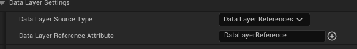
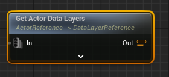
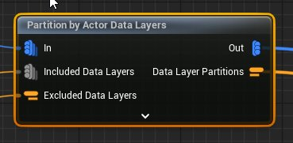
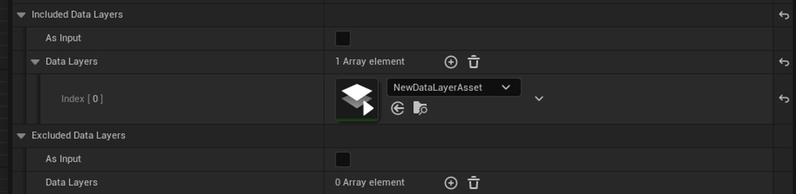
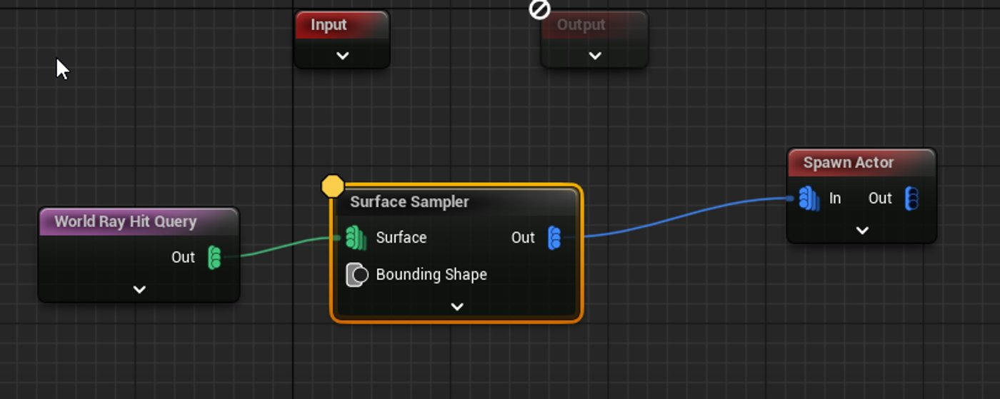
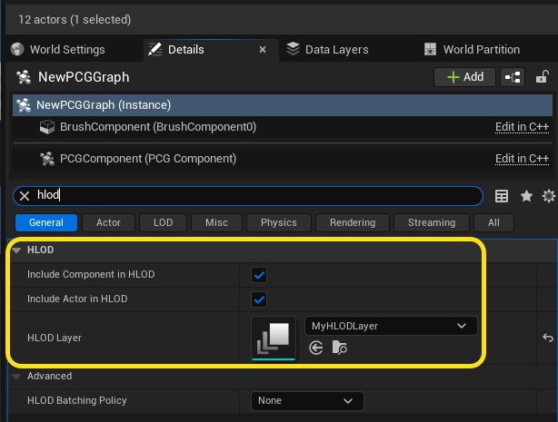
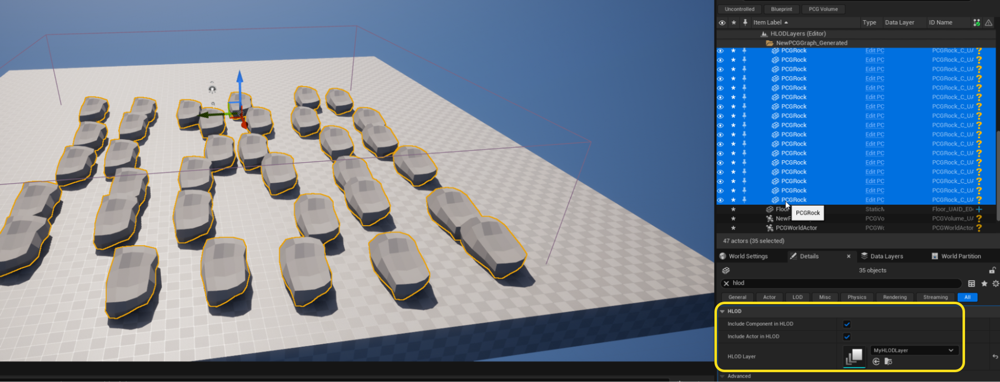
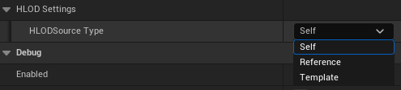

# 将PCG用于世界分区

> 路径：虚幻引擎5.7文档 / 构建虚拟世界 / 程序化内容生成框架 / PCG开发指南 / 将PCG用于世界分区

> 原始页面：https://dev.epicgames.com/documentation/unreal-engine/using-pcg-with-world-partition-in-unreal-engine

将PCG资产分配到[世界分区 - 数据层](../../../world-partition/world-partition---data-layers/index.md)和[分层细节级别](../../../world-partition/world-partition---hierarchical-level-of-detail/index.md)后，PCG图表会生成Actor并将其分配到同一数据层和HLOD层。

## 使用数据层

下方示例中存在两个[被分区的](../using-pcg-generation-modes/index.md)PCG体积。 其中一个负责生成岩石网格体，被分配到了**DL_Rocks**数据层。 另一个负责生成树木网格体，并被分配到了**DL_Trees**数据层。

> 图片已省略：在数据层窗口中选中生成的树。 它被分配到了DL_Trees数据层。

在**数据层（Data Layers）**窗口中选择生成的网格体，可以看到岩石被自动分配到了**DL_Rocks**，而树木被自动分配到了**DL_Trees**。

### Spawn Actor和Create Target Actor节点的数据层设置

Spawn Actor和Create Target Actor节点都拥有名为 数据层源类型（Data Layer Source Type） 的设置项，该设置项决定了节点为数据层分配Actor的方式。

数据层源类型 可被设为如下选项：

- **自身（Self）**：Spawn Actor或Create Target Actor节点会将与源PCG组件Actor相同的数据层分配给生成的Actor。
- **数据层引用（Data Layer References）**：节点使用由**数据层引用****特性**设定的输入参数数据来分配数据层。

Spawn Actor和Create Target Actor节点支持使用**包含的数据层（Included Data Layers）**和**排除的数据层（Excluded Data Layers）**属性进行筛选。这些属性可以是输入，也可以是直接引用。

此外，你还可以使用**添加数据层（Add Data Layers）**类别来指定要分配的其他数据层，以将其作为输入或直接引用。

### 获取Actor数据层

**Get Actor Data Layers**节点会读取输入的**Actor引用（ActorReference）**特性，然后将这些输入使用的所有数据层输出到**数据层引用（DataLayerReference）**特性中。 输出是单独的参数数据，其每个数据层资产都包含一个条目。

### 按Actor数据层分区

**Partition By Actor Data Layers**节点以点数据为输入，并根据输入点数据中的数据层输出一个或多个点数据分区。

该节点会使用**Actor引用（ActorReference）**特性解析输入点，以获取Actor所用的数据层。 然后该节点会为输入上存在的每个数据层组合分别创建一个点数据和一个数据层分区。

要在该流程中包含或排除数据层，请使用节点的**包含的数据层（Included Data Layers）**和**排除的数据层（Excluded Data Layers）**输入，或在节点设置中使用**数据层（DataLayer）**资产引用。

使用节点设置中的数据层资产引用

使用包含的数据层时会忽略其他数据层。 使用排除的数据层时，会考虑所有数据层，但排除的数据层除外。

#### 示例1

输入数据包含三个指向三个不同Actor的点。 其中一个Actor使用**数据层A（DataLayerA）**，另外两个Actor使用**数据层B（DataLayerB）**。

输出将包含两个点数据和两个数据层分区（作为参数数据存储）。

第一个点数据会包含正在使用**数据层A**的点。第二个点数据会包含使用**数据层B**的两个点。

第一个数据层分区会包含一个使用**数据层引用（DataLayerReference）**特性的条目，该特性指向**数据层A**资产。 第二个分区会包含一个使用**数据层引用（DataLayerReference）**特性的条目，该特性指向**数据层B**资产。

#### 示例2

输入包含以下点：

- 可解析为**数据层A**的点
- 可解析为**数据层B**的点
- 同时可解析为**数据层A**和**数据层B**的点

输出会包含三个点数据（每份数据使用一个点），以及三个参数数据。

第一个点数据会包含正在使用 数据层A 的点。 第二个点数据会包含正在使用 数据层B 的点。 第三个点数据会包含正在同时使用**数据层A**和的**数据层B**的点。

第一个数据层分区会包含一个使用 数据层引用特性 的条目，该特性指向 数据层A 资产。 第二个分区会包含一个使用 数据层引用特性 的条目，该特性指向 数据层B 资产。第三个分区会包含两个条目，其中一个条目指向**数据层A**资产，另一个指向**数据层B**资产。

## 使用HLOD层

下方示例展示了一个可生成岩石网格体的**Surface Sampler**节点。

包含该取样器的PCG图表被设为将其所有组件和Actor分配给名为**MyHLODLayer**的HLOD层。

选中被生成的网格体后，可以看到被生成的岩石被自动分配给了**MyHLODLayer**。

### Spawn Actor和Create Target Actor节点的HLOD设置

Spawn Actor和Create Target Actor节点都拥有名为**HLOD源类型（HLODSource Type）**的设置项，该设置项决定了节点为HLOD层分配Actor的方式。

**HLOD源类型**可被设为如下选项：

- **自身（Self）**：Spawn Actor或Create Target Actor节点会将与源PCG组件Actor相同的HLOD层分配给生成的Actor。
- **引用（Reference）**：节点会通过直接引用节点设置中的HLOD层来分配HLOD层。
- **模板（Template）**：节点会使用其模板Actor的HLOD层引用。
