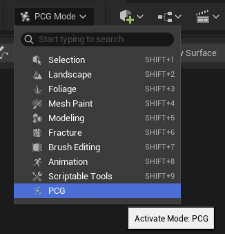
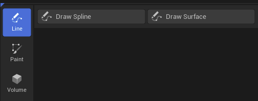
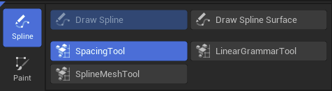
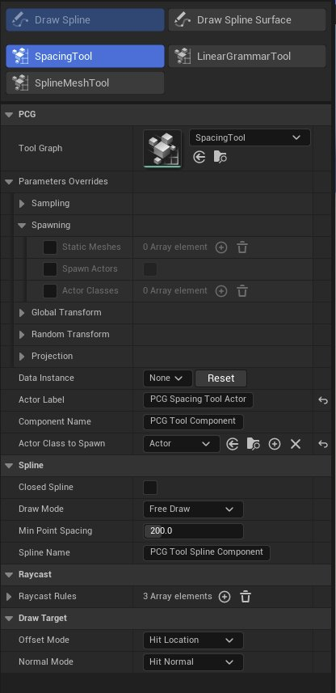
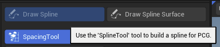
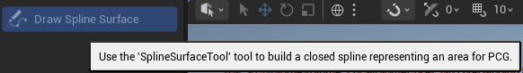
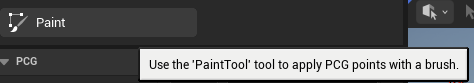
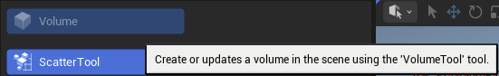

# PCG编辑器工具模式

> 路径：虚幻引擎5.7文档 / 构建虚拟世界 / 程序化内容生成框架 / PCG编辑器工具模式

> 原始页面：https://dev.epicgames.com/documentation/unreal-engine/pcg-editor-mode-in-unreal-engine

你可以使用**PCG编辑器工具模式**在关卡中放置PCG内容（包括样条、表面、绘制和体积）。该模式提供了一个可自定义的工具库，用于创建基于PCG框架的预设，且每个预设都关联有相应的PCG图表和参数。

若要访问PCG编辑器模式，请打开**模式**下拉菜单并选择**PCG**。

> [!NOTE]
> 尽管这只是该模式的初版，但我们会不断改进并提高其灵活性。这样一来，除了设置和放置默认图表和Actor之外，你还可以扩展可用的工具。

## PCG模式工具

选择工具后的结果取决于你当前是否选中了合适的Actor。

- 如果选中了Actor，系统会在必要时向该Actor添加PCG组件；如果不存在工具数据资产，则会新建一个。
- 如果未选中Actor，系统将创建一个Actor来执行操作，具体操作会根据所选图表或预设而有所不同。

> [!NOTE]
> 如果你选中的Actor类别不正确，或者该Actor缺少图表正常运行所需的组件，工具按钮将处于禁用状态。 同样，任何与当前所选Actor不兼容的预设也都不会显示。

点击工具按钮即可开始使用该工具。 此时会显示**应用**和**取消**按钮，以及一排用于预设的辅助按钮。

“预设”是指被标记为工具预设的图表和实例。 通过预设，你可以快速选择图表，而无需使用下拉菜单。 使用预设的效果与直接从下拉菜单中选择图表完全一致。

## 工具实例设置

选中某个工具时，面板会显示可直接在PCG组件上访问的实例设置，让你能够在与工具交互的同时随时进行调整。

| 实例设置 | 说明 |
| --- | --- |
| **工具图表** | 该图表是在PCG组件上设置的；它不仅决定了哪些参数可用，还能在创建新Actor时用来指定Actor类。 |
| ****参数**覆盖** | 图表中所有公开的参数均可在此处进行配置。 |
| **数据实例** | 定义该工具要写入的“数据实例”。 这一点对于样条或体积来说用途有限，但对于绘制工具而言，它允许你写入不同的层（并对每一层进行不同的处理）。 你可以通过键盘快捷键(1、2…)来切换层。 |
| **Actor标签** | 如果未选中任何对象，此处即为生成的Actor的标签。 在此处修改标签即可重命名Actor。 默认值取自图表的工具设置。 |
| **组件名称** | 添加到Actor上的组件名称（若未复用现有组件）。 |
| ****要生成的Actor**类** | 指在未选中任何对象的情况下启动工具时，所生成的Actor类。 只有当工具自行生成了Actor时才能更改此项，且更改类时会丢失工具数据。 不过，这种方式允许你创建蓝图Actor以实现更复杂的设置。 若在现有Actor上启动工具，此字段将不可见，因为此时无法更改Actor的类。 |

## PCG模式工具

### 绘制样条线

你可以使用**绘制样条（Draw Spline）**模式，将物体沿着投射到环境中的“样条”进行放置。 例如围栏、道路等，该功能支持开放和闭合样条。 这与其他样条创建模式类似，不同之处在于它是专为PCG定制的。 支持此工具的图表在其属性中包含**SplineTool**工具标记。

### 绘制样条表面

你可以使用**绘制样条表面（Draw Spline Surface）**模式定义一个由样条包围的封闭区域，PCG图表将在该区域内部填充内容。 例如田地、成垄的作物、草地等。 此工具使用**SplineSurfaceTool**工具标记。

### 绘制

利用**绘制（Paint）**工具，你可以在世界场景（基于碰撞判定）或选中的Actor上进行绘制，其操作方式类似于[植被模式（Foliage Mode）](../../open-world-tools/foliage-mode/index.md)。

系统会在射线投射击中物理物体的位置创建点。 按住Shift键（笔刷变红）即可移除点。 此工具使用**PaintTool**工具标记。

### 音量（Volume）

**体积（Volume）**工具允许你通过先拉出底部范围（足迹），再拉出盒体高度的方式来创建新的PCG体积。 除非选中的Actor是体积或拥有盒体组件，否则此工具将处于禁用状态。 此工具使用**VolumeTool**工具标记。

## 工具专属控件

### 样条控件

绘制模式控制你与工具交互的方式，与其他[样条工具](../../../working-with-content/modeling-and-geometry-scripting/modeling-tools/draw-spline-tool/index.md)类似。

### 射线投射规则

> 图片已省略：PCG射线投射规则

**射线投射规则**用于控制多种工具与世界场景的交互方式。 启用后，每条规则都定义了与项目的特定交互逻辑。

| 射线投射规则 | 说明 |
| --- | --- |
| **地形（Landscape）** | 接受与地形的交互。 |
| **网格体** | 接受与网格体的交互（例如具有碰撞的Actor）。 |
| **忽略PCG组件** | 拒绝与PCG创建的组件进行交互。 |
| **允许的类** | 仅接受与列表中的Actor类（或其派生类）进行交互。 |
| **约束到Actor** | 仅接受与选中Actor的交互。 |

## 设置工具图表

若要设置工具图表，请在**工具数据**部分下找到PCG图表设置，然后根据新工具图表的需求设定相应数值。

> 图片已省略：为PCG设置工具图表

| 工具数据图表设置 | 说明 |
| --- | --- |
| **显示名称** | 定义工具预设按钮上显示的名称。 |
| **工具提示** | 定义鼠标悬停在工具预设按钮上时显示的提示信息。 |
| **兼容的工具标记** | 列出可与此图表搭配使用的兼容标记。 必须设置此项，图表才会出现在匹配工具的下拉列表中。当前有效值包括：**SplineTool****SplineSurfaceTool****PaintTool****VolumeTool** |
| **Initial Actor Class To Spawn** | 此设置定义了在未选中对象启动工具时生成的Actor类，同时也限制了哪些Actor类能与此图表匹配。 例如，若此项设置为PCG体积，而当前选中的并非PCG体积，则该图表不会出现在工具图表的下拉列表中。 |
| **新Actor标签** | 定义生成Actor时所使用的默认标签。 |
| **是否为预设** | 控制图表是否以工具预设按钮的形式显示。 你可以在实例中覆盖此项设置。 |

## 将实例设置为预设

与工具图表类似，图表实例也包含**工具数据覆盖**部分。

> 图片已省略：PCG工具数据覆盖

| 工具数据覆盖 | 说明 |
| --- | --- |
| **显示名称** | 与图表设置相同。 |
| **工具提示** | 与图表设置相同。 |
| **是否为预设** | 无论原始图表中的值如何，此处定义该实例是否为预设。 |

## PCG编辑器模式设置

> 图片已省略：PCG编辑器模式工具设置

**PCG编辑器模式设置**用于控制PCG工具模式的行为，你可以在**编辑器偏好设置> PCG编辑器模式设置**中找到该选项。

| PCG编辑器模式设置 | 说明 |
| --- | --- |
| **图表刷新率** | 定义PCG获取并应用更改的刷新频率。 如果生成速度过慢，可以尝试调大此数值。 |
| **在激活工具期间隐藏工具按钮** | 启用后，进入工具时界面将隐藏工具栏，仅显示预设内容。 |
| **在工具出错时显示编辑器Toast** | 控制错误信息是通过Toast弹窗提示，还是仅显示在工具窗口中。 |
| **交互式工具设置** | 定义所显示的工具控件及其默认值。 若此列表为空，则自动填充“重置为默认值”。 此列表包含以下成对项：工具类设置。启动该图表时默认选中的图表。 默认图表应能直接作用于Actor类，否则工具可能无法正常打开。 |
| **默认新Actor名称** | 若图表中未提供Actor名称，则使用此值作为替代。 |
| **默认新PCG组件名称** | 若图表中未提供PCG组件名称，则使用此值作为替代。 |
| **默认新样条组件名称** | 若图表中未提供样条组件名称，则使用此值作为替代。 |
