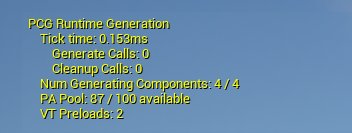
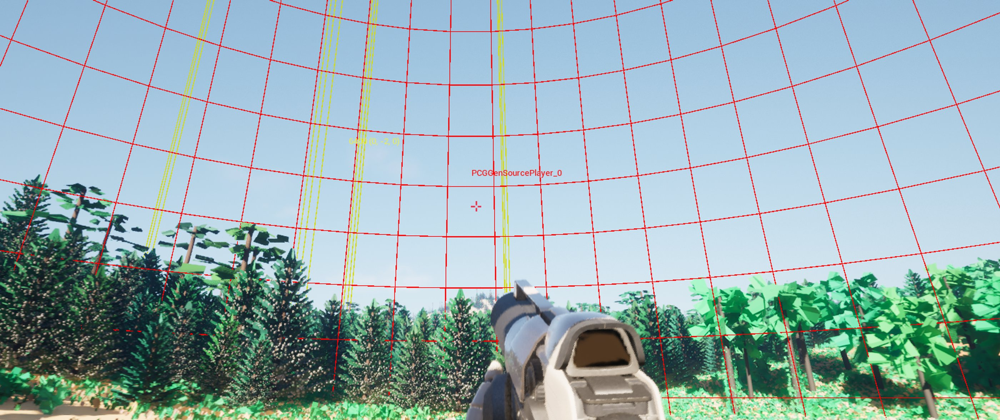
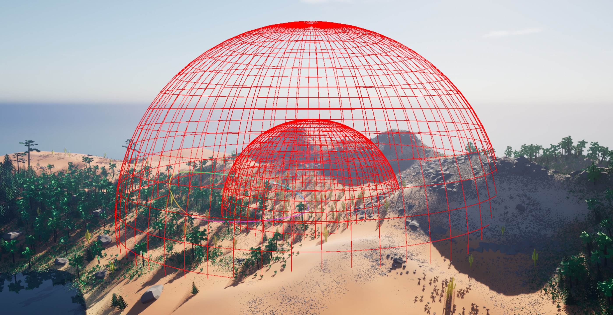
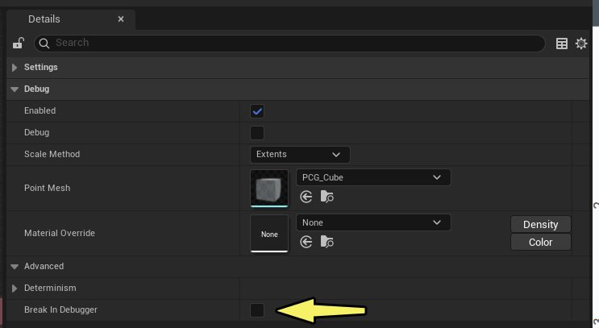
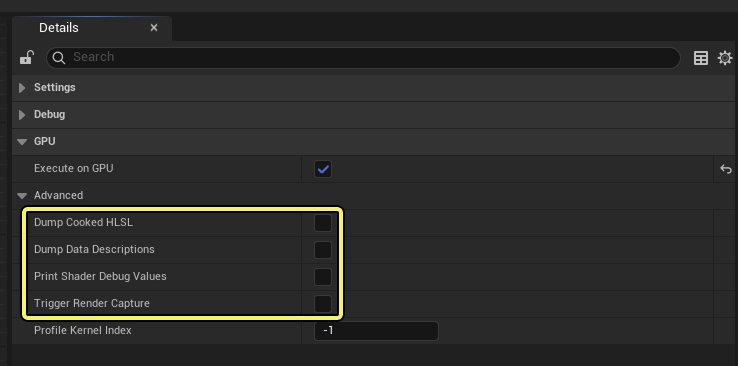
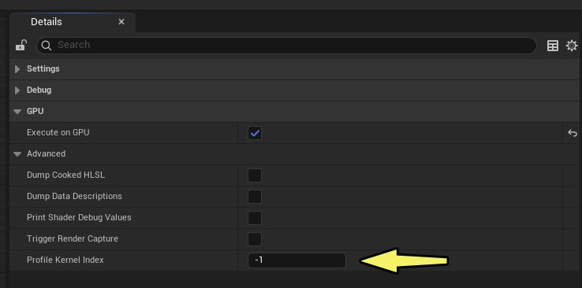

# PCG Runtime Generation Debugging

> 路径：虚幻引擎5.7文档 / 构建虚拟世界 / 程序化内容生成框架 / PCG Runtime Generation Debugging

> 原始页面：https://dev.epicgames.com/documentation/unreal-engine/pcg-runtime-generation-debugging-in-unreal-engine

该页面没有可用的官方中文版本；以下内容保留原文，并按本项目人工译文规则逐步回译。

## 简介

当你使用 Unreal Engine（UE）的 **程序化内容生成** （PCG）功能创建项目时，可以使用调试功能和工作流。本页概述这些工具，帮助你改进工作。

## 通用工具

本节介绍有助于改进 PCG 项目的工具。

### 屏幕叠加层

该 **屏幕叠加层** 提供系统当前行为的高层概览。可以用它快速验证运行时生成是否处于活动状态。

PCG 屏幕叠加层。

要启用此功能，请使用以下 cvar： `pcg.RuntimeGeneration.EnableDebugOverlay 1`

显示的数据值未经过滤，用于为每一帧提供干净数据。

> [!TIP]
> 考虑到大多数项目以 30 FPS 或更高帧率运行，建议捕获视频来研究瞬态行为，这样可以使用滚动和暂停功能查看生成过程中任意给定帧的数据。

启用此功能后，UE 会显示以下数据字段。

| 叠加层数据字段 | 说明 |
| --- | --- |
| **Tick 时间** | 显示当前帧中游戏线程在运行时生成系统内花费的时间。 |
| **Generate 调用** | 显示当前帧中 `Generate()` 在网格单元上被调用的频率。 |
| **Cleanup 调用** | 显示当前帧中 `Cleanup()` 在网格单元上被调用的频率。 |
| **正在生成的组件数量** | 显示当前帧中有多少 PCG 组件/单元正在生成。 |
| **PA 池** | 显示放置在关卡中 partition actor（PA）上的生成结果。这些结果会池化以降低运行时成本。当当前池耗尽时，其大小会翻倍，这是成本较高的操作，应避免在 gameplay 期间触发。可以使用以下 cvar 设置初始池大小： `pcg.RuntimeGeneration.BasePoolSize` . |
| **VT 预加载** | 显示当前帧中 `URuntimeVirtualTextureComponent::Preload()` 被调用以预热 virtual texture 的次数。可以用它验证关卡中的 VT 设置和 VT 预热信息是否正确。 可以使用以下 cvar 启用或禁用 VT 预加载： `pcg.VirtualTexturePriming.Enable` .可以使用以下 cvar 可视化 VT 预加载： `pcg.VirtualTexturePriming.DebugDrawTexturePrimingBounds` . |

屏幕叠加层可在 Editor 和 Development 构建中使用，不能在 Test 或 Shipping 构建中使用。

### 绘制已生成单元

该 **绘制已生成单元** 功能会显示运行时生成状态的可视化结果。

PIE 期间绘制已生成单元的线框效果。

要启用此功能，请使用以下 cvar： `pcg.GraphExecution.DebugDrawGeneratedCells 1`

启用此功能后，UE 会显示以下可视化内容：

- **红色线框球体**：这些球体会为每个生成源绘制，位于最小生成半径处。当网格单元被红色球体重叠时，会生成细节（如上方截图所示）。在编辑器中，生成源中心附近会显示标签。
- **黄色三重线框盒体**：这些盒体会绘制在当前正在生成的任何单元周围。在编辑器中，生成单元中心附近会显示包含网格大小和单元坐标的标签，可辅助在图表编辑器中进一步检查和调试。
- 如果使用了 **Generate Landscape Textures** 节点或 **Generate Grass Maps** 节点，则等待 grass map 纹理流送完成的单元中会绘制一个单独的线框盒体。

对于每个包含运行时组件的网格，每个生成半径都会绘制一个红色球体。在 PIE 中按 F8 从角色脱离，并移动到不同视角查看线框球体，可以更好理解程序化生成行为。

在 Play in Editor 模式下从角色脱离后查看到的生成源线框球体。

此可视化结果可服务于多种任务和工作流。它可以帮助你：

- 快速理解系统的行为。
- 诊断视觉突变问题（用于将可见突变与正在生成的单元关联起来）。
- 微调运行时处理预算 pcg.FrameTime（或 PIE 外的 pcg.EditorFrameTime）。为此，请观察当生成半径球体开始重叠单元时，生成是否能及时发生。

  - 如果单元在重叠后立即生成，说明系统能够跟上工作负载。
  - 如果单元在生成半径内较深的位置仍在生成，则存在视觉突变风险。

> [!NOTE]
> A **视觉突变** 是玩家看到的画面突然出现非预期变化，例如跳变、闪烁或吸附式过渡，从而破坏场景视觉连续性。

此功能可在 Editor 和 Development 构建中使用。默认情况下，它不能在 Test 和 Shipping 构建中使用，但可以通过在相应配置文件中将 `UE_ENABLE_DEBUG_DRAWING` 设为 true 来启用。

### 其它控制台命令和变量

| 控制台命令/变量 | 说明 |
| --- | --- |
| `pcg.RuntimeGeneration.Refresh` | 清理所有当前网格单元。随后系统会在后续 tick 中重新生成它们。适合用于检查问题是瞬态问题（刷新即可修复）还是持续性问题。命令按需发出。 |
| `pcg.RuntimeGeneration.Enable` | 控制运行时生成 tick。禁用时，单元的当前生成状态会被冻结。要移除所有运行时生成的数据，请先将其禁用，然后发出 `pcg.RuntimeGeneration.Refresh` . Enabled by default. |
| `pcg.Cache.Runtime.Enabled` | 控制是否启用 PCG graph cache。该缓存会缓存 CPU 节点的输出数据，以避免后续在相同数据上重新执行。适用于 game world。默认禁用。 |
| `pcg.Cache.Editor.Enabled` | 控制是否启用 PCG graph cache。该缓存会缓存 CPU 节点的输出数据，以避免后续在相同数据上重新执行。适用于 editor world。默认启用。 |
| `pcg.Cache.Runtime.MemoryBudgetMB` | 控制 PCG graph cache 在 game world 中允许使用的内存量。当内存使用超过该值时，旧条目会从缓存中移除。需要整数值。 |
| `pcg.Cache.Editor.MemoryBudgetMB` | 控制 PCG graph cache 在 editor world 中允许使用的内存量。当内存使用超过该值时，旧条目会从缓存中移除。需要整数值。 |
| `pcg.GPU.FuzzMemory` | 在 GPU graph 执行前随机初始化 buffer 内存。这有助于测试所有数据是否都被正确写入，并帮助复现难以隔离的未定义行为 bug，尤其是在未初始化数据经常偶然为 0 的情况下。默认禁用。 |
| `pcg.RuntimeGeneration.HideActorsFromOutliner` | 控制运行时生成 actor 是否在 Outliner 中可见。默认启用。 |
| `pcg.RuntimeGeneration.FramesBeforeFirstGenerate` | 按指定 tick 数延迟运行时生成。PCG 系统会等待这段时间后才开始生成，这对于给 Virtual Texture 填充提供缓冲时间很有用。需要整数值，默认值为 0。 |
| `pcg.GPU.EnableLandscapeVTSampling` | 启用后使用 Virtual Texture 获取 landscape 高度数据。这主要对 GPU graph 有用。默认启用。 |

## 调试

本节介绍在使用 PCG 时专门用于调试 CPU 和 GPU 的功能。

### CPU 调试

每个节点都有一个 **Break In Debugger** 设置；启用后，当节点进入任何执行阶段时，会在 CPU 调试器中触发断点。

Details 面板中的 Break In Debugger 功能。

要求：

- 必须附加调试器。
- 必须在 **Debug Object Tree**中选择关注的组件或网格单元。断点只对当前正在检查的对象有效。

如果节点结果已被缓存，除非刷新缓存，否则节点可能不会执行（例如在图表编辑器工具栏中按住 Ctrl 点击 **Force Regen** 按钮）。

### GPU 调试

设置为在 GPU 上执行的节点会公开额外调试设置，如下图所示。

GPU 调试选项

| GPU 调试设置 | 说明 |
| --- | --- |
| **Dumped Cooked HLSL** | 启用后，会在 cooked HLSL 源码传给 Compute Framework 以组装最终 kernel 之前显示它。对 kernel 开发很有用。 |
| **Dump Data Descriptions** | 启用后，转储流经 GPU 节点的数据描述，PCG 会使用这些描述确定 buffer 大小和线程数量。 |
| **Print Shader Debug Values** | 启用后，会分配一个以默认值 0 初始化的 float 数组，并公开 API 供 HLSL 覆写这些值。当数组值从 GPU kernel 更新后，它们会打印到日志。请参阅 `WriteDebugValue` ，位于 HLSL Source 编辑器的 Declarations 窗格中。 |
| **Trigger Render Capture** | 启用后，当图表编辑器中选择了 debug object 且该节点执行时，会触发 render capture。仅编辑器。必须启用 render capture （例如 `-AttachRenderDoc` or `-AttachPIX` ）。这些工具可提供 GPU 状态以及输入/输出 buffer 状态的详细视图。 |

> [!TIP]
> The `pcg.GPU.FuzzMemory` 上文 [其它控制台命令和变量](index.md#other-console-commands-and-variables) 下描述的 cvar 对调试很有用。每帧分配的 GPU 内存可能产生值 0，或每帧出现类似的随机内容。当数据未写入或读取了未初始化数据时，这会掩盖 bug。启用此选项可以让这类 bug 更明显，并显著提高可复现性。

## 性能分析

本节介绍用于分析 CPU 和 GPU 活动的工具。

### CPU 性能分析

该 **性能分析** 窗格会在 PCG Graph Editor 窗口中详细拆解每个节点花费的 CPU 时间。目前它尚不覆盖 GPU 执行。

如需更详细的性能分析， [Unreal Insights](../../../testing-and-optimizing-content/unreal-insights/index.md) 是标准工具。许多 PCG 函数都带有 profile scope（包括 `UPCGSubystem::Tick` ，它通常是大部分工作的根节点，也可以在打开 trace 时将其绘制出来作为起点）。

### GPU 性能分析

PCG kernel 在 `ComputeFrame_ExecuteBatches`中执行。在某些平台和构建配置上，每个 kernel 都有一个提供 kernel 名称的 scope。

如需更详细的性能分析，请为你的平台选择 GPU 性能分析工具。可重复的性能分析可能比较棘手，因为 PCG 工作在生成单元时会产生突发活动，但并不会每帧都执行可预测工作。为了帮助进行可重复性能分析，可以使用 GPU 节点上的 **Profile Kernel Index** 设置。

Details 面板中的 Profile Kernel Index 设置。

此索引会每帧持续调度该节点执行的某个 kernel，从而提供一种使用 GPU 性能分析工具捕获 GPU trace 并分析性能的方式。某些节点会从 `CreateKernels()`发出多个 kernel，此设置就是该数组的索引。将其设为 -1 可禁用性能分析。

任何网格单元都会推进到此 kernel，然后每帧重复执行。这可能产生大量 dispatch，从而扭曲性能结果。可以设置 `pcg.RuntimeGeneration.NumGeneratingComponents` 来限制可同时执行的单元数量。

要启用此功能，请在 `PCG_GPU_KERNEL_PROFILING` 中启用。
