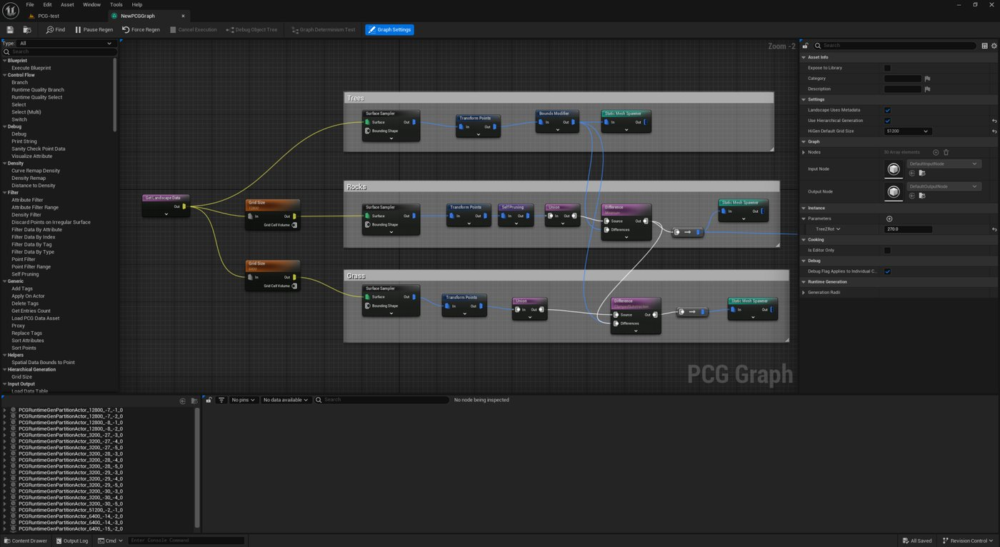
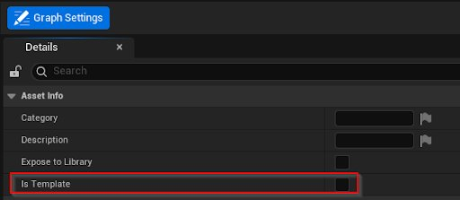
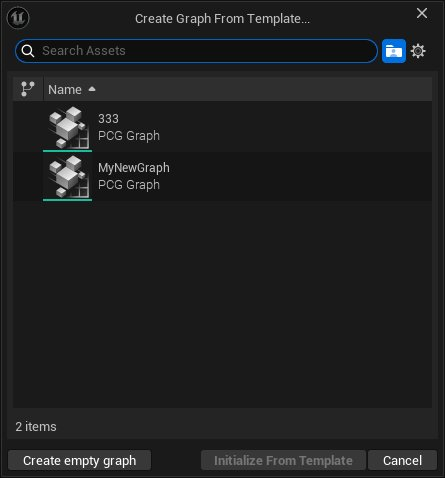
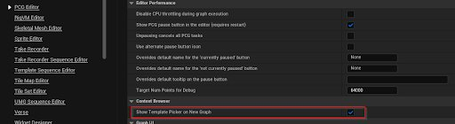
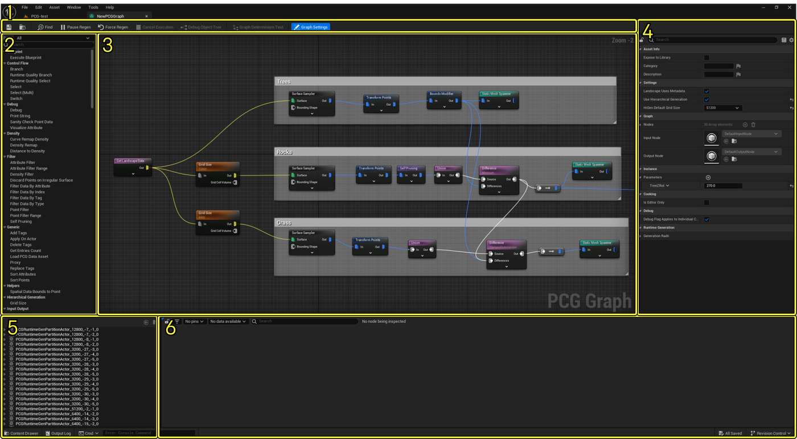
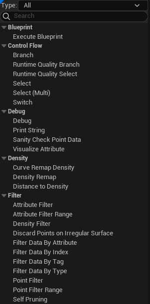
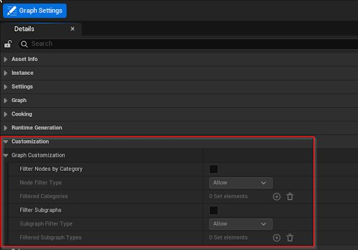

# 程序化内容生成概述

> 路径：虚幻引擎5.7文档 / 构建虚拟世界 / 程序化内容生成框架 / 程序化内容生成概述

> 原始页面：https://dev.epicgames.com/documentation/unreal-engine/procedural-content-generation-overview

**程序化内容生成框架（PCG）**是用于在虚幻引擎中创建你自己的程序化内容和工具的工具集。 借助PCG，技术美术师、设计师和程序员能够构建任意复杂度的快速迭代式工具和内容，从资产工具（如建筑物或群系生成等）到整个世界，不一而足。

高级PCG森林

## 重要概念和术语

- **点（Points）**：3D空间中的坐标点，由PCG图表生成，常用于生成网格体。 点包含变换、边界、颜色、密度、陡度和种子等信息。 可以为它们分配由用户自定义的属性值。
- **点密度（Point Density）**：各种图表节点使用的值。 在调试视图中表示为每个点上的梯度，代表该点存在于该位置的概率。 例如密度0为黑色，密度1为白色。

## 必要设置

程序化内容生成框架要求你在项目中启用**程序化内容生成框架（Procedural Content Generation Framework）**插件。 如需详细了解如何启用插件，请参阅[使用插件](../../../understanding-the-basics/foundational-knowledge-in/working-with-plugins/index.md)。

> [!NOTE]
> 要在静态网格体上对点取样，需要用到**程序化内容生成框架几何体脚本交互（Procedural Content Generation Framework Geometry Script Interop）**插件。

## 程序化节点图表

程序化节点图表是程序化内容生成框架的核心部分。

点击查看大图。

和材质编辑器类似，空间数据被传入关卡中的PCG组件中的图表，然后生成点。 然后，点会经过一系列节点的筛选和修改，并输出实时更新的结果。 生成的点可用于生成各种资产。

### 创建PCG图表资产

要创建PCG图表资产，请执行下面的步骤：

1. 右键点击**内容侧滑菜单（Content Drawer）**或**内容浏览器（Content Browser）**，找到**创建的高级资产（Create Advanced Asset）> PCG**，并选择**PCG图表（PCG Graph）**。
2. 选择新资产的名称，然后按**Enter**键。

### PCG图表模版

创建PCG图表后，你可以将图表标记为模板。当你创建新图表时，就可以在上下文菜单中选择该模板。 与[Niagara模板](../../../visual-effects/getting-started-in-niagara-effects/overview-of-niagara-effects/index.md)类似，你可以使用PCG图表模板加快工作流程，而不是用空白图表从头开始。

#### 将PCG图表设为模版

要将PCG图表定义为模板，请打开该图表并执行以下步骤：

1. 在工具栏中，点击**图表设置（Graph Settings）**按钮，从而在细节面板中填充图表的设置。
2. 找到细节面板的"资产信息（Asset Info）"分段，并启用"Is Template"属性。

Is Template属性

这时你的图表就被定义为了模板图表。

#### 使用模版新建图表

在创建新图表并选择了资产名称和位置之后，你现在就可以在**从模板创建图表（Create Graph From Template）**窗口中选择一个图表模板。 选择要使用的图表模板，然后点击**从模板初始化（Initialize From Template）**按钮，即可使用该模板创建一个新图表。

从资产选择菜单选择模版

> [!NOTE]
> 若要在创建新PCG图表时禁用模板提示，请在菜单栏中找到**编辑（Edit）** > **编辑器偏好设置（Editor Preferences）**。 然后使用搜索栏或找到**PCG编辑器**的属性分段，并禁用**新图表**属性的**显示模板选取器（Show Template Picker）**选项。
>
> 
>
> 禁用模版提示属性
>
> 禁用此属性后，当你新建PCG图表时，**从模板创建图表（Create Graph From Template）**窗口将不再出现。

### 编辑PCG图表

在PCG图表编辑器中，你可以配置并编辑PCG图表资产。 该编辑器的操作方式与蓝图或材质编辑器相似。 它还包含一些只有PCG才有的工具和面板。

PCG图表示意图

| 编号 | 说明 |
| --- | --- |
| **1** | 工具栏 |
| **2** | 节点控制板 |
| **3** | 视口 |
| **4** | 细节面板 |
| **5** | 调试树 |
| **6** | 特性列表 |

你可以像使用蓝图那样将节点添加到图表中，方法是从节点控制板将其拖入视口中，或通过右键菜单添加。

当PCG图表被指定到PCG组件并且已用于生成内容时，对该图表所做的更改会在编辑器视口中实时更新。

### PCG节点

PCG图表由一系列PCG节点构成，每个节点执行对最终结果有贡献的操作。

点击查看大图。

这些节点划分为以下类别：

| 类别 | 说明 |
| --- | --- |
| **蓝图（Blueprint）** | 包含与蓝图相关的节点。 这包括用于执行从**PCGBlueprintElement**派生的用户蓝图的通用节点。 |
| **控制流程（Control Flow）** | 包含负责控制图表中逻辑流程的节点。 |
| **调试（Debug）** | 包含帮助调试的节点。 |
| **密度（Density）** | 包含影响点密度的节点。 |
| **筛选器（Filter）** | 包含基于条件或按点筛选数据的节点。 |
| **通用（Generic）** | 包含影响数据的节点（空间数据除外）。 |
| **分层生成（Hierarchical Generation）** | 包含负责控制[分层生成](../pcg-development-guides/using-pcg-generation-modes/index.md)模式的节点。 |
| **输入输出（Input Output）** | 包含负责加载[Alembic](../../../working-with-content/alembic-file-importer/index.md)及其他外部数据的节点。 |
| **IO** | 包含能控制与外部数据交互的节点。 |
| **元数据（Metadata）** | 包含与属性交互的节点，无论是点上还是属性集上的属性。 |
| **参数（Param）** | 包含能控制如何从Actor或蓝图变量检索参数的节点。 |
| **点运算（Point Ops）** | 包含影响点以及点属性的节点。 |
| **取样器（Sampler）** | 包含从空间数据源（例如体积、表面和网格体）生成点的节点。 |
| **空间（Spatial）** | 包含能在数据之间创建空间关系、更改其内部空间数据或检索数据的节点。 |
| **生成器（Spawner）** | 包含在给定点位置创建新数据或放置Actor的节点。 |
| **子图表（Subgraph）** | 包含能处理子图表用法的节点。 |

你可以像使用蓝图那样添加**注释（Comments）**和**重路由节点（Reroute Nodes）**，使图表更易于辨识。

### 图表编辑自定义

你可以使用**图表设置（Graph Settings）**面板中的一组专用属性来自定义PCG图表的编辑。

PCG图表编辑自定义属性

你可以使用这些属性自定义PCG图表的行为和工作流程，从而获得更符合预期的体验。 你还可以使用这些设置编译[PCG图表模板](index.md#pcg-graph-templates)，从而为项目定制PCG图表的工作流程。

#### 节点过滤

你可以使用节点过滤（Node Filter）设置项按类别过滤节点选择。 过滤会基于包含或排除的原则进行。 要在选择上下文菜单中过滤节点，请**启用****按类别过滤节点（Filter Nodes by Category）**属性，然后使用**添加**(**+**)按钮为**已过滤类别（Filtered Categories）**属性添加索引。 添加索引后，请在文本字段中输入类别名称，或使用下拉菜单选择节点类别。

> 图片已省略：过滤PCG节点的选择

节点过滤

更改过滤器即会更新节点控制板和上下文菜单中可用的选择项。

#### 图表过滤

除过滤图表的可用节点外，你还可以过滤可用的子图表。 与节点过滤类似，首先**启用****过滤子图表（Filter Subgraph）**属性，然后**添加**（**+**）一个新索引，并选择将在图表中可选的子图表。

> 图片已省略：过滤子图表PCG图表编辑自定义

子图表过滤器自定义

### 属性和元数据

属性类似于变量，存储由其名称和类型定义的数据。 属性分为两类：

- **静态特性**：固定且始终存在的特性。 这类特性以`$`开头，如`$Position`。
- **动态特性**：在运行时创建的特性，并作为图表数据**元数据**的一部分存储。

### 元数据域

使用PCG图表中的特性时，必须考虑元数据所在的域。 域决定了你可以保存的信息类型，以及之后你可以如何使用并修改该信息。 针对所有元数据点，你都必须了解哪些域受支持，以及哪些域是默认域。 选择域时，域以`@`为前缀。

特性列表视图中有一个字段可以让你切换域。

选择域

你可以在使用PCG图表时使用三个域。 首先，针对为数据本身而设的特性，你可以使用**数据（Data）**域。 数据域仅限使用单个值，这意味着你不能像使用特性集那样存储多个值。 数据域的操作方式与其他域相同。 只要在特性前添加`@Data`前缀，就可以为其创建或添加特性，或使用元数据操作修改数据域。 例如，数据域中的特性 `MyAttr` 将变为`@Data.MyAttr`。 数据域是所有其他空间数据的默认域，当未指定任何域时，`@Data域` 在没有指定域时。

第二个域即"点（Points）"域，使用`@Points`前缀。

第三个域是"元素（Elements）"域，用于特性集，使用`@Elements`前缀。

### 属性选择器

某些PCG图标节点可以通过属性选择在静态和动态属性建提供互操作性。

> 图片已省略：PCG特性选择器

点击查看大图。

属性选择器提供了一份属性列表，可以于所选的节点配合使用。 属性选择器使用以下命名规则：

- 以$开头的名称为静态特性，反之则是动态特性。
- `@Last`表示被前一个节点操作过的最后一个动态特性。

例如，Math节点被用于在静态和动态属性上执行数学运算：

> 图片已省略：PCG数学节点

*点击查看大图。*

属性选择器的名称字段也被用于从组件中提取数据：

> 图片已省略：PCG数学示例

点击查看大图。

上图中的`$Position.ZYX`提供了$Position组件的反转。 下表列出了能够以这种方式操作的组件及其类型：

| 组件（Component） | 类型 |
| --- | --- |
| **向量（Vectors）** |  |
| X、Y、Z、W、x、y、z、w | 双精度浮点。 不能与RGBA混合。 |
| R、G、B、A、r、g、b、a | 双精度浮点。 不能与XYZW混合。 |
| 长度，尺寸（Length, Size） | 双精度浮点。 返回向量长度。 |
| **变换（Transforms）** |  |
| 位置，方位（Location, Position） | Vector3 |
| 缩放，缩放3D（Scale, Scale3D） | Vector3 |
| 旋转 | 四元数 |
| **旋转体（Rotators）** |  |
| 俯仰、偏航、滚转（Pitch, Yaw, Roll） | 双精度浮点 |
| 向前、向右、向上（Forward, Right, Up） | Vector3 |
| **四元数（Quaternions）** |  |
| 支持向量提取器（Support Vector extractor） | 向量 |
| 支持旋转器提取器（Support Rotator extractor） | 旋转器 |

### C++设置重载

有些设置在C++属性元数据中被标记为PCG_Overridable。 对于蓝图节点，那些可见且实例可编辑的变量是可以被重载的。

被重载后，自动添加到节点的引脚属于高级引脚。 引脚分为两类：

- **全局重载**：可接受任意数量的特性，并重载所有与设置名称完全匹配的特性的所有设置。
- **单独重载**：可接受任意数量的特性，并在发现某个特性与设置名称完全匹配时（如只有一个特性，则无视名称）重载其指定设置。

属性类型必须匹配，但某些属性类型可以转换。

要了解确切的属性名称或类型，请查看重载引脚上的提示信息：

> 图片已省略：PCG设置项重载

点击查看大图。

由于所有数据的域都是特定的，`UPCGData`的C++ API给出了一些函数，这些函数能识别受支持的域，并在`FPCGMetadataDomainID`（即用于指定元数据域的内部类）和`FPCGAttributePropertySelector`（即用于选择特性（Attributes）和属性（Properties）的公开类）之间来回转换。 所有`FPCGMetadataDomain`都有专属的一组特性和条目，且它们之间彼此独立。 访问器会使用`FPCGAttributePropertySelector`更新，以访问正确的域。

### 样条线元数据示例

以下各小节给出了实用的PCG元数据工作流程的示例配置。

#### 样条线特性

你可以使用特性来直接修改控制点的属性。 使用**添加**（**+**） > **样条线（Spline）** > **控制点（Control Points）**即可访问下列特性属性。

样条线特性控制点

| 名称 | 说明 | 类型 |
| --- | --- | --- |
| $Position | 控制点变换在世界参照系中的位置分量 | 向量 |
| $Rotation | 控制点变换在世界参照系中的旋转分量 | 四元数/旋转器 |
| $Scale | 控制点变换在世界参照系中的缩放分量 | 向量 |
| $Transform | 控制点的世界变换 | 变换（Transform） |
| $ArriveTangent | 在控制点处到达切线 | 向量 |
| $LeaveTangent | 在控制点处离开切线 | 向量 |
| $InterpType | 位置控制点的插值类型（与样条线控制点上设置的相同） | ESplinePointType |
| $LocalPosition |  | 向量 |
| $LocalRotation | 控制点变换在样条线参照系中的旋转分量 | 四元数/旋转器 |
| $LocalScale | 控制点变换在样条线参照系中的缩放分量 | 向量 |
| $LocalTransfrom | 控制点的本地变换 | 变换（Transform） |

#### 样条线数据

你也可以直接修改数据属性。 使用**添加**（**+**） > **样条线（Spline）** > **全局（Global）**即可访问下列数据属性。

样条线数据特性

| 名称 | 说明 | 类型 |
| --- | --- | --- |
| @Data.$SplineTransform | 样条线的变换 | FTransform |
| @Data.$IsClosed | 样条线是否闭合（只读） | 布尔 |

#### 样条线元数据

除控制点属性外，你还可以为样条线数据添加特性，并将其附加到控制点。 对样条线取样时，这些元数据将被插值。 此类元数据的行为与点或特性集元数据相同。

与点类似，你可以使用**添加特性**功能来创建新特性，或者使用元数据操作并指定要写入此特性的输出目标。

此外，控制点上的元数据是样条线元数据的默认项，但你也可以使用`@ControlPoints`来明确指定。

### 图表参数

与材质编辑器中的参数类似，PCG图表参数是由用户创建的可重载值，这有助于为各类情况创建可自定义的图表。 创建新参数的方法是：

> 图片已省略：PCG图表参数

点击查看大图。

1. 打开PCG图标设置。
2. 点击属性（Parameters）字段旁的 + 按钮。 这样即可创建新参数。
3. 点击下拉箭头以转到新参数。 将其重命名并选择类型。

在PCG图表中修改参数值的方法如下：

> 图片已省略：PCG图表参数细节重载

点击查看大图。

你可以在图表参数中修改值，也可以在PCG资产的细节面板中修改值。

在PCG图表示例上修改参数值的方法如下：

> 图片已省略：PCG图表参数重载

点击查看大图。

在内容浏览器中打开资产，修改其值，或在PCG资产的细节面板中修改。

### 图表实例

PCG图表实例的工作原理类似于材质实例，利用图表参数帮助你以实例或PCG子图表的形式复用现偶的图表：

> 图片已省略：PCG创建实例图表

点击查看大图。

创建PCG图表实例的方法是：

1. 选择关卡中的一个PCG资产。
2. 在细节面板中选择PCG组件。
3. 点击**保存实例（Save Instance）**按钮以新建一个实例。
4. 为新图表实例命名并按下**Enter**键。

> [!TIP]
> 在将实例作为PCG子图表使用时，可以使用子图表节点上的重载引脚重载参数。
>
> > 图片已省略：PCG子图表重载
>
> *点击查看大图。*

## PCG组件

程序化节点图表可以通过PCG组件对你的关卡取样。 此组件可保存程序化节点图表的实例，并在编辑器中以及在运行时管理程序化内容的生成。 PCG组件添加为Actor的组件，或用作PCG体积的一部分，这是一种基本体积，适合用于快速设置程序化内容。

> 图片已省略：PCG组件

点击查看大图。

要将PCG图表连接到PCG组件，请执行下面的步骤：

1. 在编辑器视口或**大纲视图（Outliner）**中，选择你想连接的**PCG体积（PCG Volume）**或**蓝图类（Blueprint Class）**。
2. 在**细节（Details）**面板中，点击**PCG组件（PCG Component）**。

   > 图片已省略：PCG组件

   点击查看大图。
3. 点击**图表（Graph）**下拉菜单，并选择你想使用的PCG节点图表。

   > 图片已省略：添加PCG图表

   添加PCG图表
4. 点击**生成（Generate）**按钮以查看结果。

   > 图片已省略：点击"生成"按钮

   点击"生成"按钮

## 世界分区支持

将PCG资产分配到 [世界分区 - 数据层](../../world-partition/world-partition---data-layers/index.md) 和 [分层细节级别（HLOD）层](../../world-partition/world-partition---hierarchical-level-of-detail/index.md) 后， PCG图表会生成Actor并将其分配到同一数据层和同一HLOD层中。

如需详细了解如何将PCG用于世界分区，请参阅[将PCG用于世界分区](../pcg-development-guides/using-pcg-with-world-partition/index.md)。

## 在PCG中调试

调试是PCG工作流程中的基本部分。

每个节点都有各种调试选项，可用于直观地显示PCG图表每个步骤中的点数据：

- 调试渲染
- 启用/禁用节点
- 检查

在节点的**细节（Details）**面板中选中**调试（Debug）**复选框或按**D**键，即可开关各节点的调试渲染。

> 图片已省略：PCG调试

PCG调试

在节点的**细节（Details）**面板中选中**启用（Enabled）**复选框或按**E**键，即可打开和关闭各个节点。

> 图片已省略：PCG节点禁用

点击查看大图。

你还可以检查节点，以此在**特性（Attributes）**列表中显示某个节点所生成的所有点。

> 图片已省略：PCG特性列表

点击查看大图。

1. 从调试树（Debug Tree）选择PCG组件。
2. 右键点击要检查的节点。
3. 选择检查（Inspect）。 你也可以按A键。

## 创建简单森林体积

程序化生成工具的常见用例是开放世界环境中的群系生成。

> 图片已省略：PCG森林体积

PCG森林体积

要创建基本森林群系生成器，请执行下面的步骤。

> [!NOTE]
> 此示例使用的材质和静态网格体来自使用Fab下载的[Megascans树木资产包：欧洲鹅耳枥](https://www.fab.com/listings/c6f917b6-ffcb-4b86-9d9f-5274ba7f6a8e)集合。

### 创建关卡

1. 在虚幻引擎中[新建项目](../../../understanding-the-basics/working-with-projects-and-templates/creating-a-new-project/index.md)。
2. 使用**基本（Basic）**关卡模板[创建新关卡](../../../understanding-the-basics/levels/working-with-levels/index.md)。 保存关卡。
3. 删除**地板（Floor）**静态网格体，然后使用地形模式为关卡[添加新地形](https://dev.epicgames.com/documentation/assets/building-virtual-worlds/landscape-outdoor-terrain/creating-landscapes)。
4. 使用[塑造（Sculpt）](../../landscape-outdoor-terrain/editing-landscapes/landscape-sculpt-mode/index.md)工具为地形添加一些变化。

   > 图片已省略：PCG关卡地形

   PCG关卡地形

### 创建PCG体积

1. 返回**选择（Selection）**模式并启用**放置Actor（Place Actors）**窗口（如果目前不可见）。
2. 使用**搜索类（Search Classes）**框查找**PCG体积（PCG Volume）**并添加一个到你的关卡。

   > 图片已省略：PCG新体积

   PCG新体积
3. 将PCG体积缩放为X=8.0, Y=8.0, Z=8.0

> 图片已省略：PCG缩放体积

PCG缩放体积

### 创建PCG图表资产

1. 右键点击**内容侧滑菜单（Content Drawer）**或**内容浏览器（Content Browser）**，找到**创建的高级资产（Create Advanced Asset）> PCG**，并选择**PCG图表（PCG Graph）**。
2. 将新资产命名为**PCG_ForestGen**并按**Enter**键。
3. 双击**PCG_ForestGen**打开PCG图表编辑器。

### 连接PCG组件

1. 在编辑器视口或**大纲视图（Outliner）**中，选择**PCG体积（PCG Volume）**。
2. 在**细节（Details）**面板中，点击**PCG组件（PCG Component）**。
3. 点击**图表（Graph）**下拉菜单并从列表选择**PCG_ForestGen**。

   > 图片已省略：PCG连接森林图表

   PCG连接森林图表

### 创建点

1. 在PCG图表编辑器窗口中，将**Get Landscape Data**节点添加到图表。
2. 从Get Landscape Data节点的输出拖移并添加**Surface Sampler**节点。

   > 图片已省略：PCG表面采样器

   PCG表面采样器
3. 选择Surface Sampler并按**D**键切换调试渲染。
4. 返回编辑器窗口，选择PCG体积，然后点击细节面板中的**生成（Generate）**按钮。

> 图片已省略：地形上的PCG点

地形上的PCG点

现在你可以在编辑器视口中看到正在生成的点。 这些点符合地形的形状。

### 添加变化

1. 在PCG图表编辑器中，选择Surface Sampler。
2. 在细节面板中调整**每平方米点数（Points Per Square Meter）**、**点范围（Points Extents）**和**松散度（Looseness）**属性，从而添加更多点。

   1. 将**每平方米点数（Points Per Square Meter）**调整为**0.15**，从而将更多点添加到空间。
   2. **点范围（Points Extents）**属性会控制各点的边界大小。 将**X**、**Y**和**Z**的值更改为**50**。
   3. 松散度属性将确定生成的点贴近网格形状的程度。 将**松散度（Looseness）**的值保留为**1.0**。

      > 图片已省略：PCG图表点调整

      PCG图表点调整
3. 接下来，添加**Transform Points**节点。 此节点将向你的点添加定义范围内的额外移动、旋转和缩放变化。 将Surface Sampler节点的**输出（Output）**引脚连接到Transform Points节点的**输入（Input）**引脚。

   > 图片已省略：PCG图表Transform Points

   PCG图表Transform Points
4. 在Surface Sampler节点上禁用调试渲染，并在Transform Points节点上启用它。
5. 要添加一些旋转变化，请将**最大旋转（Max Rotation）**的**Z**值更改为**360**。 这样所有点都会获得0到360度之间的随机旋转。

   > 图片已省略：PCG图表变换旋转

   PCG图表变换旋转
6. PCG图表会生成点并将其旋转以符合地形的法线方向。 选中**绝对旋转（Absolute Rotation）**的复选框即可禁用此额外旋转。
7. 要添加一些大小变化，请将**X**、**Y**和**Z**的**缩放最小值（Scale Min）**设置为**0.5**。 将**X**、**Y**和**Z**的**缩放最大值（Scale Max）**更改为**1.2**。

   > 图片已省略：PCG图表变换旋转设置

   PCG图表变换旋转设置

最终结果是有不少变化的一组点。

> 图片已省略：PCG图表变换缩放

PCG图表变换缩放

### 生成静态网格体

1. 在PCG图表编辑器中，将**Static Mesh Spawner**节点添加到图表视口。 将Transform Points节点的**输出（Output）**引脚连接到Static Mesh Spawner的**输入（Input）**引脚。

   > 图片已省略：PCG图表完成

   PCG图表完成
2. 选择Static Mesh Spawner。
3. 在**细节（Details）**面板中，找到**网格体条目（Mesh Entries）**选项并点击**+**按钮，添加要生成的静态网格体。
4. 点击**网格体条目（Mesh Entries）**旁边的下拉箭头以打开数组。
5. 点击**Index [0]**旁边的下拉箭头。
6. 点击**描述符（Descriptor）**旁边的下拉箭头。
7. 点击**静态网格体（Static Mesh）**的下拉菜单并选择你想生成的树。 此示例使用**SM_EuropeanHornbeam_Forest_01**。

   > 图片已省略：PCG图表生成树

   PCG图表生成树

你可以将权重属性用于数组中的每个网格体条目，添加更多静态网格体并平衡多样性。 虚幻引擎添加了所有静态网格体条目的权重值，并将该数字除以每个单独的权重以确定每个条目生成的概率。

> 图片已省略：PCG图表生成三棵树

PCG图表生成三棵树
