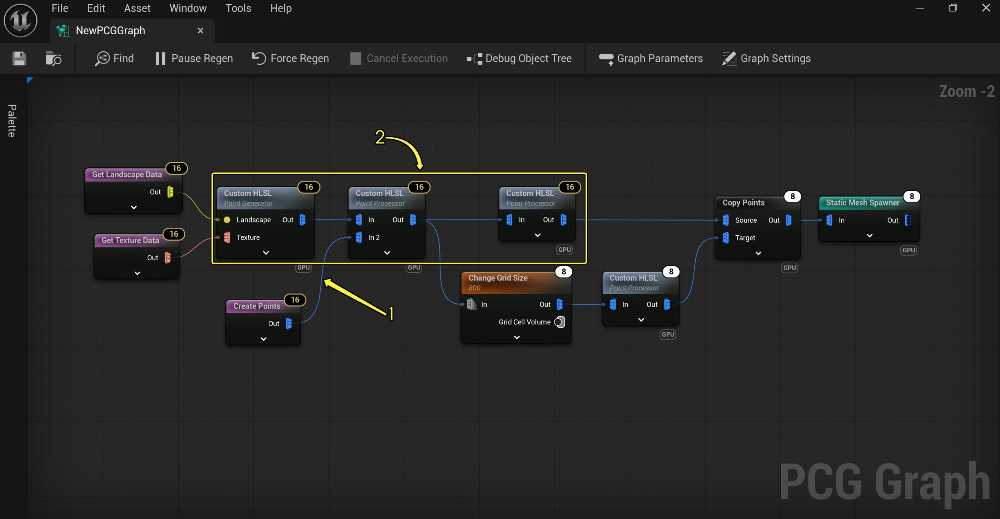
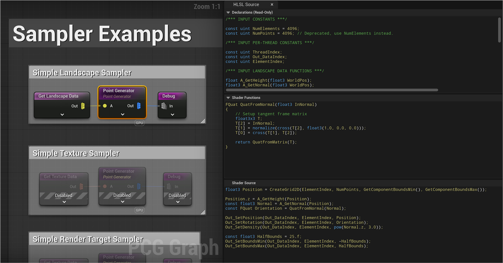
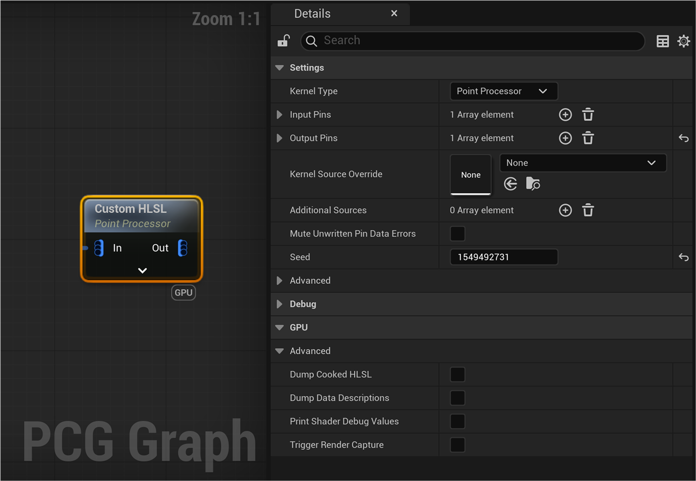
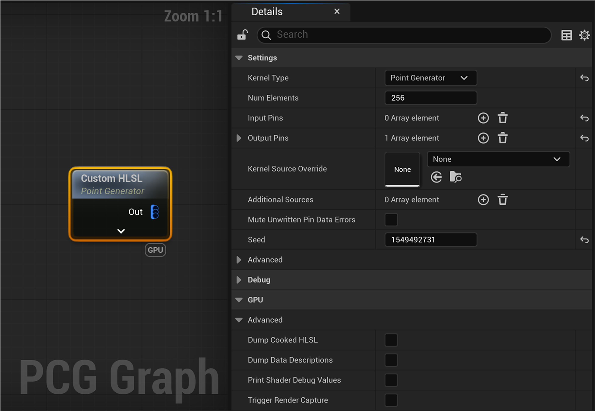
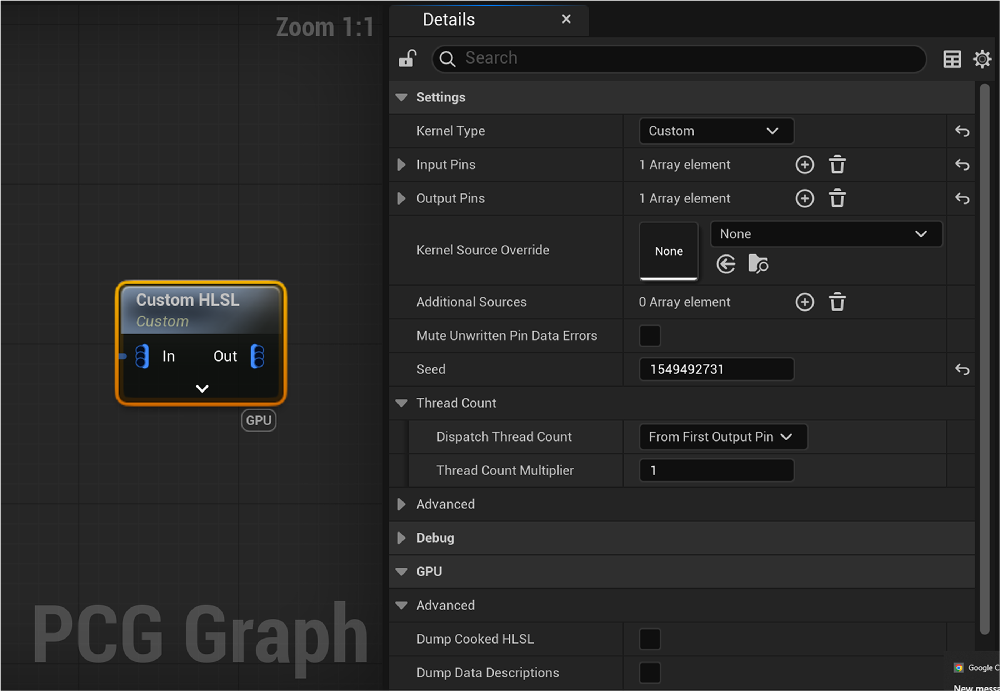
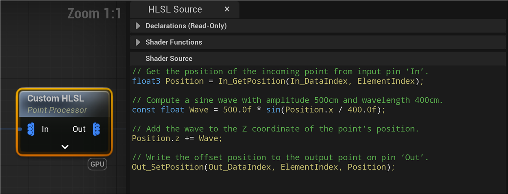
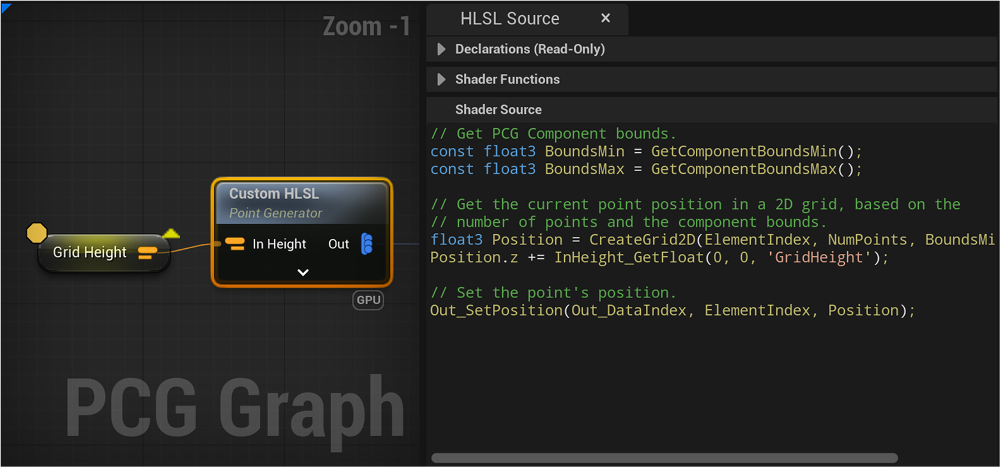
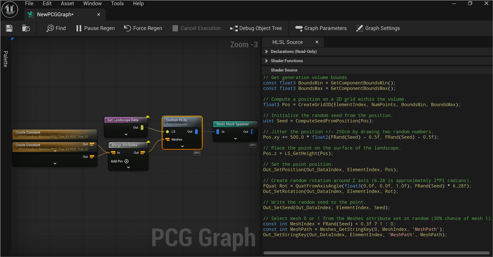

# 利用GPU处理进行程序化内容生成

> 路径：虚幻引擎5.7文档 / 构建虚拟世界 / 程序化内容生成框架 / 利用GPU处理进行程序化内容生成

> 原始页面：https://dev.epicgames.com/documentation/unreal-engine/using-pcg-with-gpu-processing-in-unreal-engine

**程序化内容生成（PCG）框架**是一套用于在虚幻引擎中创建你自己的程序化内容和工具的工具集。 **PCG GPU处理**让技术美术师和设计师可以将大量PCG处理任务直接发送给GPU，从而释放CPU的资源。

PCG GPU处理对许多任务而言都非常高效，比如点处理、[运行时生成](../pcg-development-guides/using-pcg-generation-modes/index.md#using-runtime-generation)和[静态网格体生成](../pcg-development-guides/procedural-content-generation-framework-node-reference/index.md#spawner)。

> [!NOTE]
> 目前只有[少数节点](index.md#supported-nodes)可以使用GPU处理， 包括Copy Points和Static Mesh Spawner，以及 一个新增的自定义HLSL节点，你可以用[HLSL语言](https://learn.microsoft.com/zh-cn/windows/win32/direct3dhlsl/dx-graphics-hlsl)编写该节点。

未来还将推出更多支持GPU执行的节点。

在PCG图表中，被设为以GPU为目标的节点会用**GPU**字样进行标注。 相连的GPU节点子集可在GPU上高效执行，它们被称为**计算图表**。



|  |  |
| --- | --- |
| 编号 | 说明 |
| 1 | 在CPU和GPU之间传输数据。 这些点代表性能开销。 |
| 2 | 一并执行的GPU执行节点。 |

当数据中存在足够多的点，让你可以充分利用GPU硬件时，以GPU为目标可能会比CPU执行的性能更高。 此外，一连串相互连接的GPU节点搭配GPU赋能的Static Mesh Spawner节点，可以为[静态网格体的生成](../pcg-development-guides/procedural-content-generation-framework-node-reference/index.md#spawner)提供一条快速通道。

注意，在CPU和GPU之间传输数据，以及准备计算图表以供执行，这些操作都会产生CPU开销。 因此，使用GPU执行功能的最佳方式是，将GPU赋能的节点组合在一起，并尽量减少各个计算图表传入和传出的数据。

## 支持的节点

### 自定义HLSL节点

你可以使用自定义HLSL节点执行任意的数据处理任务，而这些任务可以由用户创建的HLSL源代码编写为脚本。 源代码会被注入到计算着色器中，并在GPU硬件上按数据元素并行执行。

> [!NOTE]
> 该节点提供对GPU硬件的低级别访问，供高级用户使用。

|  |  |
| --- | --- |
| **选项** | **说明** |
| **核心类型（Kernel Type）** | 选择节点行为的预设值。 可用选项见下文的 [自定义HLSL节点核心类型](index.md#custom-hlsl-node-kernel-types) 小节。 |
| **输入引脚（Input Pins）** | 定义作为输入使用的数据。 打开卷展栏菜单即可得到如下选项：**标签（Label）**：输入引脚上显示的名称。**用法（Usage）**：与自定义HLSL节点无关。**允许类型（Allowed Types）**：定义此输入可接受的数据类型。**允许多份数据（Allow Multiple Data）**：如果勾选，则可为同一引脚提供多份数据。 仅适用于某些数据类型。**允许多个连接（Allow Multiple Connections）**：目前对所有GPU节点输入引脚禁用。**引脚状态（Pin Status）**：与自定义HLSL节点无关。**提示文本（Tooltip）**：定义向用户显示的提示文本。 |
| **输出引脚（Output Pins）** | 定义节点所输出的数据。 所含选项同输入引脚（Input Pins），外加用于设置输出数据的额外选项。 下文的 [引脚设置](index.md#pin-setup)小节 将介绍这些选项。 |
| **核心源重载项（Kernel Source Override）** | 用于用UComputeSource资产替换你的**着色器源（Shader Source）**字段。 |
| **额外源（Additional Sources）** | 允许引用其他UComputeSource资产，并将其与你的自定义HLSL节点捆绑在一起。 |
| **消除未写入的引脚数据错误（Mute Unwritten Pin Data Errors）** | 消除对输出引脚可能存在未初始化数据的警告。 |
| **种子（Seed）** | 定义用于驱动随机生成的种子值。 |
| **转存烘焙的HLSL（Dump Cooked HLSL）** | 在生成用于调试的烘焙HLSL数据时，将其打印到日志中。 |
| **转存数据描述（Dump Data Descriptions）** | 在生成用于调试的输入和输出数据时，将其数据描述打印到日志中。 |
| **打印着色器调试值（Print Shader Debug Values）** | 从着色器代码中提供简单的调试日志记录。 详见 [调试自定义HLSL](index.md#debugging-custom-hlsl) 小节。 |

### HLSL源编辑器

使用HLSL源编辑器（HLSL Source Editor）即可快速创建自定义HLSL节点。 要找到该编辑器，请转到PCG图表编辑器的**窗口（Window） -> HLSL源编辑器（HLSL Source Editor）**分段，或选择一个自定义HLSL节点并点击节点设置中的**打开源编辑器（Open Source Editor）**按钮。

HLSL源编辑器分为三个部分：

- **声明（Declarations）面板**
- **着色器函数（Shader Functions）**
- **着色器源（Shader Source）**



你可以将**声明面板**视为编写着色器代码所需的API参考页面。 声明会依据自定义HLSL节点的设置（如核心类型和输入/输出引脚的设置）而自动生成。

**着色器函数（Shader Functions）**字段允许作者创建可重复使用的函数，以便在其**着色器源**中调用。

**着色器源（Shader Source）**字段是核心实现的主要进入点。

### 自定义HLSL节点核心类型

**核心类型（Kernel Type）**决定了节点行为的预设。

#### 点处理器

**点处理器（Point Processor）**核心类型非常适合用于修改点。 它要求主输入和输出引脚的类型为点（Point），并为每个点执行一次HLSL代码。 主输出引脚发送的数据与主输入引脚的数据的布局相同，这意味着数据的数量和元素的数量均相同。

主输出引脚中的所有点都会依据主输入引脚而自动初始化，因此你只需设置需要更改的输出特性即可。

你还可以使用点处理器创建额外的输入和输出引脚，但你必须手动配置这些引脚，以设置所需的数据类型和数据/元素的数量。



#### 点生成器

点生成器（Point Generator）核心类型适合用于创建和填充一组点。 它要求主输出引脚的类型为点（Point），并为每个点执行一次HLSL代码。

该核心类型提供的额外选项如下：

|  |  |
| --- | --- |
| **选项** | **说明** |
| **点数量（Point Count）** | 决定了生成的点的数量。 每个生成的点都会执行着色器代码。 |



与点处理器类似，你可以使用点生成器创建额外的输入和输出引脚，但你必须手动配置这些引脚，以设置所需的数据类型和数据或元素的数量。

#### 自定义

**自定义（Custom）**核心类型让你能精细地控制高级用例的执行。 与其他两种核心类型不同，自定义类型对输入或输出引脚没有强制要求，因为该节点并不会假设输入与输出之间存在特定关系。 你必须在输出引脚设置中配置输出数据，下文将详细说明这一点。 你还必须配置应执行着色器代码的线程数。



该核心类型提供的额外选项如下：

|  |  |
| --- | --- |
| **选项** | **说明** |
| **调度线程数（Dispatch Thread Count）** | 决定了执行着色器代码所用的线程数。 可用模式如下：**按首个输出引脚（From First Output Pin）**：在首个输出引脚上为每个数据元素（如 每个点）派发一个线程。 可以使用由用户定义的线程乘数。**固定线程数（Fixed Thread Count）**：定义指定的线程数。**按输入引脚的乘积（From Product of Input Pins）**：为来自一个或多个输入引脚的每个数据元素派发一个线程。 可以使用由用户定义的线程乘数。 |

### 引脚设置

你应该手动配置所有并非由**核心类型**驱动的引脚。

对输出引脚而言，你必须明确描述数据的大小和布局。在输出引脚设置的**GPU属性（GPU Properties）**下拉菜单中即可设置相关事项。

|  |  |
| --- | --- |
| **初始化模式（Initialization Mode）** | 描述如何初始化此引脚的输出数据。 此菜单包含以下模式：**按首个输出引脚（From First Output Pin）**：在首个输出引脚上为每个元素派发一个线程。 可以使用由用户定义的线程乘数。**固定线程数（Fixed Thread Count）**：定义指定的线程数。**按输入引脚的乘积（From Product of Input Pins）**：为来自一个或多个输入引脚的每个数据元素派发一个线程。 可以使用由用户定义的线程乘数。 |
| **初始化所依据的引脚（Pins to Initialize From）** | 定义初始化此引脚数据所依据的输入引脚。 |
| **数据数量模式（Data Count Mode）** | 定义数据对象的数量。 此菜单包含以下模式：**按输入数据（From Input Data）**：从**初始化所依据的引脚（Pins to Initialize From）**处获取数据数量。**固定（Fixed）**：规定要输出的数据数量。 |
| **数据多重性（Data Multiplicity）** | 如果存在多个"初始化所依据的引脚（Pins to Initialize From）"，则合并数据数量。可用模式如下：**成对（Pairwise）**：为输入引脚上的每对/每元组/等输入数据项生成一个数据项。 要求所有引脚都拥有相同数量的数据。**笛卡尔（Cartesian）**：如果存在两个输入引脚，分别拥有N和M个数据项，则输出将有N x M个数据项。 |
| **元素数量模式（Element Count Mode）** | 定义元素的数量。 此菜单包含以下模式：**按输入数据（From Input Data）**：从**初始化所依据的引脚（Pins to Initialize From）**处获取元素数量。**固定（Fixed）**：规定要输出的元素数量。 |
| **元素多重性（Element Multiplicity）** | 如果存在多个"初始化所依据的引脚（Pins to Initialize From）"，则合并元素数量。可用模式如下：**乘积（Product）**：元素数量取输入数据的每对/每元组等分类中的元素数量 的乘积。**总和（Sum）**：元素数量取每对/每元组等分类中的元素数量之和。 的乘积。 |
| **特性继承模式（Attribute Inheritance Mode）** | 定义如何继承特性名称、类型和值。此菜单包含如下模式：**无（None）**：不从**初始化所依据的引脚（Pins to Initialize From）**处继承任何特性。**复制特性设置（Copy Attribute Setup）**：从**初始化所依据的引脚（Pins to Initialize From）**处继承特性名称和类型。 出现冲突时，先声明的引脚优先。 不会复制数值。 |
| **要创建的特性（Attributes to Create）** | 定义要为输出数据创建的特性列表。 |

### 调试自定义HLSL

调试显示（默认热键D）和检查（默认热键A）功能均对GPU节点生效，让你可以检查流经GPU节点的数据。

你还可以启用自定义HLSL节点上的**打印着色器调试值（Print Shader Debug Values）**选项，从而调试自定义着色器的代码。 这会公开一个新函数`WriteDebugValue`，该函数可用于将浮点数值写入在执行期间记录的缓冲区。 缓冲区大小由**调试缓冲区大小（Debug Buffer Size）**属性决定。

### 示例

#### 示例1：利用正弦波的高度偏移

下方示例使用了点处理器对一组点应用基于正弦波的高度偏移。

HLSL源编辑器窗口的着色器源（Shader Source）字段中添加的代码如下：

C

```
// Get the position of the incoming point from input pin ‘In’.
float3 Position = In_GetPosition(In_DataIndex, ElementIndex);

// Compute a sine wave with amplitude 500cm and wavelength 400cm.
const float Wave = 500.0f * sin(Position.x / 400.0f);

// Add the wave to the Z coordinate of the point’s position.
Position.z += Wave;

// Write the offset position to the output point on pin ‘Out’.
```

> 图片已省略：利用正弦波的高度偏移



#### 示例2：创建特性

下方示例使用了点生成器创建点的网格，并使用特性集控制网格的高度。

**HLSL源编辑器**窗口的**着色器源（Shader Source）**字段中添加的代码如下：

C

```
// Get PCG Component bounds.
const float3 BoundsMin = GetComponentBoundsMin();
const float3 BoundsMax = GetComponentBoundsMax();

// Get the current point position in a 2D grid, based on the 
// number of points and the component bounds.
float3 Position = CreateGrid2D(ElementIndex, NumPoints, BoundsMin, BoundsMax);
Position.z += InHeight_GetFloat(0, 0, 'GridHeight');

// Set the point's position.
```

在着色器代码中，你可以使用提供的Get和Set函数来访问特性。你还可以用撇号将特性名括起来，并用其查询特性。 例如'GridHeight'。

> 图片已省略：创建特性



#### 示例3：在地形上生成随机网格体

自定义HLSL节点还可以运行一连串的操作。

在下方示例中，着色器代码执行了以下操作：

- 在地形上创建多个点。
- 对每个点应用随机位置调整。
- 设置点的位置
- 为所有点写入随机种子值
- 读取包含一系列静态网格体的特性集，并为每个点分配随机网格体。

自定义HLSL节点的下游是一个Static Mesh Spawner节点，后者启用了GPU执行，其网格体特性为'MeshPath'。

> [!NOTE]
> 类型为字符串（String）、名称（Name）、软对象路径（Soft Object Path）、软类路径（Soft Class Path）等的GPU特性会被转换为字符串键（StringKey），用于唯一标识各个字符串。

HLSL源窗口的着色器源（Shader Source）字段中添加的代码如下：

C

```
// Get generation volume bounds
const float3 BoundsMin = GetComponentBoundsMin();
const float3 BoundsMax = GetComponentBoundsMax();

// Compute a position on a 2D grid within the volume.
float3 Pos = CreateGrid2D(ElementIndex, NumPoints, BoundsMin, BoundsMax);

// Initialize the random seed from the position.
uint Seed = ComputeSeedFromPosition(Pos);
```

> 图片已省略：在地形上生成随机网格体



## Static Mesh Spawner节点

要让Static Mesh Spawner节点在GPU上执行，请启用节点设置的**在GPU上执行（Execute on GPU）**选项。

### 程序化的实例化

将Static Mesh Spawner设为在GPU上运行后，它会完全在GPU上设置网格体实例，从而节省CPU时间和内存。 这用到了**程序化地实例化静态网格体组件（Procedurally Instanced Static Mesh Component）**功能。 这是一种非常高效的网格体生成方式，但目前它仍处于试验阶段，并存在以下缺点：

- 实例不会以任何方式持久化或保存。 它们仅能在运行时存在于GPU内存中。

  - 因此其主要用例是**运行时生成**。
  - 静态烘焙的光照和HLOD需要持久化的实例信息，因此暂不支持。
- 目前，部分功能要求让CPU访问实例数据，因此也暂不支持：

  - 碰撞/物理
  - 寻路
  - 光线追踪
  - 影响距离场光照

GPU实现尚处于试验阶段，且并不支持全部的Static Mesh Spawner功能。

### 网格体选择器类型

在GPU上执行时支持以下网格体选择器。由于它们的实例分配方式不同，其行为也略有不同。

- 加权（**PCGMeshSelectorWeighted**）

  - 与CPU的实现类似，此模式会使用输入点的随机种子和已配置的选择权重，为每个实例随机选择网格体。 这些网格体必须被设在节点上，而不是由特性驱动。
  - 系统会使用权重来判断应该为各个网格体分配多少个实例。 系统会基于启发式算法进行过度分配，以尽可能避免一个或多个图元的分配饱和，进而导致丢失实例。
  - 此模式依赖于点的种子特性已被正确地初始化，例如使用提供的着色器函 `ComputeSeedFromPosition()` 来实现这一点。 如果所有点的种子都被设为相同的值，则所有点都会进行相同的选择，而这可能导致分配超出预估，进而导致结果中缺少实例。
- 按特性（**PCGMeshSelectorByAttribute**）
- 在GPU上执行时，目前并不支持其他的网格体选择器类型（例如**PCGMeshSelectorWeightedByCategory**）。

要检查最终分配的实例数，可以选择生成的**程序化地实例化静态网格体组件**并检查其**实例数量（Num Instances）**属性。

### 实例数据打包

与CPU执行类似，特性也可以被打包到实例数据中。

系统需要在GPU执行之前先确定要打包的特性数量，因此只支持按特性打包的类型（**PCGInstanceDataPackerByAttribute**）。

## 其他节点

目前支持GPU执行的节点如下：

- Copy Points
- Attribute Partition

  - 目前只支持对字符串（String）、软对象路径（Soft Object Path）或软类路径（Soft Class Path）的特性类型进行分区。
- Normal To Density
- Data Count
- Static Mesh Spawner
- Custom HLSL

  - 不支持CPU执行。

## 计算源

**计算源（Compute Source）**资产让源代码的共享更为便捷，并减少了节点之间的代码重复。

这些资产支持HLSL源代码的行内编辑，且支持语法高亮显示和PCG特有的语法（例如数据标签和特性名称等）。

通过使用**额外源（Additional Sources）**属性，计算源资产还可以引用其他计算源资产。额外源属性可在多个计算源之间创建依赖关系的层级结构。

> 图片已省略：计算源资产

## 数据标签

有了数据标签，你就可以按标签（而非按索引）引用自定义HLSL源中的数据。 数据标签会使用前缀为PCG_DATA_LABEL的标签在数据上传递。

某些节点会自动标记其输出数据，包括：

- **Get Texture Data**
- **Get Virtual Texture Data**
- **Generate Grass Maps**

> 图片已省略：数据标签1

> 图片已省略：数据标签2

## 生成草地贴图

PCG支持从指定的地形材质中对地形草地图层取样，以支持运行时程序化生成工作流程。

1. 用Landscape Grass Output节点设置地形材质。 如需详细了解如何设置地形材质，请参阅[地形材质](../../landscape-outdoor-terrain/landscape-materials/index.md)。

   > 图片已省略：使用Landscape Grass Output节点的地形材质
2. 将你的地形数据连接到**Generate Grass Maps**节点。 使用重载或排除功能直接选择所需的草地类型。
3. 对草地贴图纹理进行取样。 你可以按索引取样，也可以按自动分配的数据标签来取样。 **HLSL源编辑器**窗口的**着色器源（Shader Source）**字段中添加的代码如下：

C++

```
float3 Min = GetComponentBoundsMin();
float3 Max = GetComponentBoundsMax();

float3 Position = CreateGrid2D(ElementIndex, NumPoints, Min, Max);
uint Seed = ComputeSeedFromPosition(Position);
Position.xy += (float2(FRand(Seed), FRand(Seed)) - 0.5) * 45.0;
Position.z = LS_GetHeight(Position);

float Density = FRand(Seed);
float Thresh = GrassMaps_SampleWorldPos('GSM_PCGGrass1', Position.xy).x;
```

> 图片已省略：Generate Grass Maps节点

> [!TIP]
> 如果你计划仅在GPU上对草地贴图纹理进行取样，那么你可以在PCG图表中启用"跳过CPU回读（Skip Readback to CPU）"，以大幅提高性能。

> 图片已省略：Generate Grass Maps - 跳过CPU回读

绘制后的地形图层：

> 图片已省略：绘制后的地形图层

生成结果：

> 图片已省略：草地贴图生成

## 在PCG中使用虚拟纹理

PCG支持将使用虚拟纹理作为程序化内容生成工作流程的一部分。

### 虚拟纹理取样

你可以从地形数据对虚拟纹理取样，以优化高度取样的性能。

#### 示例1：地形数据

要对使用虚拟纹理的地形数据取样，请确保在**Get Landscape Data**节点的设置中启用**对虚拟纹理取样（Sample Virtual Textures）**。 这让Landscape Data节点可以使用对应的地形材质提供的所有虚拟纹理。

> [!NOTE]
> 只影响GPU取样。

C

```
// Get Position and Height
float3 Position = CreateGrid2D(ElementIndex, NumPoints, GetComponentBoundsMin(), GetComponentBoundsMax());
Position.z = A_GetHeight(Position);

// Get Normal and Orientation
const float3 Normal = A_GetNormal(Position);
const FQuat Orientation = QuatFromNormal(Normal);

// Get Base Color
const float3 BaseColor = A_GetBaseColor(Position);
```

> 图片已省略：使用虚拟纹理生成的地形数据

#### 示例2：虚拟纹理数据

要对虚拟纹理取样，请查询世界中的运行时虚拟纹理组件。 每个组件都会生成一份虚拟纹理数据，并为后者标记运行时虚拟纹理资产的数据标签。

C++

```
float3 Position = CreateGrid2D(ElementIndex, NumPoints, GetComponentBoundsMin(), GetComponentBoundsMax());

// Sample virtual textures
bool bInsideVolume;
float3 BaseColor;
float Specular;
float Roughness;
float WorldHeight;
float3 Normal;
float Displacement;
```

> 图片已省略：虚拟纹理数据

## 虚拟纹理预处理

在生成虚拟纹理之前，务必先对其进行预处理，否则取样结果可能会不准确。

要请求虚拟纹理的预处理，请为你的PCG图表添加一个类型为FPCGVirtualTexturePrimingInfo的图表参数。 这将公开以下选项：

|  |  |
| --- | --- |
| **虚拟纹理（Virtual Texture）** | 定义了要预处理的虚拟纹理。 |
| **网格（Grid）** | 定义了图表中进行虚拟纹理取样的最大网格。 虚拟纹理将根据此网格指定的生成半径进行预处理。 |
| **世界纹素大小（World Space Size）** | 定义了被预处理的虚拟纹理中纹素的理想大小。 这将决定应预处理哪个mipmap级别。 |

使用控制台命令pcg.VirtualTexturePriming.Enable即可控制虚拟纹理的预处理。 使用命令pcg.VirtualTexturePriming.DebugDrawTexturePrimingBounds即可调试此功能。

> 图片已省略：虚拟纹理预处理
