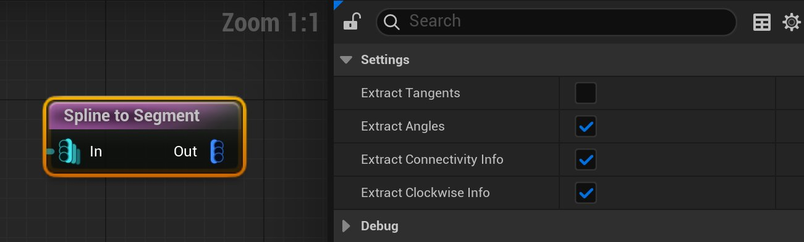
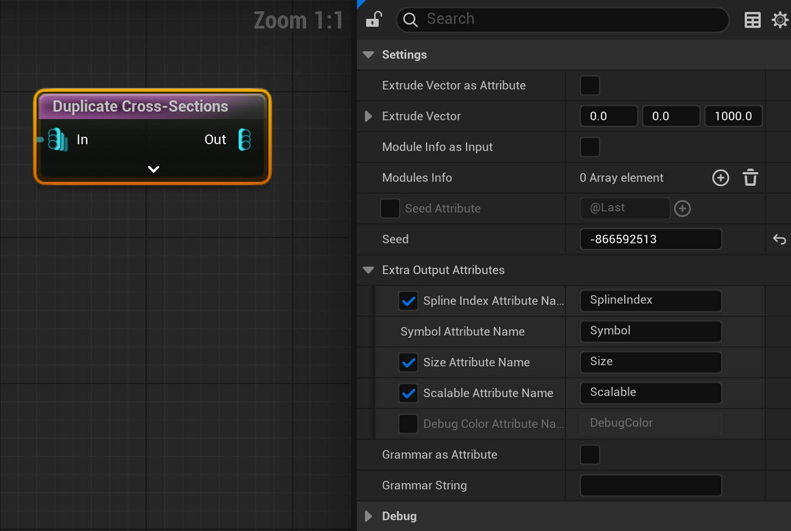
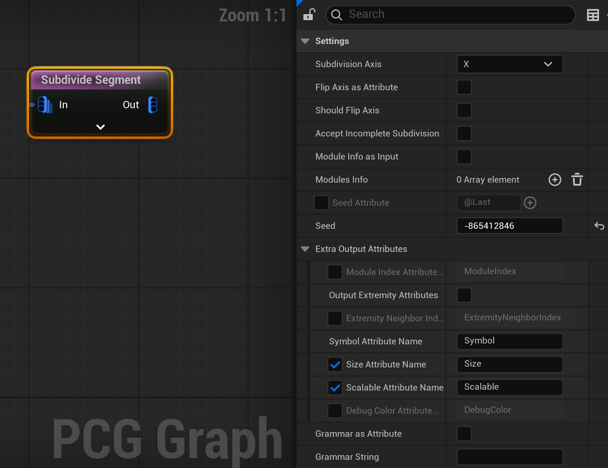
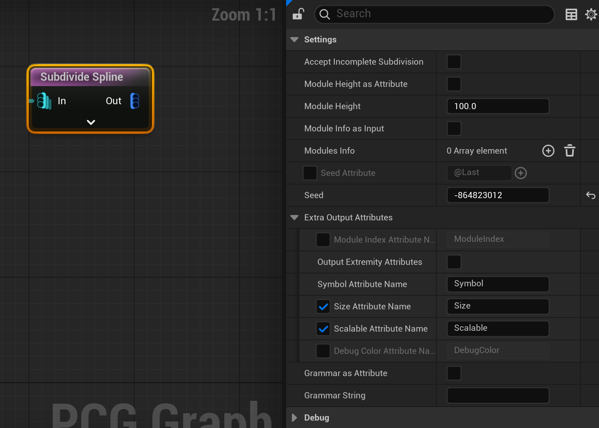
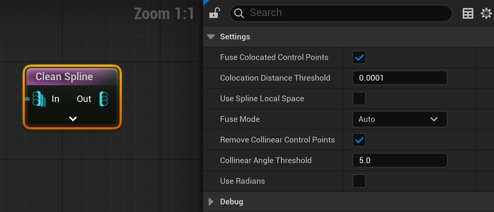
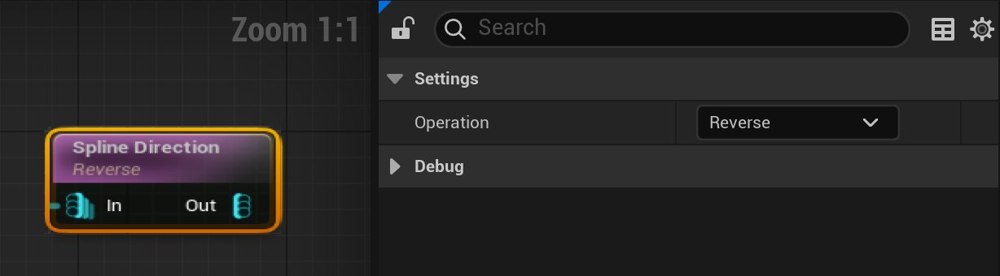
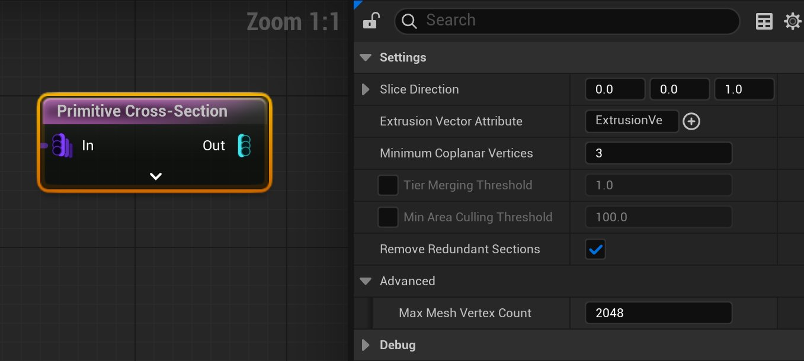
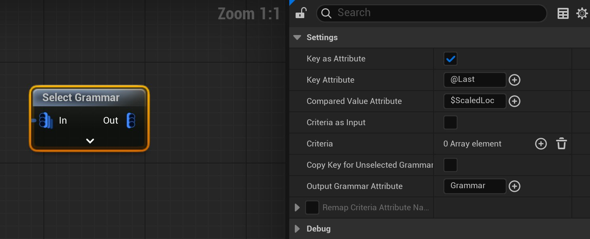

# 将形状语法用于PCG

> 路径：虚幻引擎5.7文档 / 构建虚拟世界 / 程序化内容生成框架 / 将形状语法用于PCG

> 原始页面：https://dev.epicgames.com/documentation/unreal-engine/using-shape-grammar-with-pcg-in-unreal-engine

虚幻引擎的 **程序化内容生成框架（Procedural Content Generation Framework）** 为技术美术师和设计师提供了创建程序化内容的强大工具集。在程序化内容生成的语境中，**形状语法（Shape Grammar）** 是指一组定义内容生成方法和结构的规则。在语法中，用户自定义的名为 **模块** 的符号代表资产，并以字符串的形式组合在一起以创建更复杂的结构。

> 图片已省略：Fence generator created using shape grammar.

利用形状语法创建的栅栏生成器。

## 重要概念和术语

- 模块（Modules）

  ：用户定义的符号，代表资产。其可以是字母或单词。模块可以作为属性（Attribute）存储，也可以被硬编码到节点中。
- 句法结构（Syntax）

  ：用于在字符串中组合模块以形成规则的符号和方法。

## 先决条件

本文档基于[程序化内容生成概述](../procedural-content-generation-overview/index.md)中描述的概念和信息撰写。

## 语法句法结构

PCG语法遵循特定的句法结构来组合模块，其使用以下符号：

- 你可以单独使用模块，也可以将它们与其他模块组合使用。以下是一些使用模块（以符号

  A

  和

  B

  为例）的示例：

  - A

    表示放置带符号

    A

    的模块。
  - A, B

    表示将模块

    A

    和

    B

    放在一起。
  - *

    表示尽可能多地放置一个模块。例如，

    A*

    表示尽可能多地放置模块

    A

    。
  - +

    表示至少放置一次某模块，然后尽可能多个地放置。例如，

    A+

    表示至少放置一次模块

    A

    ，然后尽可能多地放置。
- 你可以使用方括号

  [ ]

  将模块封装起来，以创建模块组合：

  - [A, B]

    组合了模块

    A

    和

    B

    ，并将它们一起放置。
  - [A, B]*

    表示尽可能多地将

    A

    和

    B

    一起放置。
  - [A, B]+

    表示至少将

    A

    和

    B

    一起放置一次，然后尽可能多地一起放置。
  - [A, B]2

    表示将

    A

    和

    B

    一起放置两次。
- 可以使用花括号和整型对模块组合进行随机排列，并赋予其概率：

  - <A, B, C>

    表示如果足够的空间就放置模块

    A

    ，否则就放置模块

    B

    ，然后再放置模块

    C

    。

例如，上图中展示的栅栏生成器使用语法规则决定在样条线的什么位置放置大门、栅栏分段和柱子。它使用的模块如下：

| **符号** | **规则** |
| --- | --- |
| `A` | 放置常规栅栏分段。 |
| `G` | 放置栅栏门。 |
| `P` | 放置栅栏柱子。 |
| `BL` | 放置带有大破损的栅栏分段。 |
| `BS` | 放置带有小破损的栅栏分段。 |

它使用的语法为：`{[A,P]:2,[BL,P]:1,[BS,P]:1}*,[G,P], {[A,P]:2,[BL,P]:1,[BS,P]:1}*`

其句法结构转译如下：

| **句法结构** | **含义** |
| --- | --- |
| `{[A,P]:2,[BL,P]:1,[BS,P]:1}*` | 使用句法结构中的权重值随机选择放置带柱子的栅栏分段、带柱子和大破损的栅栏分段，或是带柱子和小破损的栅栏分段。一直填充直至将栅栏门放置在样条线的中点位置。 |
| `[G,P]` | 放置一扇门和一个栅栏柱子。 |
| `{[A,P]:2,[BL,P]:1,[BS,P]:1}*` | 使用句法结构中的权重值随机选择放置带柱子的栅栏分段、带柱子和大破损的栅栏分段，或是带柱子和小破损的栅栏分段。一直填充直至样条线的终点。 |

## PCG语法节点

PCG语法使用了若干个图表节点，这些节点定义了系统的语法和形状。

### 细分节点

#### Spline To Segment

**Spline to Segment** 节点将样条线分为若干段点数据。每段由两个相连的控制点定义。

此节点具有以下选项：

| **选项** | **说明** |
| --- | --- |
| **提取切线（Extract Tangents）** | 提取上一个分段和下一个分段之间的切线。 |
| **提取角度（Extract Angles）** | 提取上一个分段和下一个分段之间的角度。对于非闭合样条线，样条线的端点处的角度值将为零。 |
| **提取连接信息（Extract Connectivity Info）** | 设置上一个分段和下一个分段的索引，以保留有关连接性的信息。 |
| **提取时针方向信息（Extract Clockwise Info）** | 输出一个全局属性，用于追踪样条线点是顺时针排列还是逆时针排列。 |

#### Duplicate Cross-Section

**Duplicate Cross-Section** 节点根据所选语法的规则，沿挤出向量复制样条线。

此节点具有以下选项：

| **选项** | **说明** |
| --- | --- |
| **以挤出向量作为属性（Extrude Vector as Attribute）** | 决定是从输入样条线获取挤出向量作为属性，还是在设置中将其固定下来。 |
| **挤出向量（Extrude Vector）** | 定义挤出向量。 |
| **以模块信息为输入（Module Info as Input）** | 勾选后，将获取模块信息作为输入。 |
| **模块信息（Modules Info）** | 定义用于细分的模块数组。 |
| **种子属性（Seed Attribute）** | 定义用于驱动种子选择的属性。如果不提供属性，则使用种子（Seed）属性。 |
| **种子（Seed）** | 定义用于驱动随机生成的种子值。 |
| **额外输出属性（Extra Outputs Attribute）** | 定义输出属性的具体名称。 |
| **以语法为属性（Grammar As Attribute）** | 勾选后，会将语法读取为输入属性，而不是直接从设置中读取。 |
| **语法字符串（Grammar String）** | 定义用于生成的语法字符串。 |

#### Subdivide Segment

**Subdivide Segment** 节点基于所选的语法和模块对分段进行细分。

此节点具有以下选项：

| **选项** | **说明** |
| --- | --- |
| **细分轴（Subdivision Axis）** | 在点的本地空间中定义细分方向。该下拉菜单包含使用X、Y或Z轴的选项。 |
| **以属性形式翻转轴（Flip Axis as Attribute）** | 勾选后，将使用一个属性定义是否应该翻转轴。 |
| **应翻转轴（Should Flip Axis）** | 勾选后，将定义是否应该翻转轴。 |
| **接受不完整细分（Accept Incomplete Subdivision）** | 在出现语法没有填充分段的情况时，决定此情况是否有效。可用于解决"样条线存在不完整细分（Spline has an incomplete subdivision）"警告信息。 |
| **种子属性（Seed Attribute）** | 定义用于驱动种子选择的属性。如果不提供属性，则使用种子（Seed）属性。 |
| **种子（Seed）** | 定义用于驱动随机生成的种子值。 |
| **额外输出属性（Extra Outputs Attribute）** | 定义输出属性的具体名称。 |
| **以语法为属性（Grammar As Attribute）** | 勾选后，会将语法读取为输入属性，而不是直接从设置中读取。 |
| **语法字符串（Grammar String）** | 定义用于生成的语法字符串。 |

#### Subdivide Spline

**Subdivide Spline** 节点基于所选的语法和模块对分段进行细分，并按照两端都落在样条线上的原则放置模块。

> [!NOTE]
> 这种方法可能过于僵化。低估了这一点可能会导致错误的记过。

此节点具有以下选项：

| **选项** | **说明** |
| --- | --- |
| **接受不完整细分（Accept Incomplete Subdivision）** | 在出现语法没有填充分段的情况时，决定此情况是否有效。可用于解决"样条线存在不完整细分（Spline has an incomplete subdivision）"警告信息。 |
| **以属性为模块高度（Module Height as Attribute）** | 使用属性定义模块Z高度。 |
| **模块高度（Module Height）** | 定义模块Z高度。 |
| **以模块信息为输入（Module Info as Input）** | 勾选后，将获取模块信息作为输入。 |
| **种子属性（Seed Attribute）** | 定义用于驱动种子选择的属性。如果不提供属性，则使用种子（Seed）属性。 |
| **种子（Seed）** | 定义用于驱动随机生成的种子值。 |
| **额外输出属性（Extra Outputs Attribute）** | 定义输出属性的具体名称。 |
| **以语法为属性（Grammar As Attribute）** | 勾选后，会将语法读取为输入属性，而不是直接从设置中读取。 |
| **语法字符串（Grammar String）** | 定义用于生成的语法字符串。 |

### 形状定义节点

形状定义节点定义了生成形状的轮廓。

#### Clean Spline

**Clean Spline** 节点基于用户定义的阈值移除线性眼条线上的所有多余的控制点。这些点可能要么过于靠近（共位），要么对于定义样条线来说是不必要的（共线）。

此节点具有以下选项：

| **选项** | **说明** |
| --- | --- |
| **熔合共位控制点（Fuse Colocated Control Points）** | 熔合位于所定义的距离阈值范围内的、共享同一位置的控制点。 |
| **共位距离阈值（Colocation Distance Threshold）** | 定义用于熔合共位控制点时所使用的距离阈值。 |
| **使用样条线本地空间（Use Spline Local Space）** | 勾选后，将使用样条线本地空间来计算距离。 |
| **熔合模式（Fuse Mode）** | 控制如何熔合两个共位的控制点。该下拉菜单包含以下选项： **保留第一个（Keep First）**：在第一个点的位置熔合两点。 **保留第二个（Keep Second）**：在第二个点的位置熔合两点。 **合并（Merge）**：在第一和第二个点之间正中的位置合并两点。 **自动（Auto）**：使用最佳解决方案。熔合位置通常都在第二个点上，但如果这样会改变样条线的长度，则会使用第一个点的位置。 |
| **移除共线控制点（Remove Collinear Control Points）** | 移除样条线线性分段上对于最终结果没有影响的多余点。 |
| **共线角度阈值（Collinear Angle Threshold）** | 定义用于判断控制点是否共线的角度阈值。 |
| **使用弧度（Use Radians）** | 勾选后，将在检查角度阈值时使用弧度，而非度数。 |

#### Spline Direction

**Spline Direction** 节点会反转控制点的顺序，以及它们到达和离开切线的方向。

此节点具有以下选项：

| **选项** | **说明** |
| --- | --- |
| **操作（Operation）** | 定义了节点将要执行的操作。该下拉菜单包含以下选项： **反转（Reverse）**：无论样条线控制点的初始方向如何，都逆转其方向。 **强制顺时针（Force Clockwise）**：如果样条线控制点为逆时针排列，则逆转其方向。 **强制逆时针（Force Counter Clockwise*）*：如果样条线控制点为顺时针排列，则逆转其方向。 |

> [!NOTE]
> 这对于样条线组件来说可能是一种破坏性的操作，因为某些定义样条线曲线的用户数据可能会在此过程中丢失。

#### Primitive Cross-Section

**Primitive Cross-Section** 借助帮助将一组图元横截面转换为样条线。此节点需要 **Procedural Content Generation Framework (PCG) Geometry Script Interop** 插件。

> [!WARNING]
> 此节点目前还在实验阶段。

此节点具有以下选项：

| **选项** | **说明** |
| --- | --- |
| **切片方向（Slice Direction）** | 定义切片将发生的方向。从所定义的方向向量的最小顶点开始。 |
| **挤出向量属性（Extrusion Vector Attribute）** | 定义每个横截面挤出矢量所填充的属性的名称。该矢量包含长度和方向数据。此向量包含长度和方向数据。 |
| **最低共面顶点数（Minimum Coplanar Vertices）** | 定义了必须位于同一平面内的顶点数量，以此作为判定为层特征的标准。 |
| **层合并阈值（Tier Merging Threshold）** | 定义了新层与前一层之间的最小距离标准，以厘米为单位。低于此标准的层将被剔除。 |
| **最小面积剔除阈值（Min Area Culling Threshold）** | 定义了新层必须达到的最小面积标准，低于此标准的层将被剔除。 |
| **移除冗余分段（Remove Redundant Sections）** | 如果层对横截面的轮廓不造成影响，则将其移除。 |
| **最大网格体顶点数（Max Mesh Vertex Count）** | 定义顶点数量上限，以免创建出过于复杂的网格体。 |

### 通用语法节点

#### Select Grammar

**Select Grammar** 节点基于用于定义的键值和一组条件来选择语法字符串。对于点数据中的每一个点，节点都会依次比较每一个条件，直至满足某一条件或找到所选的条件。

此节点具有以下选项：

| **选项** | **说明** |
| --- | --- |
| **以属性为键（Key as Attribute）** | 通过属性来选择键。如不勾选"以属性为键（Key as Attribute）"，则会使用由"键（Key）"选项定义的单个键。 |
| **键属性（Key Attribute）** | 定义要被用作键的属性。如不勾选"以属性为键（Key as Attribute）"，此选项将被设置为 **无（None）**。 |
| **比较值属性（Compared Value Attribute）** | 定义要与键值进行比较的属性。对每个值进行数字求值。默认值为 `$ScaledLocalBounds.X`，即在X轴上按点缩放比例缩放后的点的边界大小。 |
| **以条件为输入（Criteria as Input）** | 定义要使用属性输入比较的条件。 |
| **条件（Criteria）** | 选择并定义要用于比较键和值属性的比较条件。 |
| **为未选择语法复制键（Copy Key for Unselected Grammar）** | 如果未选中任何语法，则会为给定点传递键值。 |
| **输出语法属性（Output Grammar Attribute）** | 定义所选语法要写入的属性的名称。 |
| **重映射条件属性名称（Remap Criteria Attribute Names）** | 勾选后，将定义要用于比较条件的具体属性名称。只有在勾选了 **以条件为输入（Criteria as Input）** 时才可用。 |

#### Print Grammar

**Print Grammar** 节点将当前语法字符串的详细描述输出到日志。这是一个工具节点，有助于验证节点。它可以将语法字符串分解成更易理解的格式，以显示字符串该如何解释。

> 图片已省略：Print Grammar Node

此节点具有以下选项：

| **选项** | **说明** |
| --- | --- |
| **语法（Grammar）** | 定义了要详细验证并输出到日志的语法。 |
