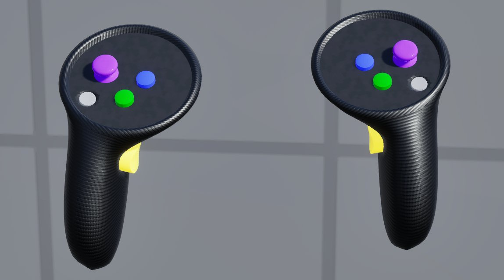
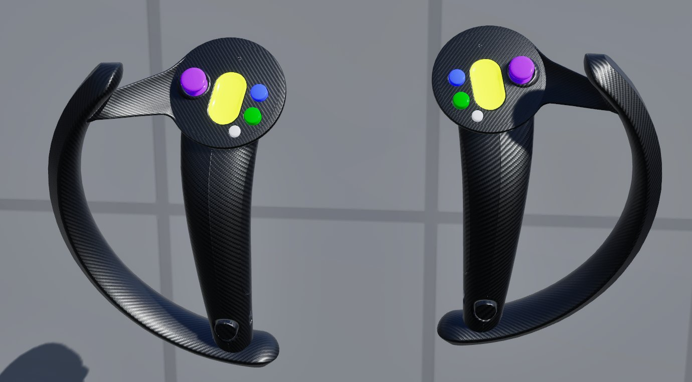
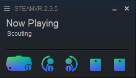
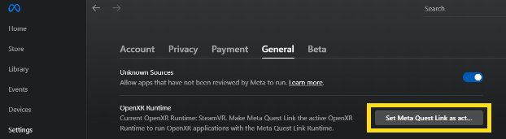
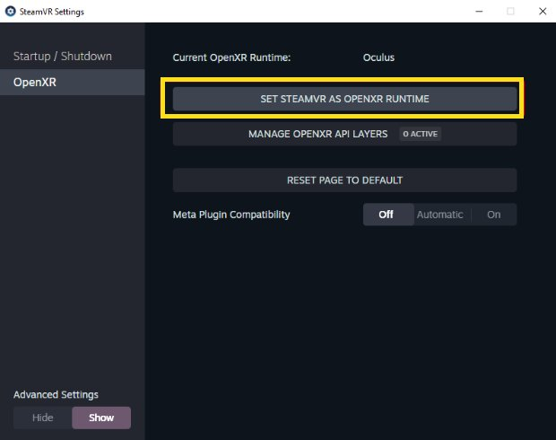
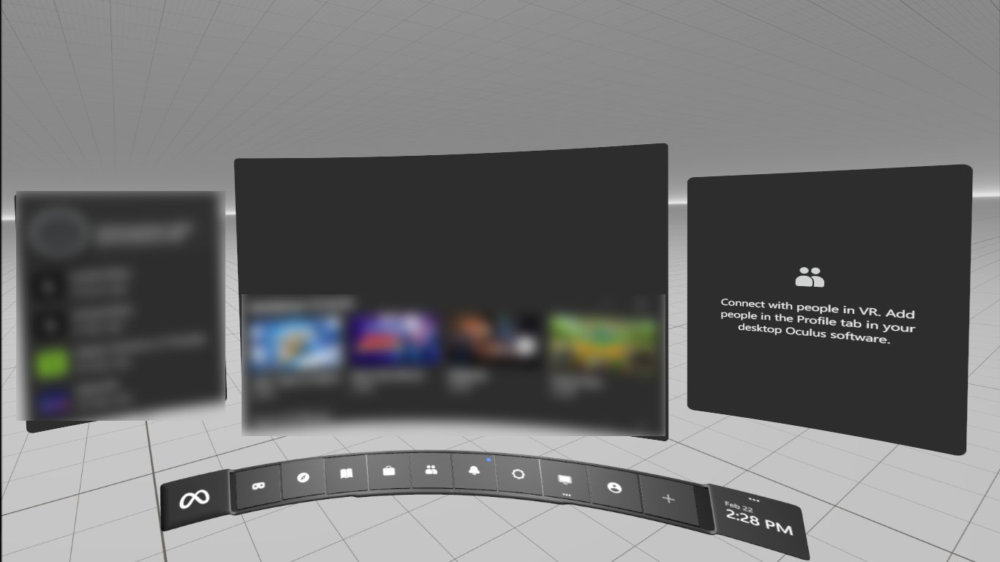
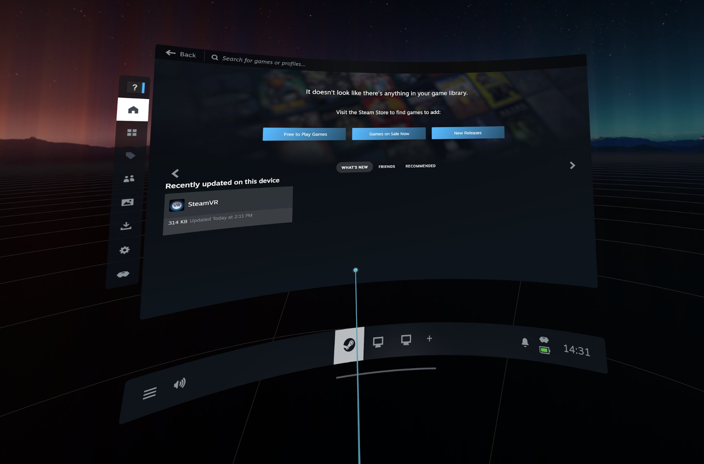
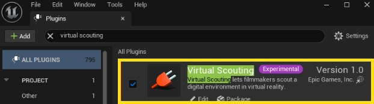

# 设置虚拟堪景

> 路径：虚幻引擎5.7文档 / 构建虚拟世界 / 虚拟堪景 / 设置虚拟堪景

> 原始页面：https://dev.epicgames.com/documentation/unreal-engine/setting-up-virtual-scouting-in-unreal-engine

本指南介绍如何设置头显设备以使用虚拟堪景工具。如需了解虚拟堪景的概述，请参阅[虚拟堪景](../index.md)。

要使用虚拟堪景，你必须设置好兼容的VR头显设备以及OpenXR运行时供应商。然后创建虚幻引擎项目，并启用虚拟堪景插件。

## 设置VR头显设备

虚拟堪景支持下列VR头显设备：

- Oculus Rift S
- Meta Quest 2
- Meta Quest Pro
- Meta Quest 3
- Valve Index

### Oculus和Meta头显设备

要设置Oculus或Meta头显设备，你必须先安装并启动Oculus桌面应用程序。如需安装说明，请参阅Meta的[为电脑安装Meta Quest Link应用](https://www.meta.com/zh-cn/help/quest/articles/headsets-and-accessories/oculus-rift-s/install-app-for-link/)文档。

启动Oculus桌面应用程序并戴上头显设备后，你应该会看到泛型控制器模型。

对于Oculus和Meta设备，不同的头显和对应的控制器之间共用一套相同的按钮映射。按钮映射即绑定控制器按钮和操作的输入。

#### Meta Quest Link - 有线

如果使用USB-C连接线，那么你必须使用Meta Quest Link连接到Meta头显。如需详细信息，请参阅Meta的[设置Meta Quest Link](https://www.meta.com/en-gb/help/quest/articles/headsets-and-accessories/oculus-link/set-up-link/)文档。

#### Meta Quest Link - 无线

必须使用Meta Quest AirLink才能将Meta头显无线连接到电脑。 如需详细信息，请参阅Meta的[使用Air Link通过Wi-Fi将Meta Quest连接到电脑](https://www.meta.com/en-gb/help/quest/articles/headsets-and-accessories/oculus-link/connect-with-air-link/)文档。

#### SteamLink和Quest

你可以用SteamLink应用程序将Meta头显连接到SteamVR电脑桌面软件。如需详细了解该应用程序及其用法，请参阅Meta商城的[Steam流式应用](https://www.meta.com/zh-cn/experiences/5841245619310585/)文档。

为获得最佳效果，请设置专用的无线路由器，通过以太网连接到你的电脑，并确保头显设备和路由器位于同一房间。VR的无线数据流质量和效果受无线网络连接质量的影响。

### Valve Index

虚拟堪景支持Valve Index头显设备以及Index Knuckle控制器。

要设置Valve Index头显，请在电脑上打开Steam客户端并启动SteamVR应用程序。

检查SteamVR窗口，确认头显和控制器已连接到用户界面。这时你应该能看到以下各组件的图标：

- 头显设备
- 左控制器
- 右控制器
- （如果有）系统中的追踪摄像机

### 设置OpenXR运行时供应商

如果你使用的是Meta或Oculus头显，请务必将Meta Quest Link桌面软件设置为OpenXR供应商。

要将Meta Quest Link桌面软件设置为OpenXR供应商，请执行以下步骤：

1. 打开Meta Quest Link桌面软件。
2. 点击

   设置（Settings）

   >

   通用（General）

   >

   OpenXR运行时（OpenXR Runtime）

   >

   将Meta Quest Link设置为...（Set Meta Quest Link as act…）

如果你用的是搭载SteamLink应用程序的Valve Index头或Meta头显，请务必将SteamVR设置为OpenXR提供商。

要将SteamVR设置为OpenXR提供商，请执行以下步骤：

1. 打开SteamVR。
2. 点击系统托盘的

   设置（Settings）

   。
3. 在打开的设置对话框中，点击

   OpenXR

   >

   将SteamVR设为OpenXR运行时（Set SteamVR as OpenXR Runtime）

   。

### 确认VR渲染和流送

要确认虚幻编辑器是否会渲染并流送到你的头显，请检查VR头显中是否可以看到到以下任一场景。

Meta Link电脑桌面视图

SteamVR桌面视图

## 在虚幻引擎项目中设置虚拟堪景

### 启用虚拟堪景插件

要启用虚拟堪景插件，请执行以下步骤：

1. 在虚幻引擎中创建一个空白项目。
2. 点击顶部工具栏的

   编辑（Edit）

   >

   插件（Plugins）

   。
3. 在 **插件（Plugins）** 菜单窗口中，搜索"虚拟堪景（Virtual Scouting）"并启用该插件。

   
4. 在弹出的对话框中点击

   是（Yes）

   ，然后重新启动虚幻引擎。

#### VR注意事项

##### 移除VR游戏输入映射

如果你使用的项目已经预设了VR增强输入操作（如VR游戏模板），那么你必须移除这些预设才能保证虚拟堪景正常工作。

要移除VR游戏输入的映射，请执行以下步骤：

1. 点击

   编辑（Edit）

   >

   项目设置（Project Settings）

   >

   引擎（Engine）

   。
2. 展开

   增强输入（Enhanced Input）

   类别。
3. 点击

   默认映射上下文（Default Map Contexts）

   标题旁的删除图标。

> 图片已省略：增强输入项目输入

##### 渲染注意事项

VR不支持实例剔除。如果项目启用了实例剔除（如[城市示例](https://www.fab.com/listings/4898e707-7855-404b-af0e-a505ee690e68)项目），那么你必须用控制台变量 `r.InstanceCulling.OcclusionCull=0` 将其禁用。如需详细了解剔除，请参阅[可视性和遮挡剔除参考](../../../designing-visuals-rendering-and-graphics/optimizing-and-debugging-proj-ea5cf1b9/visibility-and-occlusion-culling/visibility-and-occlusion-culling-reference/index.md)。

**Lumen** 和 **Nanite** 可在VR中生效，但从虚幻引擎5.4开始，使用Lumen对性能有很高的要求。你可能需要降低项目的伸缩性设置以提高性能。你可以通过降低屏幕百分比来提高性能，但代价是将出现渲染瑕疵，尤其是在VR控制板菜单等文本元素上。

##### 后期处理Alpha通道支持

要启动虚拟勘景，必须禁用后处理的Alpha通道支持。请转到 **项目设置（Project Settings）** > **引擎（Engine）** > **渲染（Rendering）** > **默认设置（Default Settings）** ，然后将 **Alpha输出（Alpha Output）** 设为 **False** 。

##### 轮廓模板支持

虚拟堪景工具使用模板材质在对象上绘制轮廓（详见[内容放置工具](../using-the-virtual-scouting-tools/index.md#%E5%86%85%E5%AE%B9%E6%94%BE%E7%BD%AE%E5%B7%A5%E5%85%B7)）。要启用轮廓丝网模板，请依次点击 **项目设置（Project Settings）** > **引擎（Engine）** > **渲染（Rendering）** 并将 **自定义深度模板通道（Custom Depth-Stencil Pass）** 设置为 **启用模板（Enabled with Stencil）**。

### 项目和用户设置

虚拟堪景插件有自己的项目和用户设置以及插件设置。你还可以在XRCreative编辑器设置中更改VR控制器的惯用手。

#### 项目设置

打开 **项目设置（Project Settings）** > **插件（Plugins）** > **虚拟堪景（Virtual Scouting Settings）** 即可访问插件的设置。如果将这些设置检入到版本控制系统中，那么这些设置将影响所有用户的项目。

> 图片已省略：项目设置

这些设置项包括控制虚拟堪景工具集的参数，例如用于测距的单位系统和取景器的曝光参数。

如果修改了单位系统，现有的测距结果将沿用之前的测距系统中存储的数值，直到更新。新的测距结果则会自动遵循当前的项目设置。

#### 用户设置

转到 **项目设置（Project Settings）** > **插件（Plugins）** > **虚拟制片编辑器（Virtual Production Editor）** > **旧版虚拟堪景（Legacy Virtual Scouting）** 即可访问用户设置。这些设置将与项目数据一起按用户进行保存。它们将决定用户对移动速度和提示文本可见性的偏好设置。你既可以在编辑器中修改这些设置，也可以在VR中进行修改。

> 图片已省略：用户设置

#### XRCreative编辑器设置

要访问XRCreative编辑器设置项，请转到 **编辑（Edit）** > **编辑器偏好设置（Editor Preferences）** > **XRCreative编辑器设置（XRCreative Editor Settings）** 。

> 图片已省略：XRCreative编辑器设置

XRCreative编辑器设置项 **惯用手（Handedness）** 决定了工具将在哪只手上出现。在VR中无法更改此设置。

**惯用手（Handedness）** 默认设置为 **右（Right）** 。左手模式就是一套单纯的功能按钮镜像，将功能切换到了另一只手。

### 设置VR模式

要设置虚拟堪景的VR模式，请在主工具栏中找到VREditor按钮，点击旁边的 **省略号（...）** 下拉菜单。

> 图片已省略：VREditor按钮和模式选择下拉菜单

确保选择堪景默认值（Scouting Default）模式。如需详细了解自定义VREditor模式，请参阅[创建新的XR创意模式和工具集](https://dev.epicgames.com/documentation/404)。

### 进入VR

要启动虚拟堪景工具集并在VR中查看关卡，点击VREditor按钮即可。

> 图片已省略：VREditor主工具栏按钮

如需详细了解虚拟堪景工具集的使用，请参阅[使用VR工具](../using-the-virtual-scouting-tools/index.md)。
