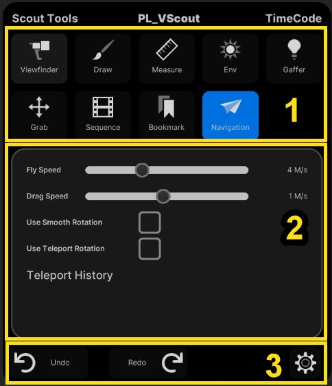
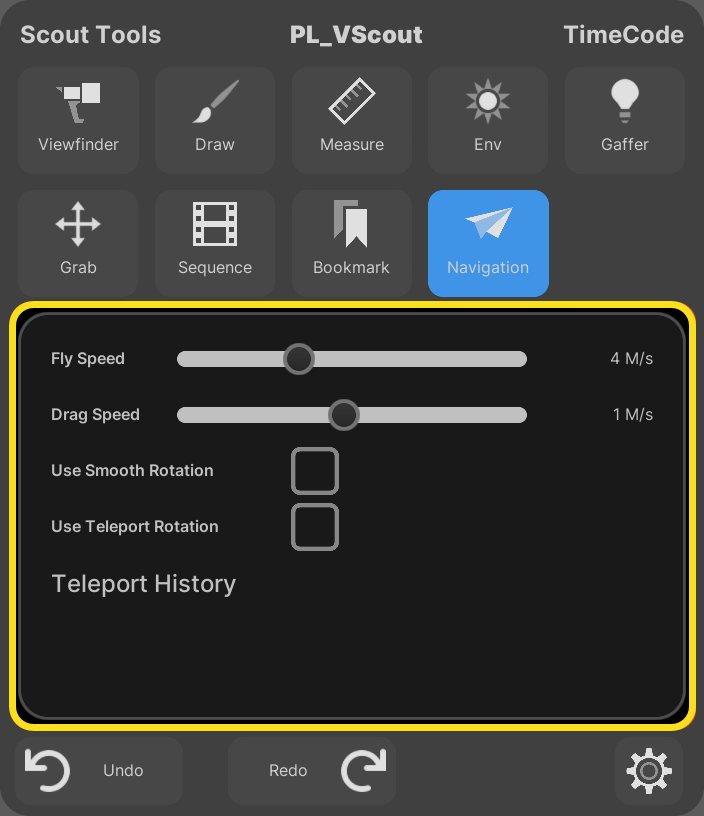
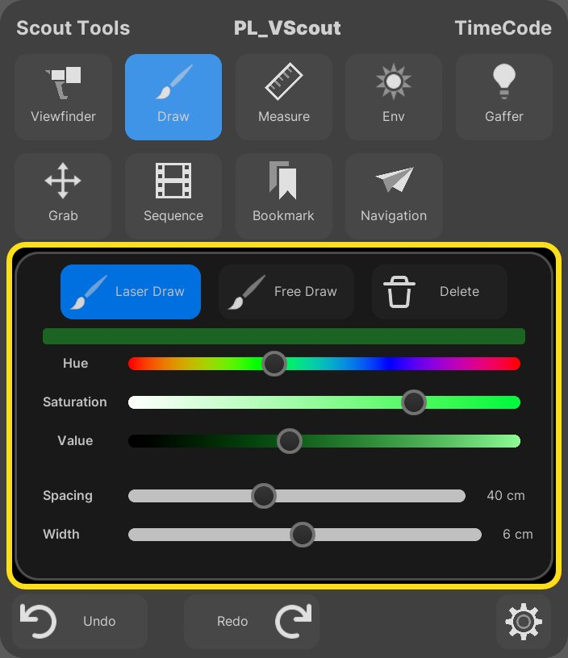
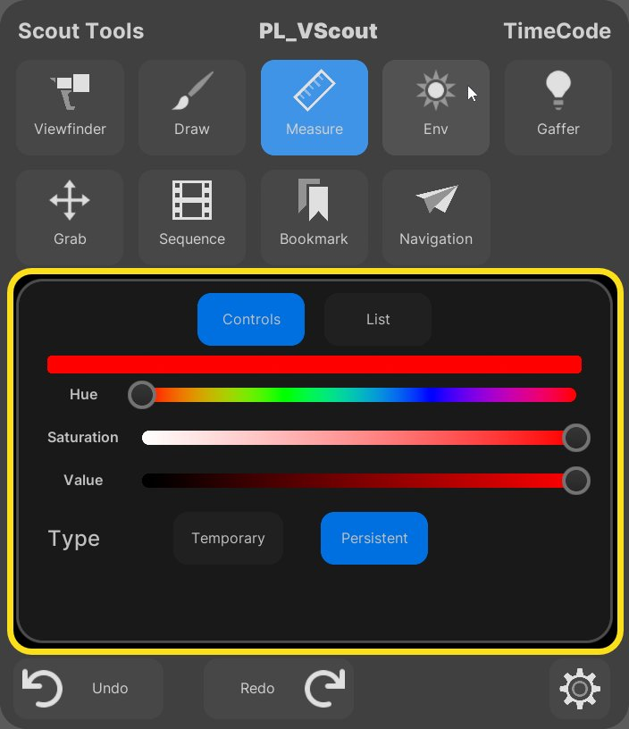
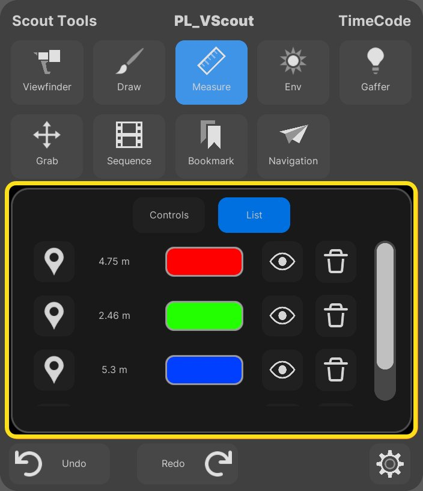
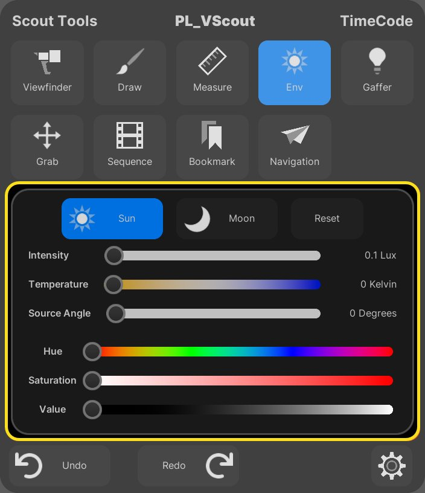
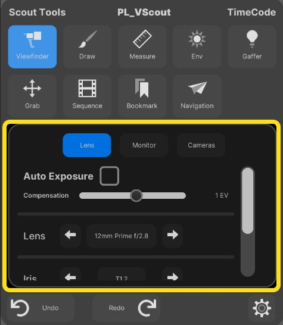
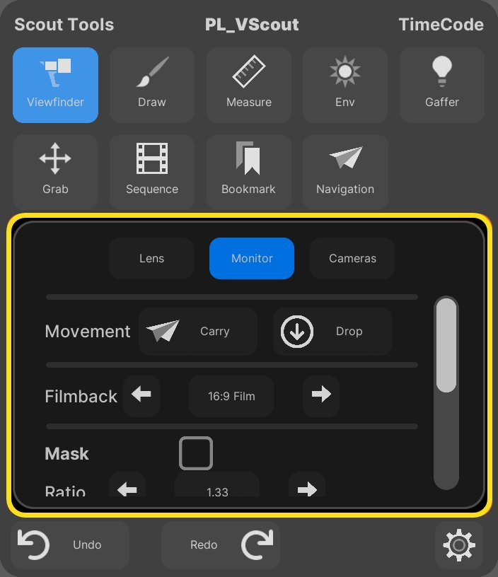

# 使用虚拟堪景工具

> 路径：虚幻引擎5.7文档 / 构建虚拟世界 / 虚拟堪景 / 使用虚拟堪景工具

> 原始页面：https://dev.epicgames.com/documentation/unreal-engine/using-the-virtual-scouting-tools-in-unreal-engine

虚拟勘景工具类似[关卡编辑器](../../level-editor/level-editor-modes/index.md)的编辑器模式。你每次只能选择一个工具，但导航（Navigation）工具除外，该工具始终可用。

## 主菜单控制板

用主菜单控制板来选择工具，调整各工具的设置，以及撤消或重做操作。

### 功能按钮

要查看主菜单控制板，请扣动并长按左运动控制器上的扳机（如果将惯用手设置为 **左（Left）** ，则是扣动右运动控制器上的扳机）。扣住左扳机时，主菜单将保持可见。

> 动图已省略：查看主菜单控制板

要与主菜单交互，请用右运动控制器的绿色光标做指示，并用右运动控制器扳机点击和/或拖拽主菜单的界面元素。

> 动图已省略：与主菜单控制板交互

### 设置

主菜单包含如下分段：

- 分段1：各工具的图标。点击即可切换到所选工具。
- 分段2：各工具的具体设置项。
- 分段3：撤消（Undo）/重做（Redo）按钮和设置菜单。

## 导航工具栏

使用 **导航（Navigation）** 工具在关卡内移动。你可以在主菜单控制板中调整移动速度和转向的设置。

导航工具在你使用其他工具时也始终可用。导航工具使用左控制器，有时也需使用右控制器，具体取决于所选工具是否重载了导航的输入功能按钮。

### 功能按钮

下表列出了导航的功能按钮。

| 功能按钮 | 操作 | 预览 |
| --- | --- | --- |
| **右摇杆，全方向（粉色）** | 向摇杆方向飞行。 | 飞行的VR预览 |
| **左摇杆，Y轴（粉色）** | 向摇杆方向飞行。同时使用左右摇杆即可加速飞行。 |  |
| **左摇杆（粉色）** | 快速转向。如果选择 **使用平滑转向（Use Smooth Rotation）** 则进行平滑的转向。 | 快速转向的VR预览 快速转向 |
| **左右侧边握把（黄色按钮）** | 拖拽。按住即可朝手部移动的方向进行拖拽。 | 拖拽的VR预览 |
| **左右侧边握把（同时按下黄色按钮）** | 将控制器彼此移近或移远来改变你在场景中的大小。 像握着方向盘那样转动控制器即可让你自己在场景中转向。 | 缩放的VR预览 改变大小 转向的VR预览 转向 |
| **蓝色按钮** | 按住不放即可召唤传送点。放开即可传送至激光指针的位置。 若启用 **使用传送转向（Use Teleport Rotation）** ，你还能转动手腕并调整传送后你所面对的方向。 | 传送的VR预览 传送 带转向传送的VR预览 带转向传送 |

### 设置

你可以用主菜单控制板更改飞行和拖拽的速度，设定左摇杆是快速转向还是平滑转向，以及是否在传送时根据手腕的转动轴（前向轴）进行转向。你还可以查看你在场景中的传送次数。

## 绘图工具

使用 **绘图（Draw）** 工具在场景中绘图（激光绘图）、在空间中绘图（自由绘图）以及删除绘图。

### 功能按钮

要在场景中绘图，请选择绘图工具并扣住右扳机。移动右控制器即可画线，放开扳机即可停止绘制。

> 动图已省略：绘图的VR预览

### 设置

你可以用主菜单控制板在三种模式之间切换：**激光绘图（Laser Draw）** 、 **自由绘图（Free Draw）** 以及 **删除（Delete）** 。你还可以控制线条的颜色、宽度和间距。

## 测距

使用 **测距（Measurement）** 工具即可测距两点之间的距离。

### 功能按钮

要进行测距，请用激光指针进行指示，扣住扳机，从起始位置拖动到结束位置。测距数据会随着你的拖动而更新。

> 动图已省略：测距的VR预览

### 设置

你可以用主菜单控制板修改测距线的颜色或切换工具的类型。若选择 **持久（Persistent）** 类型，那么测距结果在多用户会话中对所有用户可见，并且在你停止使用测距工具后，环境中仍会保留结果。若选择 **临时（Temporary）** 类型，那么测距结果只对你可见，并且在你换用其他工具后，测距结果就会消失。

测距工具的 **列表（List）** 选项卡将显示当前关卡中的所有测距结果。你可以切换所有测距结果的可见性、查看你所在位置与和测距结果间的连线、传送到测距结果以及将其删除。

## 环境光源

使用环境（**Env**）工具来控制关卡中 **太阳（Sun）** 和 **月亮（Moon）** 光源的位置。

为了让放置起作用，关卡中必须有两个定向光源，且太阳和月亮的属性必须设置如下：

- Atmosphere Sun Light

  =

  True
- Atmosphere Sun Light Index

  =

  0

  （针对太阳）
- Atmosphere Sun Light Index

  =

  1

  （针对月亮）
- Forward Shading Priority

  =

  0

  （针对太阳）
- Forward Shading Priority

  =

  1

  （针对月亮）

### 功能按钮

工具启动时默认选择太阳。要移动太阳，请使用激光指针并扣下右运动控制器的扳机。按住扳机并移动激光指针，就能让太阳跟随指针的方向移动。

> 动图已省略：Env工具VR预览

### 设置

你可以用主菜单控制板控制阳光和月光的属性，例如 **强度（Intensity）** 、 **温度（Temperature）** 、 **颜色（Color）** 和 **光源角度（Source Angle）** 等，也可以将属性重置为默认值。

## 取景器

使用 **取景器（Viewfinder）** 工具即可通过屏幕摄像机截取环境的屏幕截图。你可以控制镜头的各种属性，如光圈和焦点等。

### 功能按钮

你可以用下表所列的功能按钮修改属性、截取屏幕截图以及创建摄像机对象。

| 功能按钮 | 操作 |
| --- | --- |
| **绿色按钮** | 唤出屏幕镜头功能按钮。 |
| **摇杆（左右）** | 切换所控的属性（镜头、光圈、焦点）。 |
| **摇杆（上下）** | 修改所控的属性。 |
| **蓝色按钮** | 捕获屏幕截图。 |
| **扳机 + 蓝色按钮** | 创建摄像机对象。 |
| **扳机（按住）** | 当摄像机与激光指针重叠时拾取摄像机。摄像机必须靠近运动控制器。 |

> 动图已省略：使用屏幕镜头功能按钮

### 设置

在主菜单控制板中，使用 **镜头（Lens）** 选项卡更改镜头的设置，例如 **曝光（Exposure）** 、 **镜头（Lens）** 类型和 **光圈（Iris）** 等。

使用 **显示器（Monitor）** 选项卡来拾取和放下显示器，或者更改诸如 **胶片背板（Filmback）** 和 **遮罩（Mask）** 等显示器设置。

使用 **摄像机（Camera）** 选项卡查看已创建的摄像机对象列表，或者进行删除。

> 图片已省略：取景器设置项的摄像机选项卡

截屏保存在你的 `/[项目名称]/Saved/Screenshots/` 目录中。

## Sequencer

使用Sequencer工具加载关卡序列并控制播放。

### 功能按钮

要打开序列，点击主菜单控制板中序列缩略图旁的 **打开（Open）** 按钮即可。

> 图片已省略：打开按钮

关卡序列在编辑器中打开时，右运动控制器上方会出现一个小控制台控件。

要在多用户会话中向其他用户开放关卡序列，请启用 `Concert.EnableOpenRemoteSequencer` 变量。

要关闭序列，使用激光指针点击 **关闭（Close）** 按钮即可。

序列打开时，你可以使用下表所列的功能按钮。

| 功能按钮 | 操作 |
| --- | --- |
| **绿色按钮** | 停止/开始播放 |
| **右摇杆（左/右）** | 向前/向后推移 |
| **右扳机 + 移动（左/右）** | 向前/向后推移 |
| **右摇杆按钮** | 放下/拾取序列控制台 |

### 设置

主菜单控制板中，Sequencer工具默认将 **使用集合过滤（Use Collection Filter）** 设置为true。请使用此设置来决定虚拟堪景中可用的关卡序列。如果将 **使用集合过滤（Use Collection Filter）** 设置为false，那么项目中的所有关卡序列都将对Sequencer工具可见。

要为虚拟堪景创建序列集合，请执行以下步骤：

1. 打开内容浏览器，转到

   集合（Collections）

   并点击

   添加 (+)

   按钮。
2. 为集合命名。
3. 将关卡序列拖入集合中。

   > 图片已省略：集合内的关卡序列
4. 找到 **项目设置（Project Settings）** > **虚拟堪景设置（Virtual Scouting Settings）** ，将集合名称输入到 **序列工具集合（Sequence Tool Collection）** 字段中。

   > 图片已省略：序列工具集合字段

## 布光器

使用 **布光器（Gaffer）** 工具创建点光源或区域（即"矩形"）光源。

### 功能按钮

| 功能按钮 | 操作 | 预览 |
| --- | --- | --- |
| **右扳机** | 创建新光源（如果尚未创建光源）。 移动光源（需要你用激光指针选中光源的球体碰撞物）。 移动选定光源的兴趣点（需要你用激光指针选中除光源的碰撞物球体外的其他位置）。 | 在VR中创建并放置光源 创建并放置光源 在VR中移动光源 移动光源 在VR中移动光源的兴趣点 移动光源的兴趣点 |
| **摇杆（上/下） + 按住右扳机** | 沿激光指针拉近或推远光源。 |  |
| **摇杆按钮** | 从对光源位置的3D控制切换到粘附于任意碰撞几何体的光源。 |  |

### 设置

你可以在主菜单控制板中选择创建 **点光源（Spot Light）** 还是 **区域光源（Area Light）** 。

> 图片已省略：布光器设置项内的新版光源选项卡

**所有光源（All Lights）** 选项卡上的按钮可以切换可见性、独立、删除和选择光源。将光标悬停在光源名称上，环境中就会出现一条直线指向高亮显示的光源。

> 图片已省略：布光器设置项内的所有光源选项卡

选择光源后，可以使用滑块修改其属性。可修改的属性如下：

- 强度（Intensity）
- 衰减（Attenuation）
- 光椎角度（Cone Angle）
- 源大小（Source Size）
- 宽度（Width）
- 高度（Height）
- 挡光板角度（Barndoor Angle）
- 色温（Color Temperature）
- 颜色（Color）

> 图片已省略：单个光源的设置项

## 抓取工具

使用 **抓取（Grab）** 工具的变换小工具即可操纵环境中选定的Actor。

> 图片已省略：在VR中使用抓取工具

### 功能按钮

要操纵Actor和小工具，请使用下表中的功能按钮。

| 功能按钮 | 操作 |
| --- | --- |
| **右扳机** | 选择Actor。 |
| **右扳机** | 移动所选的小工具控点。 |
| **绿色按钮** | 小工具可在以下模式之间切换： 移动（Move） 旋转（Rotate） 缩放（Scale） 组合（Combined） 隐藏（Hidden） |
| **蓝色按钮** | 切换轴的本地和世界对齐。 |

### 设置

使用主菜单控制板让小工具在本地空间和世界空间之间切换、切换模式、复制或删除选定的Actor，或者将选定Actor的旋转或缩放重置为默认大小。

> 图片已省略：抓取工具的设置项

## 内容放置工具

使用 **内容（Content）** 或 **放置（Placement）** 工具将静态网格体、骨架网格体和蓝图放入关卡。从控制板菜单中选择一个资产。这会在你激光指针上生成一个该资产的预览副本。再次扣动扳机即可将资产放入关卡。

(convert:false)

### 功能按钮

| 功能按钮 | 操作 |
| --- | --- |
| **右扳机（Right Trigger）** | 在主菜单调色板中选择一个资产。 |
| **右扳机（Right Trigger）** | 在关卡中生成放置的资产。 |
| **右拇指摇杆（左/右）（Right Thumbstick (left/right)）** | 在放置时渲染对象。 |
| **右拇指摇杆（上/下）（Right Thumbstick (up/down)）** | 在自由放置模式中，使对象远离或靠近你的手柄。 |
| **右拇指摇杆（按下）（Right Thumbstick Button——** | 切换表面对齐模式和自由放置模式。 |

### 内容浏览器

你可以使用主菜单控制板中 **内容（Content）** 下的 **SM**（静态网格体）、**SKM**（骨架网格体）和 **BP**（蓝图）按钮在环境中浏览这些类型的资产。

> 图片已省略：List of static meshes

> 图片已省略：List of skeletal meshes

> 图片已省略：List of Blueprints

### 设置

点击主菜单调色板中 **内容（Content）** 下的 **选项（Options）**，可以切换以下设置：

- 集筛选器（Collection Filter）

  - 是列出来自放置工具（Placement Tool）集的资产，还是列出来自所有项目内容的资产。
- 使用平滑旋转（Use Smooth Rotation）

  - 是否在放置资产时平滑地旋转其垂直轴。
- 旋转至表面法线（Rotate to Surface Normal）

  - 是否将翻滚和俯仰旋转对齐到关卡对象的表面。
- 生成时使用抓取工具（Use Grab Tool on Spawn）

  - 在放置好资产后，是否自动切换至抓取工具。这可以让你立即使用资产上的变换小工具。

> 图片已省略：Settings for the Content Placement tool

#### 创建放置工具集

放置工具的 **集筛选器（Collection Filter）** 设置默认为 **True**。你可以使用命名的集来管理可被放置的资产。如果将 **集筛选器（Collection Filter）** 设置为 **False**，则项目中的所有网格体资产都对放置工具可见。

要创建放置工具集，请按以下步骤操作：

1. 在

   内容浏览器（Content Browser）

   中，找到

   集（Collections）

   并点击

   添加（+）

   按钮。
2. 为集命名。
3. 将一些资产拖入集中。

   > 图片已省略：A Placement tool collection

   如需详细了解内容浏览器集，请参阅[创建集](https://dev.epicgames.com/documentation/en-us/unreal-engine/filters-and-collections-in-unreal-engine#creatingcollections).
4. 在 **项目设置（Project Settings）** > **虚拟堪景设置（Virtual Scouting Settings）** 中，将集的名称输入 **放置工具集（Placement Tool Collection）** 字段。

   > 图片已省略：The Placement Tool Collection field
