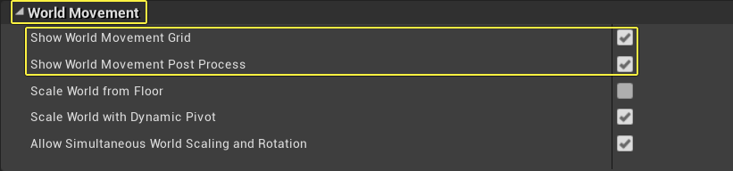
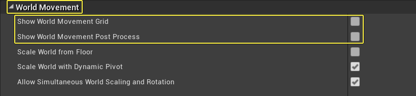
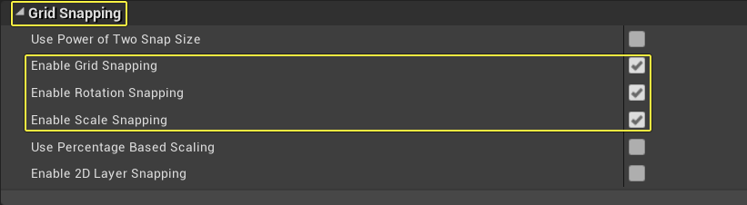
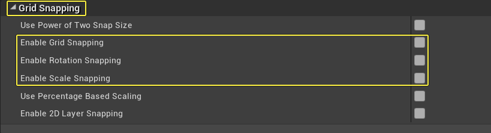

# 启动旧版虚拟堪景工具

> 路径：虚幻引擎5.7文档 / 构建虚拟世界 / 虚拟堪景 / 旧版虚拟堪景工具 / 启动旧版虚拟堪景工具

> 原始页面：https://dev.epicgames.com/documentation/unreal-engine/activating-the-virtual-scouting-legacy-tools

> [!NOTE]
> 本文中提到的旧版虚拟堪景工具将在未来的引擎版本中废弃。我们建议改用[新版虚拟堪景工具](../../index.md)。 未使用的VREditor代码和模块将在未来的引擎版本中彻底废弃。

> [!NOTE]
> 虚拟堪景兼容的头显包括HTC Vive、HTC Vive Pro、Oculus Rift和Oculus Rift S VR。请参阅[SteamVR先决条件](../../../../sharing-and-releasing-projects/developing-for-xr-experiences/supported-xr-devices/developing-for-steamvr/steamvr-prerequisites/index.md)和[Oculus先决条件](../../../../sharing-and-releasing-projects/developing-for-xr-experiences/supported-xr-devices/developing-for-oculus/oculus-rift/oculus-prerequisites/index.md)，了解如何将头显连接上虚幻引擎。

本操作指南将介绍如何配置项目，以启用虚拟堪景工具。

## 步骤

1. 打开项目后，在主菜单中选择 **编辑（Edit）** > **插件（Plugins）**。
2. 在 **插件（Plugins）** 菜单的 **虚拟制片（Virtual Production）** 下，启用 **虚拟制片工具（Virtual Production Utilities）** 插件。
3. 出现提示后，重启 **编辑器**。
4. 在主菜单中选择 **编辑（Edit）** > **项目设置（Project Settings）**。
5. 在 **项目设置（Project Settings）** > **插件（Plugins）** > **虚拟制片编辑器（Virtual Production Editor）** > **虚拟制片（Virtual Production）** 中，将 **虚拟堪景用户界面（Virtual Scouting User Interface）** 设为 **虚拟堪景控件（Virtual Scouting Widget）**。

   > [!WARNING]
   > 如启用 **虚拟制片实用工具** 插件，但 **VirtualScoutingWidget** 未设为 **虚拟堪景控件**，则可能会影响 **VR编辑器** 的行为。这一问题将在未来版本中得到解决。
6. 在主菜单中选择 **编辑（Edit）** > **编辑器首选项（Editor Preferences）**。
7. 在 **通用（General）** > **VR模式（VR Mode）** > **运动控制器（Motion Controllers）** 中，将 **交互件类（Interactor Class）** 设为 **VirtualScoutingInteractor**。
8. 在主菜单中选择 **编辑（Edit）** > **编辑器首选项（Editor Preferences）**。
9. 在 **编辑器偏好（Editor Preferences）** > **通用（General）** > **VR模式（VR Mode）** > **运动控制器（Motion Controllers）** 中，将 **传送器类** 设为 **VirtualScoutingTeleporter**。
10. 在主菜单中选择 **编辑（Edit）** > **编辑器偏好（Editor Preferences）**。
11. 在

    编辑器偏好（Editor Preferences）

    >

    通用（General）

    >

    VR模式（VR Mode）

    >

    场景移动（World Movement）

    中，不勾选

    显示场景移动网格（Show World Movement Grid）

    和

    显示场景移动后期处理（Show World Movement Post Process）

    。

    

    
12. 在主菜单中选择 **编辑（Edit）** > **编辑器偏好（Editor Preferences）**。
13. 在

    编辑器偏好（Editor Preferences）

    >

    关卡编辑器（Level Editor）

    >

    视口（Viewports）

    >

    网格快照（Grid Snapping）

    ，不勾选

    启用网格快照（Enable Grid Snapping）

    、

    启用旋转快照（Enable Rotation Snapping）

    和

    启用比例快照（Enable Scale Snapping）

    。

    

    
14. 进入 **VR模式**。

## 最终结果

进入 **VR模式** 后，按下VR控制器上的菜单按钮就能呼出虚拟堪景面板，访问各种虚拟堪景工具。关于每个工具的详细信息，请参阅[虚拟堪景概述](../virtual-scouting-legacy-overview/index.md)。
