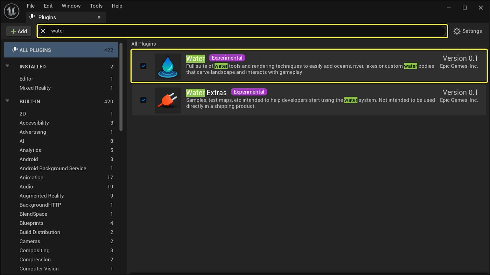
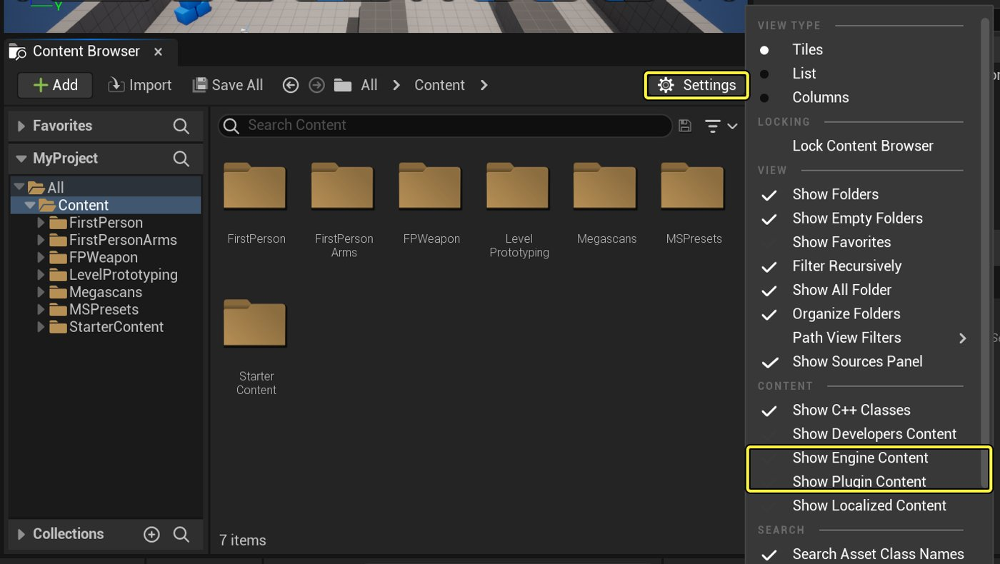
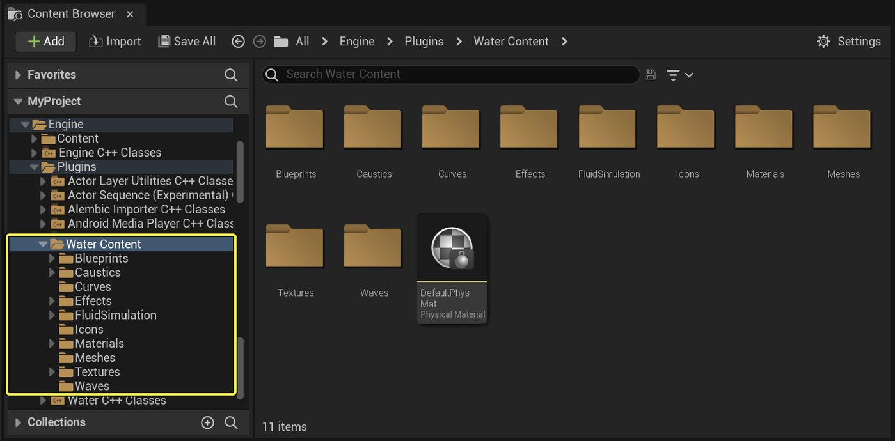

# 水体系统

> 路径：虚幻引擎5.7文档 / 构建虚拟世界 / 水体系统

> 原始页面：https://dev.epicgames.com/documentation/unreal-engine/water-system-in-unreal-engine

水体系统允许你基于样条线创建各种河流、湖泊、海洋，并陆地地形有机互动。 它集成了着色和渲染管线，其水体表面支持物理交互和动态流体模拟，比如脚本在水中的涟漪或船在水中移动时的尾迹。

## 启用水体系统插件和内容

水体系统是一个独立的插件，可以根据你的项目需求来启用/停用。 该插件能为引擎增添水体渲染和网格划分系统，还提供了范例和默认内容供你使用。

如需启用水体系统，请点击**编辑（Edit） > 插件（Plugin）**打开**插件**浏览器。 搜索**水体**插件，勾选复选框从而启用它。

点击查看大图。

> [!WARNING]
> 请重启编辑器以便让插件生效。

### 其他水体插件相关的内容

水体插件还包含一些默认的材质和内容，可以在你自己的项目中使用，供你探索。 你可以在内容浏览器的**水体内容（Water Content）**中找到这些内容。

点击查看大图。

点击查看大图。

> [!TIP]
> 如果你在内容浏览器中没有看到这个文件夹，请点击**查看选项**（位于右下角），勾选**显示引擎内容**和**显示插件内容**。

在此目录中，我们提供了一些地图和内容示例供你探索，比如：

- 水波生成（Caustics generation）
- 流体模拟（Fluid simulation）
- 浮力模拟蓝图（Physics simulation buoyancy Blueprints）

## 入门指南

- [水体的网格系统及表面渲染](water-meshing-system-and-surface-rendering/index.md) - 介绍表面网格体和材质如何被用来渲染水面。

- [水体Actor](water-body-actors/index.md) - 大致了解现有的各种水体，以及如何利用它们与水系统建立世界。

## 精选指南

- [使用水波资产模拟波浪](simulating-waves-using-the-water-waves-asset/index.md) - 介绍如何使用水波资产模拟波浪。

- [水浮力组件](water-buoyancy-component/index.md) - 介绍如何设置和使用浮力组件使物体漂浮在水面上。

- [单层水着色模型](../../designing-visuals-rendering-and-graphics/unreal-engine-materials/unreal-engine-material-properties/shading-models/single-layer-water-shading-model/index.md) - 介绍单层水材质着色模型的概念，以及它是如何用来渲染基于物理水面效果。

- [水调试和可扩展性选项](water-debugging-and-scalability-options/index.md) - 介绍如何根据项目的需求调试和扩展水。

## 其他资源
