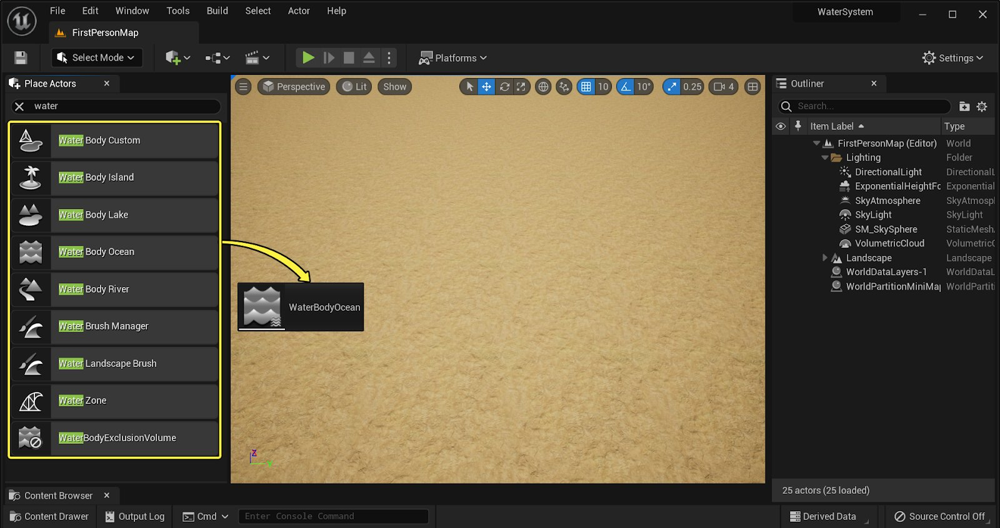
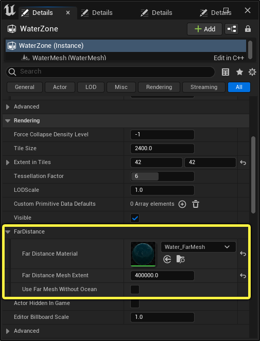
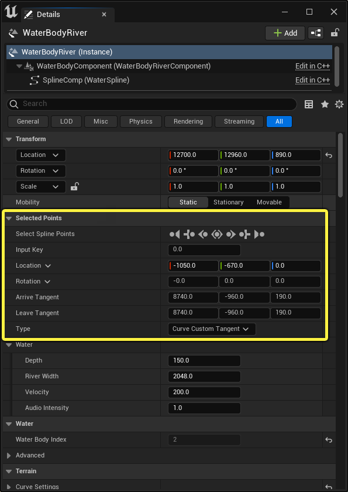
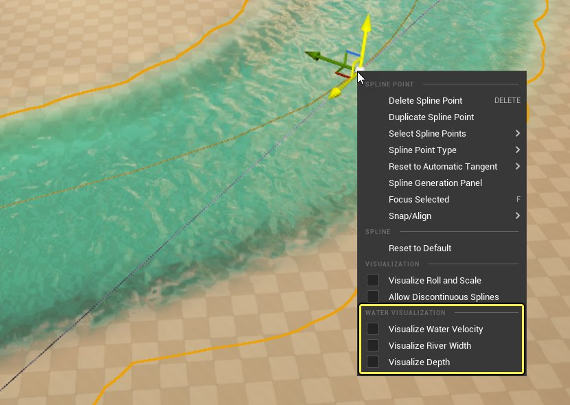
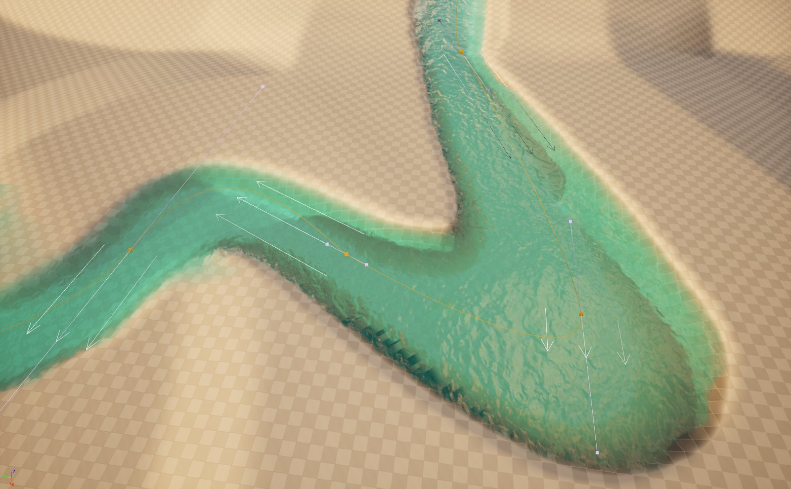
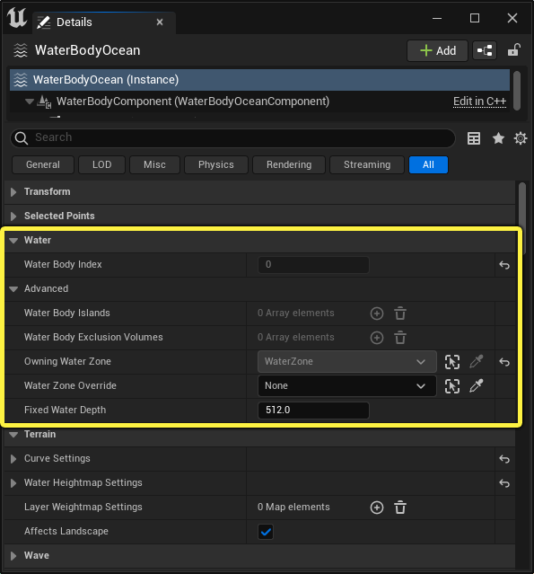
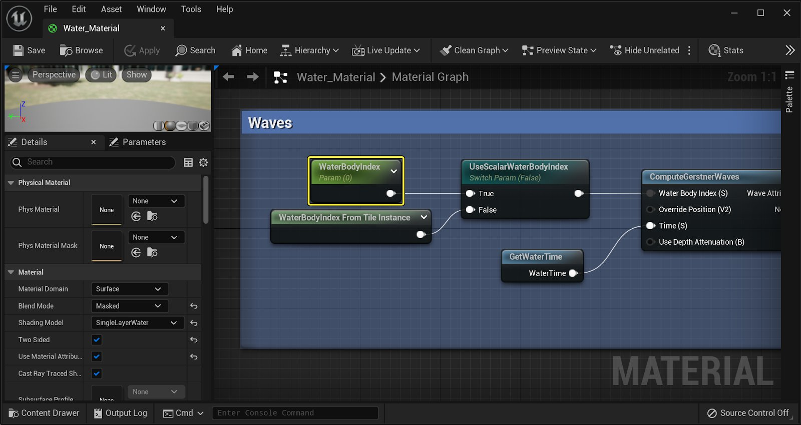
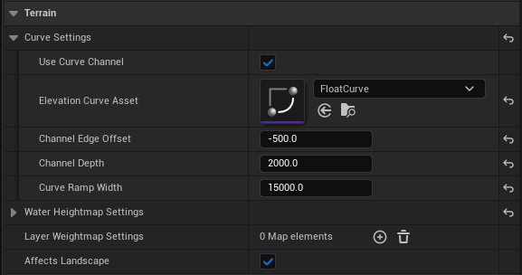

# 水体Actor

> 路径：虚幻引擎5.7文档 / 构建虚拟世界 / 水体系统 / 水体Actor

> 原始页面：https://dev.epicgames.com/documentation/unreal-engine/water-body-actors-in-unreal-engine

你可以使用 **水体Actor** 在关卡中定义水的位置、形状，以及水面过渡效果。水体是由许多的水网格体块组成，并由 **水网格体Actor（Water Mesh Actor）** 管理。这个actor决定了所有水体（water body）的质量和属性。你只需将水网格体actor放置在需要渲染水体的区域。之后，虚幻引擎会自动生成所需的网格体。系统会将所有水体渲染成单一的水网格体图块，实现平滑无缝的过渡效果。

水体（Water Body）还能决定波浪运动和水面阴影的效果，以及水下后处理效果。每个水体都包含深度和流量信息。你可以查询这些信息，用于某些游戏效果，例如创建与水面的物理交互效果。

## 水体的种类

有几种水体Actor可供选择。

- 海洋

  、

  湖泊

  和

  河流

  水体。它们的区别在于组成它们的样条线使用了保存不同类型的数据。
- 自定义

  类型。它同样有一个用于查询数据的样条，但你需要用静态网格体来定义形状。
- 岛屿

  类型。用于在已定义的样条区域内升高地形。
- 排出用体积（Exclusion Volume）

  类型。可用来在水下创建一片区域，但用来模拟水上的效果。

添加水体Actor到你的关卡：

- 找到

  放置Actor

  面板，选择

  水体Actor

  ，拖动并放在你的关卡中

水体自动与[地形地貌](../../landscape-outdoor-terrain/index.md)协同运作，使用地貌笔刷（Landscape Brush）刻画出它们下面的地形。地貌笔刷只在地貌 **启用编辑层** 的情况下编辑地貌层。

|  |  |
| --- | --- |
| 在地貌模式中启用编辑层。 | 在地貌Actor上启用编辑层。 |
| 在地貌模式（Landscape Mode）选项中启用新地貌的编辑层。 | 在现有地形地貌上启用编辑层。 |

水体包括本身的水下后期处理，当镜头移动到水面以下时就会进行处理。这使你能够用标准后期处理设置的子集来定义水的外观。

### 海洋水体

**海洋水体（Ocean Water Body）** 由闭环样条线定义，它形成岸线并从这些样条线点将水渲染到远处。这些样条线点在关卡中的高度位置都相同。

水体的延伸距离存在限制，即存在 **范围大小（Extent Size）** 上限。但是，海洋水体不用填满关卡就可以达到这一上限，在地平线和水之间留下空缺，具体取决于摄像机的视角。**水区（Water Zone）** Actor提供了使用简化的网格体和水材质填充该空缺的选项。

下面的示例演示了简化的水网格体如何填充空白，而不会带来高度曲目细分的网格体和复杂材质。

|  |  |
| --- | --- |
| 带有远距离网格体的示例场景。 | 没有远距离网格体的示例场景。 |
| 带有远距离网格体的地面视角（默认） | 没有远距离网格体的地面视角。 |

从空中视角来看，海洋水体在哪里结束是很清楚的。你可以使用远距离网格体，并将其材质的颜色与海洋水体匹配，无缝填充场景。这样对性能的影响更小。

|  |  |
| --- | --- |
| 带有远距离网格体的示例场景。 | 没有远距离网格体的示例场景。 |
| 带有远距离网格体的空中视角（默认） | 没有远距离网格体的空中视角。 |

**远距离网格体（Far Distance Mesh）** 在 **水区（Water Zone）** Actor中默认启用。**远距离网格体范围（Far Distance Mesh Extent）** 已设置了足够大的距离，可延伸到世界边缘。

要更改范围的大小：

- 转至

  水区Actor（WaterZone Actor）> 渲染（Rendering）> 远距离（FarDistance）

  ，并更改

  远距离网格体范围（Far Distance Mesh Extent）

  的值。

默认情况下， **Water_FarMesh** 材质会分配到 **远距离材质（Far Distance Material）** 插槽。此材质将匹配其他水体使用的默认水材质，确保其外观一致。

> [!NOTE]
> 为保持一致，当你调整海洋水材质的颜色或其他属性时，请确保对 **Water_FarMesh** 材质做出相同更改。这样做可确保它们在远处混合在一起。

你可以使用 **远距离网格体范围（Far Distance Mesh Extent）** 设置远距离网格体在海洋水体之外应该延伸到多远（以世界单位计）。确保使用足够大的值，以便网格体完全填充海洋水体和地平线之间的所有空缺。

### 湖泊水体

**湖泊水体（Lake Water Body）** 由其闭环定义，它形成湖泊并切割出水下地形。其每个样条线点受限于所有点必须位于相同高度，不同于河流样条线点。

### 河流水体

**河流水体（River Water Body）** 由其带有开始点和结束点的开放样条线定义。河流将沿样条线路径切割出水下地形。河流允许样条线点有不同的高度。它们不使用波浪驱动表面运动。相反，河流会使用样条线上的各个点的速度来驱动运动。速度写入水流贴图，该贴图将沿样条线的走向驱动水面的水流视觉效果。

河流水体充当其他水体之间的连接。在湖泊和海洋与河流相交处，你可以使用过渡材质自动将它们无缝混合在一起。

> 动图已省略：水体过渡示例。

### 自定义水体

**自定义水体（Water Body Custom）** 使用带有其他水体所使用的相同水材质的静态网格体。它还使用相同的网格化系统，并增加了一些自定义灵活性，例如创建池塘的水面。主要区别在于，自定义水体不使用[水网格体Actor](../water-meshing-system-and-surface-rendering/index.md)，因此不会自动切割出地貌。自定义水体可以使用[水波资产](../simulating-waves-using-the-water-waves-asset/index.md)中的 **波浪来源（Wave Source）** 和水下后期处理。

### 岛屿水体

**岛屿水体（Island Water Body）** 基于样条线创建岛屿，并包含类似于其他水体的地球化功能按钮。其唯一用途是影响水下地形，确保给定地块始终在水面之上。其地球化在其他所有水体之后应用。

## 水体属性

所有水体有构成水体组件的相同核心属性，但有一些设置特定于单独的水体类型。

### 选定点

利用 **选定点（Selected Points）** 类别，你可以循环遍历当前选定的水体样条线点。每个样条线点都有属性，包括其位置、旋转和类型。一些样条线点还有特定于水体的属性，例如，河流有额外属性来定义深度和宽度。

选中单个或所有样条线点后，其属性会显示在下方，表明其位置、旋转和类型。

每种水体都有自己的[水](#%E6%B0%B4)类别的设置，这些设置与样条线点相关。这些包括速度和音频强度的设置。河流水体还包括深度和河流宽度的设置。深度值会馈送到水体的[曲线](#%E6%9B%B2%E7%BA%BF%E8%AE%BE%E7%BD%AE)功能按钮。

|  |  |
| --- | --- |
| 海洋和湖泊水体样条线属性。 | 河流水体样条线属性。 |
| 海洋和湖泊水体样条线属性 | 河流水体样条线属性 |

| 属性 | 说明 |
| --- | --- |
| **输入键（Input Key）** | 构成水体的样条线点的数字排序。 |
| **位置（Location）** | 选定样条线点相对于其枢轴点位置的世界位置坐标。 |
| **旋转（Rotation）** | 选定样条线点的相对旋转。 |
| **到达切线（Arrive Tangent）** | 此切线在朝向此点插值时使用。 |
| **离开切线（Leave Tangent）** | 此切线在远离此点插值时使用。 |
| 水 |  |
| **深度（Depth）** | （仅限河流）在河流路径上的每个样条线点处设置河流的深度。可以为样条线上的每个点单独指定深度。 |
| **河流深度（River Width）** | （仅限河流）在河流路径上的每个样条线点处设置河流的宽度。你可以为样条线上的每个单独的点指定宽度。 |
| **速度（Velocity）** | （仅限河流）沿河流的样条线路径设置河流的方向速度。更高的值控制每个样条线点之间的水速度。正值和负值控制水沿样条线流动的方向。 |
| **音频强度（Audio Intensity）** | 调制样条线驱动的音频音量水平。 |

#### 河流样条线可视化和操控

水样条线具有与通用样条线相同的功能。它们有额外的操控器，你可以通过右键点击上下文菜单启用。

- **可视化水速度（Visualize Water Velocity）** 通过三个箭头显示每个样条线处的速度，这些箭头根据点的速度缩放。

  
- **可视化河流宽度（Visualize River Width）** 显示两个控点，你可以选择并拖动控点以在视口中编辑河流水体的宽度。

  > 动图已省略：河流水体宽度可视化。
- **可视化深度（Visualize Depth）** 显示额外的控点，你可以选择并拖动控点以在视口中编辑深度。

  > 动图已省略：河流水体深度可视化。

> [!NOTE]
> 你可以在项目设置中的 **插件（Plugins）> 水编辑器（Water Editor）** 设置下设置全局比例。

### 水

**水（Water）** 类别包含有关选定水体的信息。它还会列出哪些 **岛屿（Islands）** 和 **排除体积（Exclusion Volumes）** 会影响它。在其中每个类别下，你可以找到GPU驱动的波浪数据的索引编号。

此索引自动在默认 **Water_Material** 中用于计算正确的水面波浪。你还可以手动设置它，以通过名为 **WaterBodyIndex** 的标量参数从父材质或子实例读取。

| 属性 | 说明 |
| --- | --- |
| **水体索引（Water Body Index）** | GPU中存储每个水体Actor的波浪数据的位置的索引。此索引自动在水材质中用于计算正确的水面波浪。 |
| 高级属性 |  |
| **水体岛屿（Water Body Islands）** | 影响此水体的所有水体岛屿的数组列表。 |
| **水体排除体积（Water Body Exclusion Volumes）** | 影响此水体的所有水体排除体积的数组列表。 |
| **所属水区（Owning Water Zone）** | 此水体所属的水区。 |
| **水区覆盖（Water Zone Override）** | 用于设置此水体应该属于世界中哪个水区的覆盖。 |
| **固定水深度（Fixed Water Depth）** | 如果分配给此组件的水材质启用了固定深度，这将是传递到材质的深度。 |

### 地貌

**地貌（Terrain）** 类别中包含的设置能更改水体如何切割水周围地貌。

> [!NOTE]
> 要使水体能够与地貌交互，地形必须选中 **启用编辑层（Enable Edit Layers）** 。

#### 曲线设置

**曲线设置（Curve Settings）** 定义了水下切割的水面形状，并主要提供水深度配置文件。

| 属性 | 说明 |
| --- | --- |
| 曲线设置 |  |
| **使用曲线通道（Use Curve Channel）** | 打开和关闭水下切割水面效果。 |
| **高程曲线资产（Elevation Curve Asset）** | 使用曲线资产更改在水面下如何切割地形。 |
| **通道边缘偏移（Channel Edge Offset）** | 从水边缘到曲线开始处的偏移。 |
| **通道深度（Channel Depth）** | 仅设置湖泊水体的深度。 对于河流水体，深度按样条线点设置。 |
| **曲线梯度宽度（Curve Ramp Width** | 曲线的宽度（以世界单位计）。 |

**高程曲线资产（Elevation Curve Asset）** 在X轴和Y轴上的0-1区间内定义。Y轴表示水的深度，并与每个样条线点上设置的深度值相乘。默认曲线是适用于大部分情况的简单S曲线。

| 浮点曲线 | 河流水体S曲线 | 河流水体隐藏水面 |
| --- | --- | --- |
| 带有"S"曲线的浮点曲线资产 | 河流水体的默认S曲线 | 河流水体水面隐藏的默认S曲线 |

曲线的左下角位于0,0。这是岸线所在的位置，曲线的右上角表示最大水深度。

> [!NOTE]
> 要使你在河流水体样条线点上设置的深度值准确，你必须将Y值保持为 **1** 。

#### 水高度图设置

| 属性 | 说明 |
| --- | --- |
| **混合模式（Blend Mode）** | 选择以下某个混合模式之一： **Alpha混合（Alpha Blend）：** 影响向上和向下的地形地貌的高度图。 **最小（Min）：** 将笔刷限制为仅降低地形地貌。 **最大（Max）：** 将笔刷限制为仅抬高地形地貌。 **自适应（Adaptive）：** 使用扁平Z高度作为输入来执行叠加混合。如果你想保留你添加的底层细节或梯度，这很有用。 |
| **反转形状（Invert Shape）** | 将切割的形状翻转过来，所以如果你切割的是湖泊，它现在将变为岛屿。 |
| 衰减设置 |  |
| **衰减模式（Falloff Mode）** | 为选定水体选择基于角度或基于宽度的衰减。请参阅[衰减设置](#%E8%A1%B0%E5%87%8F%E8%AE%BE%E7%BD%AE)。 |
| **衰减角度（Falloff Angle）** | 水体与水下地貌混合的角度。 |
| **衰减宽度（Falloff Width）** | 从水体边缘到地貌的衰减的宽度（以世界单位计）。 |
| **边缘偏移（Edge Offset）** | 在指定衰减开始之前将扁平偏移应用于水体的边缘。这可以在水体周围创建扁平岸线。 |
| **ZOffset** | 将Z偏移应用于水面高度进行地貌切割。 |
| 效果 |  |
| **模糊（Blurring）** | 距离场生成过程可能会产生瑕疵（例如夹捏），这些瑕疵来自纹理分辨率造成的锯齿。这会自动应用少量模糊，但你可以手动调整以改进结果。 **模糊形状（Blur Shape）：** 将少量模糊应用于结果，以避免可能发生的瑕疵。仅当存在没有自动解决的问题时，才应该将其禁用。 **半径：** 禁用模糊形状后，使用此项可增加或减小发生的模糊的强度。 |
| **旋度噪点（Curl Noise）** | 这会将流程性失真添加到提供的样条线。这会公开两个倍频的旋度噪点，每个有单独的平铺参数和强度。默认情况下，数量设置为0，这会禁用所有旋度噪点效果。使用旋度数量和旋度平铺将不同数量的流程性噪点应用于结果。 |
| **置换（Displacement）** | 使用纹理向水体添加一些额外的细节。 |
| **平滑混合（Smooth Blending）** | 将平滑参数应用于水体的内外边缘。这很适合用于无缝混合到附近地貌，供玩家寻路。 **内部平滑距离（Inner Smooth Distance）：** 将内部距离（以世界单位计）应用于水体，以与地貌混合。 **外部平滑距离（Outer Smooth Distance）：** 将外部距离（以世界单位计）应用于水体，以与地貌混合。 |
| **阶梯化（Terracing）** | 这会将台阶应用于受水体影响的地貌区域。阶梯化可以进行遮罩，以仅在使用指定Alpha范围距离水边缘指定距离时发生。阶梯还可以实现从尖锐到平滑的混合。 **阶梯Alpha（Terrace Alpha）：** 用于阶梯最终应用的Alpha。值0表示阶梯化已禁用。值0.5表示阶梯化混合到50%不透明度，值1会显示完全阶梯化。 **阶梯间距（Terrace Spacing）：** 阶梯级别之间的间距（以世界单位计）。 **阶梯平滑度（Terrace Smoothness）：** 阶梯由函数定义，此函数可将各种台阶（从尖锐到平滑）混合到线性斜坡。值0表示尖锐阶梯。值0.5表示圆角阶梯。值1表示没有阶梯，结果与阶梯Alpha为0时相同。 **遮罩长度（Mask Length）：** 定义从水边缘到阶梯变为完全指定强度之处的Alpha梯度。 **遮罩开始偏移（Mask Start Offset）：** 阶梯遮罩从距离水体边缘多远处开始。 |
| **层权重图设置（Layer Weightmap Settings）** | 每个水体都包含此数组，允许每个水体影响任意数量的权重图。添加到数组的每个项目会公开关于权重图将如何应用的设置的另一个结构体。这些功能按钮允许从为笔刷创建的距离场映射自定义梯度，以及使用纹理分解结果并添加噪点。可以采用负值不透明度，以创建扣减效果。 |
| **影响地形（Affects Landscape）** | 启用后，地形地貌将基于其上方的水体位置进行变形，并且在运行时确定水深度时会考虑地形高度。 |

##### 混合模式

**混合模式（Blend Mode）** 提供了一组模型，可针对水体如何切割水下地形地貌提供不同的结果。

你可以在混合模式 **Alpha混合（Alpha Blend）** 、 **最小（Min）** 、 **最大（Max）** 和 **叠加（Additive）** 之间选择。

| Alpha混合模式 | 最小混合模式 | 最大混合模式 | !叠加混合模式](blend-mode-additive.png)(w:400) |
| --- | --- | --- | --- |
| Alpha混合 | 最小 | 最大 | 叠加 |

| 属性 | 说明 |
| --- | --- |
| **Alpha混合（Alpha Blend）** | 这会影响向上和向下的高度图。 |
| **最小（Min）** | 将笔刷限制为仅降低地貌。 |
| **最大（Max）** | 将笔刷限制为仅抬高地貌。 |
| **Additive** | 使用扁平Z=0地貌作为输入来执行叠加混合。如果你想保留底层细节或梯度，这很有用。 |

大部分水体只需要使用 **Alpha混合（Alpha Blend）** ，因为它可以降低和抬高地貌，确保水高度处存在基础。

**最小（Min）** 和 **最大（Max）** 选项非常适合用于将河流与其他水体相交的情况，而不会使一个水体的高程影响另一个。例如，对于河流与湖泊相交的情况，应该使用最小混合模式，防止河流在湖泊的切割地貌内抬高高程。

**叠加（Additive）** 模式应该仅用于你想保留底层细节的特殊情况，因为它不会确保将精确值写入地形地貌。

##### 衰减设置

衰减设置可确定水体如何将混合切割到现有地貌中。你可以使用多种方法进行自定义。

你可以在称为 **角度（Angle）** 和 **宽度（Width）** 的两种 **衰减模式（Falloff Modes）** 之间选择。

基于角度的衰减会按指定角度延伸对象，直至与地形地貌相交。基于宽度的衰减会设置固定宽度，无论是否与地形相交，都使用该宽度。

| 基于角度的衰减 | 基于宽度的衰减 |
| --- | --- |
| 基于角度的衰减 | 基于宽度的衰减 |

**边缘偏移（Edge Offset）** 在水体周围应用扁平边缘。这很适合河流两边的扁平水岸，即使河流因穿过山峰而受到切割。

| 边缘偏移0 | 边缘偏移1024 |
| --- | --- |
| 边缘偏移：0 | 边缘偏移：1024 |

##### 效果

**效果（Effects）** 设置是强大的地貌切割设置子类别。它们提供了相应的功能按钮，可调整水体到地形地貌的输出和混合。

###### 模糊

**模糊（Blurring）** 设置减少了距离场生成期间可能发生的瑕疵。这种项目来自纹理分辨率造成的锯齿。这会自动应用少量混合，但你可以禁用 **模糊形状（Blur Shape）** 并设置自定义 **半径（Radius）** ，增大或减小混合的强度。

| 模糊已启用 | 模糊已禁用 |
| --- | --- |
| 模糊已启用（默认） | 模糊已禁用 |

###### 旋度噪点

**旋度噪点（Curl Noise）** 设置可将流程性失真添加到水体的样条线。它使用两个倍频的旋度噪点，每个有单独的平铺参数和强度。默认情况下，旋度噪点设置为0，效果禁用。

下面的示例应用了不同的 **旋度数量（Curl Amounts）** 和 **旋度平铺（Curl Tiling）** 。

| 没有旋度噪点的河流水体。 | 应用了旋度的河流水体。 |
| --- | --- |
| 没有应用旋度噪点的河流水体。 | 带有旋度1和旋度2的河流水体 |

**平滑混合（Smooth Blending）**

**平滑混合（Smooth Blending）** 为水体的内外边缘提供了平滑参数，很适合无缝混合到附近地貌，供玩家寻路。

下面的示例显示了增加 **内部平滑距离（Inner Smooth Distance）** 和 **外部平滑距离（Outer Smooth Distance）** 的效果。

| 无平滑混合 | 内部平滑混合 | 外部平滑混合 | 内部和外部平滑混合 |
| --- | --- | --- | --- |
| 无平滑混合 | 内部平滑混合 | 外部平滑混合 | 内部和外部平滑混合 |

**阶梯化（Terracing）**

阶梯化会将台阶应用于受水体影响的地貌区域。阶梯化可以进行遮罩，以仅在使用Alpha范围距离水边缘指定距离时发生。阶梯还可以实现从尖锐到平滑的混合。

下面是将平滑度、间距和遮罩的各种阶梯化值一起使用的示例。

> 图片已省略：不同阶梯化值的示例。

你可以使用 **遮罩长度（Mask Length）** 和 **遮罩开始偏移（Mask Start Offset）** 调整衰减区域中阶梯化开始的位置。

> 动图已省略：阶梯化遮罩长度和开始偏移。

### 波浪

**波浪（Wave）** 分段定义了选定水体的波浪。你可以设置波浪衰减的深度、其最大高度边界，并指定用于驱动水体的盖斯特纳波属性的水波资产。

> 图片已省略：水体波浪设置

波浪类别包含以下内容：

| 属性 | 说明 |
| --- | --- |
| **波浪衰减水深度（Wave Attenuation Water Depth）** | 波浪开始衰减或减弱其力度的深度。水越浅，波浪衰减越多，此属性可确定要使波浪开始衰减，水必须有多浅。值为0时，波浪不会基于深度衰减。 |
| **最大波浪高度偏移（Max Wave Height Offset）** | 该值将偏移添加到自动计算的最大波浪高度边界。在自动计算的最大高度边界不匹配你的波浪的情况下，该偏移很有用，例如，如果使用世界位置偏移或其他某种方式通过材质手动改变了水面。 |
| **波浪来源（Waves Source）** | 提供了一系列用于生成波浪的算法。默认算法用于生成盖斯特纳波。你还可以使用你自己的波浪生成器分配[水波资产](../simulating-waves-using-the-water-waves-asset/index.md)，用来替换盖斯特纳波来源。 |
| **水波资产（Water Waves Asset）** | 当 **波浪来源（Waves Source）** 设置为 `Water Waves Asset Reference` 时，分配自定义[水波资产](../simulating-waves-using-the-water-waves-asset/index.md)。 |

### 渲染

**渲染（Rendering）** 类别是所有材质应用于水体的地方，例如水面材质和水下后期处理材质。此分段还包含所有Actor和组件上的常见渲染属性。

> 图片已省略：水体渲染设置

下面的属性表涵盖了与水相关的属性。

> [!NOTE]
> 并非所有属于 **渲染（Rendering）> 高级（Advanced）** 类别的属性都会显示。只有与水体直接相关的属性才会显示。

| 属性 | 说明 |
| --- | --- |
| **水材质（Water Material）** | 分配给此水体的水材质。 |
| **水下后期处理设置（Underwater Post Process Settings）** | 分配给此水体的水下后期处理材质。 |
| **水信息材质（Water Info Material）** | 此水体渲染到水信息纹理时所使用的材质。 |
| **水LOD材质（Water LOD Material）** | 此水体在渲染为静态网格体时使用的材质。仅当在水区上启用了菲曲面细分的LOD时才适用。 |
| **水网格体覆盖（Water Mesh Override）** | 设置要代替水体默认网格体使用的自定义网格体。 |
| **重叠材质优先级（Overlap Material Priority）** | 确定在没有将过渡材质分配给任一水体时，要使用哪个水体中的材质。值越高，优先级越高，有效范围是-8192到8191。 |
| **自定义图元数据默认值（Custom Primitive Data Defaults）** | 此图元的自定义图元数据的可选值。这些值由用户定义。 |
| **可见（Visible）** | 确定是否完全绘制图元。值为false时，图元不会绘制，并且不投射阴影。 |
| **Actor在游戏中隐藏（Actor Hidden in Game）** | 启用后，Actor仅在编辑器中渲染，而不在游戏中渲染。 |
| **编辑器公告板比例（Editor Billboard Scale）** | 设置比例以应用于编辑器中的公告板组件。 |
| 高级属性 |  |
| **水下后期处理设置（Underwater Post Process Settings）** | 请参阅下面的[水下后期处理设置](#%E6%B0%B4%E4%B8%8B%E5%90%8E%E6%9C%9F%E5%A4%84%E7%90%86%E8%AE%BE%E7%BD%AE)。 |
| **形状扩张（Shape Dilation）** | 扩展水信息纹理中的水体几何体的距离。这有助于缓解水信息分辨率低所造成的瑕疵。 |
| **总是生成水网格体图块（Always Generate Water Mesh Tiles）** | 值为true时，水网格体会总是为此水体生成图块。例如，这有助于为"空"水图块实际更合适的情况生成水图块，即使水材质无效。 |

> [!NOTE]
> 水体已经分配了自己的默认水面材质和水下后期处理材质。你可以创建自己的 *水* 材质以用于水体，但我们推荐你使用默认材质作为起始点。

河流水体包含两个额外的材质分配插槽，用于 **河流到湖泊（River to Lake）** 和 **河流到海洋（River to Ocean）** 的过渡材质。这些过渡材质支持河流无缝混合到它连接到的其他水体类型。

> 图片已省略：水体过渡材质插槽

下面是河流水体使用过渡材质流入海洋水体的示例。

**重叠材质优先级（Overlap Material Priority）** 将确定为该水体提供的关于生成水图块的优先级。值越高，优先级越高。过渡材质不应用于河流水体时，此属性用于确定重叠水体的优先级。

#### 水下后期处理设置

**水下后期处理设置（Underwater Post Process Settings）** 在摄像机进入水下时应用后期处理。

| 属性 | 说明 |
| --- | --- |
| **启用（Enabled）** | 确定是否将水下后期处理用于此水体。如果你的游戏不需要在水下渲染，应该禁用此项。 |
| **优先级（Priority）** | 指定此水体的水下后期处理的优先级。在水体重叠的情况下，优先级最高的水体会覆盖优先级更低的水体。如果两个或多个重叠体积的优先级相同，顺序会不明确。 |
| **混合半径（Blend Radius）** | 设置用于混合的水体周围半径（以世界单位计）。这会创建过渡区域供体积在其中渲染。 |
| **混合高度（Blend Weight）** | 此水体的水下后期处理具有的影响程度。值为1表示完全影响。值为0表示没有影响。 |
| **后期处理设置（Post Process Settings）** | 这些设置将定义水下后期处理的外观。水下后期处理包含后期处理体积中的许多设置。有关属性定义和示例，请参阅[后期处理效果](../../../designing-visuals-rendering-and-graphics/post-process-effects/index.md)。 |

## 水体排除体积

你可以使用水体排除体积在任意种类的水体中创建空腔。这会创建水下区域，使Gameplay的表现不像在水下。例如，你可以有一个水下基地或隧道，供玩家在其中正常行走。

就像[几何体笔刷](../../../understanding-the-basics/actors-and-geometry/unreal-engine-actors-reference/geometry-brush-actors/index.md)那样，这些体积可以使用 **放置Actor（Place Actors）** 面板来放置。当关卡编辑器将其 **模式（Mode）** 设置为 **笔刷编辑（Brush Editing）** 时，你可以编辑其形状。

要使水体排除体积起作用，你必须设置它们必须忽略哪些水体，方法是选择 **排除所有重叠水体（Exclude All Overlapping Water Bodies）** 或将其添加到 **要排除的水体（Water Bodies to Exclude）** 数组。

| 属性 | 说明 |
| --- | --- |
| **排除所有重叠水体（Exclude All Overlapping Water Bodies）** | 此切换开关会将所有水体排除，使其在排除体积的边界内不显示视觉效果。它可确保水数据查询失败，这样请求的位置会被视为位于所有水体的水之外。 |
| **要排除的水体（Water Bodies to Exclude）** | 此水体排除体积要排除的指定水体的数组列表。它允许所有水数据查询失败，这样请求的位置会被视为位于所有列出的水体的水之外。 |
