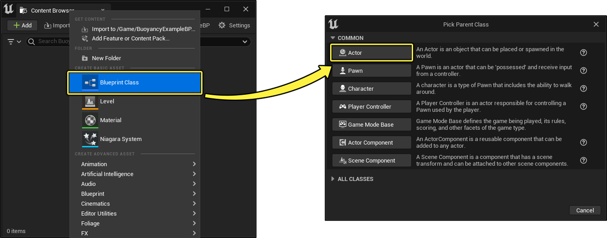
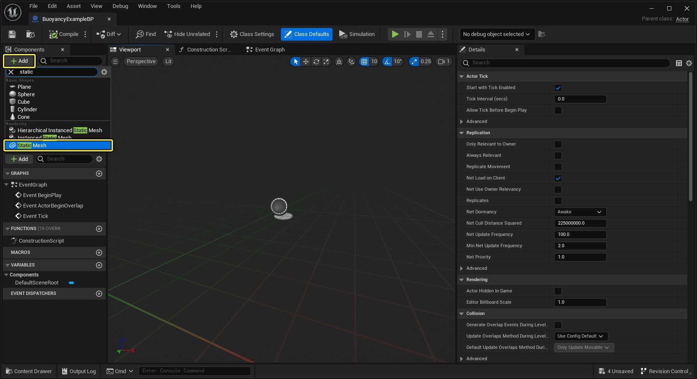
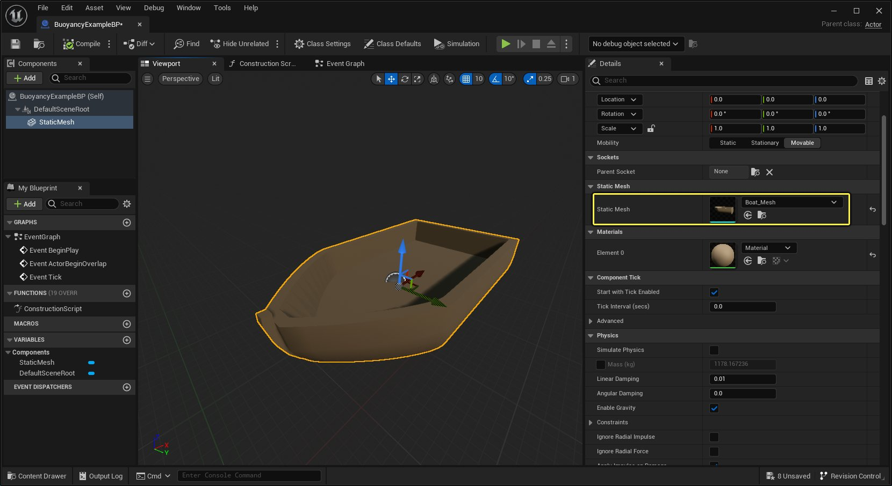
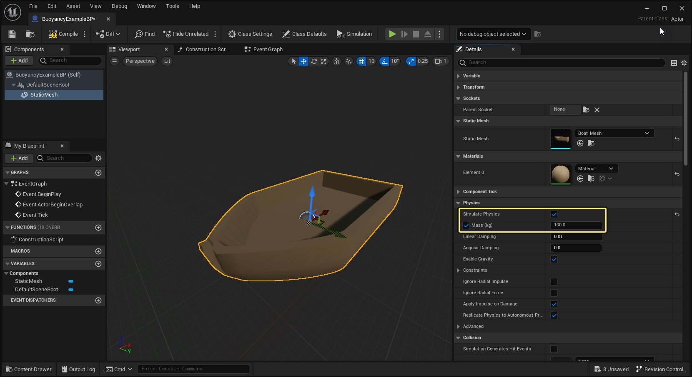
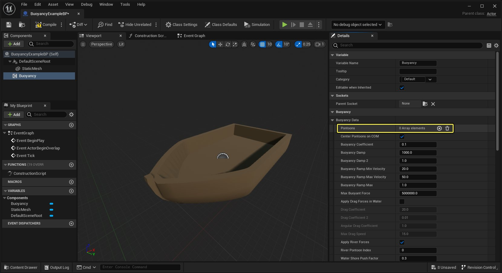
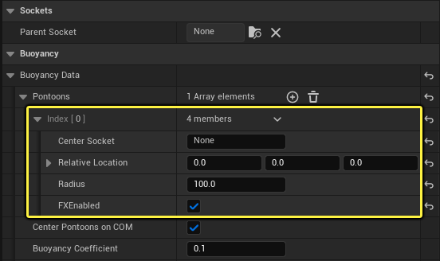
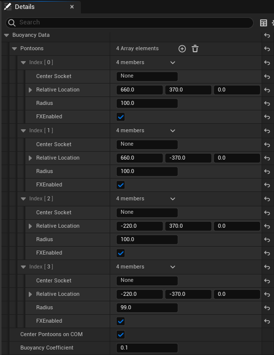
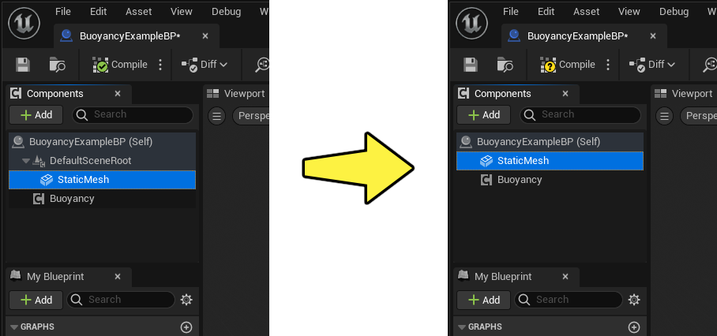

# 水浮力组件

> 路径：虚幻引擎5.7文档 / 构建虚拟世界 / 水体系统 / 水浮力组件

> 原始页面：https://dev.epicgames.com/documentation/unreal-engine/water-buoyancy-component-in-unreal-engine

水系统包含蓝图 **浮力（Buoyancy）** 组件，它使用球体（浮筒）为旨在与水面交互的物体创建简化的体积近似物。此近似物提供了低成本的解决方案，可以同时创建使用浮力的多个物体。

> 动图已省略：拥有多个物体的水浮力

## 示例水浮力蓝图

**水（Water）** 插件包含自己的示例内容，可供你使用和浏览。其中含有一个蓝图，你可使用带有立方体静态网格体的浮力组件对其进行设置。为了使立方体能够在水面平衡并直立，蓝图会使用四个浮筒设置。

浮力示例蓝图可在 **引擎（Engine）> 插件（Plugins）> 水内容（Water Content）> 蓝图（Blueprints）** 下找到，并且命名为 **BP_BuoyancyExample** 。将其拖放到水体表面上方。当你 **播放** 或 **模拟** 时，它将自动落下并沿水面漂浮，如下例所示。

## 在蓝图中设置水浮力

以下步骤说明了如何使用浮力组件设置和使用你自己的蓝图。

1. 在 **内容浏览器（Content Browser）** 中，创建新的 **蓝图类（Blueprint Class）** ，选择 **Actor** 类，然后命名。就本指南而言，我们将使用"BuoyancyExampleBP"名称。

   
2. 打开你的蓝图。在 **组件（Components）** 面板中，点击 **添加（Add +）** 下拉菜单并选择 **静态网格体（Static Mesh）** 。

   
3. 选择 **静态网格体（Static Mesh）** 组件。在 **细节（Details）** 面板中，将网格体分配到 **静态网格体（Static Mesh）** 分配插槽。

   

   > [!NOTE]
   > 如果你想严格按图中所示操作，你可以下载用于本指南的网格体。直接将此网格体拖放到 **内容浏览器（Content Browser）** 中。
   >
   > [船舶网格体](https://d1iv7db44yhgxn.cloudfront.net/documentation/attachments/4d5de2bb-74e5-4a08-957b-04d3ea185671/boat-mesh.zip)
4. 当你仍在 **细节（Details）** 面板中时，启用 **模拟物理系统（Simulate Physics）** 以及 **物理（Physics）** 类别下的 **质量（千克）（Mass (kg)）** 旁边的复选框。

   

   > [!WARNING]
   > 必须启用 **质量（千克）（Mass (kg)）** ，浮力组件才能正常运行。
5. 在 **组件（Components）** 面板中，使用 **添加（Add +）** 下拉菜单添加 **浮力（Buoyancy）** 组件。
6. 选择 **浮力（Buoyancy）** 组件。在 **浮力数据（Buoyancy Data）** 下的 **细节（Details）** 面板中，你将添加一些 **浮筒（Pontoons）** ，使网格体能够漂浮在水面上。首先点击 **添加（Add (+)）** 图标，添加一个浮筒。

   

   你应该会看到添加到数组的新浮筒元素，如下所示：

   
7. 再将 **三** 个 **浮筒** 添加到数组，这样总共有四个数组元素。将这些浮筒沿网格体的正面和背面放置，使其在水面稳定，方法是使用 **相对位置（Relative Location）** 将浮筒放置在以下位置：

   

   - 索引0（背面左侧）

     ：660、370、0
   - 索引1（背面右侧）

     ：660、-370、0
   - 索引2（正面左侧）

     ：-220、370、0
   - 索引3（背面右侧）

     ：-220、-370、0

   > [!TIP]
   > 输入浮筒的相对位置时，没有浮筒的视觉显示。但是，你可以使用[静态网格体插槽](../../../working-with-content/static-meshes/using-sockets-with-static-meshes/index.md)和 **中心插槽（Center Socket）** 标签放置浮筒，而不输入具体的位置数据，或将 **场景（Scene）** 组件添加到蓝图，并手动将其位置复制到浮筒的相对位置。
8. 在蓝图 **组件（Components）** 面板中，点击 **StaticMesh** 组件并将其拖入 **DefaultSceneRoot** ，使其成为新的根组件。

   

   > [!WARNING]
   > 静态网格体 **必须是** 根组件，浮力组件才能正确运行。
9. 将你的浮力蓝图拖放到关卡中，并放置在水面上方。 按 **播放** 或 **模拟** ，查看结果。

## 浮力组件属性

**浮力（Buoyancy）** 组件有以下属性。这些属性将控制浮筒与水面交互时的物理。

> 图片已省略：undefined

点击查看大图。

选择浮力组件时，以下属性在 **细节（Details）** 面板的 **浮力（Buoyancy）** 分段下可用。

| 属性 | 说明 |
| --- | --- |
| **浮筒（Pontoons）** | 添加到组件以近似表示其体积的可用浮筒的数组，这些浮筒的半径可能各不相同。 **中心插槽（Center Socket）** ：静态网格体上要将此浮筒居中到的插槽。 **相对位置（Relative Location）** ：相对于父Actor位置的浮筒位置。如果指定了中心插槽，它会被中心插槽覆盖。 **半径** ：此浮筒的半径大小（以世界单位计）。 **FXEnabled** ：此浮筒是否应该在进入水中时视为视觉/音频效果的候选项，用于用户实现的迸发信号？ |
| **COM上的中心浮筒（Center Pontoons on COM）** | 启用后，在使用相对位置时会将浮筒在质心附近居中放置。在使用插槽指定浮筒位置时，不会使用该属性。 |
| **浮力系数（Buoyancy Coefficient）** | 增加应用到每个浮筒的浮力。 |
| **浮力阻尼（Buoyancy Damp）** | 基于Z速度缩放阻尼的阻尼因子。 |
| **浮力阻尼2（Buoyancy Damp 2）** | 基于Z速度缩放阻尼的二阶阻尼因子。 |
| **浮力提升最小速度（Buoyancy Ramp Min Velocity）** | 开始向浮力应用提升的最小速度。 |
| **浮力提升最大速度（Buoyancy Ramp Max Velocity）** | 浮力可以提升到的最大速度。 |
| **浮力提升最大值（Buoyancy Ramp Max）** | 浮力可以提升到的最大值（最大速度或更高）。 |
| **最大浮力（Max Buoyant Force）** | 向上方向的最大浮力。 |
| **水岸推力因子（Water Shore Push Factor）** | 将物体推向岸边的系数（主要出于性能原因）。 |
| **水速度强度（Water Velocity Strength）** | 在河流水体中应用力的系数。 |
| **最大水力（Max Water Force）** | 河流水体可以应用的最大推力。 |
| **在水中应用拖拽力（Apply Drag Forces in Water）** | 指定是否向水中移动的物体应用拖拽力。 |
| **拖拽系数（Drag Coefficient）** | 基于速度应用线性拖拽的系数。 |
| **拖拽系数2（Drag Coefficient 2）** | 基于速度平方应用线性拖拽的系数。 |
| **角拖拽系数（Angular Drag Coefficient）** | 应用抵抗物体旋转的角拖拽的系数。 |
| **最大拖拽速度（Max Drag Speed）** | 应用拖拽力的最大速度。 |
| **应用河流力（Apply River Forces）** | 指定引擎是否应该应用河流力，例如下游推力与河岸推力。 |
| **河流浮筒索引（River Pontoon Index）** | 应该用来计算水力的浮筒的列表。用于计算横向推力/拉力，在可能的情况下，利用下游计算结果抓取用于计算主要力的水速度。 |
| **水岸推力因子（Water Shore Push Factor）** | 将物体推向河流岸边的系数（出于性能原因）。或者，设置负数以推向河流中心。 |
| **河流遍历路径宽度（River Traversal Path Width）** | 物体应该沿河流内部遍历的路径宽度。 |
| **最大岸边推力（Max Shore Push Force）** | 河流可以向边缘或中心应用的最大推力。 |
| **水速度强度（Water Velocity Strength）** | 在河流中应用推力的系数。 |
| **最大水力（Max Water Force）** | 河流可以应用的最大推力。 |
| **总是允许横向推力（Always Allow Lateral Push）** | 启用后，允许横向推动物体，无论河流中的向前移动速度如何。 |
| **向上游快速移动时允许水流（Allow Current when Moving Fast Upstream）** | 启用后，会在向上游高速移动时应用水流。为载具禁用，以便拥有更大控制权。 |
| **应用下游角旋转（Apply Downstream Angular Rotation）** | 启用后，会应用扭矩以沿河流下游方向对齐物体。 |
| **下游旋转轴（Downstream Axis of Rotation）** | 下游角旋转应该与之对齐的物体相关的轴。 |
| **下游旋转强度（Downstream Rotation Strength）** | 下游角旋转应用的强度。 |
| **下游旋转刚度（Downstream Rotation Stiffness）** | 用于沿下游方向对齐物体的弹簧的刚度。 |
| **下游旋转角阻尼（Downstream Rotation Angular Damping）** | 用于沿下游方向对齐物体的弹簧的阻尼。 |
| **下游最大加速（Downstream Max Acceleration）** | 每次更新时要应用于下游旋转的最大扭矩。 |

## 调试水浮力

你可以使用控制台命令 `r.Water.DebugBuoyancy 1` 调试与水面的浮力组件交互情况。每个浮筒会受到与水面交互的各个点组成的网格牵引。

下面的示例显示了多个不同形状和船舶网格体，其中用到了不同间距和大小的浮筒。
