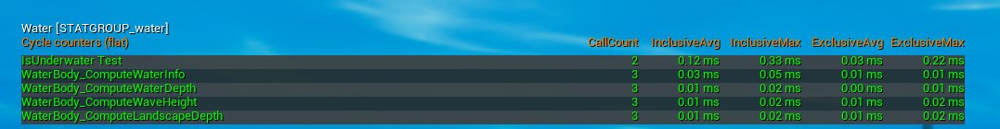
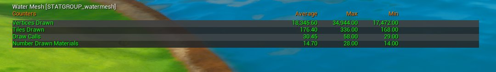
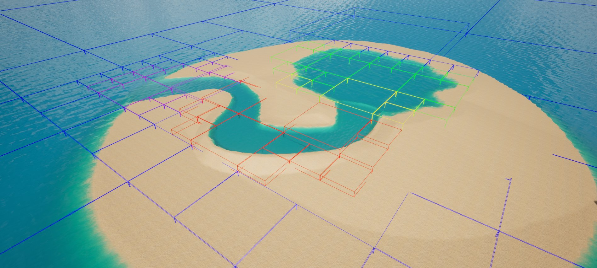
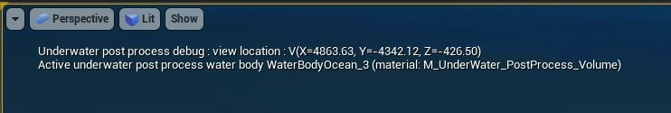
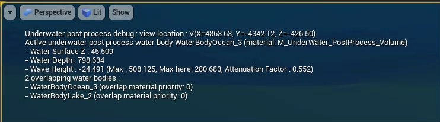

# 水调试和可扩展性选项

> 路径：虚幻引擎5.7文档 / 构建虚拟世界 / 水体系统 / 水调试和可扩展性选项

> 原始页面：https://dev.epicgames.com/documentation/unreal-engine/water-debugging-and-scalability-options-in-unreal-engine

[水系统](../water-meshing-system-and-surface-rendering/index.md)包含自己的命令，适合用于在关卡视口中显示相关信息以用于调试目的，用于提供视觉显示，以及用于设置项目的可扩展性选项。

## 水关卡统计数据

在编辑器中工作时，你可以使用 **反引号** (`) 键打开 **控制台** ，并输入某个统计数据命令，显示有关当前加载的关卡中的水系统的信息。

### Stat Water

使用命令 `stat water` 切换CPU统计数据显示，从而了解当前场景中使用的与水相关的函数。

| 统计数据名称 | 说明 |
| --- | --- |
| **IsUnderwater Test** | 函数的成本，测试每帧调用多少次，以及开销多少（最大值/平均值）。此测试函数用于检测是否激活水下后期处理。 |
| **WaterBody_ComputeWaterInfo** | 整个引擎中用于计算水相关信息的函数的开销。它用于检查帧时间，因为如果Gameplay系统、物理系统或其他系统执行了许多查询，帧中可能会增加大量时间。 |
| **WaterBody_ComputeWaterDepth** | 作为 `WaterBody_ComputeWaterInfo` 函数的一部分运行，以计算有关水深度的数据。 |
| **WaterBody_ComputeWaveHeight** | 作为 `WaterBody_ComputeWaterInfo` 函数的一部分运行，以计算有关水高度的数据。 |
| **WaterBody_ComputeLandscapeDepth** | 作为 `WaterBody_ComputeWaterInfo` 函数的一部分运行，以计算有关地形深度的数据。 |

> [!NOTE]
> `WaterBody_ComputeWaterDepth` 、 `WaterBody_ComputeWaterHeight` 和 `WaterBody_ComputeLandscapeDepth` 的统计数据不提供你可以对其执行操作的信息。其中每一项都是 `WaterBody_ComputeWaterInfo` 统计数据的一部分，并且是其函数中最昂贵的一些部分。请转而深入了解使用[Unreal Insights](../../../testing-and-optimizing-content/unreal-insights/index.md)分析场景时会发生什么。

### Stat WaterMesh

`stat watermesh` 将显示有关[水网格化和表面渲染](../water-meshing-system-and-surface-rendering/index.md)的信息。你可以对此显示内容中的统计数据执行操作，方法是对关卡中所用水的不同部分调整一些设置和分配。

| 统计数据名称 | 说明 |
| --- | --- |
| **绘制的顶点（Vertices Drawn）** | 显示为当前视图中所有水体绘制的顶点数量。 |
| **绘制的图块（Tiles Drawn）** | 基于当前水网格体的图块大小、图块范围以及摄像机距离它们有多近，显示可见图块的总数。 将 `r.Water.WaterMesh.ShowTileBounds 1` 与此统计数据一起使用，了解网格体如何划分为图块，以及它们与此统计数据有何关系。 |
| **绘制调用（Draw Calls）** | 此帧绘制水的绘制调用总数。该数字越小，CPU的开销就越小。 材质相同的图块通常会合并为单个绘制调用，因此你会看到 **绘制的材质数量（Number of Drawn Materials）** 比 **绘制的图块（Tiles Drawn）** 更少。 |
| **绘制的材质数量（Number of Drawn Materials）** | 此帧中绘制的不同水材质的数量。例如，如果你要使用带有不同水材质的各种水体，每帧绘制的材质会更多。相反，如果所有水体采用相同的材质，绘制的材质会更少，每帧的绘制调用也更少。 |

## 调试控制台命令

以下控制台命令很适合调试关卡中的水系统。

| 变量名称 | 说明 | 默认值 |
| --- | --- | --- |
| `r.Water.WaterMesh.ShowTileGenerationGeometry` | 显示用于与水网格相交并生成水网格体图块的几何体。 | 0 |
| `r.Water.WaterMesh.ForceRebuildMeshPerFrame` | 强制每帧重新构建整个水图块网格体。 | 0 |
| `r.Water.WaterMesh.Enabled` | 设置是否应该渲染水网格体。这会影响渲染和水网格体图块生成。 | 0 |
| `r.Water.WaterMesh.ShowWireframeAtBaseHeight` | 在线框中渲染时，它会显示没有置换的水图块网格体。 | 0 |
| `r.Water.WaterMesh.EnableRendering` | 设置是否应该关闭场景代理中的所有水渲染。 | 1 |
| `r.Water.WaterMesh.ShowLODLevels` | 将细节级别显示为同心圆，同心圆将围绕关卡中高度为0的摄像机位置。 | 0 |
| `r.Water.WaterMesh.ShowTileBounds` | 按照 `r.Water.TileBoundsColor` 的着色显示水网格体图块的图块边界。 默认情况下，图块按水体类型或过渡类型着色： **红色（Red）** ：河流 **绿色（Green）** ：湖泊 **蓝色Blue）** ：海洋 **黄色（Yellow）** ：河流到湖泊过渡 **紫色（Purple）** ：河流到海洋过渡 | 0 |
| `r.Water.WaterMesh.TileBoundsColor` | 使用 `r.Water.ShowTileBounds` 可视化时，设置水网格体图块边界的颜色。设为0时，颜色表示细节级别（LOD）过渡。设为1时，颜色代表水体类型。 | 1 |
| `r.Water.WaterMesh.ShowWireframe` | 针对水强制渲染线框。 | 0 |
| `r.Water.VisualizeActiveUnderwaterPostProcess` | 设为1时，显示当前为水下后期处理选择了哪个水体。设为2时，它提供有关在摄像机位置执行的水数据查询的额外信息，适合用于调试水数据查询。 | 0 |
| `r.Water.OverrideWavesTime` | 如果值大于或等于0，强制为用于波浪的时间。 | -1 |
| `r.Water.FreezeWaves` | 冻结波浪的时间。 | 0 |
| `r.Water.OceanFallbackDepth` | 在查询位置下找不到地貌时，要为海洋报告的深度。设为0或更低时，不会使用此深度值。 | 3000 |
| `r.Water.DebugBuoyancy` | 为水交互启用调试绘制。 | 0 |
| `r.Water.WaterInfo.ForceUpdateWaterInfoNextFrames` | 强制水信息纹理在后续N个帧上重新生成。负值将强制更新每一帧。 | 0 |

### 图块边界及其颜色

使用控制台命令 `r.Water.WaterMesh.ShowTileBounds 1` 为关卡中当前使用的不同类型的水网格体图块显示彩色方框。

选择以下任一项以确定图块边界的显示方式：

- 0

  表示禁用。
- 1

  表示按水体类型。
- 2

  表示按细节级别。
- 3

  表示按密度索引。

显示按水体和过渡类型着色的水图块边界的示例场景。

默认情况下，图块按水体类型及其与其他水体之间的过渡着色：

- 红色（Red）

  ：河流
- 绿色（Green）

  ：湖泊
- 蓝色Blue）

  ：海洋
- 黄色（Yellow）

  ：河流到湖泊过渡
- 紫色（Purple）

  ：河流到海洋过渡

### 可视化活动水下后期处理

使用控制台命令 `r.Water.VisualizeActiveUnderwaterPostProcess` 在关卡视口中显示有关摄像机当前重叠的水下后期处理的信息。

设置为 **1** 时，将提供有关当前使用的水下后期处理的基本调试信息。

设为 **2** 时，会显示有关在摄像机的位置执行的水数据查询的额外信息。

## 可扩展性控制台命令

以下控制台命令很适合设置关卡和项目中的水系统的可扩展性选项。

| 变量名称 | 说明 | 默认值 |
| --- | --- | --- |
| `r.Water.WaterMesh.LODCountBias` | 将该值添加到每个水网格体组件的LOD数量。负值会降低质量（更低密度的水网格体），而更高的值会提高质量（更高密度的水网格体）。 | 0 |
| `r.Water.WaterMesh.TessFactorBias` | 将该值添加到每个水网格体组件的曲面细分因子。负值会降低总体密度（分辨率）或顶点网格。值越高，水网格体组件的密度（分辨率）就越高。 | 0 |
| `r.Water.WaterMesh.LODMorphEnabled` | 设置是否将流畅的LOD变形用于不同细节级别之间的过渡。禁用该变量可能会导致在LOD级别之间出现停顿，但会跳过顶点着色器中的计算，使水在场景中的开销更低。 | 1 |
| `r.Water.WaterMesh.LODScaleBias` | 将该值添加到每个水网格体组件的LOD缩放。负值会降低总体密度（分辨率）或顶点网格，并使LOD更小。值越高，高密度（分辨率）就越高，LOD更大。允许的最小值为-0.5，这将使内层LOD尽可能小而优化。 | 0 |
| `r.Water.WaterMesh.PreAllocStagingInstanceMemory` | 根据历史最大值预分配预演实例数据内存，这会在数组需要增长但可能使用更多内存的情况下减少开销。 | 0 |
| `r.Water.UseSplineKeyOptimization` | 是否缓存水体的样条线输入键。 | 1 |
| `r.Water.EnableUnderwaterPostProcess` | 控制是否启用水下后期处理。如果摄像机从不打算沉入水下，应该禁用此项。 | 1 |
| `r.Water.EnableShallowWaterSimulation` | 控制是否应该启用浅水流体模拟。 | 1 |
| `r.Water.ShallowWaterMaxDynamicForces` | 一次向水流体模拟注册的动态力的最大数量。 | 6 |
| `r.Water.ShallowWaterMaxImpulseForces` | 一次向水流体模拟注册的冲量力的最大数量。 | 3 |
| `r.Water.ShallowWaterRenderTargetSize` | 方形浅水流体模拟渲染目标的大小。有效尺寸是Size x Size。 | 1024 |
| `r.RayTracing.Geometry.Water` | 在光线追踪效果中包含水。 | 0 |
| `r.Water.WaterSplineResampleMaxDistance` | 将水样条线形状转换为多边形时，示例片段和样条线之间的最大距离。随着距离减小，顶点数量会增加，物理形状会更准确，并且水网格体图块也会更密切匹配，但计算开销也会增加。 | 50 |

### 水体样条线重新取样最大距离

湖泊水体碰撞组件（和水网格体图块生成）基于其样条线评估。湖泊和海洋水体样条线会经历变换过程，成为多边形，并进行处理，以便查看它们覆盖哪些水网格体图块。多边形化是一个迭代过程，其中只要取样的样条线片段之间的距离与原始样条线太远，样条线就会重新取样。这会致使在高曲率片段中点的数量更多，在更直的片段中点的数量更少。

使用控制台变量 `r.Water.WaterSplineResampleMaxDistance` 调整距离。默认情况下，会使用50厘米。值越高，使用的顶点更少，这进而意味着，用于匹配湖泊样条线形状的碰撞组件更少。如果使用较低的值，生成的顶点会多得多。

> [!TIP]
> 设置 `r.Water.WaterMesh.ShowTileGenerationGeometry 1` 以查看生成的图块几何体。

|  |  |  |
| --- | --- | --- |
| [undefined](https://d1iv7db44yhgxn.cloudfront.net/documentation/images/ceb731d0-5e1b-47ee-9a73-5a36e880d229/water-max-distance-1.png) | [undefined](https://d1iv7db44yhgxn.cloudfront.net/documentation/images/b0ed5cbb-39f0-4e61-afcb-89db9b21fefa/water-max-distance-2.png) | [undefined](https://d1iv7db44yhgxn.cloudfront.net/documentation/images/ae1b64a7-9abe-4807-9f5b-b8d74c790951/water-max-distance-3.png) |
| 最大距离50厘米（默认值）是比较合适的中间值。 | 最大距离400厘米对应更少的顶点。 | 最大距离10厘米对应多得多的顶点。 |

点击查看大图。

根据我们开发《堡垒之夜》并使用附带水的大型世界的经验来看，我们推荐采用50，这是比较合适的中间值，可以正确近似表示大部分正常大小的湖泊。如果将距离降得太低，物理形状无法足够匹配，这可能导致一些水图块缺失。

> [!NOTE]
> 调整此控制台变量时，你必须在水样条线上做一些修改，例如稍微移动某个样条线点，才能看到结果。
