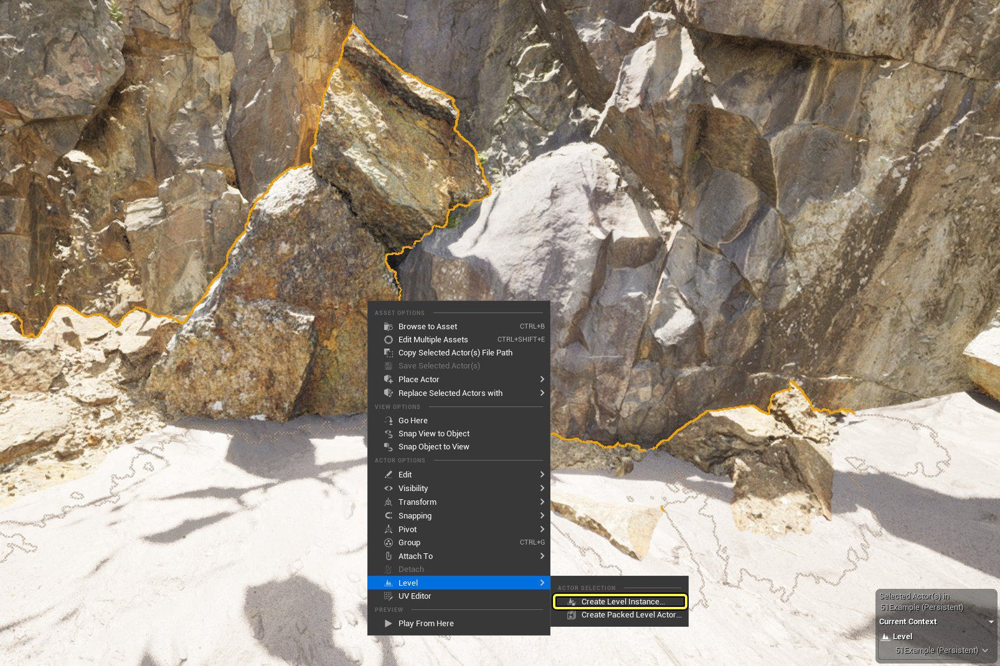
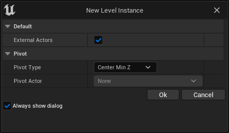
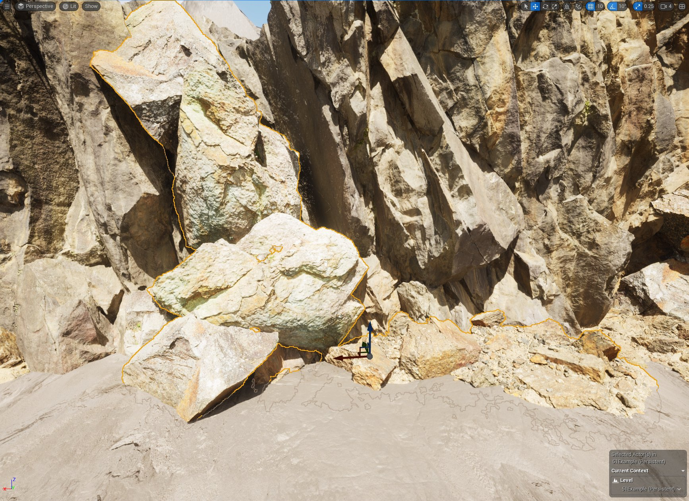
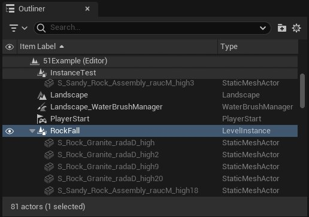
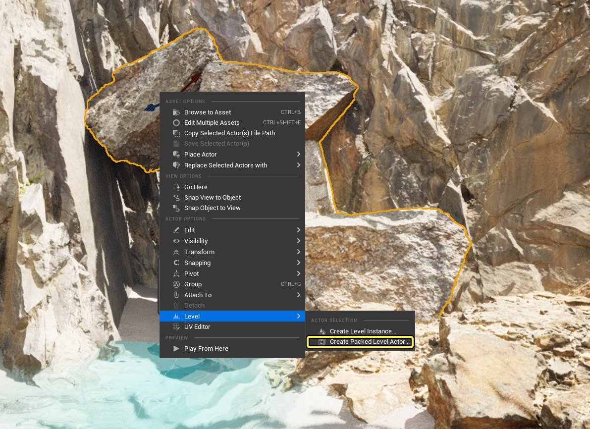
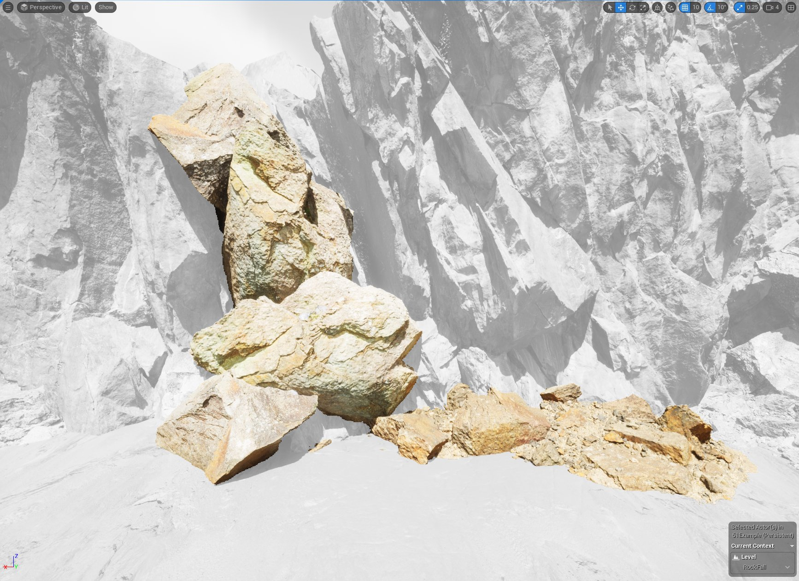
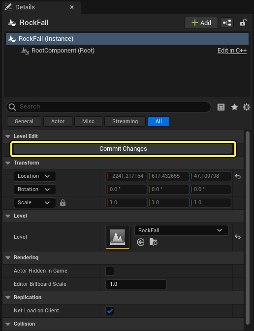

# Level Instancing

> 路径：虚幻引擎5.7文档 / 构建虚拟世界 / 世界分区 / Level Instancing

> 原始页面：https://dev.epicgames.com/documentation/unreal-engine/level-instancing-in-unreal-engine

关卡实例化是一种基于关卡的工作流程，旨在改善和精简关卡编辑体验。将关卡实例化工作流程用于一个或多个Actor来创建可以在你的整个世界内放置和复用的关卡实例。

这个工作流程具有以下优势：

- 关卡实例在相关环境中编辑，可以立即看到所做更改对你的世界的影响。对一个实例所做的更改在保存后将复用于所有实例。
- 快速创建静态网格体排列（兴趣点、建筑和Gameplay设置中的任何内容）的副本作为模板。
- 在创建Epic Games所创建的[城市示例](https://www.fab.com/listings/4898e707-7855-404b-af0e-a505ee690e68)和[Valley of the Ancient](https://www.fab.com/listings/0c19880e-21bd-42ba-8287-1caccc3951b1)演示时所使用的生产级流程。

城市示例中的天际线。

> [!WARNING]
> 虽然可以在不进行 **世界分区（World Partition）** 的情况下使用 **关卡流送（Level Streaming）** ，但关卡实例不会在世界分区（World Partition）主世界之外自动具有流送管理或流送策略。

## 创建关卡实例

关卡实例分为两种：

- 关卡实例（Level Instances）

  ：Actor集合，组合在一起形成子关卡。你的整个项目可重复存在同一子关卡的多个实例，在之前版本的虚幻引擎中这是无法实现的。请将此类型用于兴趣点和独立Gameplay设置。
- 打包型关卡蓝图（Packed Level Blueprints）

  ：将

  静态网格体（Static Mesh）

  资产合并以创建进行了渲染优化的单一

  蓝图Actor（Blueprint Actor）

  。将静态网格体替换为链接到

  打包型关卡Actor（Packed Level Actor）

  的

  打包型关卡蓝图（Packed Level Blueprint）

  实例。建议将此类型用于静态建筑和密集视觉设置，如《遗迹峡谷》中使用的Mega Assemblies（@@@）。

### 创建关卡实例

新关卡实例是根据选择的Actor生成的，可以在 **视口（Viewport）** 或 **大纲视图（Outliner）** 中创建。

选择Actor之后，右键点击其中一个即可打开上下文相关菜单。在该菜单中，找到 **关卡（Level）** 选项，然后选择 **创建关卡实例（Create Level Instance）** 。

通过上下文菜单创建关卡实例。

你将看到一个具有以下设置的对话框：

新建关卡实例对话框。

| 设置 | 说明 |
| --- | --- |
| 外部Acto | 允许外部Actor使用"一个Actor一个文件"系统。有关更多信息，请参阅[一Actor一文件](../../one-file-per-actor/index.md)文档。 |
| 枢轴点类型 | 关卡实例将采用的 **枢轴点（Pivot）** 类型： **中心最小值 - Z（Center Min Z）** ：枢轴点将位于关卡实例的中心，并且位于最小的Z值位置。 **中心：枢轴（Center:** ：枢轴点将位于关卡实例的中心。 **枢轴点Actor（Pivot Actor）** ：如果选择某个Actor作为枢轴点，请使用此下拉菜单来选择将哪个Actor作为关卡实例的枢轴点。 |
| 枢轴点Actor | 如果Actor被选择作为枢轴点，请使用此下拉菜单来选择哪个Actor将作为关卡实例的枢轴点。 |

选择你的设置并点击 **确定（Ok）** 之后，系统将要求你保存新的关卡实例。

此流程会在关卡中创建新的 **关卡实例（Level Instance）** Actor，代替之前选中的Actor。此Actor表示刚刚创建的关卡，应用于此Actor的所有变换都将应用至关卡实例。

新的关卡实例代替关卡中的资产。

组成关卡实例的Actor在大纲视图中仍然可见，但现在已成为关卡实例Actor的子项，并且不可选择。

这些资产现在已成为关卡实例Actor的子项。

### 创建打包型关卡蓝图

如同关卡实例，打包型关卡蓝图使用选择的Actor生成，可以通过在 **视口（Viewport）** 或 **大纲视图（Outliner）** 中点击右键进行创建。

选择Actor之后，右键点击其中一个即可打开上下文相关菜单。在该菜单中，找到 **关卡（Level）** 选项，然后选择 **创建打包型关卡Actor（Create Packed Level Actor）** 。

通过上下文菜单创建打包型关卡蓝图。

你会看到与上面相同的对话框。选择你的设置并点击 **确定（Ok）** 。然后系统会要求你保存新的关卡和新的打包型关卡蓝图。

此流程会在与你的打包型关卡蓝图关联的关卡中创建一个新的 **打包型关卡Actor（Packed Level Actor）** 。

## 编辑关卡实例

创建后，可将关卡实例和打包型关卡蓝图复制和放置在你的世界中。

### 编辑关卡实例

要编辑你的关卡实例，请在视口（Viewport）中选择其中一个，然后右键点击打开菜单，找到 **关卡（Level）** 选项，然后选择 **编辑（Edit）** 。你也可以点击 **细节（Details）** 面板中的 **编辑（Edit）** 按钮。

这会使你的世界中的所有其他Actor显示为灰色，从而更便于你在相关环境中进行关卡实例编辑。

在视口中编辑关卡实例时，所有其他Actor都显示为灰色。

当你完成编辑时，在 **大纲视图（Outliner）** 中选择该关卡实例Actor，然后在 **细节（Details）** 面板中点击 **提交更改（Commit Changes）** 。

点击细节（Details）面板中的提交更改（Commit Changes）保存你的关卡实例更改。

要退出编辑而不提交你的更改，请按 **Esc** 两次。

一旦对某个关卡实例做出更改，此更改就会传播到该关卡实例在你的世界中的所有副本。

### 编辑打包型关卡蓝图

要编辑你的打包型关卡蓝图，请在 **大纲视图（Outliner）** 中找到它的一个实例，然后点击 **编辑（Edit）** 。你也可以在 **内容浏览器（Content Browser）** 中找到该蓝图，然后双击。此操作将打开蓝图编辑器窗口。

> 图片已省略：The Blueprint Editor window showing the selected Packed Level Blueprint

显示所选打包型关卡蓝图的蓝图编辑器窗口。

与关卡实例类似，对打包型关卡蓝图做出更改后，此更改会传播到该蓝图在你的世界中的所有其他副本。

### 拆分关卡实例

拆分关卡实例会将关卡实例Actor或打包型关卡Actor从世界中移除，将其替换为创建它们时使用的原始资产。拆分不会从内容浏览器中删除关卡实例或打包型关卡蓝图。

此操作无法撤销。

## 运行时关卡实例

### 数据层

关卡实例和打包型关卡蓝图支持[世界分区：数据层](../world-partition---data-layers/index.md)。

关卡实例中包含的Actor默认继承指定给其 **关卡实例（Level Instance）** Actor的数据层。关卡实例内的Actor还支持额外的数据层。

例如，若关卡实例中包含用于创建房屋兴趣点的资产，则可将此关卡实例指定给某个邻里数据层。该关卡实例还可以包含以节假日为主题的选项，这些选项指定给不同的节假日数据层，仅在这些数据层启用时才可见。

### 关卡流送模式

关卡实例和打包型关卡Actor使用世界分区（World Partition）设置来定义它们的流送行为，即嵌入模式（Embedded Mode）或关卡流送模式（Level Streaming Mode）。

这些设置不可编辑，在此列出仅供参考。

#### 嵌入模式

使用 **嵌入模式（Embedded Mode）** 时，使用[一个Actor一个文件(OFPA)](../../one-file-per-actor/index.md)系统的关卡实例会被废弃，它们的Actor将会在运行时添加到世界分区网格。这是默认的运行时模式，也是建议的关卡内容流送方法。这让关卡实例仅在编辑器中存在。

> [!WARNING]
> 在使用嵌入模式时，一些不使用OFPA的Actor将会在运行时丢失。例如，嵌入的关卡实例的AWorldSettings object在运行时不存在，因为这是非OFPA Actor。你应该避免依赖这些Actor，或在需要时使用关卡流送模式。

#### 关卡流送模式

不使用OFPA的关卡实例无法嵌入到世界分区网格中，并且在运行时使用标准的关卡流送。这意味着，**关卡实例（Level Instance）** Actor通过自身关联的世界分区运行时单元格加载时，它将加载关联的关卡。

此关卡流送的运行时开销很高，因为流中添加了更多的关卡。不建议使用采用此模式来流送大量关卡，因为性能开销会很大。

> [!TIP]
> 结合使用嵌入模式和[世界分区：数据层](../world-partition---data-layers/index.md)功能，你可以有效估计出能为动态加载的关卡预先准备哪些功能。
