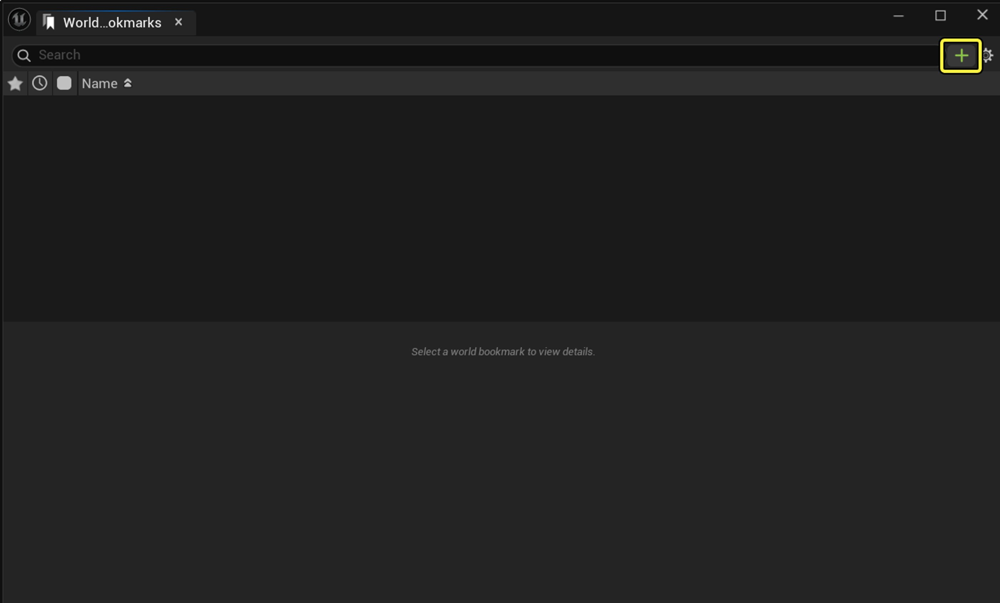
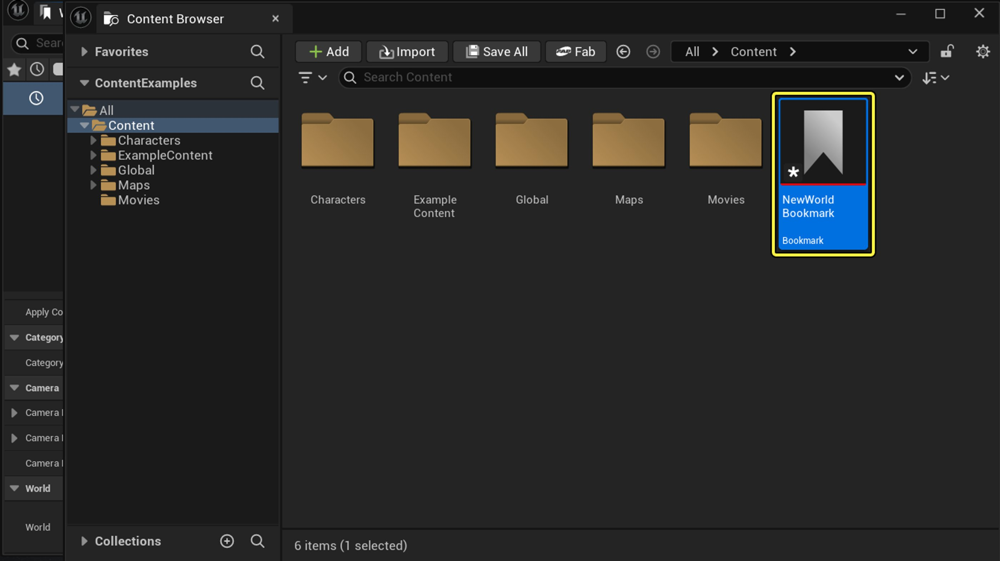
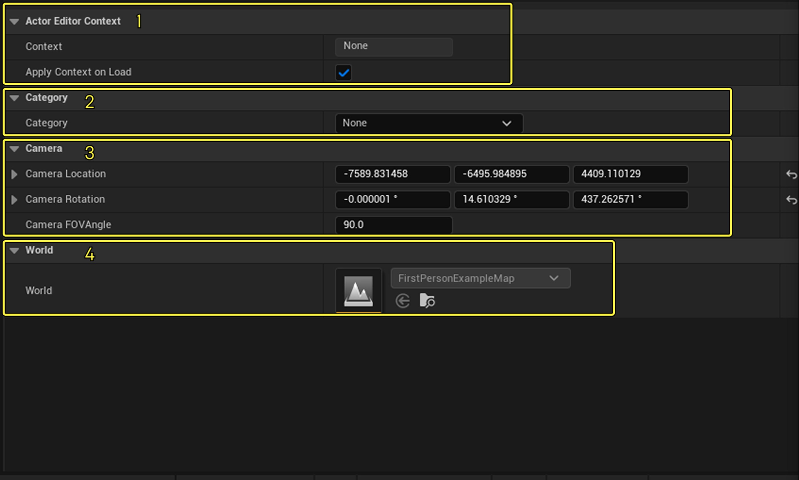
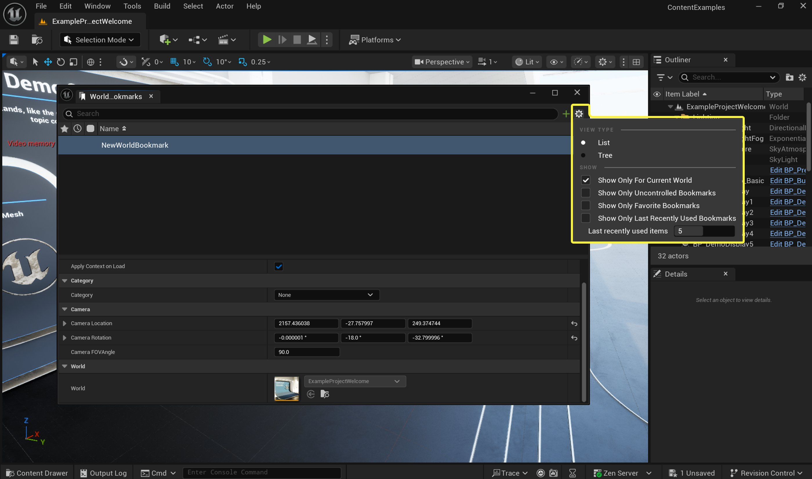
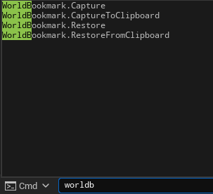
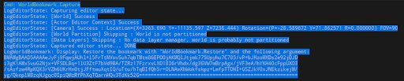

# 世界书签

> 路径：虚幻引擎5.7文档 / 构建虚拟世界 / 世界分区 / 世界书签

> 原始页面：https://dev.epicgames.com/documentation/unreal-engine/world-bookmarks

## 概述

在虚幻引擎中，常规书签与**世界书签**有着不同的用途。 常规书签用于在关卡编辑器的视口中导航，可快速跳转至特定摄像机位置或编辑器状态。 世界书签主要用于在蓝图中标记特定位置或节点，以便处理复杂逻辑。

世界书签是一个有助于管理项目以及在大型开放世界中导航的系统。 单个书签可存储编辑器内多个系统的状态，包括：

- 当前激活的世界
- 摄像机位置/朝向
- 分区世界中已加载的区域
- 数据层状态
- Actor编辑器上下文

引擎中有一个专门的世界书签大纲（World Bookmark Outliner）窗口，用于访问和管理书签。 书签作为一种资产，可供用户在本地使用，也可与其他人共享。

书签还可通过控制台命令以文本形式捕获/恢复（类似bugit/bugitgo工作流）。

## 创建世界书签

1. 在虚幻引擎顶部的文件菜单中选择**窗口（Window）>世界分区（World Partition）>世界书签（World Bookmark）**。
2. 打开专门的世界书签大纲窗口。 点击**加号（+）**按钮创建新的书签。

   
3. 系统将提示你选择或创建用于存储世界书签的**文件夹位置**。 点击**保存（Save）**。 新建的世界书签将显示在该文件夹中。

   > [!TIP]
   > 世界书签是一种新的资产类型。

   

## 世界书签设置

### 单独的设置

通过****窗口（Window）>世界分区（World Partition）>世界书签（World Bookmark）****打开书签模型。 **点击**书签打开设置菜单。 每个世界书签都包含以下信息：

1. Actor编辑器上下文
2. 类别
3. 摄像机（位置、旋转和摄像机视野角度）
4. 世界

   

### 全局书签设置：

通过**窗口（Window）>世界分区（World Partition）>世界书签（World Bookmark）**打开书签模型。点击**设置图标**（齿轮）进入全局设置菜单。

| 设置名称 | 说明 |
| --- | --- |
| 视图类型 |  |
| **列表（List）** | 按显示设置以列表形式显示所有书签。 |
| **树状（Tree）** | 以树状图形式显示世界书签资产的路径。 |
| 显示 |  |
| **仅显示当前世界（Show only for Current World）** | 仅显示与当前世界绑定的书签。 |
| **仅显示不受控制的书签** | 仅显示保存在不受控制的变更列表中的本地书签。 |
| **仅显示最常用的书签** | 仅显示标记为收藏夹的书签。 |
| **仅显示最近使用的书签** | 仅显示最近使用的书签。 |
| ****最近使用的项目**** | 你可以通过该字段设置要显示的书签数量。 |

## 使用命令行

世界书签也可以通过命令行界面启用。

**WorldBookmark.capture**捕获当前世界书签详情并发送至输出日志：

**WorldBookmark.CaptureToClipboard**捕获当前世界书签详情并生成一个可粘贴的参数，该参数可通过****WorldbookMarks.Restor**e**和**WorldBookmark.RestoreFromClipboard**恢复。

`WorldBookmark.Restore`可在提供实用`WorldBookmark.capture`创建的参数时恢复世界书签。 参数示例：

worldbookmark.restore BMAMgBAAD5AAAAeJyFj9FOwjAUhl9l6TV0hbWOcbc0w5sJi0S9MMbUrjFLSk/TVsWQvbsdKIGg8a75z/ef83WHfBBBeTR/3KFnroX3S7FRaI7StXSdDemdcUroqsUP4HRbtV0Atx46aIQ+hmhgr2MnXXTOh0Y5D4Y3TXojrD/Nqq3YWK1ijH9NUT/6T6GU8fhBgYMJahvOfcTFfD/hoLWSoQMTly7BDOhLaa3+vFy4MjWI+Kfg3tSfQrV6V/pQwydvHiknzpXkPqtBiu/7OZ3mOKPJeMYoxaRI2IxleMqO7C2EH3ac5ZgVyYRMML1KCCbkSC1W96V51dGqIP1T/wVQI52J======================================================

`WorldBook.RestoreFromClipboard`可在将世界书签参数复制到剪贴板中时，从剪贴板恢复世界书签。

## 使用场景

> [!NOTE]
> 能够发送位置书签以及该位置的所有摄像机设置意义重大。 在团队协作中，这能有效节省大量时间，因为我们可以将位置转化为可以共享的资产。 例如，当你发现某个区域的VFX导致性能下降时，可以快速创建一个世界书签，并将该位置提交给相关团队进行修复。 如果你发现某个复杂的场景存在漏洞，可以快速高效地复制粘贴相关位置的详情。

> [!NOTE]
> 能够按用途（如VFX、脚本事件等）对书签进行分类， 有助于在关卡中快速导航。 例如，当我想查看Cassini演示的运行状况时，可以在不同位置创建多个书签，并将它们标记为PCG性能，快速监测这些位置的性能表现。
